# 第十章 认识与学习BASH

## 一。系统合法shell与/etc/shells功能

### 1。什么是shell

shell:是一个命令解释器,解释执行用户输入的命令及程序 #shell英文贝壳

### 2。linux合法shell

Unix/Linux中主要两大类Shell:

+ Bourne shell:分sh(已被bash取代), ksh , bash(常用,主流，由sh发展而来)
 
+ C shell:分csh(常用) 和 tsh(csh的升级版)

**$ echo $SHELL #输出本机应有的shell(linux默认为bash)**

### 3。Bash shell功能

+ 命令编辑能力(history) #bash可记忆使用过的命令(存储在home下的.bash_history)

+ 命令与档案补全功能([tab键])

+ 命令别名设定功能(alias)

  **设定别名: $ alias ll='ls -l' #设定ls -l别名为ll,则命令行输入ll即可。但此种设定只在当前有效**
  
+ 工作控制、前景背景控制： (job control, foreground, background)

  **如：可让当前工作在后台执行，而不会因输入「ctrl+c」结束进程**
  
+ 程式化脚本： (shell scripts) #『批次档』

+ 万用字元： (Wildcard)

  如：想知道/usr/bin 底下有多少以X为开头的档案？使用『 ls -l /usr/bin/X* 』
  
### 4。查询指令是否为Bash shell 的内建命令： type

**指令分为bash内建指令(如ls/cd)和非内建指令**

+ $ man bash #查看bash帮助

+ type 应用 (查找命令档而不是普通文档，<=> which命令)

### 5。指令的下达与快速编辑按钮

**「\[Enter]」键，可以下达指令到下一行继续输入**

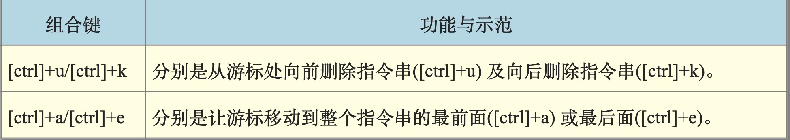

## 二。shell的变数功能

### 1。什么是变数

    『 y = ax + b 』等号左边的(y)就是变数，等号右边的(ax+b)就是变数内容。要注意的是，左边是未知数，右边是已知数.
    
    如PATH即为一个环境变数，可配置。(注：环境变数通常以大写字元)
    
    『变数就是以一组文字或符号等，来取代一些设定或者是一串保留的资料！』
    
#### 2。变数的取用与设定：echo, 变数设定规则, unset

+ 变数的取用-echo
  
  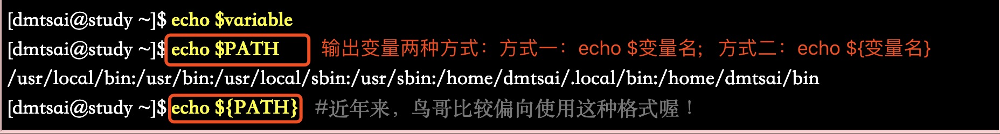
  

+ 变数设定规则-unset

  
  
  
  
  **注意：单引号与双引号区别**
  
  
  **反单引号(`):在反单引号之内的指令将会被先执行，而其执行的结果将做为外部的输入.**
    
        如：ls -ld `locate crontab` 

  **简化到达常去的一个工作目录**
  
        $work="/Users/shiyufeng/Documents"
        $cd $work
        #此设定可以bash设定档(~/.bashrc)中设定
        
### 3.环境变数的功能

+ 用env(environment)观察环境变数与常见环境变数说明「$ env」

+ 用set 观察所有变数(含环境变数与自定义变量)「$ set」

    + PS1：(提示字元的设定) #「$ man bash」查看提示字元PS1用法
    + $：(关于本shell的PID)
    + ?：(关于上个执行指令的回传值) #成功0，失败非0
      
    + OSTYPE, HOSTTYPE, MACHTYPE：(主机硬体与核心的等级)

+ export:自定变数转成环境变数

环境变量与自定变量区别：『 该变数是否会被子程序所继续引用』

环境变数=全局变数 | 自定变数=局部变数

### 4.影响显示结果的语系变数(locale)

**语系统档案放置目录：/usr/lib/locale/**

**系统整体语系定义：/etc/locale.conf**

### 5.变数的有效范围

环境变量子shell可用(全局变量)，自定义变量子shell不可用(局部变量)

### 6.变数键盘读取、阵列与宣告： read, array, declare

+ read #从命令行读入参数

  
  
+ declare / typeset #『宣告变数的类型』

  
  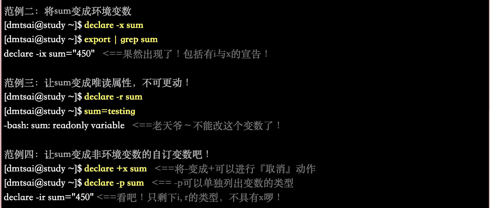

+ 阵列(array) 变数类型

  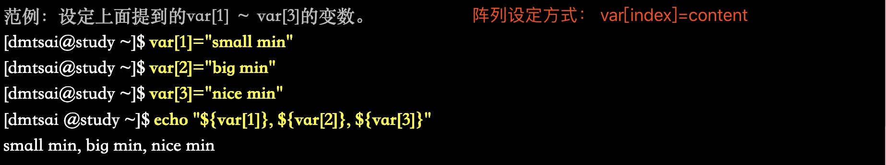

### 7.与档案系统及程序的限制关系： ulimit

**bash可以『限制使用者的某些系统资源』，包括可以开启的档案数量,使用的CPU时间,使用的记忆体总量...**

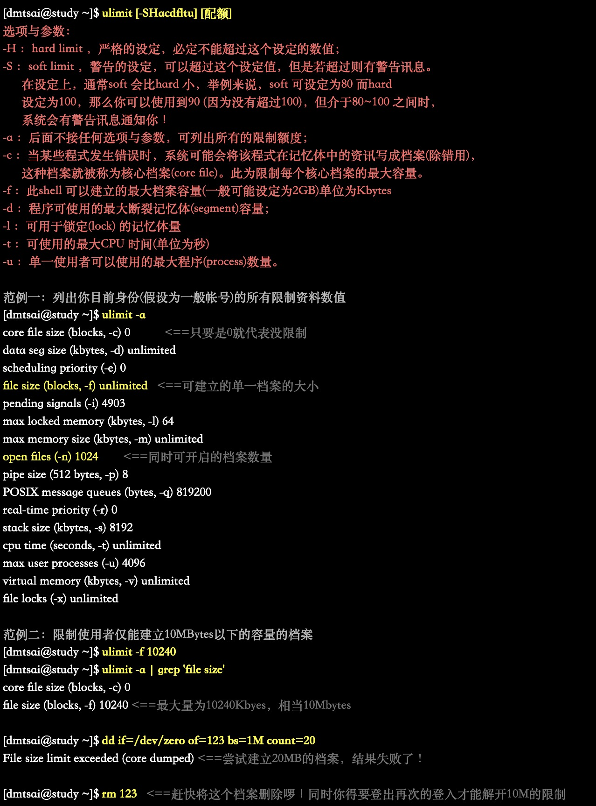

### 8.变数内容的删除、取代与替换(Optional)

#### (1)变数内容的删除

+ 变数内容的删除与取代

**变数内容的删除：从前-》向删除(#与##号)(如PATH中各目录是以:号分隔，因此从/到:代表一个目录)**

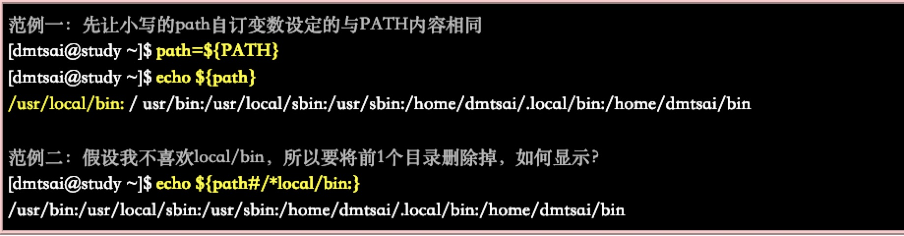

**变数内容的删除：从后-》前删除(%与%%号)**

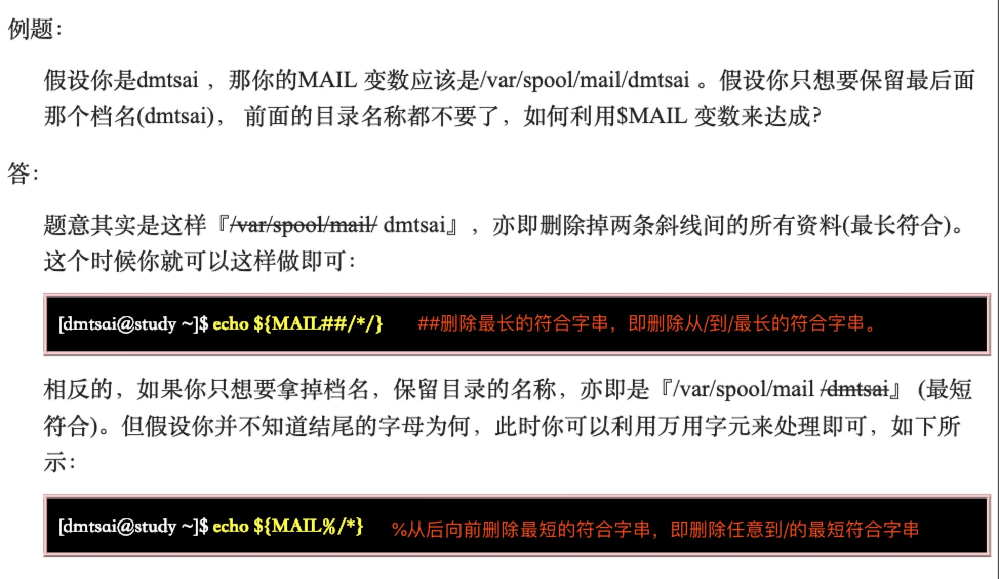

#### (2)变数内容的取代(/与//)

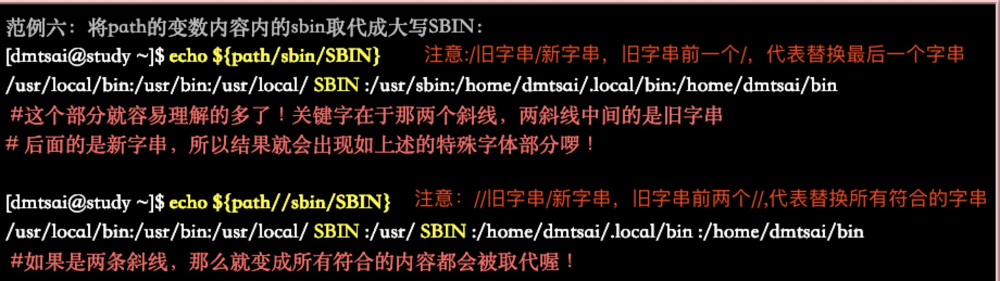

**总结:**

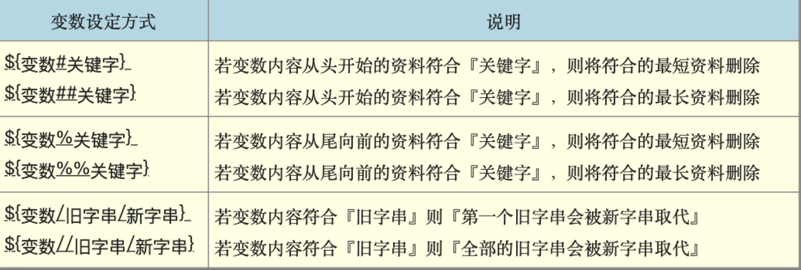

#### (3)变数的测试与内容替换

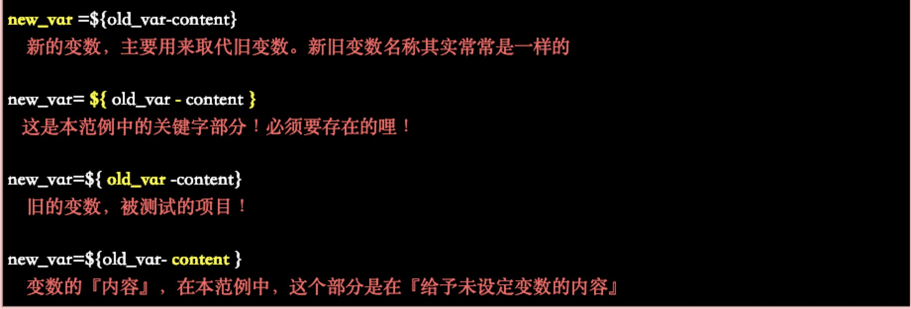

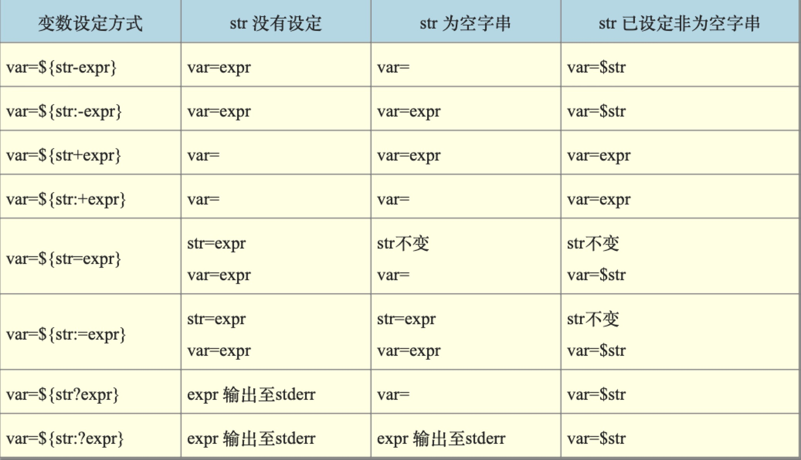

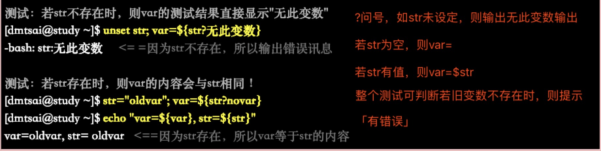

## 三、命令别名与历史命令

### 1.命令别名设定：alias ,unalias

**命令别名：可直接下达该指令(与变数不同，变数需要echo呼出)**

    $ alias #查看有哪些命令别名
    $ alias lm='ls -al | more' # $ls -al | more 查询隐藏档，且需列出并一页一页翻看,为其设置别名为lm
    $ alias rm='rm -i' #用于设定删除时，来确定是否要删除该档案（避免误删除-尤其root权限）
    $ alias vi='vim' #命令行输入vi即为vim
    $ unalias lm #取消别名
    
### 2.历史命令: history

    $ alias h='history' #为历史命令设定别名,命令行可直接输入h查询历史命令

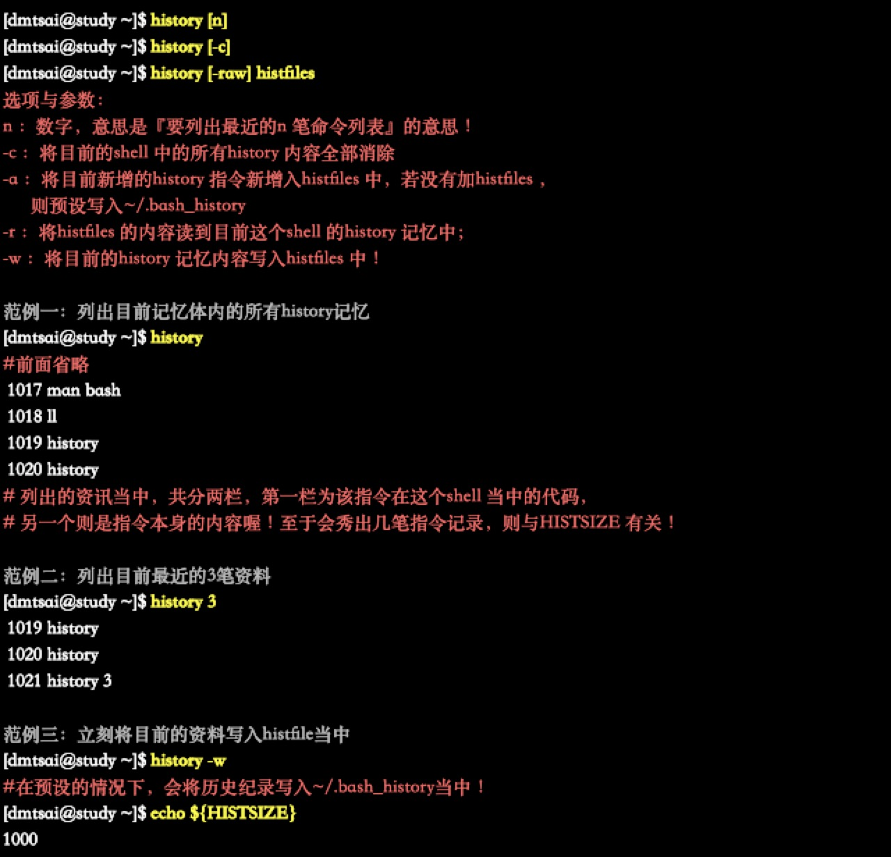

### 3.同一账号同时多次登入history写入问题

**同时开多个bash,则所有bash都有自己的记录写入记忆体。因登出时才更新记录档。则最后登出的那个bash会将前面的history覆盖掉**

### 4.无法记录时间

**无法记录指令的下达时间(可通过~/.bash_logout + date来增加时间参数)**

## 四、Bash shell的操作环境

### 1.路径与指令搜寻顺序

    先alias 再builtin 再由$PATH 找到/bin/echo 
    
### 2.bash的进站与欢迎讯息

### 3.bash的环境设定档

#### (1)login与non-login shell

+ login shell:取得bash需要完整的登入流程

+ non-login shell:无需重新登入或在原bash上再启bash,则第二个bash称为non-login

#### (2)环境设定档

+ /etc/profile:这是系统整体的设定，你最好不要修改这个档案

  **login shell才会读**

+ ~/.bash_profile 或~/.bash_login 或~/.profile：属于使用者个人设定，你要改自己的资料，就写入这里

  **在login shell的bash环境中，读取的个人偏好设定档主要有三个：**

  + ~/.bash_profile(login shell才会读)
  
  + ~/.bash_login
  
  + ~/.profile
  
  **login shell的设定档读取流程**
  
 
  
#### (3)source:读入环境设定档的指令

**/etc/profile & ~/.bash_profile只有login shell才会读**

**~/.bashrc(non-login shell会读)**

#### (4)其他相关设定档

+ /etc/man_db.conf :规范了使用man时，man page路径到哪里寻找

+ ~/.bash_history :历史命令

+ ~/.bash_logout : 当登出bash后，系统再帮我做完什么动作后才离开

### 4.终端机的环境设定: stty,set

[鸟哥的linux私房菜](http://linux.vbird.org/linux_basic/0320bash.php)

### 5.bash预设的组合键

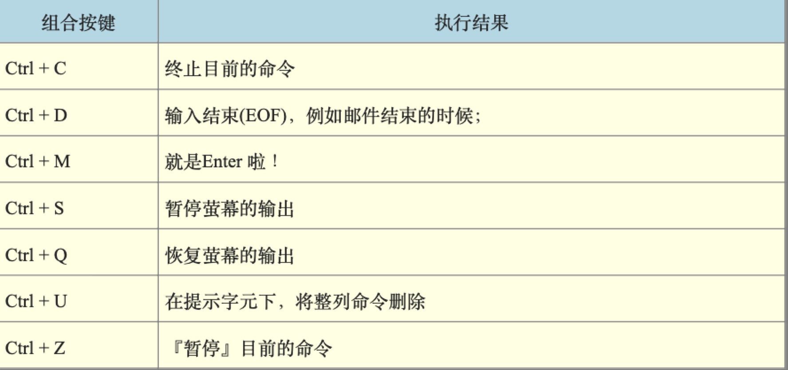

### 6.万用字元与特殊符号

+ 万用字元

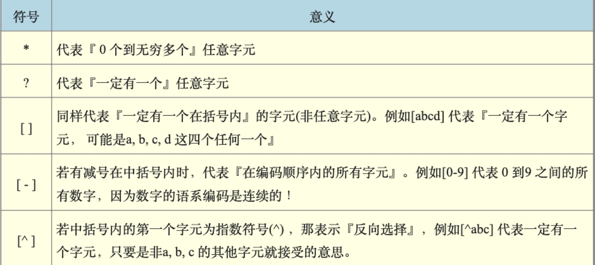

+ 特殊符号

## 五。资料流重导向

**资料流重导向即将某个指令执行后应该要出现屏幕上的资料，给它传输到其他的地方**

+ standard output 标准输出(简称stdout)

+ standard error output 标准错误输出(简称stderr)

    **传送所用的特殊字元**
    
    + 标准输入(stdin) ：代码为0 ，使用< 或<< 
    + 标准输出(stdout)：代码为1 ，使用> 或>> 
    + 标准错误输出(stderr)：代码为2 ，使用2> 或2>> 

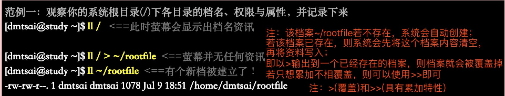

+ /dev/null垃圾桶黑洞装置与特殊写法

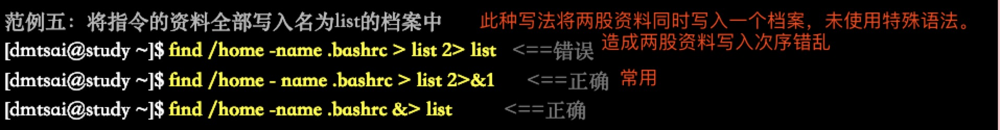

+ standard input: < 与 << 

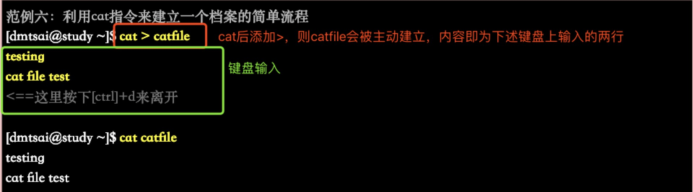

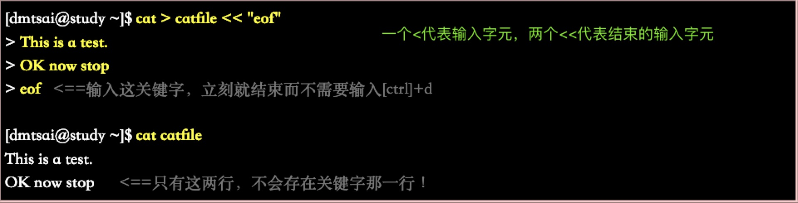

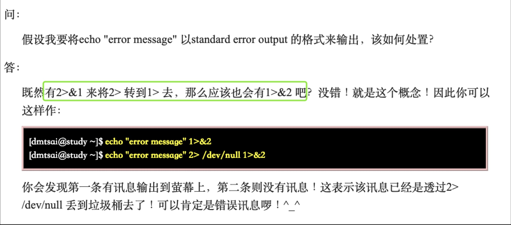

## 六。命令执行的判断依据: ; && ||

+ 「分号(;)」:cmd;cmd(不考虑反映令相关性的连续指令下达)

+ 「$?(指令回传值)与&&或||」

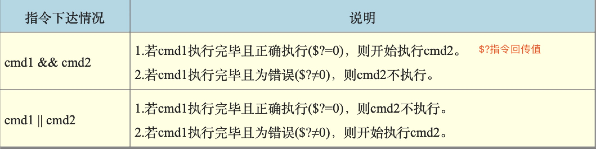

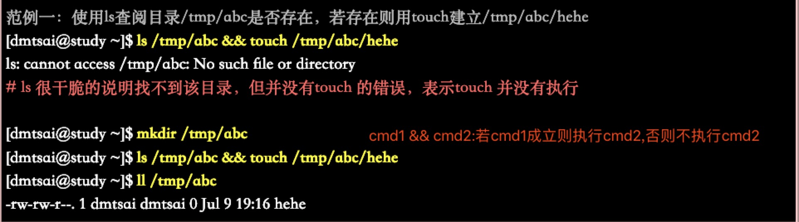

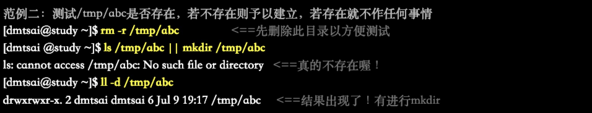

**注意下述指令区别**

(1) $ ls /tmp/syf && echo "exist" || echo "not exist" #如syf目录存在，则输出exist，否则输出not exist(||前面执行成功后面不会执行)

(2) $ ls /tmp/syf || echo "not exist" && echo "exist" #此种情况会同时出现exist和not exist情况.因为&&命令前边执行成功，后边即会执行

cmd1 && cmd2 || cmd3 #cmd2与cmd3放置肯定可以执行成功的指令

## 七。管线命令(pipe)

-----------------------

# 第十一章 正规表示法与文件格式化

[鸟哥的linux私房菜]()

-----------------------

# 第十二章 学习shell scripts

[鸟哥的linux私房菜]()

-----------------------

