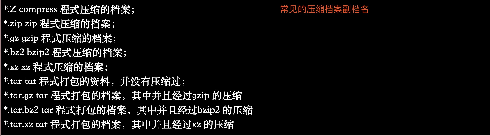
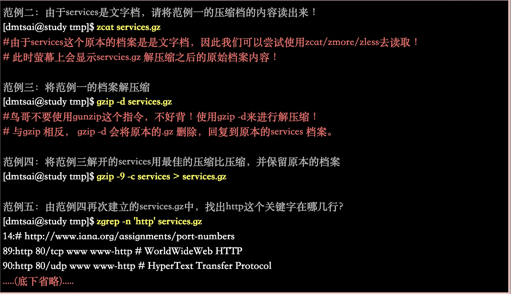
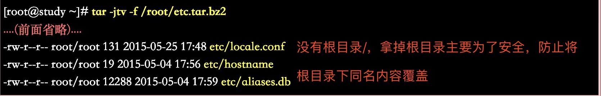

# 第七章 linux磁碟与档案系统管理

## 7.1 认识linux档案系统

### 1.磁碟组成与分割的复习

### 2.档案系统特性：索引式档案系统

### 3.linux的EXT2档案系统(inode):data block,inode table,superblock,dumpe2fs

### 4.与目录树的关系

### 5.EXT2/EXT3档案的存取与日志式档案系统的功能

### 6.linux档案系统的运作

### 7.挂载点的意义(mount point)

### 8.其他linux支援的档案系统与VFS

### 9.XFS档案系统简介: xfs_info

## 7.2 档案系统的简单操作

### 1.磁碟与目录的容量: df , du

### 2.实体连结与符号连结: ln

## 7.3 磁碟的分割，格式化，检验与挂载

### 1.观察磁碟分割状态：lsblk, blkid, fdisk

### 2.磁碟分割gdisk/fdisk: gdisk,partprobe,fdisk

### 3.磁碟格式化(建置档案系统): mkfs.xfs,mkfs.xfs for raid,mkfs.ext4,mkfs

### 4.档案系统检验： xfs_repair,fsck.ext4

### 5.档案系统挂载与卸载: mount,umount

## 7.4 设定开机挂载

### 1.开机挂载 /etc/fstab 及/etc/mtab

### 2.特殊装置loop挂载: 挂载DVD,大型档案，dd

## 7.5 记忆体置换空间(swap)之建置

### 1.使用实体分割槽建置swap: mkswap,free,swapon,swapoff

### 2.使用档案建置swap

## 7.6 档案系统的特殊观察与操作

### 1.磁碟空间之浪费问题

### 2.利用GNU的parted进行分割行为(Optional)

## 7.7 重点回顾

-------------------------------------------

# 第八章 档案与档案系统的压缩,打包与备份

**常见的压缩档案副档名**

## 一. linux系统常见的压缩指令 

+ gzip, zcat/zmore/zless/zgrep (原始档案被压缩成.gz，但原始档案不再存在)

    
    

**注：gzip为取代compress,提供更好的压缩比。若旧版本有用compress压缩的.Z档案，可用znew将档案转成gzip格式**

+ bzip2, bzcat/bzmore/bzless/bzgrep (同gzip)

    **bzip2为取代gzip并提供更佳的压缩比**
    
    

+ xz, xzcat/xzmore/xzless/xzgrep (同gzip&bzip2,压缩比更高)

    
    
## 二. 打包指令: tar

**$ man tar  #查看tar帮助指令**

+ 压缩：tar -j c v -f filename.tar.bz2要被压缩的档案或目录名称
+ 查询：tar -j t v -f filename.tar.bz2
+ 解压缩：tar -j x v -f filename.tar.bz2 -C欲解压缩的目录

**说明:副档名为自定义，若不指定[-z|-j|-J]则档名最好为*.tar;**
 
 「-j」
    + [-z]为gzip压缩方式，档名为x.tar.gz;
    + [-j]为bzip2压缩方式，档名为x.tar.bz2;
    + [-J]为xz压缩方式，档名为x.tar.xz
    
 「v」:在压缩/解压缩过程中，将正在处理的档名显示出来
 
 「c / t / x」:
    + c 建立打包档案
    + t 查看打包档案包含哪些档名
    + x 解打包或解压缩功能
  
 「-f」: -f后紧根要处理的档名  「-f filename」
 
### 常用tar方法

#### 1.使用tar 加入-z, -j 或-J 的参数备份/etc/ 目录

#### 2.查阅tar档案的资料内容(可察看档名)，与备份档名是否有根目录的意义

#### 3.将备份的资料解压缩，并考虑特定目录的解压缩动作(-C 选项的应用)

#### 4.仅解开单一档案的方法(上述为全部解开)

#### 5.打包某目录，但不含该目录下的某些档案之作法

#### 6.仅备份比某个时刻还要新的档案

#### 7.基本名称： tarfile, tarball ？

+ 若仅是打包而已，就是『 tar -cv -f file.tar 』而已，这个档案我们称呼为tarfile 

+ 若还要进行压缩的支援，如『 tar -jcv -f file.tar.bz2 』时，我们就称呼为tarball (tar球？)！

**将/home /root /etc备份到磁带机『tar -cv -f /dev/st0 /home /root /etc』**

#### 8.特殊应用：利用管线命令与资料流

#### 9.例题：系统备份范例

#### 10.解压缩后的SELinux 课题

## [三.XFS 档案系统的备份与还原](http://linux.vbird.org/linux_basic/0240tarcompress.php#compress_tech)

**使用tar 通常是针对目录树系统来进行备份的工作，那如果想要针对整个档案系统来进行备份与还原可使用xfsdump 与xfsrestore 两个工具**

### (1).XFS 档案系统备份xfsdump

### (2).XFS 档案系统还原xfsrestore

## 四. 光碟写入工具

### 1.mkisofs：建立映像档

### 2.cdrecord：光碟烧录工具

## 五.其他常见的压缩与备份工具

### 1.dd

### 2.cpio

## 六.小结

### 压缩命令与解压缩命令(.zip .gz .bz2)

    .zip:可以压缩文件/目录 （压缩源文件，并保留源文件）--windows可以解压缩
    
    .gz：可以压缩文件，且源文件消失；压缩目录，会将目录下的所有子目录/文件分别压缩--windows可以解压缩
    
    .bz2：bzip2命令不能压缩目录，只能够压缩文件
    
    （1）【.zip压缩格式】=windows(通用)
    
    #压缩文件-压缩文件不一定比源文件小
    zip filename.zip filename  //[zip 压缩文件名 源文件] 注：.zip可省，但建议保留
    
    #压缩目录
    zip -r dirname.zip  dirname //[zip -r 压缩目录名 源目录]
    
    #.zip格式解压缩
    unzip filename.zip  //解压缩文件[unzip 压缩文件]
    unzip dirname.zip   //解压缩目录[unzip 压缩文件]
    
    （2）【.gz压缩格式】-linux专有压缩格式，windows可以解压缩
    
    gzip filename    //将文件压缩成.gz格式且源文件消失
    
    gzip -c filename > filename.gz //将文件压缩成.gz格式且源文件不消失
    
    gzip -r dirname  //压缩目录下的所有子文件，但不会打包成一个文件
    
    【.gz格式解压缩】
    
    gzip -d filename.gz   //[gzip -d 压缩文件]解压缩
    
    gunzip filename.gz    //解压缩
    
    gunzip -r dir      //解压缩目录
    
    【.bz2格式压缩】--注意：bzip2命令不能压缩目录
    
    bzip2 filename  //[bzip2 源文件](不保留源文件)
    
    bzip2 -k filename //保留源文件压缩
    
    [.bz2格式解压缩]
    
    bzip2 -d filename.bz2   //[bzip2 -d 压缩文件]
    
    bunzip2 filename.bz2   //[bunzip2 压缩文件]

### 打包命令 tar

    ###解决.gz和.bz2格式打包目录的问题（原理：先将文件打包，再压缩）
    
    (1).[.tar格式打包] 
    
    tar -cvf filename.tar filename  //打包文件[tar -cvf 打包文件名 源文件]
    #-c:打包/-v：显示过程/-f：指定打包后的文件名    >可再用gzip压缩
    
    (2).[解打包命令]
    
    tar -xvf filename.tar  //tar -xvf 打包文件名 -x:解打包
    
    (3).打包&压缩(先打包.tar格式再压缩.gz格式)
    
    #打包压缩.tar.gz格式
    tar -zcvf filename.tar.gz filename   //先打包再压缩(c:压缩)[tar -zcvf 压缩包名.tar.gz 源文件]
    tar -zxvf filename.tar.gz    //解压缩[tar -zxvf 压缩包名.tar.gz]
    
    #多文件压缩
    tar -zcvf /tmp/unionfile.tar.gz file1 file2 //将文件file1和file2一起压缩到目录tmp下
    tar -zxvf unionfile.tar.gz  //解压缩
    
    #压缩.tar.bz2格式
    tar -jcvf filename.tar.bz2 filename  //解压缩[tar -jcvf 压缩包名.tar.bz2 源文件]
    tar -jxvf filename.tar.bz2           //解压缩[tar -jxvf 压缩包名.tar.bz2]
    tar -jxvf filename.tar.bz2 -C /tmp/  //指定-C选项，解压缩位置
    
    #只看压缩包内容不解压缩
    tar -ztvf filename.tar.gz  //只压缩包内容不解压缩 [t:test]
    
------------------------------------------------

[鸟哥的linux私房菜](http://linux.vbird.org/linux_basic/0240tarcompress.php#compress_tech)

