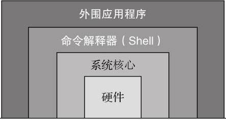
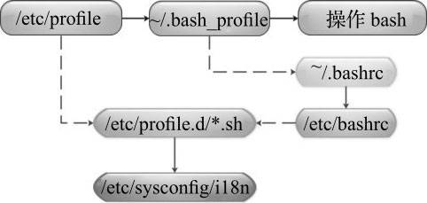
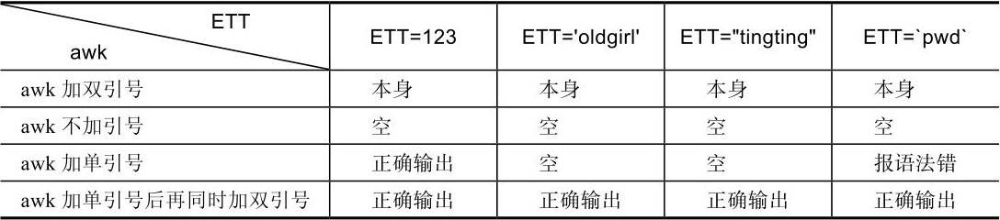
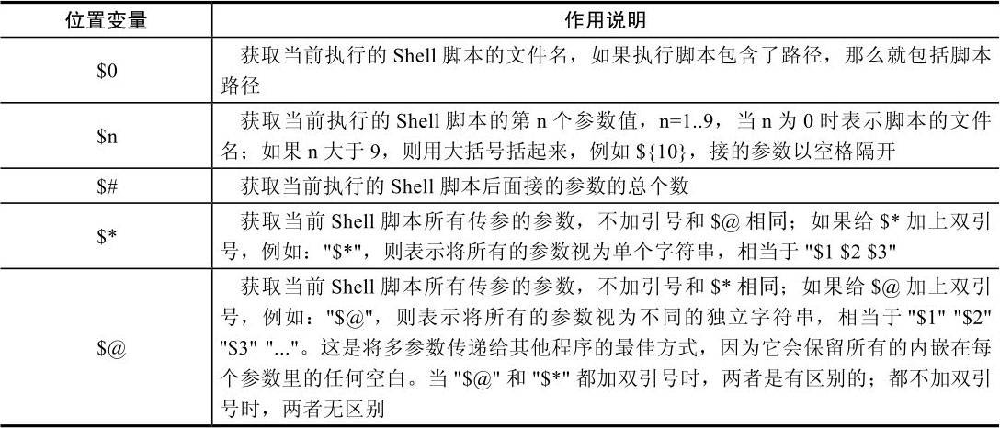
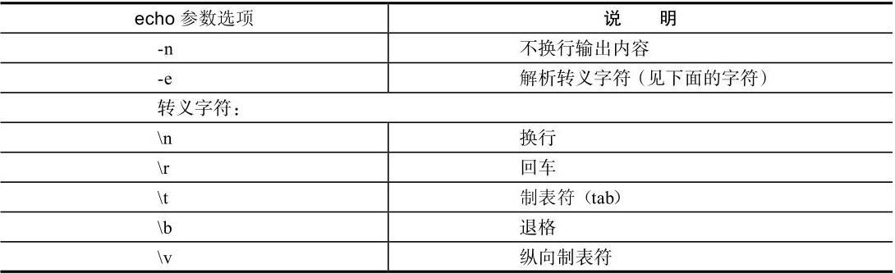
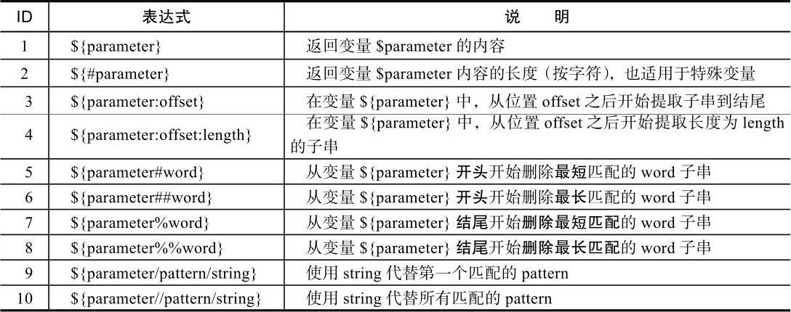
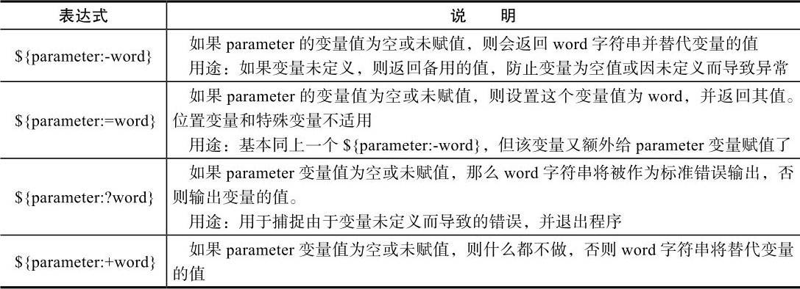

#shell脚本初步入门(跟老男孩学linux第1-2章)

##一。什么是shell

shell:是一个命令解释器,解释执行用户输入的命令及程序 #shell英文贝壳

##二。什么是shell脚本

shell脚本:当命令/程序语句不在命令行下执行，而是通过一个程序文件来执行时，该程序即为Shell脚本.

shell脚本类似DOS系统下的批处理程序(.bat)

###示例程序

####1.清除/var/log下的message日志文件的简单命令脚本

cd /var/log
cat /dev/null >messages
echo "Logs cleaned up."

**重要:/var/log/messages是linux系统的日志文件**

**注意:上述只有root用户才可执行脚本清理命令**

####2.清除/var/log下messages日志文件的shell脚本

[shell1.sh](examples/shell1.sh)

###shell脚本在运维工作中的地位和形象图

##三。脚本语言种类

###1.shell脚本语言的种类

**shell脚本语言是弱类型语言(无须定义变量的类型即可使用)**

Unix/Linux中主要两大类Shell:

+ Bourne shell:分sh(已被bash取代), ksh , bash(常用,主流，由sh发展而来)
 
+ C shell:分csh(常用) 和 tsh(csh的升级版)

###2.其他常用脚本语言种类

(1)php语言

网页程序语言，也是脚本语言。它更专注于web页面开发(前端展示)的语言。优势：小型网站开发

(2)Perl语言

Perl语言比shell脚本语言强大很多，缺点：不易读，团队协作困难。很少用

(3)Python语言--流行

Python语言可实现

+ Web页面程序开发：如CMDB管理系统
+ 软件开发：如OpenStack,SaltStack
+ 游戏开发 & 大数据开发 & 移动端开发

优势：开发较复杂的运维工具软件,web界面管理工具和web业务的开发

###3.shell脚本语言的优势

shell语言优势在于处理偏操作系统底层的业务。

**特别是linux正则表达式及三剑客(grep | awk | sed 等命令)**

###4.shell脚本的建立和执行

###4-1 shell脚本建立

linux自带vim编辑器来编写shell脚本

可事先做一个别名alias (vi='vim'),使其永久生效。调用vi即调用vim编辑器

echo "alias vi='vim'" >>/etc/profile 
tail -1 /etc/profile
source /etc/profile

####1.脚本第一行

**#! /bin/bash  或  #! /bin/sh #<==255个字符以内**

####2.bash与sh区别

sh是bash的软链接

$ bash --version #查看bash版本命令

$ env x='() { :; }; echo be careful' bash -c "echo this is a test" #检测系统是否存在漏洞,输出be careful则表示需要升级

$ yum -y update bash  #升级系统
$ rpm -qa bash

$ bash test.sh #执行shell脚本
$ python test.py #执行test.py
$ expect test.exp #执行test.exp

####3.脚本注释

"#"后面内容表注释(第1行#!除外),脚本中尽量避免中文

###4-2 shell脚本执行

shell脚本运行，会先查找系统环境变量ENV，该变量指定了环境文件(加载顺序:/etc/profile,~/.bash_profile,~/.bashrc,/etc/bashrc)

[shell脚本的基本执行流程](images/shell脚本的基本执行流程.jpeg)

####shell脚本的执行可采用如下方式--常用

+ $ bash test.sh  / $ sh test.sh  (推荐)

+ $ path/ test.sh / $ ./test.sh (脚本需要有执行权限:chmod +x test.sh,再通过绝对/相对路径直接执行脚本)

+ $ source test.sh / $ . test.sh (source和.方式先读入/加载指定shell脚本文件，再依次执行指定shell脚本中语句。可将子shell中返回值传递到当前父shell脚本中使用)

**vim编辑shell脚本,ctrl+d命令结束编辑**

[shell2.sh](examples/shell2.sh)

执行脚本:

方式一: $ bash test.sh  或  $ sh test.sh 

方式二: 此方式必须有执行权限

$ ls -l shell2.sh   #查看脚本文件权限

$ ./shell2.sh  #执行当前目录的脚本文件(必须有执行权限:chmod u+x shell2.sh)

方式三: $ source shell2.sh  或 $ . shell2.sh  #读入脚本并执行脚本

#####示例1：

$ echo 'userdir=`pwd`' >testsource.sh #输出userdir=`pwd`并创建[testsource.sh](examples/testsource.sh)

$ cat testsource.sh #查看testsource.sh脚本内容

$ sh testsource.sh #以sh方式执行脚本

$ echo $userdir #输出变量值，并无任何内容

**注：以sh/bash执行脚本会启动新的子shell执行，执行完后退回到父shell.因此变量(包括函数)值无法保留**

$ source testsource.sh #以source或.方式执行脚本

$ echo $userdir #输出变量值为目录路径

**注：以source或.加载执行过的脚本，由于是当前shell中执行脚本，因此脚本结束后，脚本中变量(包括函数)值在当前shell中依然存在**

**另：在进行shell脚本开发时，若脚本中有引用或执行其他脚本的内容人或配置文件需求时，最好用.或source先加载该脚本或配置文件，处理完后，再将它们加载到脚本的下面，就可调用source加载的脚本和配置文件中的变量及函数等内容了**

#####示例2：

[shell01.sh](examples/shell01.sh) #仅echo "hello linux shell!"

$ sh<shell01.sh #执行shell脚本(尽量不用)

$ cat shell01.sh | bash #执行shell脚本(拼接方式，查看执行)

**其他：可配置vim简化操作，如：实现自动缩近，自动补全成对符号，自动加入起始解释器及版权信息等**

###[shell脚本学习指南中的实操](Shell脚本：Linux Shell脚本学习指南))

shell提示符：#(超级用户root)和$(普通用户)

命令:
$ echo $SHELL #查看当前linux默认shell
$ cat /etc/shells #查看Shell

##第一个shell脚本

[example/shell01.sh](examples/shell01.sh)

[example/shell02.sh](examples/shell02.sh)

执行shell脚本:Shell 脚本也是一种解释执行的程序，可以在终端直接调用（需要使用 chmod 命令给 Shell 脚本加上执行权限）

###操作步骤

Step1:$cd exmaples

Step2:$chmod +x ./shell02.sh  #使脚本具有执行权限

**应用"."命令 和 "source"命令 和 /bin/bash解释器分别执行,效果一致!**

step3-1:$./shell02.sh #执行当前目录下的shell02.sh脚本 #./表示当前目录，若不指定,linux会到PATH所指定的系统路径下查找shell02.sh

step3-2:$ source shell02.sh #同.号,source命令可读取并在当前环境中执行脚本。(返回脚本中最后一个命令的返回状态；若没有返回值则返回 0-执行成功；未找到指定的脚本返回false。)

step3-3:$ /bin/bash shell02.sh #直接运行解释器，即shell02.sh中第一行指定的!#解释器可省略(写了也没用)

###Bash Shell的安装和升级(源码安装)

#常用命令

$ chmod +x ./shell.sh #使用shell.sh脚本具有可执行权限
$ cat /etc/shells #查看Shell
$ echo $SHELL #确认系统中使用的shell(本机bash)
$ bash --version / echo $BASH_VERSION #查看系统中bash shell的版本

----------------------------------------------------------------

#第3章 shell变量的核心基础知识和实践

##3.1什么是shell变量

1.什么是变量

$ varName="learn shell"  #变量名=变量值
 
$ echo $varName #输出变量值

**注：变量值一般要加双引号**

2.shell变量特性

默认bash shell不区分变量类型(弱类型语言),若需指定shell变量类型，可使用declare显示定义变量类型.

3.变量类型

变量分为两类:

+ 环境变量(全局变量)

  + 自定义环境变量
  + bash内置的环境变量

+ 普通变量(局部变量):只能在创建它们的shell函数或shell脚本中使用

##3.2环境变量

1.环境变量一般指：用export内置命令导出的变量，用于定义shell的运行环境，保证shell命令的正确执行.

2.shell通过环境变量确定：登录用户名，命令路径，终端类型，登录目录等。

3.永久保存环境变量方法:

在用户家目录下 .bash_profile / .bashrc(非用户登录模式特有，如远程SSH) / 

全局配置/etc/bashrc(非用户登录模式特有，如远程SSH) /  /etc/profile 文件中定义

**注意：按系统规范，所有环境变量名字均采用大写形式**

4.一般环境变量被定义并保存在用户家目录下的.bash_profile文件或全局配置文件/etc/profile中

**[环境变量含义1](images/环境变量含义1.jpeg) , [环境变量含义2](images/环境变量含义2.jpeg)**

5.在查看设置的变量时，有3个命令可显示变量的值: set / env /declare(替代早期的typeset)

+ set命令：输出所有的变量，包括全局变量和局部变量
  + $ set -o #显示bash shell的所有参数配置信息
  + $  set -o|head
+ env命令：只显示全局变量
  + $ env|tail
+ declare命令：输出所有变量，函数，整数和已经导出的变量
  + $ declare|tail
  
###3.2.1自定义环境变量

1.设置环境变量--3种方法

+ export 变量名=value

  + $ export NAME=learn shell

+ 变量名=value ; export 变量名

  + $ NAME=learn shell ; export NAME

+ declare -x 变量名=value

  + $ declare -x NAME=learn shell
  
**示例：自定义全局环境变量**

$ cat /etc/profile | grep OLD
$ export NAME='learn shell'  #编辑/etc/profile文件，输出此行并保存
$ source /etc/profile  #source或.执行脚本，使其生效
$ echo $NAME #变量前加$符号，并打印变量值
$ env|grep NAME #查看定义结果

**示例：环境变量永久生效常用设置文件**

+ 用户的环境变量配置

  + $ ls /root/.bashrc  #推荐在此文件中优先设置
  
  + $ ls /toot/.bash_profile 

+ 全局环境变量的配置

  + /etc/profile
  
  + /etc/bashrc   #推荐在此文件中优先设置
  
  + /etc/profile.d #若要在登录后初始化或显示加载内容，则把脚本文件放在/etc/profile.d下即可(无须加执行权限)
  
2.设置登录提示的两种方式

+ 在/etc/motd里增加提示的字符串

   + $ cat /etc/motd

+ 在/etc/profile.d下增加脚本

   + $ cat /etc/profile.d/test.sh

###3.2.2显示与取消环境变量

1.通过echo / printf命令打印环境变量

+ $HOME:用户登录时进入的目录($ echo $HOME 或 $ printf "$HOME\n"")
+ $UID:当前用户的UI，即用户标识，相当于id-u(echo $UID)
+ $PWD:当前工作目录的绝对路径名(echo $PWD)
+ $SHELL:当前SHELL(echo $SHELL)
+ $USER:当前用户(echo $USER)

2.用env或set显示默认的环境变量

+ $ env
+ $ set

3.用unset消除本地变量和环境变量

$ echo $USER   #输出USER环境变量值 (echo $变量名)
$ unset USERT  #消除USER环境变量  (unset 变量名)
$ echo $USER   #输出空行

###3.2.3环境变量初始化与对应文件的生效顺序

##3.3普通变量

###3.3.1定义本地变量

本地变量在用户当前shell生存期的脚本中使用。

1.普通变量定义

+ 变量名=value
+ 变量名='value'
+ 变量名="value"

2.在shell中定义变量名及为变量内容赋值的要求

**变量名一般由字线，数字，下划线组成，可以字母/下划线开头**

3.普通变量的定义及输出的示例

+ 示例1

$ a=192.168.1.2    # $ echo "a=$a" : 192.168.1.2
$ b='192.168.1.2'  # $ echo "b=$b" : 192.168.1.2
$ c="192.168.1.2"  # $ echo "c=${c}" : 192.168.1.2

**注意：$变量名表示输出变量，可以用$c和${C}**

+ 示例2

$ a=192.168.1.2-$a    # $ echo "a=$a" : 192.168.1.2-192.168.1.2
$ b='192.168.1.2-$a'  # $ echo "b=$b" : 192.168.1.2-$a
$ c="192.168.1.2-$a"  # $ echo "c=${c}" : 192.168.1.2-192.168.1.2-192.168.1.2

4.变量定义的基本技巧总结

以示例2为例：

+ $ a=192.168.1.2-$a #定义变量未加任何符号，值里有变量会被解析后再输出
+ $ b='192.168.1.2-$a'#定义变量加单引号，输出变量内容单引号里是什么则输出什么
+ $ c="192.168.1.2-$a" #通过双引号定义变量，引号里的变量及命令会经过解析后再输出内容

5.把一个命令的结果作为变量的内容赋值的方法

**对需要获取命令结果的变量内容赋值的两种方法**

+ 变量名=`ls`  #不推荐，易与单引号混

+ 变量名=$(ls) #推荐

**示例1：用以上两种方法将命令的结果赋值给变量**

$ CMD=`ls` #定义变量，将命令赋值给变量
$ echo $CMD #输出变量,显示所有文件件内容

$ CMD1=$(pwd) #定义变量，将命令赋值给变量
$ echo $CMD1 #输出变量,打印当前用户所在目录

**注：当变量后面连接有其他字符时，必须给变量加上{}，如$dbname_tname需改成${dbname}_tname**

**[示例2:按天打包网站的站点目录程序，生成不同的文件名--企业实战案例](examples/shell01.txt)**

###3.3.2变量定义及变量输出说明

[单引号、双引号、反引号、与不加引号的知识说明](images/单双反引号说明.jpeg)

**示例1：[对由反引号引起来的`date`命令或$(date)进行测试](examples/shell02.txt)**

**示例2：[变量定义后，在调用变量输出打印时加引号测试](examples/shell03.txt)**

**示例3：使用三剑客命令中的grep过滤字符串时给过滤的内容加引号**
$ cat grep.log 
$ grep "test grep" grep.log  #过滤查找

**示例4：[使用awk调用shell中的变量，分别针对加引号、不加引号等情况进行测试](examples/shell04.txt)**

结论:

不管变量如何定义，赋值。除了加单引号外，得用awk直接获取变量的输出，结果都是一样的。

因此常用如下方式:

[echo加符号输出变量，然后通过管道给awk，进而控制变量的输出结果](examples/shell05.txt)

**其他**

[有关awk调用Shell变量的详情，参考“一道实用Linux运维问题的9种Shell解答"](http://oldboy.blog.51cto.com/2561410/760192)

**示例5：通过sed指定变量关键字过滤**

##3.4变量定义技巧总结

----------------------------------------------------------------

#第4章 shell变量知识进阶与实践

##4.1 shell中特殊且重要的变量

###4.1.1 shell中的特殊位置参数变量

1.$1 $2 ...$9 ${10}${11}..特殊变量实践

**[示例4-1:测试$n(n为1..15)](examples/shell06.txt)**

**[示例4-2:在脚本中同时加入$1和$2](examples/shell06.txt)**

**[示例4-3:设置15个位置参数($1-$15),用于接收命令行传递的15个参数](examples/shell06.txt)**

2.$0特殊变量的作用及变量实践

**[示例4-4:获取脚本的名称及路径](examples/shell06.txt)**

**[示例4-5:dirname及basename命令自身的功能和用法](examples/shell06.txt)**

+ dirname:获取脚本的路径

+ basename:获取脚本名字

**[示例4-6:得用$0和上述命令(dirname/basename)分别取出脚本名称和脚本路径](examples/shell06.txt)**

3.$#特殊变量获取脚本传参个数的实践

**[示例4-7:通过$#获取脚本传参的个数](examples/shell06.txt)**

**[示例4-8:根据用户在命令行的传参个数判断用户的输入，不合要求的给予提示并退出](examples/shell06.txt)**

4.$*和$@特殊变量功能及区别说明

**[示例4-9:利用set设置位置参数(同命令行脚本的传参)](examples/shell06.txt)**

**有关set和eval命令的使用案例（特殊位置变量用法）**

###4.1.2 shell进程中的特殊状态变量

####shell进程的特殊状态变量说明

**查找上述知识方法:**

$ man bash  ->  / Special Parameters  #搜索关键字

1.$?特殊变量功能实践 --获取执行上一个指令的返回状态(0:成功，非0:失败)

**[示例4-10:执行命令后获取返回值](examples/shell06.txt)**

**[示例4-11：根据返回值来判断软件的安装步骤是否成功](examples/shell06.txt)**

**[示例4-12：通过获取$?的返回值确定网站备份是否正确](examples/shell06.txt)**

**[示例4-14：查看系统脚本的应用情况，脚本名为/etc/init.d/rpcbind](examples/shell06.txt)**

2.$$特殊变量功能及实践--$$用于获取当前执行shell脚本的进程号

**[示例4-15:获取脚本执行的进程号(PID)](examples/shell06.txt)**

**[示例4-16:实现系统中多次执行某一个脚本后的进程只有一个(此为$$的企业级应用)](examples/shell06.txt)**

3.$_特殊变量功能说明及实践 -- $_用于获得上一条命令的最后一个参数值(用得少，了解)

**[示例4-17: $_参数示例](examples/shell06.txt)**

4.$!特殊变量功能说明及实践 -- $!类似于$$,作用是获取上一次执行脚本的pid

**[示例4-18 $!功能示例](examples/shell06.txt)**

##4.2 bash shell内置变量命令

**常用内部命令**

+ echo :在屏幕上输出信息,格式: echo args  #可以是字符串和变量的组合

  
  
  **[示例4-19:echo的参数应用示例](examples/shell06.txt)**
  
+ eval : 格式eval args，功能(当shell程序执行到eval语句时，shell读入参数args，并将它们组合成一个新的命令，然后执行)

  **[示例4-20:set和eval命令的使用(含特殊位置变量用法)](examples/shell06.txt)**
  
  **[linux下set和eval的使用小案例精彩解答](https://blog.51cto.com/oldboy/1175971)**
  
+ exec :格式 exec 命令参数 (功能：exec命令能在不创建新的子进程前提下，转去执行指定的命令，当指定的命令执行完毕后，该进程(即最初shell)就终止了)

  **[示例4-21 exec的功能示例](examples/shell06.txt)**

+ export

+ read :格式(read 变量名表) 功能(从标准输入读取字符串等信息，传给shell程序内部定义的变量)

+ shift : 格式(shift-Shift positional parameters)

  **[示例4-22&4-23:shift功能介绍](examples/shell06.txt)**
  
+ exit :格式(exit-Exit the shell) 退出shell程序,在exit之后可有选择地指定一个数位作为返回状态

##4.3 shell变量子串知识及实践

###4.3.1 shell变量子串介绍

**shell变量子串帮助知识**

$ man bash  ->  /Parameter Expansion

###4.3.2 shell变量子串的实践

**[示例4-24:返回OLDBOY变量值的长度](examples/shell06.txt) --通过在变量名前加#**

**[示例4-25:Shell的其他打印变量长度的方法](examples/shell06.txt)** --wc /expr / awk 应用

**[示例4-26：利用time命令及for循环对几种获取字符串长度的方法进行性能比较](examples/shell06.txt)**

**[示例4-27：截取OLDBOY变量的内容，从第2个字符之后开始截取，默认截取后面字符的全部，第2个字符不包含在内，也可理解为删除前面的多个字符](examples/shell06.txt)**

**[示例4-28：截取OLDBOY变量的内容，从第2个字符之后开始截取，截取2个字符](examples/shell06.txt)**

**[示例4-29：从变量$OLDBOY内容的开头开始删除最短匹配“a*C”及“a*c”的子串](examples/shell06.txt)**

**[示例4-30：从变量$OLDBOY开头开始删除最长匹配“a*C”及“a*c”的子串](examples/shell06.txt)**

**[示例4-31：从变量$OLDBOY结尾开始删除最短匹配“a*C”及“a*c”的子串](examples/shell06.txt)**

**[示例4-32：从变量$OLDBOY结尾开始删除最长匹配“a*C”及“a*c”的子串](examples/shell06.txt)**

**[示例4-33：使用oldgirl字符串代替变量$OLDBOY匹配的oldboy字符串](examples/shell06.txt)**

###4.3.3 变量子串的生产场景应用案例

**[示例4-34:去掉下面所有文件的文件名中的“_finished”字符串](examples/shell06.txt)**

**[Linux下批量修改文件名精彩解答案例分享》](http://oldboy.blog.51cto.com/2561410/711342)**

##4.4 shell特殊扩展变量的知识与实践

###4.4.1 shell特殊扩展变量介绍

**shell特殊扩展变量说明**

**注意：上述冒号可选.若去掉冒号，则定义"为空或示赋值"修改为"未赋值"**

$ man bash  -> / Parameter Expansion  #搜索相关帮助内容

###4.4.2 shell特殊扩展变量的实践

1. ${parameter:-word}功能实践

**${parameter:-word}功能:如果parameter变量值为空或未赋值，则会返回word字符串替代变量的值。**

**[示例4-25:${parameter:-word}用法功能示例1](examples/shell06.txt)**

**[示例4-36:${parameter:-word}用法功能示例2](examples/shell06.txt)**

2. ${parameter:=word}功能实践

**${parameter:=word}功能:若parameter变量值为空或未赋值，就设置这个变量值为word并返回其值。位置变量和特殊变量不适用**

**[示例4-37:${parameter:=word}用法功能示例](examples/shell06.txt)**

3. ${parameter:?word}功能实践

**${parameter:?word}功能:若parameter变量值为空或未赋值，则word字符串将被作为标准错误输出，否则输出变量的值**

**[示例4-38:${parameter:?word}用法功能示例](examples/shell06.txt)**

说明：本例的用法可以用于设定由于变量未定义而报错的具体内容，如：“not defined”

4. ${parameter:+word}功能实践

**${parameter:+word}功能:若parameter变量值为空或未赋值，则什么都不做，否则word字符串将替代变量的值**

**[示例4-39:${parameter:+word}用法功能示例](examples/shell06.txt)**

###4.4.3 shell特殊扩展变量生产场景应用案例

**[示例4-40（生产案例）：实现Apache服务启动脚本/etc/init.d/httpd](examples/shell06.txt)**

**[示例4-41（生产案例）：删除7天前的过期数据备份](examples/shell06.txt)**

-----------------------------------------------------

#第5章 变量的数值计算实践

##5.1 算术运算符

##5.2 双小括号"(())"数值运算命令

### 5.2.1 双小括号"(())"数值运算的基础语法

### 5.2.2 双小括号"(())"数值运算实践

##5.3 let运算命令用法

##5.4 expr命令的用法

###5.4.1 expr命令的基本用法示例

###5.4.2 expr的企业级实战案例详解

##5.5 bc命令的用法

##5.6 awk实现计算

##5.7 declare(同typeset)命令的用法

##5.8 $[]符号的运算示例

##5.9 基于shell变量输入read命令的运算实践

###5.9.1 read命令基础

###5.9.2 以read命令读入及传参的综合企业案例

[文档](Shell脚本：Linux Shell脚本学习指南)