# [第五章 linux的文件权限与目录配置](http://cn.linux.vbird.org/linux_basic/0210filepermission.php)

## 5.1 使用者与群组(任何一个文件都具有)

### 一。使用者与群组

1.文件拥有者：指定谁能够查看与修改该文件内容(如：私密文件只有我自己能够查看和修改，我就是文件的拥有者)

2.群组：一般指团队协作时，团队能共同做的事情

  如：A组：A1，A2，A3 ，共用代码库，但A1,A2,A3均有自己所属项目，其他人只能看，但不能修改。只有属于公共的项目才可互相查看和修改。

3.其他人:

  A组：A1，A2，A3，则A4是A1的朋友，A1可授权A4权限。但相对于A2和A3来说，A4是其他人。A4不能查看/修改A2,A3
  
**Linux系统：root用户，具有最高权限，啥都能干！**

### 二。linux用户身份与群组记录的文件

+ linux系统当中，默认所有系统上的账号 & 一般身份使用者 & root相关信息 存储在=>/etc/passwd文件内

+ 个人密码 存储在=>/etc/shadow文件

+ linux所有组名 存储在=>/etc/group

-------------------------------------------

## 5.2 linux文件权限概念

**注意：[Permission deny]即[肯定是权限设定错误]**

**某一文件权限，如何针对[使用者]与[群组]来设定**

### 一。linux文件属性

**文件属性示意图**

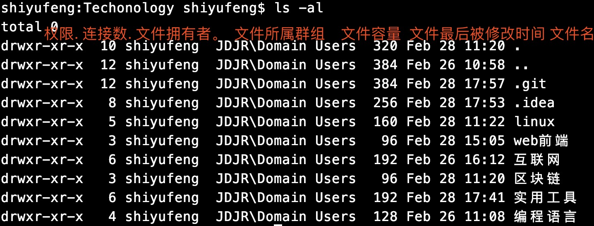

+ 第一栏：代表这个文件的类型与权限(permission)

**注意：第一个字符代表这个文件是[目录/文件/链接文件等]**

  + d:目录  
  + -:文件  
  + l:链接文件  
  + b:装置文件里可供储存的接口设备
  + c:装置文件里串行端口设备，如键盘，鼠标(一次性读取装置)
  
**另：权限顺序不变rwx(读，写，执行)**

**drwxr-xr-- 1 test1 testgroup ...:则说明其他人只有r权限，没有x权限，则不能进入该目录**

+ 第二栏：表示有多少文件名连接到此节点(i-node)

**注意：每个文件都会将他的权限与属性记录到文件系统的i-node中。但使用的目录树是使用文件名来记录**

+ 第三栏：表示这个文件(或目录)的[拥有者账号]

+ 第四栏：表示这个文件的所属群组(你的账号会附属一个/多个群组)

+ 第五栏：表示这个文件大小，单位bytes

+ 第六栏：表示这个文件的建档日期/最近修改日期(月/日及时间)(ls -l --full-time：显示完整时间格式)(修改语系文件:/etc/sysconfig/i18n)

+ 第七栏：表示这个文件的名称

  文件名前多个"."代表隐藏文件，可用：$ ls -a 查看
  
### 命令总结:

+ 查看ls帮助命令: $ ls --help / $ man ls / $ info ls

+ 查看某一文件详情信息： $ ls -al 文件名

+ 查看某一目录详情信息：$ ls -ld 目录名

### 二。如何改变档案属性与权限

**常用于群组、拥有者、各种身份的权限之修改的指令**

+ chgrp:改变档案所属群组 (change group => chgrp)

  **注：要改变权限的群组名称必须在/etc/group文档中存在**
  
  **例：改变群组，当前用户为syf,修改为群组newusergroup(在/etc/group中不存在)**
  
  + chgrp [-R] 群组名 目录名  ##改变目录的所属群组(-R选项代表递归的持续变更。即将bin目录下面的所有目录和文件均更改为新群组)
  
  + chgrp 群组名 文件名       ##改变文件所属群组
  
  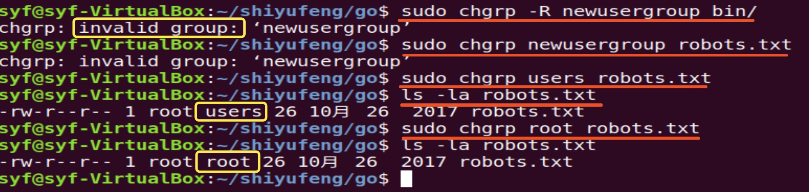
  
+ chown:改变档案拥有者 (change owner => chown)

  **注:使用者必须是已经存在系统中的帐号，即在/etc/passwd这个档案中有纪录的使用者名称才能改变**
  
  **示例:chown修改所有者，同时也可修改所属群组!**
  
  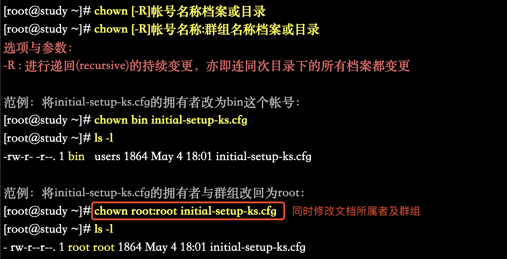
  
  **注：分隔所有者与群组符号**
  
  + 所有者:群组 (常用)
  + 所有者.群组 (也可，但因创建账号时可能会在用户里添加.导致系统误判。)
  
  **另:chown也可修改群组: $ chown .groupname file.txt**
  
  **chgrp与chown实例应用：cp命令会复制执行者的属性与权限**
  
  
  
  **因此：需要修改文件的拥有者与群组，其他人员才可使用。**

+ chmod:改变档案的权限, SUID, SGID, SBIT等等的特性

  + 数字类型改变档案权限
  
    **linux档案的基本的权限有9个(owner/group/other;r/w/x)**
    
    + r -4
    + w -2
    + x -1
    
    『-rwxr-xr--』 则
    
    分组后 - [rwx][r-x][r--] => 文件，所属用户权限，组权限，其他人权限。权限对应数字和:[4+2+1][4+0+1][4+0+0]=754
    
    **常用：需要将文件设置为可执行档，但不能修改。权限『-rwxr-xr-x』即755**
    
    
    
    **如：$ chmod 744 dirname或filename //为目录或文件设置[rwxr--r--]权限**
  
  + 符号类型改变档案权限
  
  
  
  **示例1:一个档案的权限成为『-rwxr-xr-x』**
  
    + user (u)：具有可读、可写、可执行的权限
    + group 与others (g/o)：具有可读与执行的权限
    
    
  **示例2:『 -rwxr-xr-- 』权限 => chmod u=rwx,g=rx,o=r filename** 
  
  **示例3:假定事先不知道文件属性，只想要"增加".bashrc这个文档每个人均可写入的权限**
  
  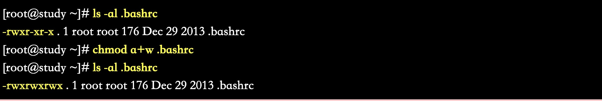
  
  **示例4:不更改其他已存在权限，而将某一权限去掉**
  
  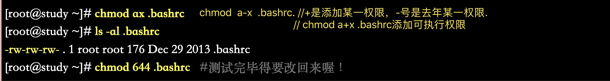
  
### 三。目录与档案之权限意义

**Linux系统档案的三种身份:owner/group/other ;每种身份所具有的三种权限:rwx**

#### 1.权限对档案(文档)重要性

+ r(read):能够读取 (有些时间具有x权限即可，可不必具有r权限，**具有r权限可用tab键将档名补全)

+ w(write):可编辑，新增，修改，但不能删除

+ x(excute):可执行，如windows下.exe,.bat等为可执行文件，linux为具有x权限的为可执行

#### 2.权限对目录重要性 : 目录主要用于记录文档清单，文档与目录具有强关联

+ r(read content in directory):可查看该目录下所有文档资料

+ w(modify contents of directory):
  
  + 建立新的档案与目录；
  + 删除已经存在的档案与目录(不论该档案的权限为何！)
  + 将已存在的档案或目录进行更名；
  + 搬移该目录内的档案、目录位置

+ x(access directory):目录的x代表的是使用者能否进入该目录成为工作目录

**如：drwxr--r-- 3 root root 4096 Jun 25 08:35 .ssh ，该用户不属于root，因此该用户仅能看到目录，但不能进入该目录.**

**注意：要开放目录给任何人浏览时，应该至少也要给予r及x的权限，但w权限不可随便给**

(1).先用root的身份建立所需要的档案与目录环境

(2).一般用户的读写权限为何？

(3).如果该目录属于用户本身，会有什么状况？

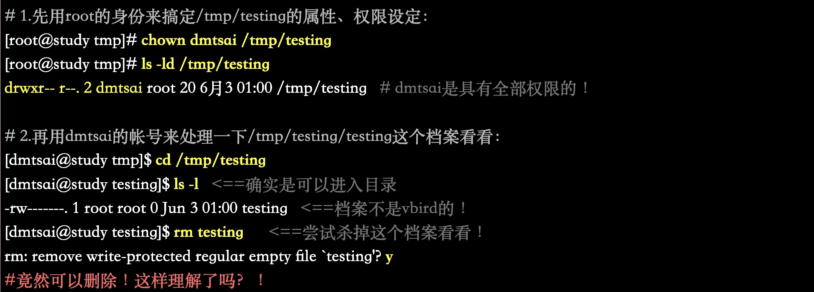

#### 3.使用者操作功能与权限

**示例：有两个档案名/dir1/file1和/dir2**

### [四.linux档案种类与副档名](http://linux.vbird.org/linux_basic/0210filepermission.php#filepermission_ch) 

**5.2.4 Linux档案种类与副档名**

#### 1.档案种类

+ 正规档案(-)
+ 目录档案(d)
+ 连接档(l):捷径
+ 设备与装置档(device)
+ 资料接口档(sockets)
+ 资料输送档(FIFO,pipe)

#### 2.linux档案副档名

**windows系统以.exe,.bat等结尾文件为可执行文件，但Linux以具有x权限为可执行文件，但文件是否执行成功，依赖于文件内容本身**

+ *.sh: 脚本或批次档(scripts)

+ *Z, *.tar, *.tar.gz, *.zip, *.tgz: 经过打包的压缩档

+ *.html, *.php: 网页相关档案

**注：上述仅限于用于区分文件类型，无其他意义，具有执行权限必须设置文件类型具有x权限**

#### 3.linux档案长度限制

单一档案或目录的最大容许档名为255bytes，以一个ASCII 英文占用一个bytes来说，则大约可达255个字元长度。若是以每个中文字占用2bytes 来说， 最大档名就是大约在128个中文字符

#### 4.linux档案名称限制

避免"* ? > < ; & ! [ ] | \ ' " ` ( ) { }"字符

### 五.linux目录配置

#### 1.linux目录下配置的依据-FHS(Filesystem Hierarchy Standard )标准

**FHS的重点在于规范每个特定的目录下应该要放置什么样子的资料**

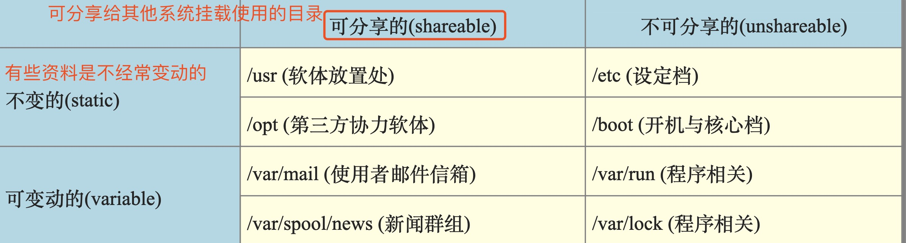

**FHS针对目录树架构仅定义出三层目录底下应该放置什么资料而已，分别是底下这三个目录的定义：**

+ / (root, 根目录)：与开机系统有关；
+ /usr (unix software resource)：与软体安装/执行有关；
+ /var (variable)：与系统运作过程有关。

#### 2.根目录(/)的意义与内容 (整个系统最重要的目录)

**根目录也与开机/还原/系统修复等动作有关**

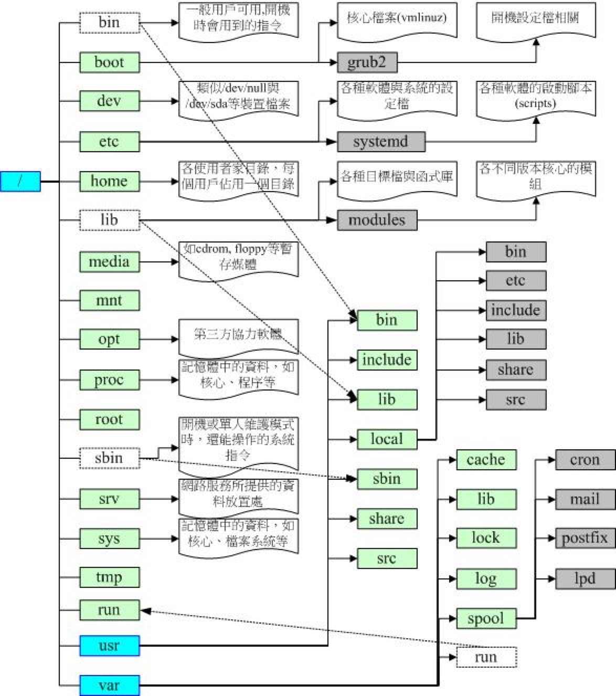

### 六.绝对路径与相对路径

#### 1.绝对路径

由根目录(/)开始写起的档名或目录名称，例如/home/dmtsai/.bashrc；

#### 2.相对路径

相对于目前路径的档名写法。例如./home/dmtsai或../../home/dmtsai/等等。反正开头不是/就属于相对路径的写法

+ . ：代表当前的目录，也可以使用./ 来表示
+ .. ：代表上一层目录，也可以../ 来代表

**以上来自于[第五章 linux的文件权限与目录配置](http://cn.linux.vbird.org/linux_basic/0210filepermission.php)**

-------------------------------------------------------------------

# [第六章 linux档案与目录管理](http://linux.vbird.org/linux_basic/0220filemanager.php)

**FHS(Filesystem Hierarchy Standard )标准**

## 6.1 目录与路径

### 6.1.1 相对路径与绝对路径

#### 1.相对路径(相对于某一目录，如$ cd ../bin)

#### 2.绝对路径(一定由根目录/写起,如$ cd /usr/share)

**shell scripts中务必使用绝对路径(因工作环境不同，可能会导致一些问题发生)**

### 6.1.2 目录的相关操作:cd / pwd / mkdir / rmdir

#### 1.比较特殊的目录

**$ ls -al / #查询根目录下的所有文件信息。则.与..个目录属性与权限完一致，即根目录的上一层(..)与根目录自已(.)是同一个目录**

#### 2.常见处理目录指令

+ cd:变换目录 (change directory)

  

+ pwd:显示当前的目录(print working directory)

  
  
**$ ls -ld /var/mail/ #查看目录详细信息**

+ mkdir:建立一个新的目录(make directory)

  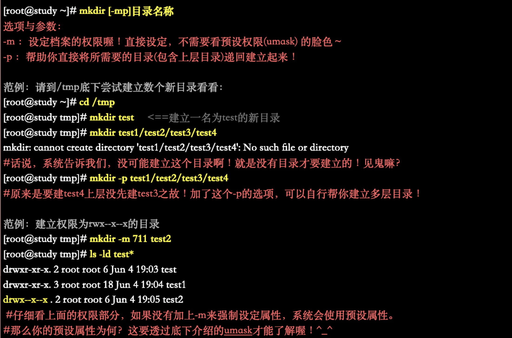
  
  **实例:**
  
  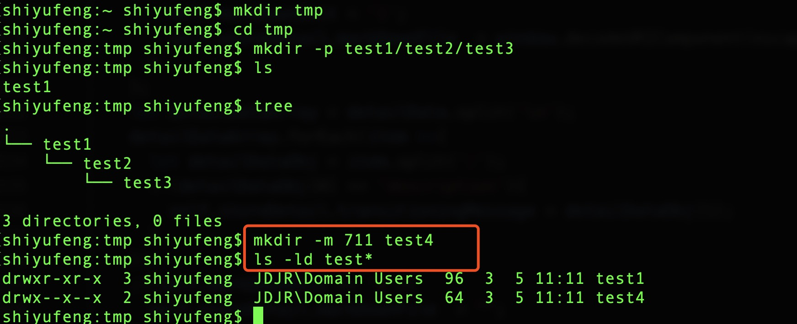

+ rmdir:删除一个空的目录
  
  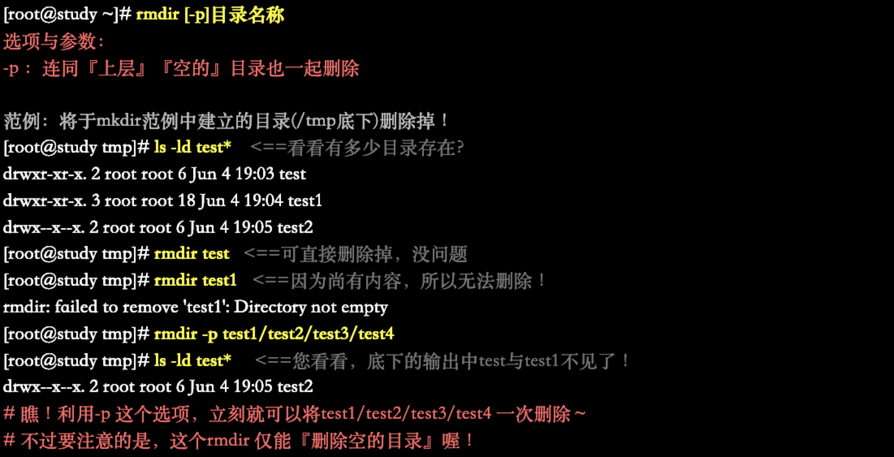
  
  **实例:**
  
  

### 6.1.3 关于执行档路径的变数: $PATH --环境变量

**查阅档案属性指令ls,完整档名(/bin/ls)绝对路径.可在任意处执行ls,因为环境变量PATH**

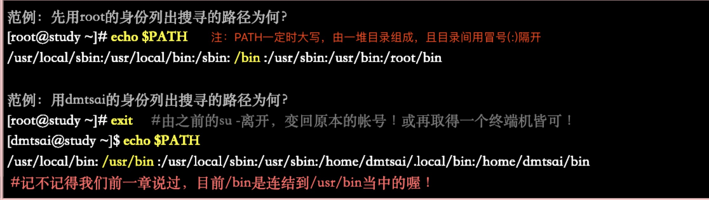

## 6.2 档案与目录管理

### 6.2.1 档案与目录的检视: ls

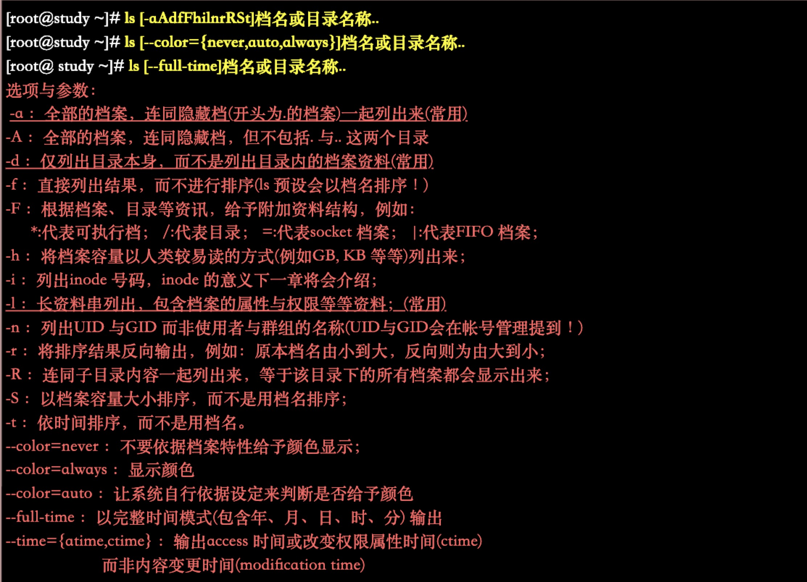

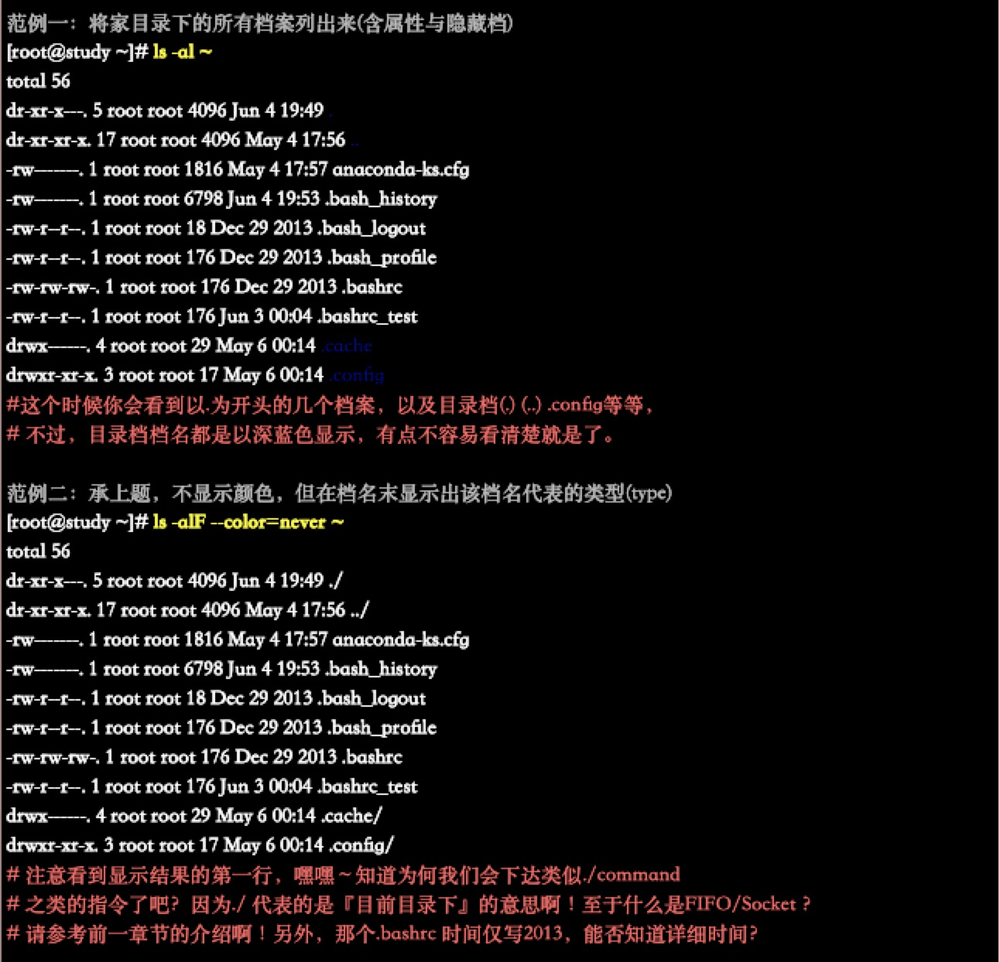

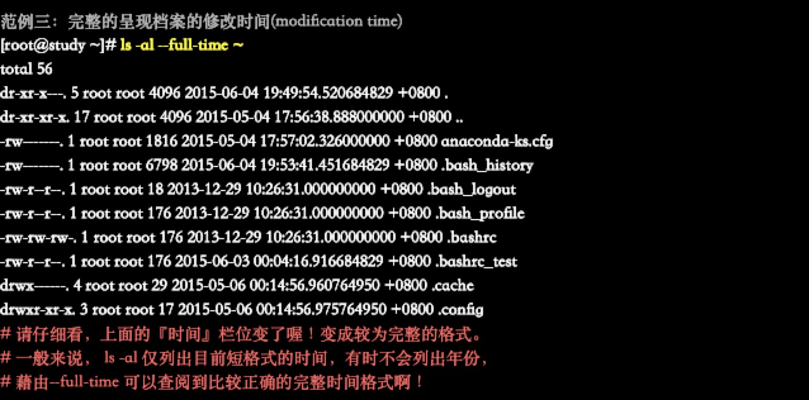

### 6.2.2 复制，删除与移动(cp,rm,mv)

+ cp命令： (copy) #复制 & 建立连结档(捷径)

  
  
  
  
  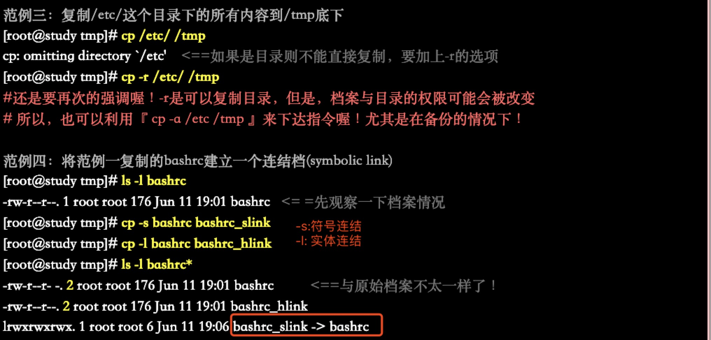
  
  
  
+ mv命令： (move) # 移动档案与目录 & 更名(rename)

  mv [-fiu] source destination ##-f强制移动，不管是否已存在，会覆盖；-i询问是否覆盖；-u目标档存在则source比较新才移动
  
  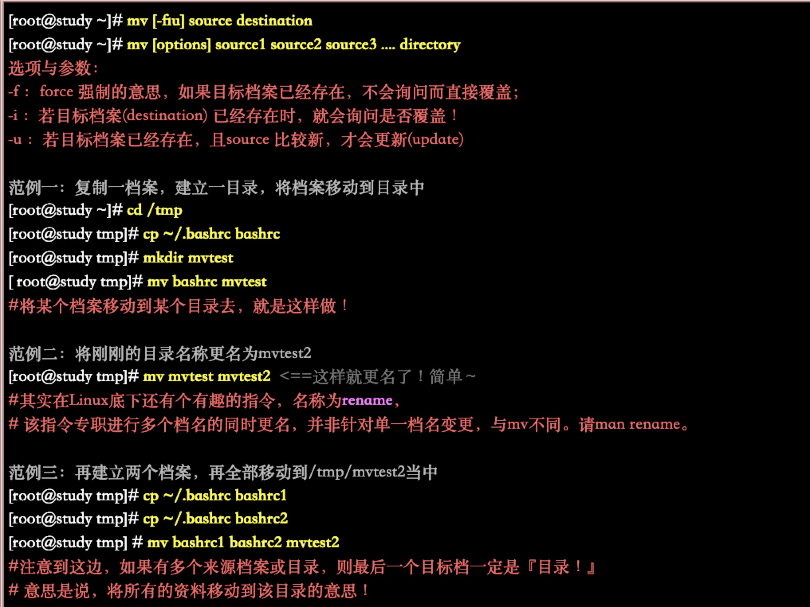

+ rm命令： (remove) #移除档案或目录

### 6.2.3 取得路径的档案名称与目录名称

  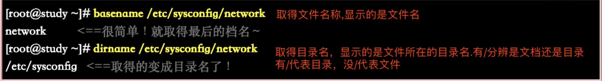

## 6.3 档案内容查阅

**查阅一个文档内容命令如下：**

+ 直接查阅一个档案内容: cat / tac / nl

    + cat : 由第一行开始显示档案内容  (Concatenate连续->cat)(常用)
    
       
    
    + tac : 从最后一行开始显示，可以看出tac是cat的倒写($ tac readme.txt)
    
    + nl  : 显示的时候，顺便输出行号
      
       
       
+ 可翻页查看档案内容: more / less
    
    + more: 一页一页的显示档案内容  (常用)
    
        $ more readme.txt  ## $ man more 
        
        **常用按键**
        
        + 空白键(space)：代表向下翻一页；
        
        + Enter ：代表向下翻『一行』；
        
        + /字串 ：代表在这个显示的内容当中，向下搜寻『字串』这个关键字；
        
        + :f ：立刻显示出档名以及目前显示的行数；
        
        + q ：代表立刻离开more ，不再显示该档案内容。
        
        + b 或[ctrl]-b ：代表往回翻页，不过这动作只对档案有用，对管线无用
    
    + less: 与more类似，但比more更好的是，可向前翻页  (常用)
    
        $ less readme.txt  ## $ man less
        
        **常用按键**
        
        + 空白键 ：向下翻动一页；
        
        + [pagedown]：向下翻动一页；
        
        + [pageup] ：向上翻动一页；
        
        + /字串 ：向下搜寻『字串』的功能；
        
        + ?字串 ：向上搜寻『字串』的功能；
        
        + n ：重复前一个搜寻(与/ 或? 有关！)
        
        + N ：反向的重复前一个搜寻(与/ 或? 有关！)
        
        + g ：前进到这个资料的第一行去；
        
        + G ：前进到这个资料的最后一行去(注意大小写)；
        
        + q ：离开less 这个程式；
        
+ 摘取资料部分内容
    
    + head: 只看头几行 # $ head shell.txt
    
      **语法：head [-n number] 档案  # $ head -n 20 shell.txt (取文档前20行内容)**
      
      **语法：head [-n -number] 档案 # $ head -n -100 shell.txt(抛除后100行)**
    
    + tail: 只看尾几行 $ $ tail shell.txt
    
      **语法：tail [-n number] 档案**
      
    **示例：显示/etc/man_db.conf的第11-20行**
    
    $ head -n 20 /etc/man_db.conf | tail -n 10 #取前20行及后10行,其中"|"管线指令为前面指令输出的信息透过管线交由后续指令继续使用
    
    $ cat -n /etc/man_db.conf | head -n 20 | tail -n 10 #在上例基础上加行号

+ 非纯文字档

    + od  : 以二进位的方式读取档案内容 (避免读取二进制档出现乱码问题)
    
    
    
+ 修改档案时间或建置新档

   + 时间参数意义
   
     + modification time(mtime) : 内容变化会更新该时间(注：非档案属性或权限修改)(重要)
     
     + status time(ctime): 该档案状态(属性/权限)更改时会更新该时间
     
     + access time(atime): 该档案内容被取用(如cat读取)，会更新该时间
     
     

   + touch :(1)建立一个空的档案 (2)将某个档案日期修订为目前(mtime & atime)
   
     **注：复制一个档案，即使复制所有属性，但也不能复制ctime这个属性**
   
     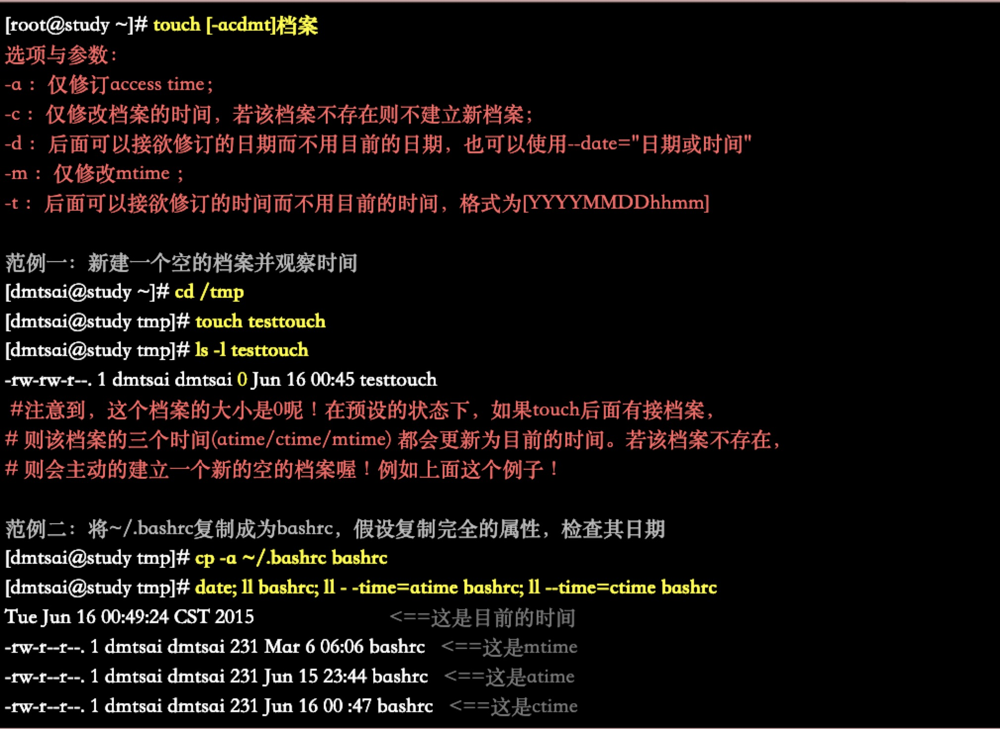
     
     

## 6.4 档案与目录的预设权限与隐藏权限

**一个档案有若干属性(r,w,x)读写执行权限或(d/-/l)目录/文件连接档**

**复习示例1:你的系统有个一般身份使用者syf,他的群组属于syf,他的家目录在/home/syf。你是root,你想将你的~/.bashrc复制给他，怎么做？**

+ 复制档案： cp ~/.bashrc ~syf/bashrc
+ 修改属性： chown syf:syf ~syf/bashrc #syf:syf(所属者:群组)

**复习示例2:在/tmp下创建一个目录，名为linux,该目录拥有者syf,群组root.另任何人都可进入该目录浏览档案，除syf可修改外，其他人都不能修改该目录下的档案**

+ 创建目录: mkdir /tmp/linux
+ 修改属性：chown -R syf:root /tmp/linux #-R递归，里面的所有文档均为该属性
+ 修改权限：chmod -R 755 /tmp/linux #具有权限应为drwxr-xr-x,即数字表示755(x:1/w:2/r:4)

#### 6.4.1 档案预设权限: umask

**umask:指定目前使用者在建立档案或目录时的权限预设值**

 
 
+ 文档具有的最大权限:666(rw-rw-rw-),因为普通文档建立不应该有执行权限

+ 目录具有的最大权限:777(rwxrwxrwx)，因为要进入该目录必须有x权限

 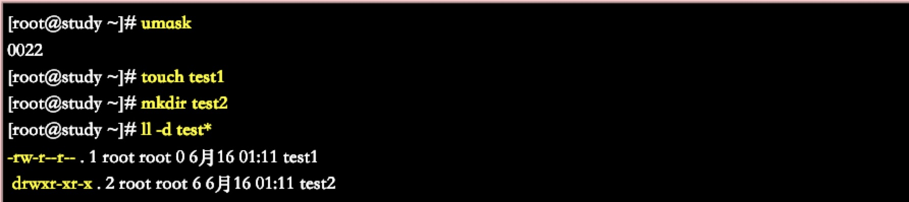
 
+ umask的利用与重要性

  + 022权限:所属用户-所属组-其他人(022),所属用户具有最高权限，所属组除去2(即w权限),具有rx权限(文档仅具有r,目录具有rx)，其他人除去2,同所属组.

  + 场景：因新创建的文件unmask具有022权限，则同组其他人不可修改该文件(不能合作)

  + 如何设定unmask: $ unmask 002 (文档具有最大权限:rw-rw-r--)(目录具有最大权限:rwxrwxr-x)

  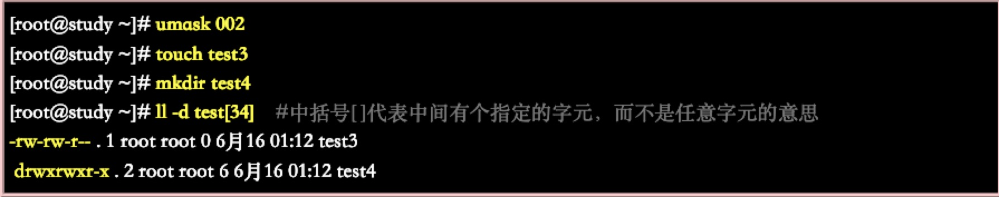
  
**示例：假设你的umask为003,则该umask情况下，建立的档案与目录权限是？**

umask=003(user/group/other),user=group具有最高权限，other除去3(x+w=1+2=3),因此仅具有r权限

+ 档案：-rw-rw-r--

+ 目录：drwxrwxr--

#### 6.4.2 档案隐藏属性

+ chattr(设定档案隐藏属性)

**注意：chattr指令只能在Ext2/Ext3/Ext4的Linux传统档案系统上面完整生效**

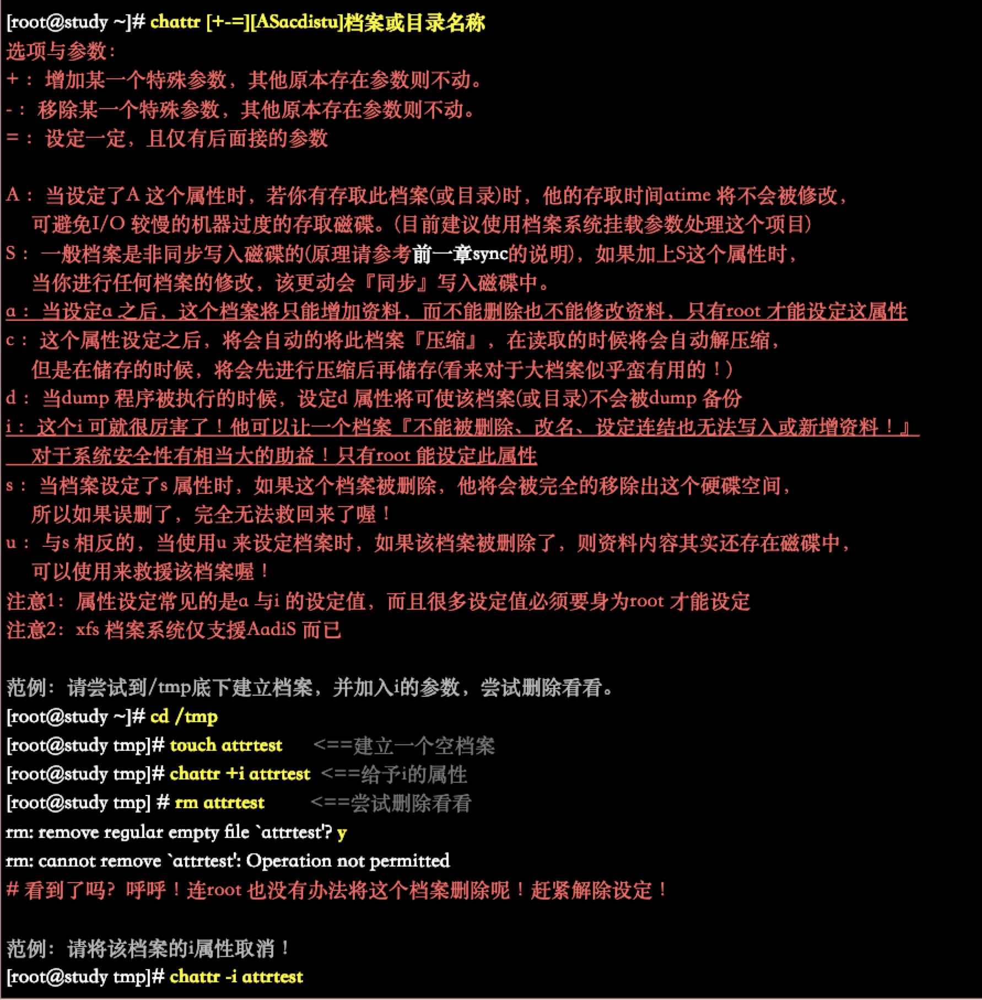

+ lsattr(显示档案隐藏属性)

#### 6.4.3 档案特殊权限：SUID,SGID,SBIT

#### 6.4.4 观察档案类型：file

## 6.5 指令与档案的搜寻

## 6.6 极重要的复习！权限与指令间的关系

-------------------------------------------------------------------

# [第十二章 学习shell scripts](http://linux.vbird.org/linux_basic/0340bashshell-scripts.php)

**[鸟哥的linux私房菜](http://linux.vbird.org/linux_basic_train/unit07.php)**

**[runoob-shell](http://www.runoob.com/linux/linux-shell-process-control.html)**
  
  
  

