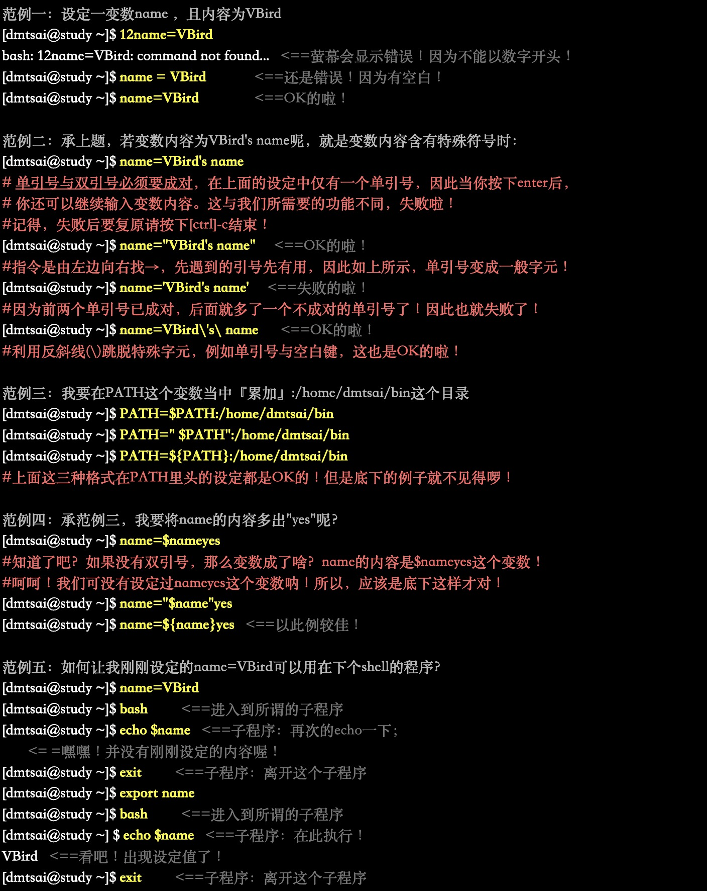
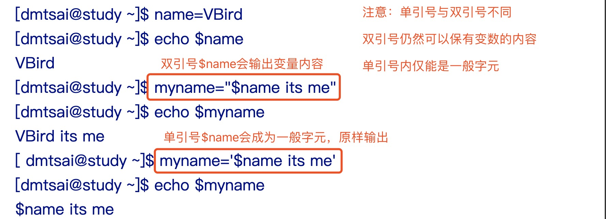
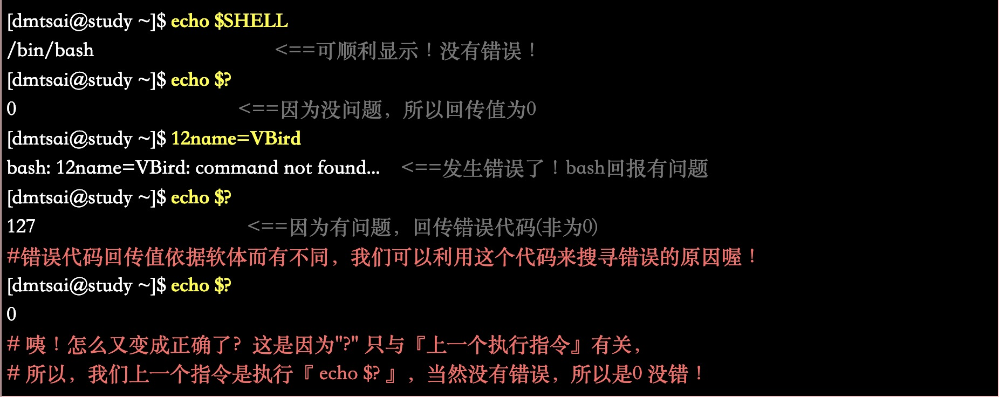
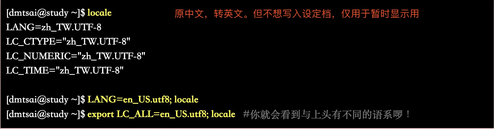
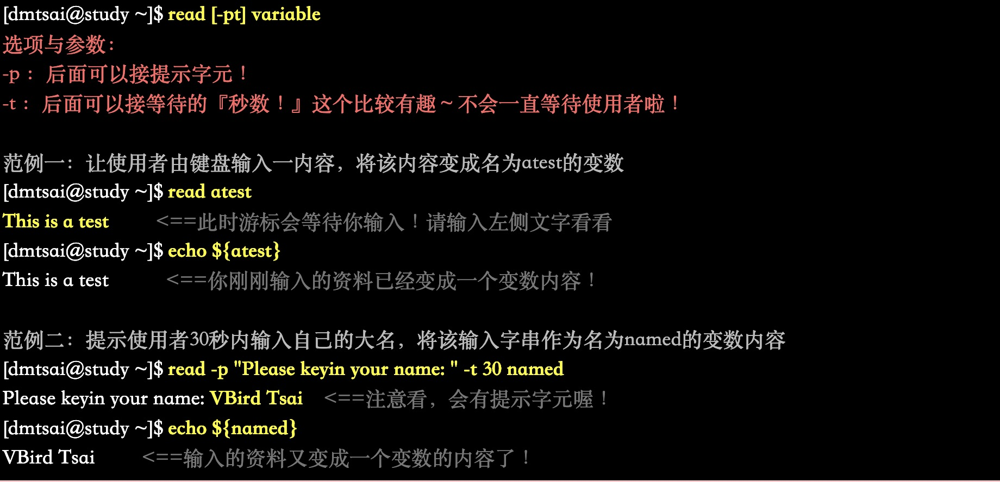
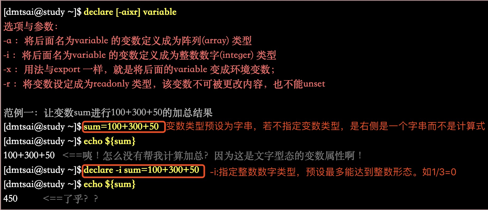

# 第十章 认识与学习BASH

## 一。系统合法shell与/etc/shells功能

### 1。什么是shell

shell:是一个命令解释器,解释执行用户输入的命令及程序 #shell英文贝壳

### 2。linux合法shell

Unix/Linux中主要两大类Shell:

+ Bourne shell:分sh(已被bash取代), ksh , bash(常用,主流，由sh发展而来)
 
+ C shell:分csh(常用) 和 tsh(csh的升级版)

**$ echo $SHELL #输出本机应有的shell(linux默认为bash)**

### 3。Bash shell功能

+ 命令编辑能力(history) #bash可记忆使用过的命令(存储在home下的.bash_history)

+ 命令与档案补全功能([tab键])

+ 命令别名设定功能(alias)

  **设定别名: $ alias ll='ls -l' #设定ls -l别名为ll,则命令行输入ll即可。但此种设定只在当前有效**
  
+ 工作控制、前景背景控制： (job control, foreground, background)

  **如：可让当前工作在后台执行，而不会因输入「ctrl+c」结束进程**
  
+ 程式化脚本： (shell scripts) #『批次档』

+ 万用字元： (Wildcard)

  如：想知道/usr/bin 底下有多少以X为开头的档案？使用『 ls -l /usr/bin/X* 』
  
### 4。查询指令是否为Bash shell 的内建命令： type

**指令分为bash内建指令(如ls/cd)和非内建指令**

+ $ man bash #查看bash帮助

+ type 应用 (查找命令档而不是普通文档，<=> which命令)

### 5。指令的下达与快速编辑按钮

**「\[Enter]」键，可以下达指令到下一行继续输入**

## 二。shell的变数功能

### 1。什么是变数

    『 y = ax + b 』等号左边的(y)就是变数，等号右边的(ax+b)就是变数内容。要注意的是，左边是未知数，右边是已知数.
    
    如PATH即为一个环境变数，可配置。(注：环境变数通常以大写字元)
    
    『变数就是以一组文字或符号等，来取代一些设定或者是一串保留的资料！』
    
#### 2。变数的取用与设定：echo, 变数设定规则, unset

+ 变数的取用-echo
  
  
  

+ 变数设定规则-unset

  
  
  
  
  **注意：单引号与双引号区别**
  
  
  **反单引号(`):在反单引号之内的指令将会被先执行，而其执行的结果将做为外部的输入.**
    
        如：ls -ld `locate crontab` 

  **简化到达常去的一个工作目录**
  
        $work="/Users/shiyufeng/Documents"
        $cd $work
        #此设定可以bash设定档(~/.bashrc)中设定
        
### 3.环境变数的功能

+ 用env(environment)观察环境变数与常见环境变数说明「$ env」

+ 用set 观察所有变数(含环境变数与自定义变量)「$ set」

    + PS1：(提示字元的设定) #「$ man bash」查看提示字元PS1用法
    + $：(关于本shell的PID)
    + ?：(关于上个执行指令的回传值) #成功0，失败非0
      
    + OSTYPE, HOSTTYPE, MACHTYPE：(主机硬体与核心的等级)

+ export:自定变数转成环境变数

环境变量与自定变量区别：『 该变数是否会被子程序所继续引用』

环境变数=全局变数 | 自定变数=局部变数

### 4.影响显示结果的语系变数(locale)

**语系统档案放置目录：/usr/lib/locale/**

**系统整体语系定义：/etc/locale.conf**

### 5.变数的有效范围

环境变量子shell可用(全局变量)，自定义变量子shell不可用(局部变量)

### 6.变数键盘读取、阵列与宣告： read, array, declare

+ read #从命令行读入参数

  
  
+ declare / typeset #『宣告变数的类型』

  
  

+ 阵列(array) 变数类型

  

### 7.与档案系统及程序的限制关系： ulimit

**bash可以『限制使用者的某些系统资源』，包括可以开启的档案数量,使用的CPU时间,使用的记忆体总量...**

### 8.变数内容的删除、取代与替换(Optional)

  
  
[鸟哥的linux私房菜](http://linux.vbird.org/linux_basic/0320bash.php)

-----------------------

# 第十一章 正规表示法与文件格式化

[鸟哥的linux私房菜]()

-----------------------

# 第十二章 学习shell scripts

[鸟哥的linux私房菜]()

-----------------------

