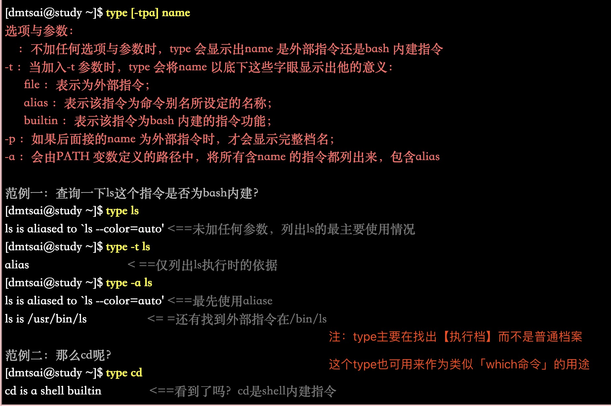
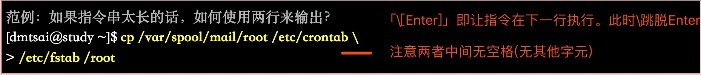

# 第十章 认识与学习BASH

## 一。系统合法shell与/etc/shells功能

### 1。什么是shell

shell:是一个命令解释器,解释执行用户输入的命令及程序 #shell英文贝壳

### 2。linux合法shell

Unix/Linux中主要两大类Shell:

+ Bourne shell:分sh(已被bash取代), ksh , bash(常用,主流，由sh发展而来)
 
+ C shell:分csh(常用) 和 tsh(csh的升级版)

**$ echo $SHELL #输出本机应有的shell(linux默认为bash)**

### 3。Bash shell功能

+ 命令编辑能力(history) #bash可记忆使用过的命令(存储在home下的.bash_history)

+ 命令与档案补全功能([tab键])

+ 命令别名设定功能(alias)

  **设定别名: $ alias ll='ls -l' #设定ls -l别名为ll,则命令行输入ll即可。但此种设定只在当前有效**
  
+ 工作控制、前景背景控制： (job control, foreground, background)

  **如：可让当前工作在后台执行，而不会因输入「ctrl+c」结束进程**
  
+ 程式化脚本： (shell scripts) #『批次档』

+ 万用字元： (Wildcard)

  如：想知道/usr/bin 底下有多少以X为开头的档案？使用『 ls -l /usr/bin/X* 』
  
### 4。查询指令是否为Bash shell 的内建命令： type

**指令分为bash内建指令(如ls/cd)和非内建指令**

+ $ man bash #查看bash帮助

+ type 应用 (查找命令档而不是普通文档，<=> which命令)

### 5。指令的下达与快速编辑按钮

**「\[Enter]」键，可以下达指令到下一行继续输入**

## 二。shell的变数功能

  
  
[鸟哥的linux私房菜](http://linux.vbird.org/linux_basic/0320bash.php)

-----------------------

# 第十一章 正规表示法与文件格式化

[鸟哥的linux私房菜]()

-----------------------

# 第十二章 学习shell scripts

[鸟哥的linux私房菜]()

-----------------------

