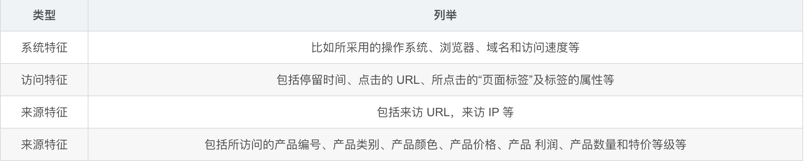
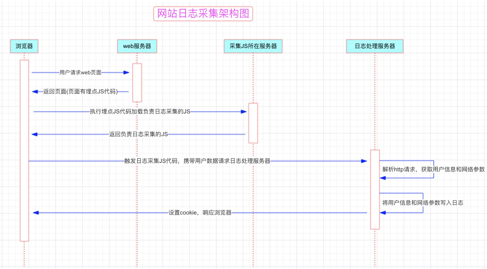
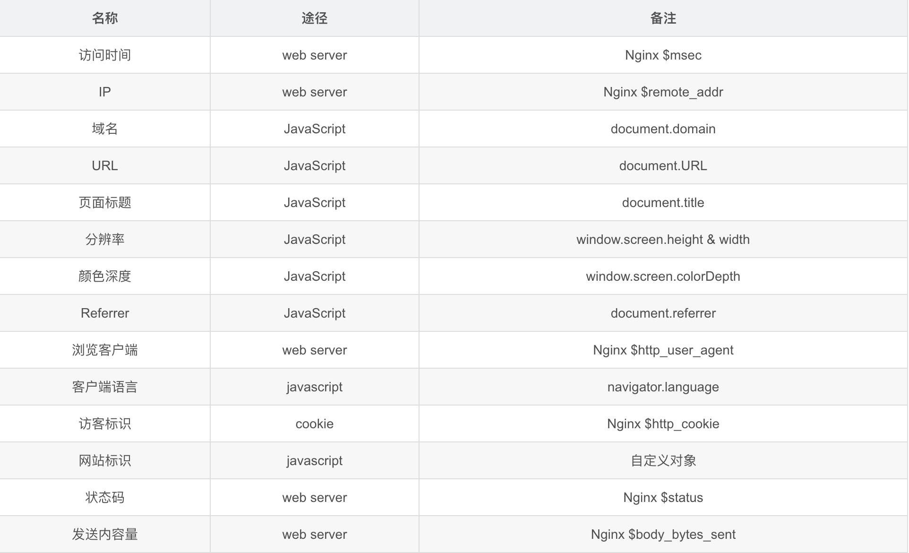
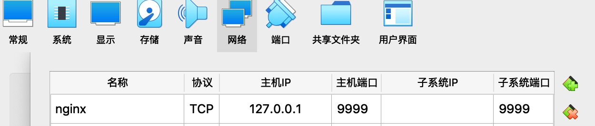
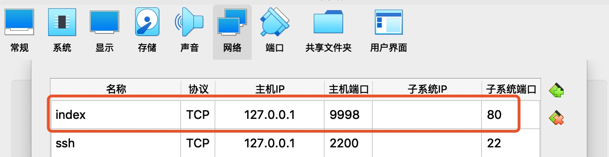
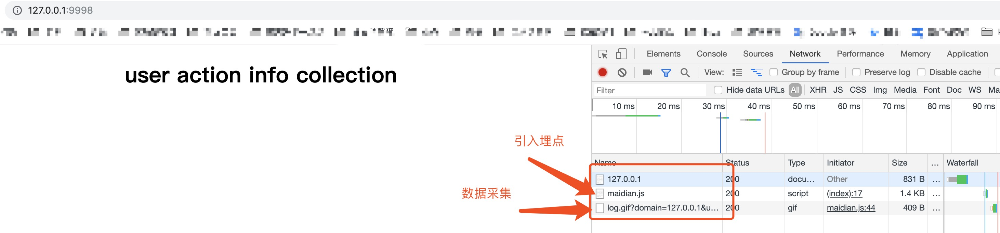

## [网站用户行为日志采集和后台日志服务器搭建](https://blog.csdn.net/weixin_37490221/article/details/80894827)

参考：

[网站用户行为日志采集和后台日志服务器搭建](https://blog.csdn.net/weixin_37490221/article/details/80894827)
[同源策略与通过跨域资源共享实现ajax跨域访问](https://blog.csdn.net/weixin_37490221/article/details/80786592)

### 一。简介

    访问日志指用户访问网站时的所有访问、浏览、点击行为数据
    
    日志的生成渠道分为以下两种:
    
    1.web服务器软件(httpd、nginx、tomcat)自带的日志记录功能，如 Nginx 的 access.log 日志
    
    2.自定义采集用户行为数据，通过在页面嵌入自定义的 javascript 代码来获取用户的访问行为(比如鼠标悬停的位置，点击的页面组件等)，然后通过ajax请求到后台记录日志，这种方式所能采集的信息会更加全面
    
在实际操作中，有以下几个方面的数据可以自定义的采集:

### 二。设计架构

    1.埋点是指:
    
    在网页中预先加入小段javascript代码，这个代码片段一般会动态创建一个script标签，并将src属性指向一个单独的js文件，
    
    此时这个单独的js文件会被浏览器请求到并执行,这个js往往就是真正的数据收集脚本。
    
    数据收集完成后,js会请求一个后端的数据收集脚本,这个脚本一般是一个伪装成图片的动态脚本程序,js会将收集到的数据通过 http 参数的方式传递给后端脚本，
    
    后端脚本解析参数并按固定格式记录到访问日志，同时可能会在http响应中给客户端种植一些用于追踪的cookie。
    
    2.为什么使用请求图片的形式收集?
    
    收集的形式有很多种,如ajax请求，但在实际生产环境中服务一般都是分布式部署,ajax请求就会涉及到跨域的问题(具体详见:同源策略与通过跨域资源共享实现ajax跨域访问)，
    
    而请求图片地址的形式则不在同源策略的限制范围内，即请求图片没有跨域限制。另一方面，请求一个静态资源的速率比请求一个动态接口要快得多。

### 三。设计实现

步骤：

    确定想要收集的信息
    确定埋点代码
    编写JS前端日志收集脚本
    确定日志格式
    编写后台脚本
    日志切分
    在网站页面进行埋点
    检测日志数据

选型：

    选用Nginx作为Web服务器--Node6(192.168.1.106)
    
    日志后台服务器使用Nginx处理日志请求，同时将JS前端日志收集脚本直接放置在Nginx服务器内(架构中将其单独部署一个服务器)--Node7(192.168.1.107)
    
确定收集信息

#### 1.准备两台虚拟机，模拟Nginx服务器和应用服务器部署

    192.168.1.106  #部署nginx服务器
    192.168.1.107  #部署应用(index.html)
    
#### 2.系统环境搭建部署-192.168.1.106(node6环境)

##### 2-1  192.168.1.106机器部署nginx

    $ cd /home/luaJIT
    
    # 准备包：一个Lua包，一个nginx包，一个openresty包，4个nginx模块包
    
    #lua包
    $ wget http://luajit.org/download/LuaJIT-2.0.4.tar.gz  
    #nginx模块包
    $ wget https://github.com/openresty/set-misc-nginx-module/archive/v0.29.tar.gz
    $ wget https://github.com/openresty/lua-nginx-module/archive/v0.10.0.tar.gz
    $ wget https://github.com/simpl/ngx_devel_kit/archive/v0.2.19.tar.gz 
    $ wget https://github.com/openresty/echo-nginx-module/archive/v0.58.tar.gz
    #nginx包
    $ wget http://nginx.org/download/nginx-1.8.1.tar.gz   
    #openresty包
    $ wget https://openresty.org/download/openresty-1.9.7.3.tar.gz  
    
##### 2-2 安装依赖

    $ yum -y install gcc perl pcre-devel openssl openssl-devel
    
##### 2-3 解压编译安装LuaJIT，及设置LuaJIT环境变量

    $ tar -zxvf LuaJIT-2.0.4.tar.gz -C /usr/local/src/
    
    $ cd /usr/local/src/LuaJIT-2.0.4/
    
    $ make && make install PREFIX=/usr/local/luajit
    
    $ vim /etc/profile
    #add content
    export LUAJIT_LIB=/usr/local/luajit/lib
    export LUAJIT_INC=/usr/local/luajit/include/luajit-2.0
    
    #更新环境变量
    $ source /etc/profile
    
##### 2-4 解压modules

    $ mkdir -p /usr/local/nginx/modules
    
    $ cd /export/software/
    
    $ mv set-misc-nginx-module-0.29.tar.gz /usr/local/nginx/modules/
    $ mv lua-nginx-module-0.10.0.tar.gz /usr/local/nginx/modules/
    $ mv ngx_devel_kit-0.2.19.tar.gz /usr/local/nginx/modules/
    $ mv echo-nginx-module-0.58.tar.gz /usr/local/nginx/modules/
    
    $ cd /usr/local/nginx/modules/
    
    #分别解压缩
    $ tar -zxvf lua-nginx-module-0.10.0.tar.gz 
    $ tar -zxvf set-misc-nginx-module-0.29.tar.gz
    $ tar -zxvf ngx_devel_kit-0.2.19.tar.gz
    $ tar -zxvf echo-nginx-module-0.58.tar.gz
    
    #删除压缩包
    $rm -rf *.tar.gz
    
##### 2-5 安装OpenResty

###### (1)什么是OpenResty

    OpenResty是一个基于 Nginx与Lua的高性能Web平台，其内部集成了大量精良的Lua库、第三方模块以及大多数的依赖项。
    
    其中的核心是通过ngx_lua模块集成了Lua，从而在nginx配置文件中可以通过Lua来表述业务。
    
    而Lua是一种轻量小巧的脚本语言，用标准C语言编写并以源代码形式开放，其设计目的是为了嵌入应用程序中，从而为应用程序提供灵活的扩展和定制功能.

###### (2)安装

    $ tar -zxvf openresty-1.9.7.3.tar.gz -C /usr/local/src/
    
    $ cd /usr/local/src/openresty-1.9.7.3/
    
    $ ./configure --prefix=/usr/local/openresty --with-luajit && make && make install
    
##### 2-6 解压编译安装Nginx

    $ tar -zxvf nginx-1.8.1.tar.gz -C /usr/local/src/
    
    $ cd /usr/local/src/nginx-1.8.1/
    
    $ ./configure --prefix=/usr/local/nginx \
      --with-ld-opt="-Wl,-rpath,/usr/local/luajit/lib" \
      --add-module=/usr/local/nginx/modules/ngx_devel_kit-0.2.19 \
      --add-module=/usr/local/nginx/modules/lua-nginx-module-0.10.0 \
      --add-module=/usr/local/nginx/modules/set-misc-nginx-module-0.29 \
      --add-module=/usr/local/nginx/modules/echo-nginx-module-0.58
     
     $ make install
     
##### 2-7 启动检测安装

    $  cd /usr/local/nginx/
    
    $ ./sbin/nginx -c conf/nginx.conf
    
    $ sbin/nginx -s reload #重启nginx
    
##### 2-8 访问nginx

    $ curl 127.0.0.1
    
##### 2-9 virtualbox暴露端口

    地址栏访问:http://127.0.0.1:9999/   #可以访问nginx，显示nginx主页面
    
##### 2-10 实施采集测试

###### (1)编写[index.html](resources/index.html)

**注意：传参问题，项目应用中会出现跨页面传值，参数带不过去问题**

解决方案：[应用全局变量](resources/maidian2.js)

###### (2)编写[maidian.js](resources/maidian.js)

###### (3)配置node6(192.168.1.106)nginx配置文件[nginx.conf](resources/nginx.conf)
 
    $ vim /usr/local/nginx/conf/nginx.conf
    
#### 3.部署index.html和maidian.js

##### 3-1 192.168.1.106(node6)机器部署maidian.js

    上传maidian.js到Nginx目录下:/usr/local/nginx/html
    
    $ curl 127.0.0.1:9999/maidian.js #检测
    
##### 3-2 192.168.1.107(node7)机器部署index.html

###### (1)安装nginx服务器

    #安装nginx
    $ yum install epel-release
    
    $ yum install nginx
    
    #可选：安装辅助工具
    $ yum install lsof
    
###### (2)配置nginx.conf

    $ vim /etc/nginx/nginx.conf
    #修改html目录位置
    server{
        root /home/syf/html #修改为自已的index.html所放置的目录
    }
   
###### (3)启动nginx服务

    $ systemctl start nginx #启动nginx
    
    $ systemctl reload nginx #重新加载nginx
    
    $ systemctl status nginx #查看nginx启动状态
    
    $ lsof -i:80 #查看80端口进程
    
    $ ps aux | grep nginx #查看nginx进程
    [root@node7 html]# ps aux | grep nginx
    root     26420  0.0  0.2 125772  5256 ?        Ss   09:57   0:00 nginx: master process /usr/sbin/nginx
    nginx    26818  0.0  0.2 126192  4000 ?        S    11:11   0:00 nginx: worker process   #nginx配置文件中配置了2个workprocess，因此会起2个进程
    nginx    26819  0.0  0.2 126192  4000 ?        S    11:11   0:00 nginx: worker process
    root     26830  0.0  0.0  12492   696 pts/0    R+   11:14   0:00 grep --color=auto nginx

###### (3)virtualbox配置网络，暴露端口

    地址栏请求: http://127.0.0.1:9998/
    

请求到了maidian.js文件，同时发送了log.gif请求并且状态为200，即请求成功!

###### (4)切换到node6(192.168.1.106)，查看nginx日志

    $ cd /usr/local/nginx/
    
    $ tail -f logs/user_defined.log 
    1555034282.367||10.0.2.2||200||0||127.0.0.1||http://127.0.0.1:9998/||userinfo collection||||1050||1680||24||zh-CN||Mozilla/5.0 (Macintosh; Intel Mac OS X 10_14_0) AppleWebKit/537.36 (KHTML, like Gecko) Chrome/73.0.3683.103 Safari/537.36||action1||2019-4-11 14:00:00||onclick||syf

    
    

