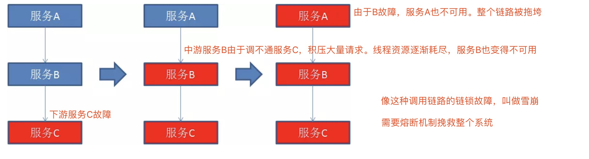
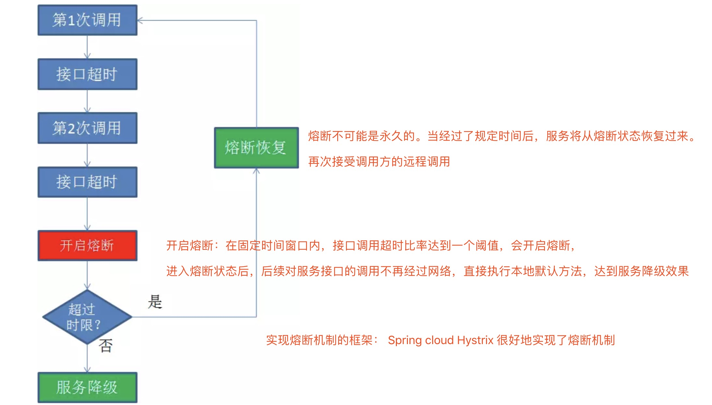

### 一。前后端分离

#### [你不得不了解的前后端分离原理](https://juejin.im/post/5b71302351882560ea4afbb8)

### 二。互联网常识

#### [漫话：如何给女朋友解释为什么有些网站域名不以www开头](https://juejin.im/post/5c85c79c5188257e342db8ee)

    域名——为数字化的互联网资源提供易于记忆的名称。
    如：wikipedia.org来代替IP地址，然后域名系统（DNS）就会将它转化成便于机器识别的IP地址
    
    为了区分互联网中的各种应用，就有了不同的子域名，比如互联网就以www作为子域名，文件传输以ftp作为子域名，电子邮件以mail作为子域名。如：www.mhcoding.cn，ftp.hcoding.cn， mail.mhcoding.cn
    
### 三。互联网技术名词

#### 1。服务熔断

当下游服务因访问压力过大而响应变慢或失败，上游服务为了保护系统整体的可用性，可以暂时切断对下游服务的调用。这种牺牲局部，保全整体的措施就叫做熔断.

[漫画：什么是服务熔断](https://mp.weixin.qq.com/s?__biz=MzIxMjE5MTE1Nw==&mid=2653193370&idx=1&sn=60cc1478d7f44392a8d48b89132b6d1e&chksm=8c99f640bbee7f560f6e7ce685923676bb22774feab8acf522b81b2e668bf63bdcbf031b3983&mpshare=1&scene=1&srcid=0507B8nRBB1vwv42QLT3jTSJ#rd)

**问题**

**服务熔断**

#### 2。[吞吐量TPS(承压能力)](https://www.cnblogs.com/data2value/p/6220859.html)

##### (1).系统吞吐量几个重要参数：QPS（TPS）、并发数、响应时间
    
    QPS(TPS):每秒钟request/事务 数量 (吞吐量是指系统在单位时间内处理请求的数量)

    并发数:系统同时处理的request/事务数 (并发用户数是指系统可以同时承载的正常使用系统功能的用户的数量)

    响应时间: 一般取平均响应时间 (响应时间是指系统对请求作出响应的时间)
    
    关系：QPS（TPS）= 并发数/平均响应时间
    

    

