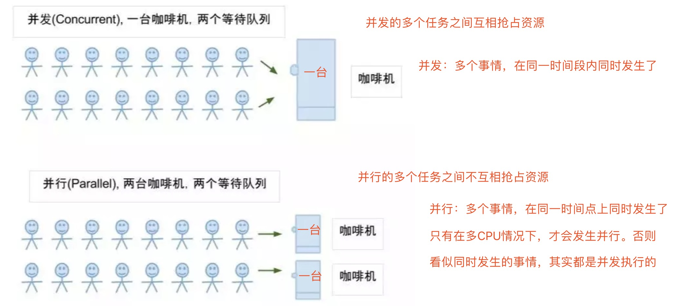
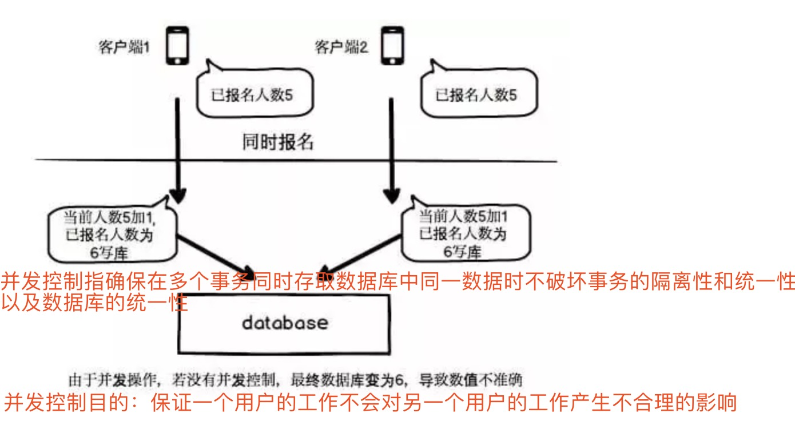
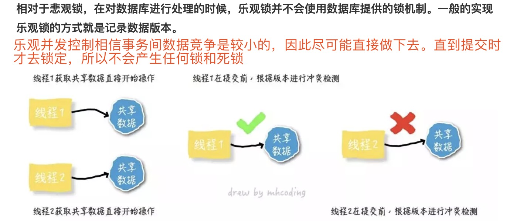

### 目录

#### [并发和并行](https://mp.weixin.qq.com/s?__biz=Mzg3MjA4MTExMw==&mid=2247484698&idx=1&sn=66fa459dfb46cfc7fa8616c5fd2386e8&chksm=cef5f6acf9827fba9c32896ccf2391c0079e31b03295b1300c1a175a5fae55cc8e31bc8bbb66&scene=21#wechat_redirect)

#### [并发控制-乐观锁和悲观锁](https://juejin.im/post/5caaaa67e51d452b63241954)

------------------------------------------------

#### 一。并发和并行

##### 1.并发

**并发（Concurrent）在操作系统中，是指一个时间段中有几个程序都处于已启动运行到运行完毕之间，且这几个程序都是在同一个处理机上运行。**

    如：在一台电脑上，在同一时间段内，同时看电影，聊QQ,都是在同一台电脑上完成了从开始到结束的动作，则可以说看电影，聊QQ是并发的。
    
    并发：如一个CPU,所有的进程在同一时间段内争CPU使用,进程交互获取CPU完成任务

##### 2.并行

**并行（Parallel），当系统有一个以上CPU时，当一个CPU执行一个进程时，另一个CPU可以执行另一个进程，两个进程互不抢占CPU资源，可以同时进行，这种方式我们称之为并行(Parallel)**

    并行：多个CPU资源，各用各的，互不影响，可同时进行
    
**并发与并行**

------------------------------------------------

[漫话：如何给女朋友解释什么是并发和并行](https://mp.weixin.qq.com/s?__biz=Mzg3MjA4MTExMw==&mid=2247484698&idx=1&sn=66fa459dfb46cfc7fa8616c5fd2386e8&chksm=cef5f6acf9827fba9c32896ccf2391c0079e31b03295b1300c1a175a5fae55cc8e31bc8bbb66&scene=21#wechat_redirect)

------------------------------------------------

#### 二。[乐观锁和悲观锁](https://juejin.im/post/5caaaa67e51d452b63241954)

##### 1.并发控制

##### 2.悲观锁/悲观并发控制-是并发控制的一种手段

    当我们要对一个数据库中的一条数据进行修改的时候，为了避免同时被其他人修改，最好的办法就是直接对该数据进行加锁以防止并发。
    
    这种借助数据库锁机制在修改数据之前先锁定，再修改的方式被称之为悲观并发控制（又名“悲观锁”，Pessimistic Concurrency Control，缩写“PCC”）。
    

###### (1)悲观锁实现机制--依靠数据库提供的锁机制

    + 在对记录进行修改前，先尝试为该记录加上排他锁（exclusive locking）
    + 如果加锁失败，说明该记录正在被修改，那么当前查询可能要等待或者抛出异常。具体响应方式由开发者根据实际需要决定。
    + 如果成功加锁，那么就可以对记录做修改，事务完成后就会解锁了。
    + 其间如果有其他对该记录做修改或加排他锁的操作，都会等待我们解锁或直接抛出异常。
    
###### (2)以常用的MySql Innodb引擎举例，说明一下在SQL中如何使用悲观锁

    要使用悲观锁，我们必须关闭mysql数据库的自动提交属性，因为MySQL默认使用autocommit模式，也就是说，当你执行一个更新操作后，MySQL会立刻将结果进行提交。set autocommit=0;
    
以淘宝下单过程中扣减库存的需求说明一下如何使用悲观锁:

    //0.开始事务
    begin; 
    //1.查询出商品库存信息
    select quantity from items where id=1 for update;  #在对id = 1的记录修改前，先通过for update的方式进行加锁，然后再进行修改。这就是比较典型的悲观锁策略。若产生并发，其他事务必须等本次事务提交后才能执行，目的保证当前数据不会被其他事务修改
    //2.修改商品库存为2
    update items set quantity=2 where id = 1;
    //3.提交事务
    commit;
    
    注：使用select…for update会把数据给锁住，不过我们需要注意一些锁的级别，MySQL InnoDB默认行级锁。行级锁都是基于索引的，
    
    如果一条SQL语句用不到索引是不会使用行级锁的，会使用表级锁把整张表锁住，这点需要注意。

##### 3.乐观锁/乐观并发控制-是并发控制的一种手段

    乐观锁（ Optimistic Locking ） 是相对悲观锁而言的，乐观锁假设数据一般情况下不会造成冲突，所以在数据进行提交更新的时候，才会正式对数据的冲突与否进行检测，如果发现冲突了，则让返回用户错误的信息，让用户决定如何去做。
    

###### (1)乐观锁实现方式

    使用乐观锁就不需要借助数据库的锁机制了
    
    具体实现细节主要有两个步骤：
    
    冲突检测和数据更新。其实现方式有一种比较典型的就是Compare and Swap(CAS)。
    
    CAS是项乐观锁技术，当多个线程尝试使用CAS同时更新同一个变量时，只有其中一个线程能更新变量的值，而其它线程都失败，失败的线程并不会被挂起，而是被告知这次竞争中失败，并可以再次尝试。
    
###### (2)比如前面的扣减库存问题，通过乐观锁可以实现如下：

    //查询出商品库存信息，quantity = 3
    select quantity from items where id=1   #先查出库存数
    //修改商品库存为2
    update items set quantity=2 where id=1 and quantity = 3;  #更新时以上次上查询的库存数为条件
    
###### (3)存在问题-ABA问题

    ABA问题：
    
    比如一个线程one从数据库中取出库存数3，这时另一个线程two也从数据库中取出库存数3，且two进行了操作变成2，然后two又将库存数变成3，
    
    这时线程one进行CAS操作发现数据库中仍然是3，然后one操作成功。尽管线程one的CAS操作成功，但不代表这个过程是没有问题的。
    
###### (4).解决ABA问题，通过一个单独的可以顺序递增的version字段。

    //查询出商品信息，version = 1
    select version from items where id=1
    //修改商品库存为2
    update items set quantity=2,version = 3 where id=1 and version = 2; #每次更新都会携带版本号(只增不减)，版本号一致则更新且版本号+1，否则失败。
    
    **除了version以外，还可以使用时间戳，因为时间戳天然具有顺序递增性。**

###### (5)存在问题-高并发情况，只有一个线程能够修改成功，其他均会失败 --解决方案(减少乐观锁的粒度,最大程度的提升吞吐率，提高并发能力)

    //修改商品库存
    update item 
    set quantity=quantity - 1 
    where id = 1 and quantity - 1 > 0 #如果用户下单数为1，则通过quantity - 1 > 0的方式进行乐观锁控制

##### 4.乐观锁与悲观锁区别和应用场景

    乐观锁并未真正加锁，效率高。一旦锁的粒度掌握不好，更新失败的概率就会比较高，容易发生业务失败
    
    悲观锁依赖数据库锁，效率低。更新失败的概率比较低
    
**随着互联网三高架构（高并发、高性能、高可用）的提出，悲观锁已经越来越少的被使用到生产环境中了，尤其是并发量比较大的业务场景**

------------------------------------------------

[漫话：如何给女朋友解释什么是乐观锁与悲观锁](https://juejin.im/post/5caaaa67e51d452b63241954)

------------------------------------------------
         
   