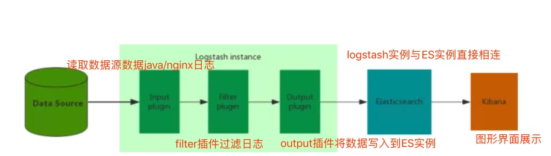
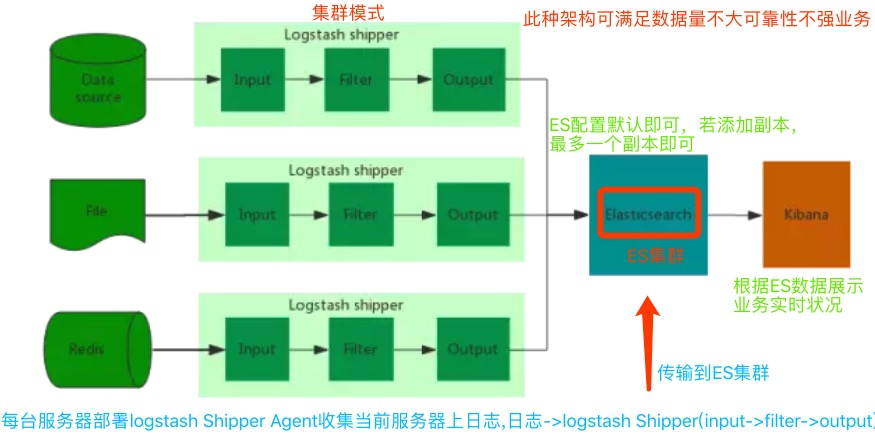
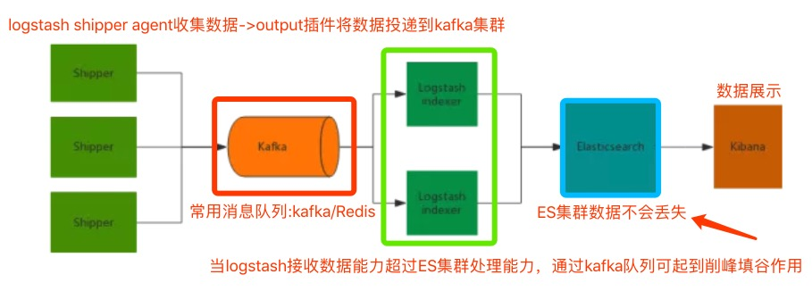
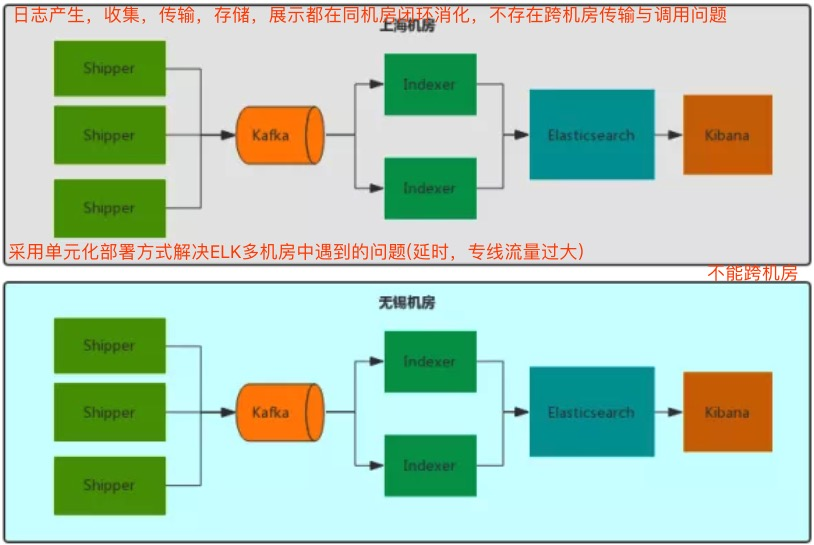
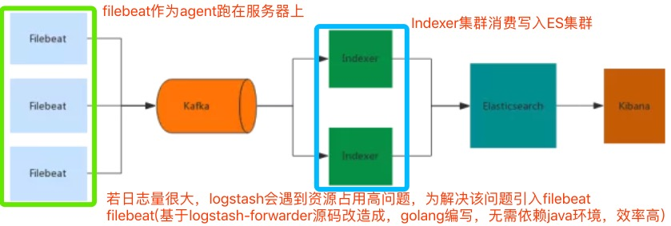
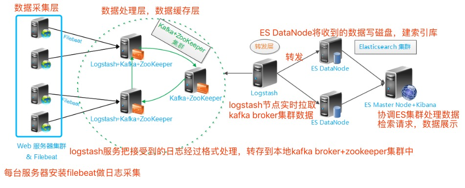

# ELK & EFK

**ELK : Elasticsearch Logstash Kibana三个系统**

    Logstash：数据收集处理引擎
    
        支持动态的从各种数据源搜集数据，并对数据进行过滤、分析、丰富、统一格式等操作，然后存储以供后续使用
        
    Kibana：可视化化平台
        
        它能够搜索、展示存储在 Elasticsearch 中索引数据。使用它可以很方便的用图表、表格、地图展示和分析数据
        
    Elasticsearch：分布式搜索引擎
    
        具有高可伸缩、高可靠、易管理等特点。可以用于全文检索、结构化检索和分析，并能将这三者结合起来。Elasticsearch 基于 Lucene 开发，现在使用最广的开源搜索引擎之一，Wikipedia 、StackOverflow、Github 等都基于它来构建自己的搜索引擎。

**EFK : Elasticsearch Filebeat Kibana三个系统**

    Filebeat:轻量级数据收集引擎（用于解决Logstash导致的问题）
    
        基于原先 Logstash-fowarder 的源码改造出来。换句话说：Filebeat就是新版的 Logstash-fowarder，也会是 ELK Stack 在 shipper 端的第一选择。

**日志数据在以下几方面具有非常重要的作用**

    数据查找：通过检索日志信息，定位相应的 bug ，找出解决方案
    
    服务诊断：通过对日志信息进行统计、分析，了解服务器的负荷和服务运行状态
    
    数据分析：可以做进一步的数据分析，比如根据请求中的课程 id ，找出 TOP10 用户感兴趣课程

------------------------------------    

# 架构

## 简单版架构-适合初学，不能用于线上环境

**日志的收集、过滤、输出等功能，主要由这三个核心组件组成 Input 、Filter、Output**

    Input：输入，输入数据可以是 File 、 Stdin（直接从控制台输入） 、TCP、Syslog 、Redis 、Collectd 等
    
    Filter：过滤，将日志输出成我们想要的格式。Logstash 存在丰富的过滤插件：Grok 正则捕获、时间处理、JSON 编解码、数据修改 Mutate 。Grok 是 Logstash 中最重要的插件，强烈建议每个人都要使用 Grok Debugger 来调试自己的 Grok 表达式
        grok {
              match => ["message", "(?m)\[%{LOGLEVEL:level}\] \[%{TIMESTAMP_ISO8601:timestamp}\] \[%{DATA:logger}\] \[%{DATA:threadId}\] \[%{DATA:requestId}\] %{GREEDYDATA:msgRawData}"]
            }
    
    Output：输出，输出目标可以是 Stdout （直接从控制台输出）、Elasticsearch 、Redis 、TCP 、File 等
    
## 集群版架构

****

**集群版架构存在问题**

    消耗服务器资源：Logstash 的收集、过滤都在服务器上完成，这就造成服务器上占用系统资源较高、性能方面不是很好，调试、跟踪困难，异常处理困难
    
    数据丢失：大并发情况下，由于日志传输峰值比较大，没有消息队列来做缓冲，就会导致 Elasticsearch 集群丢失数据
    
 ## 引入消息队列架构
 
 

**消息队列架构存在问题**

    Logstash shipper 收集数据同样会消耗 CPU 和内存资源
    
    不支持多机房部署

**两种消息队列为:Kafka(推荐) VS Redis(官网)**
    
    数据丢失：Redis 队列多用于实时性较高的消息推送，并不保证可靠。Kafka保证可靠但有点延时。
    
    数据堆积：Redis 队列容量取决于机器内存大小，如果超过设置的Max memory，数据就会抛弃。Kafka 的堆积能力取决于机器硬盘大小
    
## 多机房部署

 

## 引入Filebeat

 

上述参考资料来自于[从ELK到EFK](https://mp.weixin.qq.com/s?__biz=MzI1MTE2NTE1Ng==&mid=2649517123&idx=1&sn=5223976052c67e343a5f4e3dcfc7d636&chksm=f1efecc8c69865de5d67560bb8aed4eaf0afbbc9fb93d3cfacaf14490f45aef5690e00adb952#rd)

------------------------------------ 

# [ELK+Filebeat+Kafka+ZooKeeper构建海量日志分析平台](https://blog.51cto.com/tchuairen/1861167)

## 架构图

 

