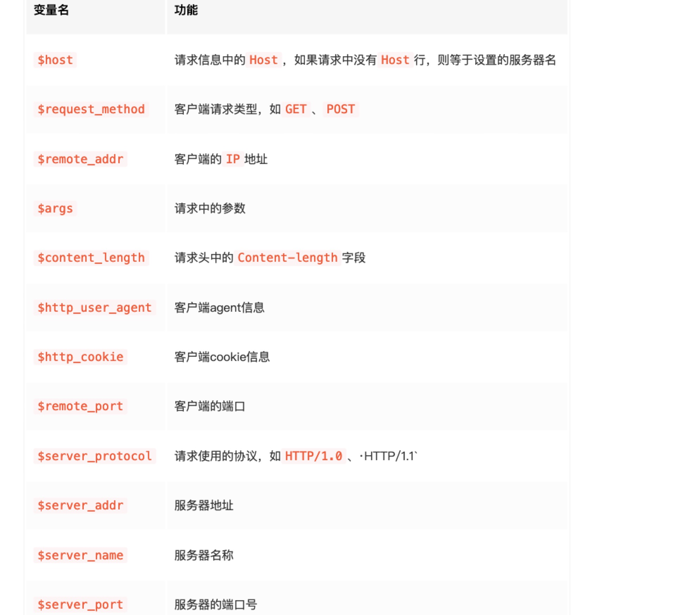
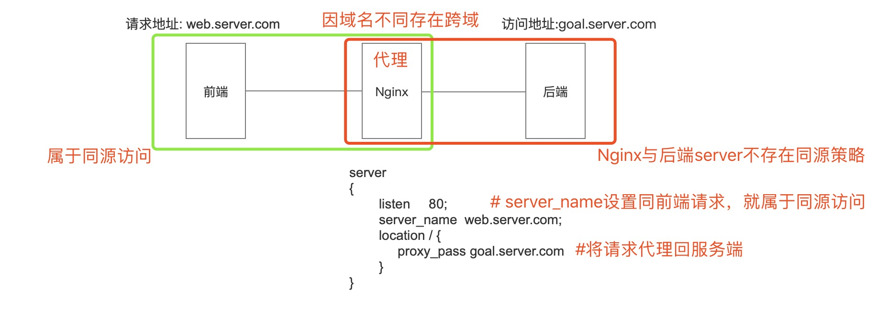

# 正向代理 与 反向代理

# Nginx安装

### [mac安装Nginx](https://www.cnblogs.com/meng1314-shuai/p/8335140.html)

    $ brew install nginx
    
    $ open /usr/local/etc/nginx/    #查看nginx安装目录(brew info nginx查看查nginx安装信息)
    
    $ open /usr/local/Cellar/nginx  #nginx被安装到的目录
    
    $ nginx  #启动nginx,浏览器访问:localhost:8080即可显示nginx信息

# Nginx配置文件及内置变量

**nginx.conf配置**

**内置变量**

# Nginx应用

### 解决跨域

#### 1.跨域

**仅浏览器存在跨域问题，服务端与服务端不存在跨域问题**

**同源策略限制了从同一个源加载的文档或脚本如何与来自另一个源的资源进行交互。这是一个用于隔离潜在恶意文件的重要安全机制。通常不允许不同源间的读操作**

#### 2.同源(浏览器同源策略)

**若两个页面的协议，端口（如果有指定）和域名都相同，则两个页面具有相同的源**

#### 3.nginx解决跨域的原理

### 请求过滤

### 配置gzip

### 负载均衡

### 静态资源服务器

**[前端开发的必备的Nginx知识-掘金](https://juejin.im/post/5c85a64d6fb9a04a0e2e038c)**