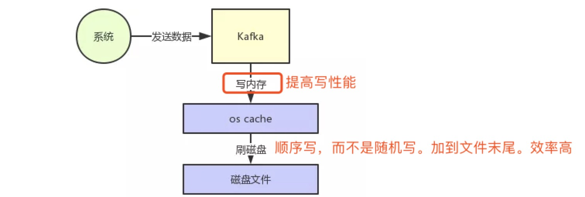
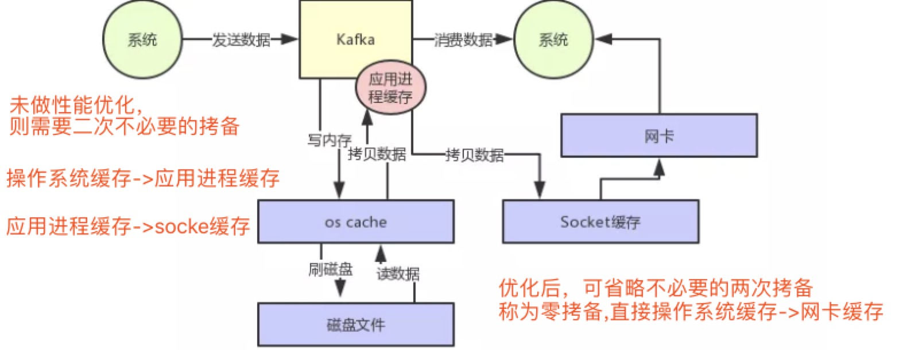

# Kafka

### [消息中间件如何实现每秒几十万的高并发写入](https://mp.weixin.qq.com/s?__biz=MzU0OTk3ODQ3Ng==&mid=2247484700&idx=1&sn=fbfdb57ea53882828e4e3bd0b3b61947&chksm=fba6ed1fccd16409c43baa7f941e522d97a72e63e4139f663b327c606c6bb5dfe516b6f61424&scene=21#wechat_redirect)

    Kafka是高吞吐低延迟的高并发、高性能的消息中间件，在大数据领域有极为广泛的运用。配置良好的Kafka集群甚至可以做到每秒几十万、上百万的超高并发写入。
    
+ 页面缓存技术+磁盘顺序写(写入) **kafka核心架构原理**

+ 零拷贝技术(消费)

性能优化后：

### [写入消息中间件的数据，如何保证不丢失](https://mp.weixin.qq.com/s/wbqA9vZOCQ0M_N9Q0NXWVg)

+ kafka分布式存储架构

+ kafka高可用架构

+ kafka写入数据丢失问题

+ kafka的核心机制--ISR机制

    ISR是kafka自动维护和监控哪些follower及时的跟上了leader的数据同步
    
+ kafka写入的数据保证不丢失

**若写入失败，则让生产者不停的重试，直到kafka恢复正常**

