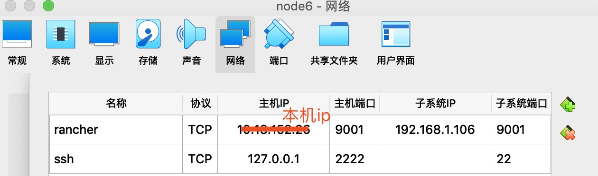
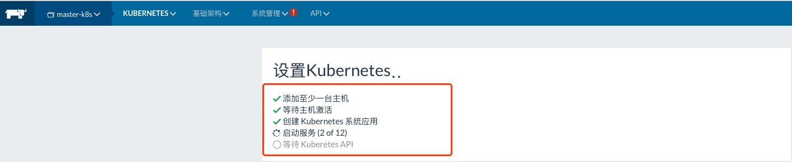
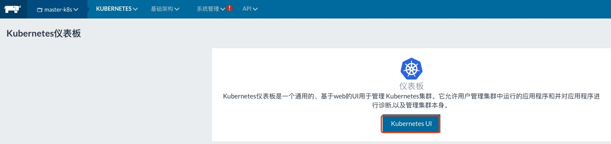

### [企业级rancher搭建kubernetes-rancher管理平台搭建k8s](https://blog.51cto.com/13941177/2165668)

#### 1.准备两台虚拟机node6(作为master节点)和node7(作为node节点)

    192.168.1.106  #Master节点
    192.168.1.107  #Node节点
    
#### 2.[node6和node7节点均需安装docker](resources/deploy-docker.sh)

    $ chmod u+x deploy-docker.sh
    
    $ ./deploy-docker.sh

#### 3.node6-master节点安装Rancher

    $ docker pull rancher/server:stable #拉取rancher镜像
    
    $ docker run -d --restart=unless-stopped -p 9001:8080 rancher/server:stable #启动容器
    
    $ curl 127.0.0.1:9001 或  curl 192.168.1.106:9001 #验证是否可以访问
    
利用vitualbox设置网络->网络1(网络地址转换NAT)_高级_端口转发->添加

#### 4.浏览器访问http://192.168.1.106:9001 即可访问在rancher页面

**Rancher页面操作**

##### 4-1.创建k8s环境模版

    菜单栏(Default)->环境模版(添加环境模版)->
    
    (1)名称：k8s-Template
    (2)选择编排中的kubernetes->编辑设置
       A.Private Registry for Add-Ons and Pod Infra Container Image : registry.cn-shenzhen.aliyuncs.com
       B.Repository for Add-Ons and Pod Infra Container Image : rancher_cn
    (3)最下方设置
    
    ->最下方"创建"
    
##### 4-2.添加环境

    添加环境->名称(master-k8s)->选择刚创建的环境模版(k8s-Template)-》创建
    
##### 4-3.添加节点-将机器(node6-192.168.1.106)加入到k8s环境

    选择Default->master-k8s->右上角"添加主机"->保存(生成脚本)
    
##### 4-4.登录node7节点(192.168.1.107)执行注册Rancher的脚本

    [root@node7 k8s]# sudo docker run --rm --privileged -v /var/run/docker.sock:/var/run/docker.sock -v /var/lib/rancher:/var/lib/rancher rancher/agent:v1.2.11 http://xx.xx.xx.xx:9001/v1/scripts/5031D08700A02A2BFDB2:1546214400000:GH1jvVpXPs06CeaSTmPYQhnhmLM
    Unable to find image 'rancher/agent:v1.2.11' locally
    v1.2.11: Pulling from rancher/agent
    b3e1c725a85f: Pull complete 
    6a710864a9fc: Pull complete 
    d0ac3b234321: Pull complete 
    87f567b5cf58: Pull complete 
    063e24b217c4: Pull complete 
    d0a3f58caef0: Pull complete 
    16914729cfd3: Pull complete 
    bbad862633b9: Pull complete 
    3cf9849d7f3c: Pull complete 
    Digest: sha256:0fba3fb10108f7821596dc5ad4bfa30e93426d034cd3471f6ccd3afb5f87a963
    Status: Downloaded newer image for rancher/agent:v1.2.11
    
    INFO: Running Agent Registration Process, CATTLE_URL=http://xx.xx.xx.xx:9001/v1
    INFO: Attempting to connect to: http://xx.xx.xx.xx:9001/v1
    INFO: http://xx.xx.xx.xx:9001/v1 is accessible
    INFO: Configured Host Registration URL info: CATTLE_URL=http://xx.xx.xx.xx:9001/v1 ENV_URL=http://xx.xx.xx.xx:9001/v1
    INFO: Inspecting host capabilities
    INFO: Boot2Docker: false
    INFO: Host writable: true
    INFO: Token: xxxxxxxx
    INFO: Running registration
    INFO: Printing Environment
    INFO: ENV: CATTLE_ACCESS_KEY=0265DE78D68040D9942A
    INFO: ENV: CATTLE_HOME=/var/lib/cattle
    INFO: ENV: CATTLE_REGISTRATION_ACCESS_KEY=registrationToken
    INFO: ENV: CATTLE_REGISTRATION_SECRET_KEY=xxxxxxx
    INFO: ENV: CATTLE_SECRET_KEY=xxxxxxx
    INFO: ENV: CATTLE_URL=http://xx.xx.xx.xx:9001/v1
    INFO: ENV: DETECTED_CATTLE_AGENT_IP=10.0.2.2
    INFO: ENV: RANCHER_AGENT_IMAGE=rancher/agent:v1.2.11
    INFO: Launched Rancher Agent: 63260f73920e1b0e502f5bbb8ead1519479e068788dd9f531868ccd4566d9e7d

##### 4-5.浏览器刷新页面

等待一段时间后出现如下页面:

---------------------------------

    
    

    

