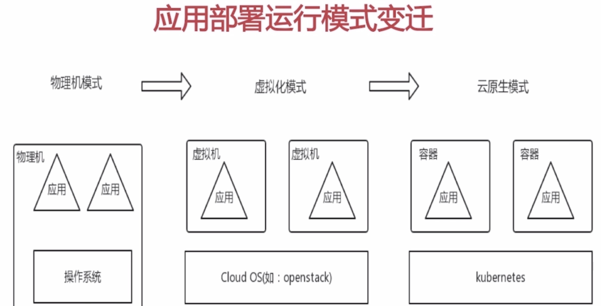
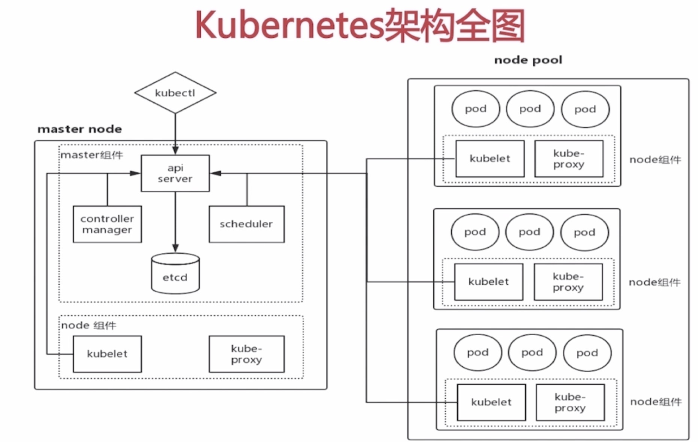
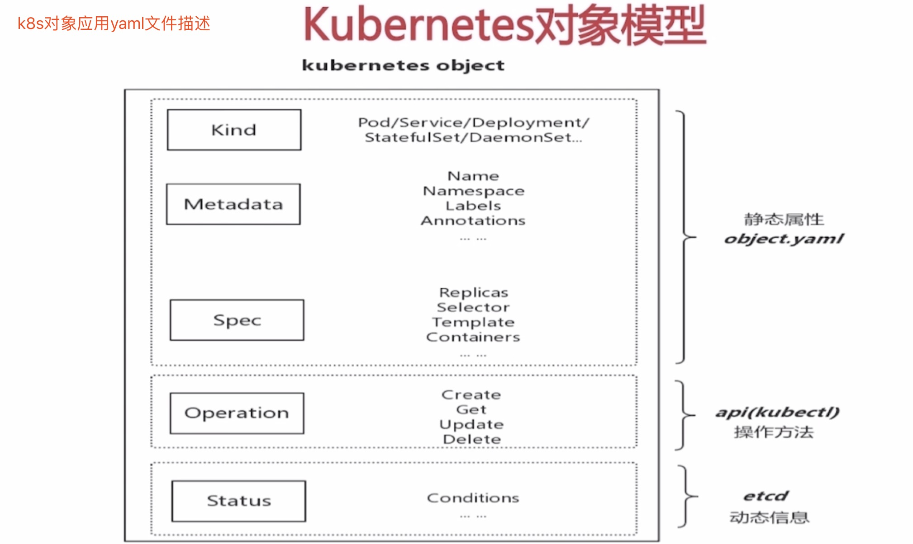
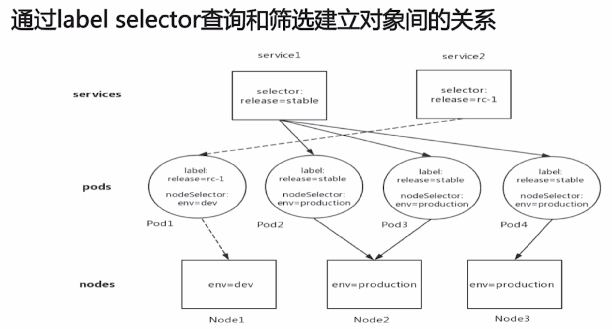

# [kubernetes-github](https://github.com/kubernetes)

## [十分钟带你理解Kubernetes核心概念](http://www.dockone.io/article/932)

## [mooc-kubernetes](https://www.imooc.com/video/17043)

### 1.应用部署运行模式变迁

### 2.kubernetes架构全图

#### 2-1.kubernetes对象模型(kubectl管理k8s对象，yaml文件描述对象)

+ Namespace:不仅仅是一个属性，本身也是一个Object

    + 用于将物理集群划分为多个虚拟集群
    
    + Namespace间完全隔离，因此常用来隔离不同用户(权限)
    
    + 内置三个namespaces: default / kube-system / kube-public
      
      Node和PersistentVolume不属于任何namespace
      
+ label标签

#### 2-2.
