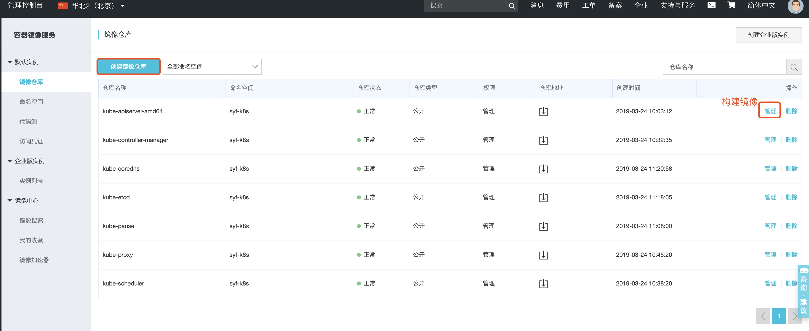

# [Kubernetes (k8s)](https://www.kubernetes.org.cn/doc-17)

**Kubernetes是容器集群管理系统，是一个开源的平台，可以实现容器集群的自动化部署、自动扩缩容、维护等功能。**

kubenetes搭建方式有三种：

+ minikube （通常在测试环境使用，不要在生产环境中使用）

+ kubeadm （是一种快速部署kubernetes的方式，部署相对简单，可以在生产环境中应用）

+ 二进制方式安装kubernetes （安装过程复杂，比较容易踩坑）

### 一。Kubernetes集群安装指南(https://blog.devopszen.com/kubernetes) --二进制文件

**k8s集群安装方式--二进制文件**

#### 1.安装vagrant & [visualbox](https://www.virtualbox.org/wiki/Downloads)

    $ brew install vagrant  

#### 2.初始化3台虚拟机

[Vagrantfile](resources/Vagrantfile)放置于目录~/learn/vagrant/目录下

    $ cd ~/learn/vagrant
    $ vagrant up #启动虚拟机
    $ vagrant status #查看3台虚拟机状态

虚拟机IP分别为:

    node1 192.168.56.101
    node2 192.168.56.102
    node3 192.168.56.103
    
#### 3.初始化ubuntu服务器，安装docker服务

    $ vagrant ssh node1  #连接到node1虚拟机
    $ sudo su #切换到管理员用户
    $ passwd #修改密码
    $ apt-key adv --keyserver hkp://p80.pool.sks-keyservers.net:80 --recv-keys 58118E89F3A912897C070ADBF76221572C52609D
    $ vim /etc/apt/sources.list.d/docker.list #创建docker.list文件添加
      # deb https://apt.dockerproject.org/repo ubuntu-trusty main
    $ apt-get update
    $ apt-get install ssh -y
    $ apt-get install curl -y
    $ apt-get install git -y
    $ apt-get install bridge-utils
    $ apt-get install docker-engine
    
    **分别连接到node2和node3执行上述命令.另：上述初始化工作可用自动化工具如ansible完成**
    
#### 4.添加统一权限

node1为master节点，node2和node3为普通node节点

    $ vagrant ssh node1 #登录master虚拟机
    $ vim /etc/hosts #配置主机192.168.56.102 node2及192.168.56.103 node3
    $ vim /etc/ssh/sshd_config #设置PermitRootLogin为yes(允许ssh用root用户登录)
    $ cd /root/.ssh #默认会有个authorized_keys文件
    $ ssh-keygen #生成公私钥对id_rsa和id_rsa.pub
    $ service ssh restart #重启ssh
    
    **node2和node3节点分别依次执行上述命令**
    
    $ scp id_rsa.pub root@node2:/root/.ssh/id_rsa_node1.pub #将node1公钥拷备到node2节点上
    
    $ vagrant ssh node2 #登录node2
    $ cd /root/.ssh/
    $ cat id_rsa_node1.pub >> authorized_keys #将node1的公钥添加到authorized_keys文件中
    $ service ssh restart #重启ssh服务
    
    **此时切换到node1节点，$ ssh node2即可直接登录node2,不必输入密码**
    
#### 5.在node1主节点上安装kubernetes
    
    $ vagrant ssh node1 #连接node1节点
    $ sudo su #切换到管理员用户
    $ cd /home 
    $ mkdir k8s
    $ cd k8s
    $ wget https://github.com/GoogleCloudPlatform/kubernetes/releases/download/v1.4.0/kubernetes.tar.gz
    $ tar -xvf kubernetes.tar.gz
    $ vim kubernetes/cluster/ubuntu/config-default.sh #修改配置
      export nodes=${nodes:-"root@192.168.56.101 root@192.168.56.102 root@192.168.56.103"}
    $ cd kubernetes/server/
    $ tar -xvf kubernetes-salt.tar.gz  
    $ cp -a kubernetes/saltbase ../cluster
    $ rm -rf kubernetes-salt.tar.gz
    $ tar -xvf kubernetes-server-linux-amd64.tar.gz
    $ cp kubernetes/server/bin/kubectl /usr/bin/
    
#### 6.启动kubernetes集群
    $ cd ../cluster #进入cluster目录
    $ KUBERNETES_PROVIDER=ubuntu ./kube-up.sh
    
    **第一次执行会报错，报文件不存在。解决方案如下:**
    $ cp kubernetes-server-linux-amd64.tar.gz /home/k8s/kubernetes/cluster/ubuntu/kubernetes/server 
    
    $ KUBERNETES_PROVIDER=ubuntu ./kube-up.sh #可能还会报错。忽略执行输入密码即可
    
#### 7.kubernetes集群已经启动成功

[kubernetes集群启动成功显示信息](resources/k8s安装成功info.txt)

地址栏可访问:http://192.168.56.101:8080/ 显示[kubernetes的api信息](resources/k8s的api信息.txt)

查看机器状态：$ kubectl get nodes

    NAME             STATUS    AGE
    192.168.56.101   Ready     5m
    192.168.56.102   Ready     5m
    192.168.56.103   Ready     5m  
    
**上述：kubernetes安装成功！**

**kubernetes各部件**

     etcd，kube-scheduler，flanneld，kube-apiserver，kube-controller-manager，kubelet，kube-proxy，dockerd

#### 8.本地操作集群

**node1可看到这个集群的[kubectl配置信息](resources/kubectl配置信息.txt)**

    $ kubectl config view
    
**切换到本地**

(1).[安装kubectl](https://kubernetes.io/docs/tasks/tools/install-kubectl/) (mac)

    $ brew install kubernetes-cli
    或
    $ curl -LO https://storage.googleapis.com/kubernetes-release/release/$(curl -s https://storage.googleapis.com/kubernetes-release/release/stable.txt)/bin/darwin/amd64/kubectl(本示例采用此种方式)
   
    $ chmod +x ./kubectl #制作kubectl二进制可执行文件
    $ mv ./kubectl /usr/local/bin/kubectl #将二进制文件移动到PATH中
    
    
(2).配置信息(node1的kubectl配置信息)

    $ kubectl config set-cluster nodes --server=http://192.168.56.101:8080 --insecure-skip-tls-verify=true
    
    $ kubectl config set-context nodes --cluster=nodes --user=cluster-admin
    
    $ kubectl config set-credentials cluster-admin --username=admin --password=D3wgncMpKQip8wFv
    
(3).本地查看kubeconfig文件,修改[kubeconfig文件](resources/kubeconfig.txt)

**为让kubectl能查找和访问k8s集群，需要该文件**

**[kubeconfig文件配置说明](https://kubernetes.io/docs/tasks/access-application-cluster/configure-access-multiple-clusters/)**

    $ vim ~/.kube/config #可删除掉初始化时无用的信息。否则总会报连不上服务...
    
    $ kubectl get nodes # 本地查看集群的机器
        NAME             STATUS   ROLES    AGE    VERSION
        192.168.56.101   Ready    <none>   149m   v1.4.0
        192.168.56.102   Ready    <none>   149m   v1.4.0
        192.168.56.103   Ready    <none>   149m   v1.4.0
        
    $ kubectl get nodes --show-labels
        NAME             STATUS   ROLES    AGE    VERSION   LABELS
        192.168.56.101   Ready    <none>   152m   v1.4.0    beta.kubernetes.io/arch=amd64,beta.kubernetes.io/os=linux,kubernetes.io/hostname=192.168.56.101
        192.168.56.102   Ready    <none>   152m   v1.4.0    beta.kubernetes.io/arch=amd64,beta.kubernetes.io/os=linux,kubernetes.io/hostname=192.168.56.102
        192.168.56.103   Ready    <none>   152m   v1.4.0    beta.kubernetes.io/arch=amd64,beta.kubernetes.io/os=linux,kubernetes.io/hostname=192.168.56.103

#### 9.停止kubernetes集群

    $ KUBERNETES_PROVIDER=ubuntu ./kube-down.sh
    
#### 10.销毁这3台本地虚拟机

    $ vagrant destroy
    
**常见vagrant命令**

    $ vagrant init      # 初始化
    
    $ vagrant up        # 启动虚拟机
    $ vagrant halt      # 关闭虚拟机
    $ vagrant reload    # 重启虚拟机
    $ vagrant ssh       # SSH 至虚拟机
    $ vagrant suspend   # 挂起虚拟机
    $ vagrant resume    # 唤醒虚拟机
    $ vagrant status    # 查看虚拟机运行状态
    $ vagrant destroy   # 销毁当前虚拟机

--------------------------------------------------

参考资料:

[k8s中文文档](http://docs.kubernetes.org.cn/227.html)

[安装minikube](https://kubernetes.io/docs/tasks/tools/install-minikube/)

--------------------------------------------------

### 二。kubeadm搭建kubernetes集群

参考文章:
+ [使用kubeadm安装Kubernetes 1.13-中文社区](https://www.kubernetes.org.cn/4956.html)
+ [kubernetes---CentOS7安装kubernetes1.11.2图文完整版](https://blog.csdn.net/zzq900503/article/details/81710319)
+ [CentOS7中用kubeadm安装Kubernetes](https://yq.aliyun.com/articles/626118)
+ [kubeadm 搭建 kubernetes 集群-掘金](https://mritd.me/2016/10/29/set-up-kubernetes-cluster-by-kubeadm/)

实用网址:

+ [Kubernetes 各版本镜像列表](https://blog.atompi.com/2018/07/30/kubernetes%E5%90%84%E7%89%88%E6%9C%AC%E9%95%9C%E5%83%8F%E5%88%97%E8%A1%A8/)
+ [aliyun 镜像服务](https://cr.console.aliyun.com/cn-beijing/instances/repositories)
    
    **k...g/A..3..aliyun :用于构建镜像,需要connect github(A..3..github)(采用此种方式)**
    
    
    
+ [docker hub](https://cloud.docker.com)

    **y..16..@sina.com/A..3..docker : 用于构建镜像**
    
### (一)。[kubeadm搭建kubernetes集群](https://www.kubernetes.org.cn/4956.html)

#### 1.vagrant & virtualbox 安装，并初始化三台centos/7虚拟机

**[具体参见](../../../../Linux/虚拟机/resource/vagrant/Vagrantfile)**

    $ vagrant up node1 #启动第一台虚拟机(master)
    $ vagrant up node2 node3 
    
**集群1:第一次部署，应用flannel网络的机器**

    192.168.1.31 master(node1)
    192.168.1.32 node2
    192.168.1.33 node3
    
**集群2:第二次部署，应用calico网络的机器(推荐calico网络)** 

    192.168.2.11 master(k8s1)
    192.168.2.12 node2 (k8s2)
    192.168.2.13 node3 (k8s3)
    
#### 2.设置ssh免登录权限

**[具体参见](resources/ssh免密码登录-centos.txt)**

#### 3.关闭防火墙
    
    $ sudo systemctl stop firewalld.service   #停止firewall
    $ sudo systemctl disable firewalld.service #禁止firewall开机启动
    $ sudo firewall-cmd --state             #查看防火墙状态

#### 4.禁用SELINUX

    $ sudo setenforce 0
    $ sudo vi /etc/selinux/config
        #SELINUX修改为disabled
        SELINUX=disabled 

    $ vim /etc/sysctl.d/k8s.conf
     # 添加如下内容
     net.bridge.bridge-nf-call-ip6tables = 1
     net.bridge.bridge-nf-call-iptables = 1
    $ sudo sysctl -p /etc/sysctl.d/k8s.conf #配置生效
    
可能遇到问题–sysctl: cannot stat /proc/sys/net/bridge/bridge-nf-call-ip6tables: 没有那个文件或目录 
    
解决方案:
    
    $ modprobe br_netfilter
    $ ls /proc/sys/net/bridge
    $ sudo sysctl -p /etc/sysctl.d/k8s.conf
    
#### 5.安装&启动停止docker

**安装docker**

    $ sudo yum install -y yum-utils device-mapper-persistent-data lvm2 
    $ sudo yum-config-manager \
      --add-repo \
      https://download.docker.com/linux/centos/docker-ce.repo
      
    $ sudo yum list docker-ce.x86_64  --showduplicates |sort -r #查看当前docker版本
    
Kubernetes 1.8已经针对Docker的1.11.2, 1.12.6, 1.13.1和17.03等版本做了验证。 因此我们这里在各节点安装docker的17.03.2版本。 
使用命令如下:

    $ sudo yum makecache fast
    $ sudo yum install -y --setopt=obsoletes=0 \
        docker-ce-17.03.2.ce-1.el7.centos \
        docker-ce-selinux-17.03.2.ce-1.el7.centos

可能遇到的问题

    获取 GPG 密钥失败：[Errno 12] Timeout on https://download.docker.com/linux/centos/gpg: (28, 'Operation timed out after 30002 milliseconds with 0 out of 0 bytes received')
   
解决方案

    $ curl -l https://download.docker.com/linux/centos/gpg
    
**启动停止docker**

    $ sudo systemctl enable docker && systemctl start docker #设置开机启动和启动docker服务
    
Docker从1.13版本开始调整了默认的防火墙规则，禁用了iptables filter表中FOWARD链，这样会引起Kubernetes集群中跨Node的Pod无法通信，在各个Docker节点执行下面的命令:

    $ sudo iptables -P FORWARD ACCEPT
    
同时在docker的systemd unit文件中以ExecStartPost加入允许访问的代码，使用命令如下:

      # 为docker服务创建一个systemd插件目录
    $ mkdir -p /etc/systemd/system/docker.service.d
      # 创建一个/etc/systemd/system/docker.service.d/port.conf配置文件
    $ vi /etc/systemd/system/docker.service.d/port.conf
      # 添加如下内容
    ExecStartPost=/usr/sbin/iptables -P FORWARD ACCEPT
      # 重启docker服务
    $ systemctl daemon-reload
    $ systemctl restart docker
    
#### 6.安装kubeadm和kubelet

    #编辑资源库
    $ vi /etc/yum.repos.d/kubernetes.repo
    
    #添加如下内容
    [kubernetes]
    name=Kubernetes
    baseurl=https://mirrors.aliyun.com/kubernetes/yum/repos/kubernetes-el7-x86_64/
    enabled=1
    gpgcheck=1
    repo_gpgcheck=1
    gpgkey=https://mirrors.aliyun.com/kubernetes/yum/doc/yum-key.gpg https://mirrors.aliyun.com/kubernetes/yum/doc/rpm-package-key.gpg
    
    # 继续安装,因kubernetes更新比较频繁，最好指定版本
    $ yum install -y kubelet-1.13.3 kubectl-1.13.3 kubernetes-cni-0.6.0 kubeadm-1.13.3
    
#### 7.处理swap

    #关闭swap(方式一)
    $ swapoff -a  
    $ free -m #查看swap查否关闭(均为0)
    
    #调整swappiness参数
    $ vim /etc/sysctl.d/k8s.conf
    #添加内容
    vm.swappiness=0
    $ sysctl -p /etc/sysctl.d/k8s.conf #修改生效

    #去掉swap的限制(方式二)
    $ vi /etc/systemd/system/kubelet.service.d/10-kubeadm.conf
    #添加内容
    Environment="KUBELET_EXTRA_ARGS=--fail-swap-on=false"
    $ systemctl daemon-reload
    
#### 8.启动kubelet服务

    $ systemctl enable kubelet.service && systemctl start kubelet.service
    
**上述操作在所有节点上均需执行!!!**

**下述操作均只在master节点上执行!!!**
    
#### 9-1 kubeadm初始化集群--手动制作k8s所需镜像
    
##### (1).准备kubernetes镜像--阿里云

    $ kubeadm config images list #查看所需镜像版本
    
    [root@peer1 k8s]# kubeadm config images list
    k8s.gcr.io/kube-apiserver:v1.13.4
    k8s.gcr.io/kube-controller-manager:v1.13.4
    k8s.gcr.io/kube-scheduler:v1.13.4
    k8s.gcr.io/kube-proxy:v1.13.4
    k8s.gcr.io/pause:3.1
    k8s.gcr.io/etcd:3.2.24
    k8s.gcr.io/coredns:1.2.6
    
**制作镜像**

+ [登录github](https://github.com),创建仓库，本地初始化git,clone仓库,编辑Dockerfile,push到仓库
  [具体参见](https://github.com/shiyufeng0919/k8s.gcr.io)
  
+ [登录aliyun](https://cr.console.aliyun.com/cn-beijing/instances/repositories)
  创建命名空间-》创建镜像仓库(eg:kube-apiserver-amd64)-》管理->构建->添加规则
  
    $ docker pull registry.cn-beijing.aliyuncs.com/syf-k8s/kube-apiserver-amd64:v1.13.4 #拉取镜像
    $ docker tag registry.cn-beijing.aliyuncs.com/syf-k8s/kube-apiserver-amd64:v1.13.4  k8s.gcr.io/kube-apiserver:v1.13.4 #修改tag标签(上述kubeadm config images list)
    $ docker rmi registry.cn-beijing.aliyuncs.com/syf-k8s/kube-apiserver-amd64:v1.13.4 #删除
  
  **其他镜像制作方法同上**
  
  **[拉取镜像与替换镜像标签脚本](resources/pull-images.sh)**
    
    [root@peer1 k8s]# docker images
    REPOSITORY                           TAG                 IMAGE ID            CREATED             SIZE
    k8s.gcr.io/coredns                   1.2.6               9bb0aabb32d0        About an hour ago   40 MB
    k8s.gcr.io/etcd                      3.2.24              d1bec057ff74        About an hour ago   220 MB
    k8s.gcr.io/pause                     3.1                 3be3c3205407        2 hours ago         742 kB
    k8s.gcr.io/kube-proxy                v1.13.4             0dd0d1acb64b        2 hours ago         80.3 MB
    k8s.gcr.io/kube-scheduler            v1.13.4             4ad3493974d5        2 hours ago         79.6 MB
    k8s.gcr.io/kube-controller-manager   v1.13.4             ea600de59644        2 hours ago         146 MB
    k8s.gcr.io/kube-apiserver            v1.13.4             8ded9a7def94        3 hours ago         181 MB
    
##### (2).使用kubeadm init初始化集群 (只在主节点master执行)

    $ yum install -y ebtables  # 安装 ebtables

    $ systemctl enable kubelet && systemctl start kubelet

    $ kubeadm init --apiserver-advertise-address 192.168.1.11 #初始化并指定 apiserver 监听地址
    
[执行结果](resources/images/kubeadminit.txt)

**生成token记录下来，使用kubeadm join往集群中添加节点需要该Token**

**配置常规用户如何使用kubectl(客户端)访问集群,因为master节点也需要使用kubectl访问集群,因此也需执行下列命令**

    $ mkdir -p $HOME/.kube
    $ sudo cp -i /etc/kubernetes/admin.conf $HOME/.kube/config
    $ sudo chown $(id -u):$(id -g) $HOME/.kube/config

    [root@peer1 k8s]# kubectl get cs  #查看集群状态,确认每个组件均为Healthy状态
    NAME                 STATUS    MESSAGE              ERROR
    controller-manager   Healthy   ok                   
    scheduler            Healthy   ok                   
    etcd-0               Healthy   {"health": "true"} 
    
#### 9-2 使用阿里云镜像

##### (1).执行下述命令,初始化k8s集群并从阿里云下载镜像

    # 192.168.1.31为master节点
    $ kubeadm init \
    --apiserver-advertise-address=192.168.1.31 \
    --image-repository registry.aliyuncs.com/google_containers \
    --kubernetes-version v1.13.3 \
    --service-cidr=10.1.0.0/16 \
    --pod-network-cidr=10.244.0.0/16
    
[输出结果](resources/kubeadminit.txt)

##### (2).配置常规用户如何使用kubectl访问集群

    $ mkdir -p $HOME/.kube
    $ sudo cp -i /etc/kubernetes/admin.conf $HOME/.kube/config
    $ sudo chown $(id -u):$(id -g) $HOME/.kube/config
    
#### (3)。查看镜像($ docker images)

    [root@node1 k8s]# docker images
    REPOSITORY                                                        TAG                 IMAGE ID            CREATED             SIZE
    registry.aliyuncs.com/google_containers/kube-apiserver            v1.13.3             fe242e556a99        7 weeks ago         181 MB
    registry.aliyuncs.com/google_containers/kube-controller-manager   v1.13.3             0482f6400933        7 weeks ago         146 MB
    registry.aliyuncs.com/google_containers/kube-proxy                v1.13.3             98db19758ad4        7 weeks ago         80.3 MB
    registry.aliyuncs.com/google_containers/kube-scheduler            v1.13.3             3a6f709e97a0        7 weeks ago         79.6 MB
    registry.aliyuncs.com/google_containers/coredns                   1.2.6               f59dcacceff4        4 months ago        40 MB
    registry.aliyuncs.com/google_containers/etcd                      3.2.24              3cab8e1b9802        6 months ago        220 MB
    registry.aliyuncs.com/google_containers/pause                     3.1                 da86e6ba6ca1        15 months ago       742 kB
    
    $ docker ps #已经有运行的容器，主要是实始化集群时static pod

#### (4).查看集群状态($ kubectl get cs)

    [root@node1 k8s]# kubectl get cs
    NAME                 STATUS    MESSAGE              ERROR
    controller-manager   Healthy   ok                   
    scheduler            Healthy   ok                   
    etcd-0               Healthy   {"health": "true"}  
    
#### (5).查看节点/机器状态 kubectl get node 

    [root@node1 k8s]# kubectl get node
    NAME    STATUS     ROLES    AGE   VERSION
    node1   NotReady   master   19m   v1.13.3
    
    上述处理NotReady状态，是因为还未安装Pod Network

#### 10-1.安装Pod Network (只在主节点master执行)--配置flannel网络

**flannel网络，后面集群中部署应用时会发生网络连接问题**

    $ mkdir -p ~/k8s/
    $ cd ~/k8s
    $ yum install wget
    
    #安装flannel(后续节点间通信及pod间通信会有问题)
    $ wget https://raw.githubusercontent.com/coreos/flannel/master/Documentation/kube-flannel.yml
    $ kubectl apply -f  kube-flannel.yml
    
    #查看flannel的运行状态
    $ kubectl get ds -l app=flannel -n kube-system
    [root@node1 k8s]# kubectl get ds -l app=flannel -n kube-system
    NAME                      DESIRED   CURRENT   READY   UP-TO-DATE   AVAILABLE   NODE SELECTOR                     AGE
    kube-flannel-ds-amdpip64     2         2         2       2            2           beta.kubernetes.io/arch=amd64     105m
    kube-flannel-ds-arm       0         0         0       0            0           beta.kubernetes.io/arch=arm       105m
    kube-flannel-ds-arm64     0         0         0       0            0           beta.kubernetes.io/arch=arm64     105m
    kube-flannel-ds-ppc64le   0         0         0       0            0           beta.kubernetes.io/arch=ppc64le   105m
    kube-flannel-ds-s390x     0         0         0       0            0           beta.kubernetes.io/arch=s390x     105m
    
    #查看kube-flannel.yml这个文件里的flannel的镜像的版本
    $ cat kube-flannel.yml|grep quay.io/coreos/flannel 
    

[输出结果](resources/1.txt)

    $ kubectl get node #查看机器状态,此时处于Ready状态
    
    [root@node1 k8s]# kubectl get node
    NAME    STATUS   ROLES    AGE   VERSION
    node1   Ready    master   25m   v1.13.3
    
    [root@node1 k8s]# kubectl get pod --all-namespaces -o wide  ##确保所有的Pod都处于Running状态
    NAMESPACE     NAME                            READY   STATUS    RESTARTS   AGE   IP             NODE    NOMINATED NODE   READINESS GATES
    kube-system   coredns-78d4cf999f-cbl9t        1/1     Running   0          25m   10.244.0.2     node1   <none>           <none>
    kube-system   coredns-78d4cf999f-wx7lw        1/1     Running   0          25m   10.244.0.3     node1   <none>           <none>
    kube-system   etcd-node1                      1/1     Running   0          24m   192.168.1.31   node1   <none>           <none>
    kube-system   kube-apiserver-node1            1/1     Running   0          24m   192.168.1.31   node1   <none>           <none>
    kube-system   kube-controller-manager-node1   1/1     Running   0          24m   192.168.1.31   node1   <none>           <none>
    kube-system   kube-flannel-ds-amd64-r8xg7     1/1     Running   0          55s   192.168.1.31   node1   <none>           <none>
    kube-system   kube-proxy-mpj54                1/1     Running   0          25m   192.168.1.31   node1   <none>           <none>
    kube-system   kube-scheduler-node1            1/1     Running   0          24m   192.168.1.31   node1   <none>           <none>
    
#### 10-2.安装Pod Network (只在主节点master执行)--安装calico(推荐)

    $ wget https://docs.projectcalico.org/v3.6/getting-started/kubernetes/installation/hosted/kubernetes-datastore/calico-networking/1.7/calico.yaml
    
[calico.yaml](resources/calico.yaml)

    $ kubectl apply -f calico.yaml   #应用kubectl命令部署
    
    #确保所有pod都处于Running状态
    [root@k8s1 k8s]# kubectl get pod --all-namespaces -o wide
    NAMESPACE     NAME                                       READY   STATUS    RESTARTS   AGE     IP               NODE        NOMINATED NODE   READINESS GATES
    kube-system   calico-kube-controllers-55df754b5d-hkht7   1/1     Running   0          2m27s   192.168.106.66   k8s1.node   <none>           <none>
    kube-system   calico-node-glmqn                          1/1     Running   0          2m27s   10.0.2.15        k8s1.node   <none>           <none>
    kube-system   coredns-78d4cf999f-j2rm4                   1/1     Running   0          10m     192.168.106.67   k8s1.node   <none>           <none>
    kube-system   coredns-78d4cf999f-wnbd7                   1/1     Running   0          10m     192.168.106.65   k8s1.node   <none>           <none>
    kube-system   etcd-k8s1.node                             1/1     Running   0          10m     10.0.2.15        k8s1.node   <none>           <none>
    kube-system   kube-apiserver-k8s1.node                   1/1     Running   0          10m     10.0.2.15        k8s1.node   <none>           <none>
    kube-system   kube-controller-manager-k8s1.node          1/1     Running   0          10m     10.0.2.15        k8s1.node   <none>           <none>
    kube-system   kube-proxy-m98c4                           1/1     Running   0          10m     10.0.2.15        k8s1.node   <none>           <none>
    kube-system   kube-scheduler-k8s1.node                   1/1     Running   0          9m51s   10.0.2.15        k8s1.node   <none>           <none>
    
    # 查看节点/机器状态
    [root@k8s1 k8s]# kubectl get node
    NAME        STATUS   ROLES    AGE   VERSION
    k8s1.node   Ready    master   11m   v1.13.3
    
[运行结果](resources/calico.txt)

[flannel网络与calico网络](https://juejin.im/post/59c47fc2f265da065a63c52b)

    
#### 11.master node参与工作负载 (只在主节点master执行)

**使用kubeadm初始化的集群，出于安全考虑Pod不会被调度到Master Node上，也就是说Master Node不参与工作负载。**

    $ kubectl describe node node1 | grep Taint #查看node1被打上了不参与工作负载
      Taints:             node-role.kubernetes.io/master:NoSchedule
      
    $ kubectl taint nodes node1 node-role.kubernetes.io/master-  #使node1参与工作负载
      node "node1" untainted
    
#### 12.测试DNS (只在主节点master执行)

    [root@node1 k8s]# kubectl run curl --image=radial/busyboxplus:curl -it
    kubectl run --generator=deployment/apps.v1 is DEPRECATED and will be removed in a future version. Use kubectl run --generator=run-pod/v1 or kubectl create instead.
    If you don't see a command prompt, try pressing enter.
    
    [ root@curl-66959f6557-m4w9w:/ ]$ nslookup kubernetes.default     #确认解析正常
    Server:    10.1.0.10
    Address 1: 10.1.0.10 kube-dns.kube-system.svc.cluster.local
    
    Name:      kubernetes.default
    Address 1: 10.1.0.1 kubernetes.default.svc.cluster.local
       
**以上kubernetes单节点集群配置完成!!!**

### (二)。向Kubernetes集群添加Node节点 (只在副节点peer2&peer3执行)

**每个node节点(master/peer1/peer2)均需执行上述2-9步**

**初始化加入集群:node2节点(flannel网络)**

    # master生成的token直接粘贴执行即可,后面加忽略swap的限制
    $ kubeadm join 192.168.1.31:6443 --token kumyz7.b1mc0gdqpeyoeqsw --discovery-token-ca-cert-hash sha256:1023eb20d89a6777141356e32003d23932d0077e91756f35d5690f714736792e \
      --ignore-preflight-errors=Swap
      
[运行结果](resources/kubeadmJoin.txt)

    $ ssh node1       #切换master节点
    
    $ kubectl get nodes     #在master节点上执行命令查看集群中的节点
    
    [root@node1 k8s]# kubectl get nodes
    NAME    STATUS   ROLES    AGE    VERSION
    node1   Ready    master   99m    v1.13.3
    node2   Ready    <none>   2m9s   v1.13.3
    
**实始化加入集群:k8s2节点(calico网络)**

    $ kubeadm join 192.168.2.11:6443 --token u89wdl.5myljtrmiw43teto --discovery-token-ca-cert-hash sha256:dcfde230665793917305984bd359305cff410000eb19ff409acf3d16925f6b72
    
[运行结果](resources/kubeadmJoins.txt)

    $ ssh k8s1  #切换到master节点
    
    [root@k8s1 k8s]# kubectl get node     #查看机器状态
    NAME        STATUS   ROLES    AGE   VERSION
    k8s1.node   Ready    master   41m   v1.13.3
    k8s2.node   Ready    <none>   28m   v1.13.3
        
### (三)。集群应用 -[kubernets部署nginx](https://my.oschina.net/logmm/blog/2246278)

#### [传统Kubernetes应用搭建](https://juejin.im/post/5c04d50fe51d4567b564b7e9)

+ 创建namespace
    
**在一个Kubernetes集群中可以创建多个Namespace进行“环境隔离”，当项目和人员众多时，可以考虑根据项目的实际情况（例如生产、测试、开发）划分不同的Namespace**
    
    [root@node1 nginx]# kubectl create ns nginx-syf   #创建namespace
    namespace/nginx-syf created
    
    [root@node1 nginx]# kubectl get ns   #查看集群中已创建出来的namespace
    NAME          STATUS   AGE
    default       Active   6h3m
    kube-public   Active   6h3m
    kube-system   Active   6h3m
    nginx-syf     Active   6s

+ 创建deployment

**创建deployment更加方便地管理pod,包括扩容、缩容、暂停、滚动更新、回滚等**

**典型的应用场景**

  + 定义Deployment来创建Pod和ReplicaSet
  
  + 滚动升级和回滚应用
  
  + 扩容和缩容
  
  + 暂停和继续Deployment
  
    
    # kubectl命令部署
    [root@node1 nginx]# kubectl apply -f deployment.yaml 
    deployment.apps/nginx-deployment created
    
    # 查看部署出来的Deployment
    [root@node1 nginx]# kubectl get deployment -n nginx-syf
    NAME               READY   UP-TO-DATE   AVAILABLE   AGE
    nginx-deployment   1/1     1            1           66s
    
    # 查看Deployment创建出来的Pod
    [root@k8s1 nginx]# kubectl get pod -n nginx-syf -o wide
    NAME                               READY   STATUS    RESTARTS   AGE     IP              NODE        NOMINATED NODE   READINESS GATES
    nginx-deployment-9f9df9b88-8shpb   1/1     Running   0          8m47s   192.168.197.1   k8s2.node   <none>           <none>
    
    # 分别在master和node节点执行,会打印nginx的html页面Welcome to nginx!信息
    $ curl 192.168.197.1   # flannel网络会出现只有打到的机器才可以curl，其他均不连不通的问题。因些需要更换网络为calico
    
**[deployment.yaml](resources/deployment.yaml)**

**问题点：当采用flannel网络时，仅有node2可以通过curl ip访问nginx,master和node3均不可以访问。连接被拒绝; 修改为calico网络时问题解决!**

**多副本部署**

    #修改deployment.yaml中的replicas: 2 设置2个副本
    
    [root@k8s1 nginx]# kubectl get pod -n nginx-syf -o wide  #查看pod信息,会发现nginx被分别安装在k8s2和k8s3节点上
    NAME                               READY   STATUS    RESTARTS   AGE    IP              NODE        NOMINATED NODE   READINESS GATES
    nginx-deployment-9f9df9b88-8shpb   1/1     Running   0          3h7m   192.168.197.1   k8s2.node   <none>           <none>
    nginx-deployment-9f9df9b88-c4vpc   1/1     Running   0          48s    192.168.164.1   k8s3.node   <none>           <none>
    

+ 创建service(也称svc) 

**Kubernetes Pod 是有生命周期的，它们可以被创建，也可以被销毁，然而一旦被销毁生命就永远结束。通过 Deployment 能够动态地创建和销毁 Pod。 每个 Pod 都会获取它自己的 IP 地址，然而这些IP地址并不是稳定固定的，在销毁Pod时这些IP也会进行回收。 这会导致一个问题：在 Kubernetes 集群中，如果一组 Pod（称为 Backend）为其它Pod （称为 Frontend）提供服务，那么那些 Frontend 该如何发现，并连接到这组 Pod 中的哪些Backend呢? Service可解决该问题**

    # 使用kubectl命令部署
    [root@k8s1 nginx]# kubectl apply -f service.yaml 
    service/nginx-service created
    
    [root@k8s1 nginx]# kubectl get svc -n nginx-syf
    NAME            TYPE        CLUSTER-IP    EXTERNAL-IP   PORT(S)   AGE
    nginx-service   ClusterIP   10.1.37.155   <none>        80/TCP    55s
    
    $ curl 10.1.37.155  #可以在各节点通过访问service访问到nginx
    
**[service.yaml](resources/service.yaml)**
    
**可以看到Pod对应的Service已经建好了，而这个“对应”就是依靠Service里面的Selector与Pod的Labels建立映射的（即Selector内容与Pod的Labels内容需一致）。现在集群内部可以通过该Service访问到Nginx**
    
+ 创建Ingress

**此时，只有集群内部和所在主机能访问Nginx，要让节点外的其他主机能够访问，还得需要创建Ingress。Ingress 可以给 Service 提供集群外部访问的 URL、负载均衡、SSL 终止、HTTP 路由等功能。Ingress对应了Choerodon中的域名，Choerodon中除了对域名的管理外还添加了域名证书的管理，支持在线申请和导入**

    $ kubectl apply -f Ingress.yaml
    
    [root@k8s1 sysconfig]# kubectl get ingress -n nginx-syf
    NAME            HOSTS       ADDRESS   PORTS   AGE
    nginx-ingress   nginx.syf             80      67m
    
[Ingress.yaml](resources/Ingress.yaml)

### (五)。kubernetes-dashboard部署(UI)

#### 1.master节点上执行

    # 拉取dashbord的yaml文件
    $ wget https://raw.githubusercontent.com/kubernetes/dashboard/v1.10.1/src/deploy/recommended/kubernetes-dashboard.yaml
    
    # 修改kubernetes-dashboard.yaml
    $ vim kubernetes-dashboard.yaml
       (1). - --apiserver-host=http://192.168.2.11:8081
       (2). image: registry.cn-beijing.aliyuncs.com/syf-k8s/kubernetes-dashboard-amd64:v1.10.1
       (3). Service-spec-增加(type: NodePort)
    
### (六)。从kubernetes集群中移除Node节点 --未执行

#### 1.在master节点上执行

    $ kubectl drain node2 --delete-local-data --force --ignore-daemonsets
    $ kubectl delete node node2
    
#### 2.在node2节点上执行 

    kubeadm reset
    ifconfig cni0 down
    ip link delete cni0
    ifconfig flannel.1 down
    ip link delete flannel.1
    rm -rf /var/lib/cni/
    
#### 3.在node1(master)节点上执行  

    $ kubectl delete node node2
    
### (七)。kube-proxy开启ipvs(ipvs:ip visual server[ip虚拟服务器])

**ipvs是运行在LVS下的提供负载均衡功能的一种技术**

    #修改ConfigMap的kube-system/kube-proxy中的config.conf，mode: “ipvs”：
    [root@node1 k8s]# kubectl edit cm kube-proxy -n kube-system
    configmap/kube-proxy edited
    
    #重启各个节点上的kube-proxy pod
    [root@node1 k8s]# kubectl get pod -n kube-system | grep kube-proxy | awk '{system("kubectl delete pod "$1" -n kube-system")}'
    pod "kube-proxy-mpj54" deleted
    pod "kube-proxy-w5hzt" deleted
    [root@node1 k8s]# kubectl get pod -n kube-system | grep kube-proxy
    kube-proxy-9pswc                1/1     Running   0          22s
    kube-proxy-shscz                1/1     Running   0          24s
    
    #打印日志
    [root@node1 k8s]# kubectl logs kube-proxy-9pswc -n kube-system
    
    
### (八)。[Kubernetes常用组件部署](https://www.kubernetes.org.cn/4956.html)

**Helm是Kubernetes的包管理器，应用Helm安装Kubernetes的常用组件**

#### 1.Helm安装

**Helm由客户端命令行helm工具和服务端tiller组成**

    # (1).下载helm命令行工具到master节点node1的/usr/bin

    $ wget https://storage.googleapis.com/kubernetes-helm/helm-v2.12.0-linux-amd64.tar.gz
    
    $ tar -zxvf helm-v2.12.0-linux-amd64.tar.gz 
    
    $ cd linux-amd64 
    
    $ cp /usr/bin
    
    # (2).为了安装服务端tiller，还需要在这台机器上配置好kubectl工具和kubeconfig文件，确保kubectl工具可以在这台机器上访问apiserver且正常使用
    #     因为Kubernetes APIServer开启了RBAC访问控制，所以需要创建tiller使用的service account: tiller并分配合适的角色给它。这里简单起见直接分配cluster-admin这个集群内置的ClusterRole给它。创建rbac-config.yaml文件
    
    $ vim rbac-config.yaml
    
    [root@k8s1 helm]# kubectl create -f rbac-config.yaml 
    serviceaccount/tiller created
    clusterrolebinding.rbac.authorization.k8s.io/tiller created
    
    # (3).使用helm部署tiller
    
    $ helm init --upgrade -i registry.cn-hangzhou.aliyuncs.com/google_containers/tiller:v2.12.0 --stable-repo-url https://kubernetes.oss-cn-hangzhou.aliyuncs.com/charts
    
    [root@k8s1 helm]# helm init --upgrade -i registry.cn-hangzhou.aliyuncs.com/google_containers/tiller:v2.12.0 --stable-repo-url https://kubernetes.oss-cn-hangzhou.aliyuncs.com/charts
    Creating /root/.helm 
    Creating /root/.helm/repository 
    Creating /root/.helm/repository/cache 
    Creating /root/.helm/repository/local 
    Creating /root/.helm/plugins 
    Creating /root/.helm/starters 
    Creating /root/.helm/cache/archive 
    Creating /root/.helm/repository/repositories.yaml 
    Adding stable repo with URL: https://kubernetes-charts.storage.googleapis.com 
    Adding local repo with URL: http://127.0.0.1:8879/charts 
    $HELM_HOME has been configured at /root/.helm.
    
    Tiller (the Helm server-side component) has been installed into your Kubernetes Cluster.
    
    Please note: by default, Tiller is deployed with an insecure 'allow unauthenticated users' policy.
    To prevent this, run `helm init` with the --tiller-tls-verify flag.
    For more information on securing your installation see: https://docs.helm.sh/using_helm/#securing-your-helm-installation
    Happy Helming!
    
    # (4).tiller默认被部署在k8s集群中的kube-system这个namespace下
    
    $ kubectl get pod -n kube-system -l app=helm
    
    [root@k8s1 helm]# kubectl get pod -n kube-system -l app=helm
    NAME                             READY   STATUS    RESTARTS   AGE
    tiller-deploy-84bcb9978c-lxvst   1/1     Running   0          106s
    
     $ helm version #可查看helm的版本信息
     
#### 2.使用Helm部署Nginx Ingress
    

**重启机器后，若kubelet/docker服务未启动，需要手动启动**
 
    $ swapoff -a  #关闭swap分区
 
    $ systemctl enable docker && systemctl start docker
    
    $ systemctl enable kubelet.service && systemctl start kubelet.service
    
---------------------------------------------------

### 三。rke安装kubernetes集群(单节点部署)

    192.169.2.11

参考

[使用Rancher的RKE部署Kubernetes要点](https://blog.51cto.com/10321203/2071396)

#### 1.[下载rke](https://github.com/rancher/rke/releases/)

    rke_linux-amd64

#### 2.配置

    (1).$ sudo passwd #更密码, $ sudo -i 以root身份登录
    (2).$ ssh-keygen  #生成密钥
    (3).$ vim /etc/ssh/sshd_config #修改配置，使ssh允许root用户登录
    (4).$ ssh-copy-id root@192.168.2.11
    (5).$ ssh peer1 #即可免密登录
    (6).$ #关闭防火墙
    
#### 3.启动rke

    $ copy rke /
    $ ./rke config #配置主机，IP等信息
    
---------------------------------------------------

命令：

    #Centos7下安装netstat
    $ yum install net-tools
    $ ip addr | grep 192.168  #查看ip地址
    $ netstat -lnp|grep 10250 #查看进程被哪个端口占用
    $ ps 进程号 #查看进程详细信息
    $ kill -9 进程号 #杀掉进程
    
    #获取所有pod
    $ kubectl get pod --all-namespaces
    $ kubectl get ns #查看集群中已创建出来的Namespace
    $ kubectl get svc -n namespaceName  #查看service
    $ kubectl get deployment -n namespaceName #查看deployment
    
    # 创建nginx-deploy的Deployment控制器资源对象及名为nginx-svc的Service资源对象
    # 方式一：命令式操作
    $ kubectl run nginx-deploy --image-nginx:1.12--replicas=2
    $ kubectl expose deployment/nginx --name=nginx-svc --port=80
    
    # 方式二：命令式资源配置文件
    $ kubectl create -f nginx-deploy.yaml -f nginx-svc.yaml
    
    # 方式三：声明式对象配置
    $ kubectl apply -f nginx-deploy.yaml -f nginx-svc.yaml
    
    
    # 列出资源对象
    # 列出系统上所有Namespace资源对象
    $ kubectl get namespaces 或 kubectl get ns
    
    # 列出默认名称空间内的所有pod和service对象,并输出额外信息
    $ kubectl get pods,services -o wide  #缺省命名空间为default
    
    # 列出kube-namespace名称空间中拥有k8s-app标签名称的所有pod对象
    $ kubectl get pods -l k8s-app -n kube-system
    
    # 查看kube-system名称空间中拥有标签component=kube-api-server的pod对象的资源配置清单，并输出为yaml格式
    $ kubectl get pods -l compoment=kube-apiserver -o yaml -n kube-system
    
    $ kubectl exec..
    
    $ kubectl delete..
    
    $ kubectl logs ..
    
    
