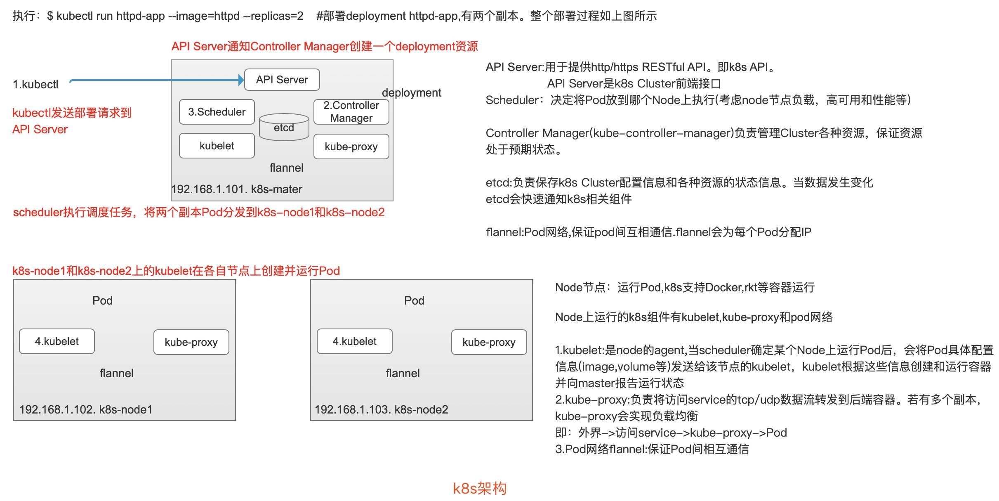

2019.5.11 开心玉凤

目标：

    1。kubernetes重要概念和架构
    
    2。学习kubernetes如何编排容器，包括：优化资源利用，高可用，滚动更新，网络插件，服务发现，监控，数据管理，日志管理等
    
教程[完成创建kubernetes集群，部署应用，访问应用，扩展应用，更新应用等](https://kubernetes.io/docs/tutorials/#basics)

博客[每天5分钟玩转k8s](https://mp.sohu.com/profile?xpt=Y2xvdWRtYW42QHNvaHUuY29t&_f=index_pagemp_2&spm=smpc.content.author.3.1557473409950ErIE9g3)

文章[每天5分钟玩转k8s](https://www.cnblogs.com/liufei1983/category/1369899.html)

-------------------------------------------------
*************************************************

目录：

第1章 先把kubernetes跑起来

第2章 重要概念

第3章 部署k8s集群-kubeadm

第4章 k8s架构

第5章 运行应用

第6章 通过service访问pod

第7章 Rolling Update

第8章 Health Check

第9章 数据管理(一个数据库例子)

第10章 Secret(处理敏感信息) & Configmap

第11章 Helm-kubernetes的包管理器

-------------------------------------------------
*************************************************

### 第1章 先把kubernetes跑起来

#### 1。启动minikube

Step1.[打开k8s教程菜单](https://kubernetes.io/docs/tutorials/kubernetes-basics/create-cluster/cluster-interactive/)

Step2.启动minikube

    $ minikube version #查看minikube版本
    
    $ kubectl get nodes #获取节点信息。此时已创建好了一个单节点的k8s集群
    
    $ kubectl cluster-info  #查看集群信息
    

#### 2。部署应用

    # 通过kubectl run部署一个应用，名为kubernetes-bootcamp | Docker镜像通过--image指定 | --port设置应用对外服务的端口
    $ kubectl run kubernetes-bootcamp \
    > --image=docker.io/jocatalin/kubernetes-bootcamp:v1 \
    > --port=8080
    
    k8s术语：
    (1).Deployment可理解为应用
    (2).Pod是容器的集合(一般会将紧密相关的一组容器放到一个pod中，同一个pod所有容器共享IP地址和Port间。即它们在一个network namespace中)
        Pod是k8s调度的最小单位，同一Pod中容器始终被一起调度
        
    $ kubectl get pods #查看当前Pod
    

#### 3。访问应用

默认情况下，所有Pod只能在集群内部访问。为能够从外部访问应用，需将容器8080端口映射到节点的端口

    #暴露应用的8080端口
    $ kubectl expose deployment/kubernetes-bootcamp \
    > --type="NodePort" \
    > --port 8080
    
    #查看应用被映射到节点的哪个端口
    $ kubectl get services
    
    #查看节点名称：minikube
    $ kubectl get nodes 
    
    #访问应用
    $ curl minikube:30753 #节点名称:暴露端口
    

#### 4。Scale应用

##### (1)增加副本

默认情况下只会运行一个副本

    #查看副本数
    $ kubectl get deployments
    NAME                  READY   UP-TO-DATE   AVAILABLE   AGE
    kubernetes-bootcamp   1/1     1            1           3m30s
    
    #副本数加到3个
    $ kubectl scale deployments/kubernetes-bootcamp --replicas=3
    
    #查看副本数
    $ kubectl get deployments
    
    #查看当前Pod增加到3个
    $ kubectl get pods
    
    #访问应用,每次执行均会将请求发送到不同Pod，3个副本轮询处理，实现了负载均衡
    $ curl minikube:30753 
    
   

##### (2)减少副本

     #将副本数减少到2个(其中一个副本会被删除)
     kubectl scale deployments/kubernetes-bootcamp --replicas=2
     
     

     #多次执行,直到仅有2个副本
     $ kubectl get pods
     NAME                                   READY   STATUS    RESTARTS   AGE
     kubernetes-bootcamp-5bf4d5689b-5hz8p   1/1     Running   0          58s
     kubernetes-bootcamp-5bf4d5689b-6sfsc   1/1     Running   0          59s
     
     #访问应用（多次执行，会将请求负载发到2个副本）
     $ curl minikube:30753  

#### 5。滚动更新

##### (1).升级镜像版本

    #升级镜像版本v1->v2
    $kubectl set image deployments/kubernetes-bootcamp kubernetes-bootcamp=jocatalin/kubernetes-bootcamp:v2 deployment.extensions/kubernetes-bootcamp image updated
    
  

##### (2).回退版本

    #回退v2->v1
    $ kubectl rollout undo deployments/kubernetes-bootcamp
    
    #观察滚动更新过程
    $ kubectl get pods
    
    #访问应用，验证版本是否已经回退到v1
    $ curl minikube:30753
    Hello Kubernetes bootcamp! | Running on: kubernetes-bootcamp-6c5cfd894b-hzfrj | v=1

-------------------------------------------------

-------------------------------------------------
*************************************************

### 第2章 重要概念

#### 1.Cluster

    Cluster是计算，存储和网络资源的集合，k8s利用这些资源运行各种基于容器的应用

#### 2.Master

    Master是Cluster的大脑，职责是调度(决定将应用放在哪里运行)。
    
    Master运行在linux操作系统，可以是物理机/虚拟机

#### 3.Node

    Node职责是运行容器应用
    
    Node由Master管理
    
    Node负责监控并汇报容器的状态，并根据Master要求管理容器的生命周期.
    
    Node运行在linux操作系统，可以是物理机/虚拟机

#### 4.Pod

    Pod是k8s最小工作单元
    
    每个Pod包含一个/多个容器
    
    Pod中的容器会作为一个整体被Master调度到一个Node上运行
    
**Pod两种使用方式：**

(1).运行单一容器(将单个容器封装成Pod)

(2).运行多个容器(相关联容器放到一个Pod中)

#### 5.Controller

**k8s不会直接创建Pod，而是通过Controller来管理Pod。**

    Controller中定义了Pod的部署特性，如：有几个副本/在什么样的Node上运行..
    
**k8s提供了多种Controller**

    (1).Deployment(常用)
    
    如：创建Deployment部署应用，Deployment可管理Pod多个副本，并确保Pod按期望状态运行
    
    (2).ReplicaSet(实现Pod多副本管理)
    
    Deployment是通过ReplicaSet来管理Pod的多个副本，通常不需要直接使用ReplicaSet
    
    (3).DaemonSet
    
    用于每个Node最多只运行一个Pod副本场景
    
    (4).StatefuleSet
    
    保证Pod的每个副本在整个生命周期中名称不变(上述滚动更新名称会改变)。保证副本按固定顺序启动，更新，删除
    
    (5).Job
    
    用于运行结束就删除的应用。（其他Controller中的Pod一般长期持续运行）
    
#### 6.Service

问题：Deployment可部署多个副本，每个Pod都有自己IP(动态，销毁/重启IP会改变),外界如何访问副本？

    k8s Service定义了外界访问一组特定Pod的方式
    
    Service有自己的IP和端口
    
    Service为Pod提供了负载均衡
    
**k8s运行容器(Pod)与访问容器(Pod)由Controller和Service执行**

#### 7.Namespace

问题：当有多个用户/项目组使用同一个k8s Cluster,则如何将他们创建的Controller和Pod等资源分开？

    Namespace
    
    Namespace可将一个物理的Cluster逻辑划分成多个虚拟Cluster,每个Cluster即为一个Namespace.不同Namespace里的资源是完合隔离的。
    
    k8s默认创建两个Namespace
    $ kubectl get namespace / $ kubectl get ns
    NAME          STATUS   AGE
    default       Active   60s
    kube-system   Active   60s
    
    
-------------------------------------------------
*************************************************

### 第3章 部署k8s集群-kubeadm

部署三台虚拟机器,构建k8s集群

    node1 192.168.56.101   ###master节点
    node2 192.168.56.102   ###node节点
    node3 192.168.56.103   ###node节点

-------------------------------------------------

-------------------------------------------------
*************************************************

### 第4章 k8s架构

  

-------------------------------------------------

-------------------------------------------------
*************************************************

### 第5章 运行应用

    k8s通过各种Controller来管理Pod的生命周期。为满足不同业务场景，k8s开发了Deployment,ReplicaSet,DaemonSet,StatefuleSet,Job等多种Controller。(kind值指定)
    
#### 1。Deployment

##### 1-1.运行Deployment

     ###创建2个副本nginx-deployment  --image指定镜像
     [root@node1 ~]# kubectl run nginx-deployment --image=nginx:1.7.9 --replicas=2
     kubectl run --generator=deployment/apps.v1 is DEPRECATED and will be removed in a future version. Use kubectl run --generator=run-pod/v1 or kubectl create instead.
     deployment.apps/nginx-deployment created
     
     ------------------------
     
     ###查看nginx-deployment的状态，输出显示两个副本正常运行
     [root@node1 ~]# kubectl get deployment nginx-deployment
     NAME               READY   UP-TO-DATE   AVAILABLE   AGE
     nginx-deployment   2/2     2            2           2m33s
     
     
     ###查看deployment详细信息
     [root@node1 ~]# kubectl describe deployment
     Name:                   nginx-deployment
     Namespace:              default
     CreationTimestamp:      Fri, 10 May 2019 01:44:16 +0000
     Labels:                 run=nginx-deployment
     Annotations:            deployment.kubernetes.io/revision: 1
     Selector:               run=nginx-deployment
     Replicas:               2 desired | 2 updated | 2 total | 2 available | 0 unavailable
     StrategyType:           RollingUpdate
     MinReadySeconds:        0
     RollingUpdateStrategy:  25% max unavailable, 25% max surge
     Pod Template:
       Labels:  run=nginx-deployment
       Containers:
        nginx-deployment:
         Image:        nginx:1.7.9
         Port:         <none>
         Host Port:    <none>
         Environment:  <none>
         Mounts:       <none>
       Volumes:        <none>
     Conditions:
       Type           Status  Reason
       ----           ------  ------
       Available      True    MinimumReplicasAvailable
       Progressing    True    NewReplicaSetAvailable
     OldReplicaSets:  <none>
     NewReplicaSet:   nginx-deployment-578fb949d8 (2/2 replicas created)
     Events: ###Events是Deployment的日志,记录了ReplicaSet启动过程,同时验证了Deployment通过ReplicaSet来管理Pod
       Type    Reason             Age    From                   Message
       ----    ------             ----   ----                   -------
       Normal  ScalingReplicaSet  3m10s  deployment-controller  Scaled up replica set nginx-deployment-578fb949d8 to 2
       
     ------------------------
     
      ###查看两个副本已就绪,Name即为上述Events中的Message(Scaled up replica set "nginx-deployment-578fb949d8" to 2)
      [root@node1 ~]# kubectl get replicaset
       NAME                          DESIRED   CURRENT   READY   AGE
       nginx-deployment-578fb949d8   2         2         2       15m
       
       
      ###查看详细信息
      [root@node1 ~]# kubectl describe replicaset
      Name:           nginx-deployment-578fb949d8
      Namespace:      default
      Selector:       pod-template-hash=578fb949d8,run=nginx-deployment
      Labels:         pod-template-hash=578fb949d8
                      run=nginx-deployment
      Annotations:    deployment.kubernetes.io/desired-replicas: 2
                      deployment.kubernetes.io/max-replicas: 3
                      deployment.kubernetes.io/revision: 1
      Controlled By:  Deployment/nginx-deployment  ###指明此ReplicaSet是由Deployment nginx-deployment创建的
      Replicas:       2 current / 2 desired   ###Deployment创建Replicas
      Pods Status:    2 Running / 0 Waiting / 0 Succeeded / 0 Failed
      Pod Template:
        Labels:  pod-template-hash=578fb949d8
                 run=nginx-deployment
        Containers:
         nginx-deployment:
          Image:        nginx:1.7.9
          Port:         <none>
          Host Port:    <none>
          Environment:  <none>
          Mounts:       <none>
        Volumes:        <none>
      Events: ###两个副本日志
        Type    Reason            Age   From                   Message
        ----    ------            ----  ----                   -------
        Normal  SuccessfulCreate  14m   replicaset-controller  Created pod: nginx-deployment-578fb949d8-4h4sg
        Normal  SuccessfulCreate  14m   replicaset-controller  Created pod: nginx-deployment-578fb949d8-6bfjf
        
      ###上述Events->Message创建两个副本,对象命名: 名称=父对象名称+随机字符串或数字
        
     ------------------------
     
     ###查看pod
     [root@node1 ~]# kubectl get pod
     NAME                                READY   STATUS    RESTARTS   AGE
     nginx-deployment-578fb949d8-4h4sg   1/1     Running   0          23m
     nginx-deployment-578fb949d8-6bfjf   1/1     Running   0          23m
     
     
     ###查看更详细信息
     [root@node1 ~]# kubectl describe pod
     Name:               nginx-deployment-578fb949d8-4h4sg
     Namespace:          default
     Priority:           0
     PriorityClassName:  <none>
     Node:               node2/192.168.1.32
     Start Time:         Fri, 10 May 2019 01:44:16 +0000
     Labels:             pod-template-hash=578fb949d8
                         run=nginx-deployment
     Annotations:        cni.projectcalico.org/podIP: 10.244.104.6/32
     Status:             Running
     IP:                 10.244.104.6
     Controlled By:      ReplicaSet/nginx-deployment-578fb949d8 ###指明此Pod是由ReplicaSet/nginx-deployment-578fb949d8创建的
     Containers:
       nginx-deployment:
         Container ID:   docker://78b084d9b37b0c7b41851d2564c3265d0ea9e4d20abad03c1587d8e71c855a66
         Image:          nginx:1.7.9
         Image ID:       docker-pullable://nginx@sha256:e3456c851a152494c3e4ff5fcc26f240206abac0c9d794affb40e0714846c451
         Port:           <none>
         Host Port:      <none>
         State:          Running
           Started:      Fri, 10 May 2019 01:46:48 +0000
         Ready:          True
         Restart Count:  0
         Environment:    <none>
         Mounts:
           /var/run/secrets/kubernetes.io/serviceaccount from default-token-gtn9w (ro)
     Conditions:
       Type              Status
       Initialized       True 
       Ready             True 
       ContainersReady   True 
       PodScheduled      True 
     Volumes:
       default-token-gtn9w:
         Type:        Secret (a volume populated by a Secret)
         SecretName:  default-token-gtn9w
         Optional:    false
     QoS Class:       BestEffort
     Node-Selectors:  <none>
     Tolerations:     node.kubernetes.io/not-ready:NoExecute for 300s
                      node.kubernetes.io/unreachable:NoExecute for 300s
     Events:
       Type     Reason          Age                From               Message
       ----     ------          ----               ----               -------
       Normal   Scheduled       24m                default-scheduler  Successfully assigned default/nginx-deployment-578fb949d8-4h4sg to node2
       Warning  Failed          23m                kubelet, node2     Failed to pull image "nginx:1.7.9": rpc error: code = Unknown desc = context canceled
       Warning  Failed          23m                kubelet, node2     Error: ErrImagePull
       Normal   SandboxChanged  23m                kubelet, node2     Pod sandbox changed, it will be killed and re-created.
       Normal   BackOff         23m (x3 over 23m)  kubelet, node2     Back-off pulling image "nginx:1.7.9"
       Warning  Failed          23m (x3 over 23m)  kubelet, node2     Error: ImagePullBackOff
       Normal   Pulling         22m (x2 over 24m)  kubelet, node2     pulling image "nginx:1.7.9"
       Normal   Pulled          22m                kubelet, node2     Successfully pulled image "nginx:1.7.9"
       Normal   Created         22m                kubelet, node2     Created container
       Normal   Started         22m                kubelet, node2     Started container
     
     
     Name:               nginx-deployment-578fb949d8-6bfjf
     Namespace:          default
     Priority:           0
     PriorityClassName:  <none>
     Node:               node3/192.168.1.33
     Start Time:         Fri, 10 May 2019 01:44:16 +0000
     Labels:             pod-template-hash=578fb949d8
                         run=nginx-deployment
     Annotations:        cni.projectcalico.org/podIP: 10.244.135.1/32
     Status:             Running
     IP:                 10.244.135.1
     Controlled By:      ReplicaSet/nginx-deployment-578fb949d8
     Containers:
       nginx-deployment:
         Container ID:   docker://cf0aa2d9467a653879a2e4f795463e454f7e9a676d018e44a539ac3e985fb46a
         Image:          nginx:1.7.9
         Image ID:       docker-pullable://nginx@sha256:e3456c851a152494c3e4ff5fcc26f240206abac0c9d794affb40e0714846c451
         Port:           <none>
         Host Port:      <none>
         State:          Running
           Started:      Fri, 10 May 2019 01:45:17 +0000
         Ready:          True
         Restart Count:  0
         Environment:    <none>
         Mounts:
           /var/run/secrets/kubernetes.io/serviceaccount from default-token-gtn9w (ro)
     Conditions:
       Type              Status
       Initialized       True 
       Ready             True 
       ContainersReady   True 
       PodScheduled      True 
     Volumes:
       default-token-gtn9w:
         Type:        Secret (a volume populated by a Secret)
         SecretName:  default-token-gtn9w
         Optional:    false
     QoS Class:       BestEffort
     Node-Selectors:  <none>
     Tolerations:     node.kubernetes.io/not-ready:NoExecute for 300s
                      node.kubernetes.io/unreachable:NoExecute for 300s
     Events: ###日志,记录Pod启动过程
       Type    Reason     Age   From               Message
       ----    ------     ----  ----               -------
       Normal  Scheduled  24m   default-scheduler  Successfully assigned default/nginx-deployment-578fb949d8-6bfjf to node3
       Normal  Pulling    24m   kubelet, node3     pulling image "nginx:1.7.9"
       Normal  Pulled     23m   kubelet, node3     Successfully pulled image "nginx:1.7.9"
       Normal  Created    23m   kubelet, node3     Created container
       Normal  Started    23m   kubelet, node3     Started container
       
      ------------------------
      
      ###上述创建nginx-deployment默认在default命名空间下
      [root@node1 nginx]# kubectl get deployments -n default
      NAME               READY   UP-TO-DATE   AVAILABLE   AGE
      nginx-deployment   2/2     2            2           44m
       
      ------------------------
      
      ###总结：
      
      A.用户通过kubectl创建Deployment
      B.Deployment创建ReplicaSet
      C.ReplicaSet创建Pod
     
      kubectl->Deployment->ReplicaSet->Pod
      

##### 1-2.命令 VS 配置文件

k8s支持两种创建资源方式：

1.kubectl命令直接创建

简单，适合临时测试和实验
  
    ###命令行中通过参数指定资源的属性
    $ kubectl run nginx-deployment --image=nginx:1.7.9 --replicas=2
    
    ###删除命令创建的deployment
    [root@node1 nginx]# kubectl delete deployment/nginx-deployment
    deployment.extensions "nginx-deployment" deleted
    
    ###查看应用
    [root@node1 nginx]# kubectl get deployment
    No resources found.

2.通过配置文件/kubectl apply创建

配置文件提供了创建资源模版，能够重复部署，方便管理，适合正式，跨环境，规模化部署

    Step1:创建nginx.yaml,资源的属性写在配置文件中，文件格式为YAML
    [root@node1 nginx]# cat nginx.yaml 
    apiVersion: extensions/v1beta1   ###当前配置格式的版本
    kind: Deployment    ###要创建的资源类型
    metadata: ###该资源的元数据
      name: nginx-deployment     ###必需的元数据项
      namespace: kube-public     ###指定命名空间，不指定会应用默认default命名空间
    spec:     ###该deployment的规格说明
      replicas: 2    ###指明副本数量，默认为1
      template:      ###定义pod的模版，此处为配置文件重要部分
        metadata:    ###定义pod的元数据，至少定义一个label
          labels:
            app: web_server ###label的key和value任意指定
        spec:        ###描述pod规格,此部分定义pod中每一个容器的属性
          containers:
          - name: nginx  ###必需
            image: nginx:1.7.9   ###必需
            
    ----------------------------------------------------------
    
    Step2:$ kubectl apply -f nginx.yaml  ###配置文件方式启动应用
    
    [root@node1 nginx]# kubectl apply -f nginx.yaml 
    deployment.extensions/nginx-deployment created
    
    [root@node1 nginx]# kubectl get deployment -n kube-public
    NAME               READY   UP-TO-DATE   AVAILABLE   AGE
    nginx-deployment   2/2     2            2           76m
    
    [root@node1 nginx]# kubectl get replicaset -n kube-public
    NAME                          DESIRED   CURRENT   READY   AGE
    nginx-deployment-65998d8886   2         2         2       76m
    
    [root@node1 nginx]# kubectl get pod -o wide -n kube-public
    NAME                                READY   STATUS    RESTARTS   AGE   IP             NODE    NOMINATED NODE   READINESS GATES
    nginx-deployment-65998d8886-hb7rk   1/1     Running   0          77m   10.244.135.2   node3   <none>           <none>
    nginx-deployment-65998d8886-zfvc8   1/1     Running   0          77m   10.244.104.7   node2   <none>           <none>

    ###以上，Deployment,ReplicaSet,Pod均已就绪
    
**kubectl apply:创建，更新资源**

    kubectl apply不但能创建k8s资源，也可对k8s资源更新
    
    k8s也提供了几个类似命令：kubectl create / kubectl replace / kubectl edit / kubectl patch  
    
    以上，尽量应用kubectl apply
    
**kubectl delete:删除资源**

    [root@node1 nginx]# kubectl delete -f nginx.yaml 
    deployment.extensions "nginx-deployment" deleted

    [root@node1 nginx]# kubectl get deployment -n kube-public
    No resources found.

##### 1-3.伸缩:在线增加/减少Pod副本数

    ### Step0.修改nginx.yaml，应用默认namespace且副本数量修改为5(2个副本时，在node2和node3上各跑一个副本)
    [root@node1 nginx]# cat nginx.yaml 
    apiVersion: extensions/v1beta1
    kind: Deployment
    metadata:
      name: nginx-deployment
    spec:
      replicas: 5
      template:
        metadata:
          labels:
            app: web_server
        spec:
          containers:
          - name: nginx
            image: nginx:1.7.9
            
    ### Step1.创建/更新资源
    [root@node1 nginx]# kubectl apply -f nginx.yaml 
    deployment.extensions/nginx-deployment created
    
    ### Step2.查看pod,增加3个副本被调度到node2和node3
    [root@node1 nginx]# kubectl get pod -o wide 
    NAME                                READY   STATUS    RESTARTS   AGE   IP              NODE    NOMINATED NODE   READINESS GATES
    nginx-deployment-65998d8886-c7r4j   1/1     Running   0          53s   10.244.135.3    node3   <none>           <none>
    nginx-deployment-65998d8886-lp45t   1/1     Running   0          53s   10.244.104.10   node2   <none>           <none>
    nginx-deployment-65998d8886-nq7k2   1/1     Running   0          53s   10.244.135.4    node3   <none>           <none>
    nginx-deployment-65998d8886-wcs9r   1/1     Running   0          53s   10.244.104.8    node2   <none>           <none>
    nginx-deployment-65998d8886-xk6wk   1/1     Running   0          53s   10.244.104.9    node2   <none>           <none>

    ### Step3.减少副本数量为3，再更新资源，查看pod
    [root@node1 nginx]# kubectl apply -f nginx.yaml 
    deployment.extensions/nginx-deployment configured

    [root@node1 nginx]# kubectl get pod -o wide
    NAME                                READY   STATUS    RESTARTS   AGE     IP              NODE    NOMINATED NODE   READINESS GATES
    nginx-deployment-65998d8886-lp45t   1/1     Running   0          5m16s   10.244.104.10   node2   <none>           <none>
    nginx-deployment-65998d8886-wcs9r   1/1     Running   0          5m16s   10.244.104.8    node2   <none>           <none>
    nginx-deployment-65998d8886-xk6wk   1/1     Running   0          5m16s   10.244.104.9    node2   <none>           <none>
    
**注：安全考虑，默认配置下k8s不会将Pod调度到Master节点，若将k8s-master也当作Node使用，则**

    #Master作为Node节点应用
    $ kubectl taint node node1 node-role.kubernetes.io/master -
    
    #恢复Master Only状态
    $ kubectl taint node node1 node-role.kubernetes.io/master="":NoSchedule
    
##### 1-4.Failover 

    ###模拟机器故障，如node2节点故障(关闭node2)
    [root@node1 nginx]# kubectl get node
    NAME    STATUS     ROLES    AGE   VERSION
    node1   Ready      master   42d   v1.13.3
    node2   NotReady   <none>   42d   v1.13.3   ###node2节点被关闭了
    node3   Ready      <none>   42d   v1.13.3
    
    ###查看pod信息,此时pod被调度到node3运行
    [root@node1 nginx]# kubectl get pod -o wide
    NAME                                READY   STATUS        RESTARTS   AGE   IP             NODE    NOMINATED NODE   READINESS GATES
    nginx-deployment-65998d8886-br7cv   1/1     Running       0          65s   10.244.135.7   node3   <none>           <none>
    nginx-deployment-65998d8886-lp45t   0/1     Terminating   0          83m   <none>         node2   <none>           <none>
    nginx-deployment-65998d8886-tdx8l   1/1     Running       0          65s   10.244.135.6   node3   <none>           <none>
    nginx-deployment-65998d8886-w6jfv   1/1     Running       0          65s   10.244.135.5   node3   <none>           <none>
    nginx-deployment-65998d8886-wcs9r   0/1     Terminating   0          83m   <none>         node2   <none>           <none>
    nginx-deployment-65998d8886-xk6wk   0/1     Terminating   0          83m   <none>         node2   <none>           <none>
    
    ###重启node2后，会删除Terminating状态的pod,不过已经运行的pod不会重新调度回node2
    [root@node1 nginx]# kubectl get pod -o wide
    NAME                                READY   STATUS    RESTARTS   AGE    IP             NODE    NOMINATED NODE   READINESS GATES
    nginx-deployment-65998d8886-br7cv   1/1     Running   0          2m7s   10.244.135.7   node3   <none>           <none>
    nginx-deployment-65998d8886-tdx8l   1/1     Running   0          2m7s   10.244.135.6   node3   <none>           <none>
    nginx-deployment-65998d8886-w6jfv   1/1     Running   0          2m7s   10.244.135.5   node3   <none>           <none>
    
    ###删除nginx-deployment
    [root@node1 nginx]# kubectl delete deployment nginx-deployment
    deployment.extensions "nginx-deployment" deleted
    
##### 1-5.用label控制pod的位置

    Scheduler会将Pod调度到所有可用的Node.
    
    但有时希望将Pod部署到指定Node,如：将大量磁盘I/O的Pod部署到配置了SSD的Node 或 Pod需要GPU,需要运行在配置了GPU的节点上
    
    以上：k8s通过label实现该功能
    
    -----------
    
    label是key-value对，各种资源均可设置label,灵活添加各种自定义属性
    
    ###标注node3是配置了SSD的节点
    [root@node1 nginx]# kubectl label node node3 disktype=ssd
    node/node3 labeled
    
    ###查看节点的label
    [root@node1 nginx]# kubectl get node --show-labels
    NAME    STATUS   ROLES    AGE   VERSION   LABELS
    node1   Ready    master   42d   v1.13.3   beta.kubernetes.io/arch=amd64,beta.kubernetes.io/os=linux,kubernetes.io/hostname=node1,node-role.kubernetes.io/master=
    node2   Ready    <none>   42d   v1.13.3   beta.kubernetes.io/arch=amd64,beta.kubernetes.io/os=linux,kubernetes.io/hostname=node2
    node3   Ready    <none>   42d   v1.13.3   beta.kubernetes.io/arch=amd64,beta.kubernetes.io/os=linux,disktype=ssd,kubernetes.io/hostname=node3  ###自定义disktype=ssd的label
    
    ###设置disktype这个自定义label，即可指定将pod部署到node3
    ###编辑nginx.yaml
    [root@node1 nginx]# cat nginx.yaml
    apiVersion: extensions/v1beta1
    kind: Deployment
    metadata:
      name: nginx-deployment
    spec:
      replicas: 3
      template:
        metadata:
          labels:
            app: web_server
        spec:
          containers:
          - name: nginx
            image: nginx:1.7.9
          nodeSelector:     ###增加，指定将此pod部署到具有label disktype=ssd的node上
            disktype: ssd
            
    ###部署deployment并查看pod运行节点(全部部署到了node3)
    [root@node1 nginx]# kubectl apply -f nginx.yaml 
    deployment.extensions/nginx-deployment created
    [root@node1 nginx]# kubectl get deployment
    NAME               READY   UP-TO-DATE   AVAILABLE   AGE
    nginx-deployment   3/3     3            3           9s

    [root@node1 nginx]# kubectl get pod -o wide
    NAME                                READY   STATUS    RESTARTS   AGE   IP              NODE    NOMINATED NODE   READINESS GATES
    nginx-deployment-7c75d8cdf6-mftr2   1/1     Running   0          19s   10.244.135.8    node3   <none>           <none>
    nginx-deployment-7c75d8cdf6-td57j   1/1     Running   0          19s   10.244.135.10   node3   <none>           <none>
    nginx-deployment-7c75d8cdf6-vbxnq   1/1     Running   0          19s   10.244.135.9    node3   <none>           <none>
    
    
    ###删除label disktype
    [root@node1 nginx]# kubectl label node node3 disktype-
    node/node3 labeled
    [root@node1 nginx]# kubectl get node --show-labels
    NAME    STATUS   ROLES    AGE   VERSION   LABELS
    node1   Ready    master   42d   v1.13.3   beta.kubernetes.io/arch=amd64,beta.kubernetes.io/os=linux,kubernetes.io/hostname=node1,node-role.kubernetes.io/master=
    node2   Ready    <none>   42d   v1.13.3   beta.kubernetes.io/arch=amd64,beta.kubernetes.io/os=linux,kubernetes.io/hostname=node2
    node3   Ready    <none>   42d   v1.13.3   beta.kubernetes.io/arch=amd64,beta.kubernetes.io/os=linux,kubernetes.io/hostname=node3  ###自定义disktype=ssd已经被删除
    [root@node1 nginx]# kubectl get pod -o wide
    NAME                                READY   STATUS    RESTARTS   AGE   IP              NODE    NOMINATED NODE   READINESS GATES
    nginx-deployment-7c75d8cdf6-mftr2   1/1     Running   0          99s   10.244.135.8    node3   <none>           <none>
    nginx-deployment-7c75d8cdf6-td57j   1/1     Running   0          99s   10.244.135.10   node3   <none>           <none>
    nginx-deployment-7c75d8cdf6-vbxnq   1/1     Running   0          99s   10.244.135.9    node3   <none>           <none>
    
    注：
    
    上述删除label disktype,pod并不会重新部署，依然在node3节点上运行
    
    除非nginx.yaml中删除nodeSelector设置，然后通过kubectl apply重新部署。k8s会删除之前的pod并调度和运行新pod
    
    ###删除nodeSelector,重新部署
    [root@node1 nginx]# kubectl apply -f nginx.yaml 
    deployment.extensions/nginx-deployment configured
    [root@node1 nginx]# kubectl get pod -o wide
    NAME                                READY   STATUS    RESTARTS   AGE   IP              NODE    NOMINATED NODE   READINESS GATES
    nginx-deployment-65998d8886-h5482   1/1     Running   0          17s   10.244.104.11   node2   <none>           <none>
    nginx-deployment-65998d8886-jz5rq   1/1     Running   0          17s   10.244.135.11   node3   <none>           <none>
    nginx-deployment-65998d8886-l9blg   1/1     Running   0          16s   10.244.104.12   node2   <none>           <none>

#### 2。DaemonSet    

    Deployment部署的副本Pod会分布在各个Node上，每个Node都可能运行好几个副本

    DaemonSet不同处在于：每个Node上最多只能运行一个副本
    
>DaemonSet典型应用场景

    (1).在集群的每个节点上运行存储Daemon,如: glusterd / ceph
    (2).在每个节点上运行日志收集Daemon,如: flunentd / logstash
    (3).在每个节点上运行监控Daemon,如: prometheus Node Exporter / collectd
    
>k8s应用DaemonSet运行系统组件

    ###若不指定namespace,则默认namespace为default
    [root@node1 nginx]# kubectl get daemonset --namespace=kube-system
    NAME          DESIRED   CURRENT   READY   UP-TO-DATE   AVAILABLE   NODE SELECTOR                 AGE
    calico-node   3         3         3       3            3           beta.kubernetes.io/os=linux   42d
    kube-proxy    3         3         3       3            3           <none>                        42d
    
    ###上述calico-node和kube-proxy分别负责在每个节点上运行calico和kube-proxy组件
    
    ### calico网络，也可以是flannel网络(常用)
    
    ### kube-proxy组件，用于将service代理映射到pod(外界访问->service->kube-proxy->pod)
    
##### 2-1。kube-flannel-ds

>部署flannel网络

    ###部署flannel网络
    [root@node1 k8s]# kubectl apply -f  https://raw.githubusercontent.com/coreos/flannel/master/Documentation/kube-flannel.yml
    podsecuritypolicy.extensions/psp.flannel.unprivileged created
    clusterrole.rbac.authorization.k8s.io/flannel created
    clusterrolebinding.rbac.authorization.k8s.io/flannel created
    serviceaccount/flannel created
    configmap/kube-flannel-cfg created
    daemonset.extensions/kube-flannel-ds-amd64 created
    daemonset.extensions/kube-flannel-ds-arm64 created
    daemonset.extensions/kube-flannel-ds-arm created
    daemonset.extensions/kube-flannel-ds-ppc64le created
    daemonset.extensions/kube-flannel-ds-s390x created
    
    ###查看k8s应用DaemonSet运行的系统组件
    [root@node1 k8s]# kubectl get daemonset --namespace=kube-system
    NAME                      DESIRED   CURRENT   READY   UP-TO-DATE   AVAILABLE   NODE SELECTOR                     AGE
    calico-node               3         3         3       3            3           beta.kubernetes.io/os=linux       42d
    kube-flannel-ds-amd64     3         3         3       3            3           beta.kubernetes.io/arch=amd64     4m26s
    kube-flannel-ds-arm       0         0         0       0            0           beta.kubernetes.io/arch=arm       4m26s
    kube-flannel-ds-arm64     0         0         0       0            0           beta.kubernetes.io/arch=arm64     4m26s
    kube-flannel-ds-ppc64le   0         0         0       0            0           beta.kubernetes.io/arch=ppc64le   4m26s
    kube-flannel-ds-s390x     0         0         0       0            0           beta.kubernetes.io/arch=s390x     4m26s
    kube-proxy                3         3         3       3            3           <none>                            42d
    
    ###以上：flannel的DaemonSet即定义在kube-flannel.yaml中
    $ wget https://raw.githubusercontent.com/coreos/flannel/master/Documentation/kube-flannel.yml
    
[kube-flannel.yaml](resources/kube-flannel.yml)

    ###截取一小部分说明。DaemonSet的语法结构同Deployment。如：
    ---
    apiVersion: extensions/v1beta1
    kind: DaemonSet  ###指定kind为DaemonSet
    metadata:
      name: kube-flannel-ds-amd64
      namespace: kube-system
      labels:
        tier: node
        app: flannel
    spec:
      template:
        metadata:
          labels:
            tier: node
            app: flannel
        spec:
          hostNetwork: true  ###指定hostNetwork,表指定Pod直接使用的是Node网络，相当于docker run --network=host
          nodeSelector:
            beta.kubernetes.io/arch: amd64
          tolerations:
          - operator: Exists
            effect: NoSchedule
          serviceAccountName: flannel
          initContainers:
          - name: install-cni
            image: quay.io/coreos/flannel:v0.11.0-amd64
            command:
            - cp
            args:
            - -f
            - /etc/kube-flannel/cni-conf.json
            - /etc/cni/net.d/10-flannel.conflist
            volumeMounts:
            - name: cni
              mountPath: /etc/cni/net.d
            - name: flannel-cfg
              mountPath: /etc/kube-flannel/
          containers:    ###定义了运行flannel服务的容器
          - name: kube-flannel
            image: quay.io/coreos/flannel:v0.11.0-amd64
    
##### 2-2。kube-proxy

    ###由于无法拿到kube-proxy的YAML文件，只能运行下述命令查看配置：
    $ kubectl edit daemonset kube-proxy --namespace=kube-system

[kube-proxy.yaml](resources/kube-proxy.yaml)

##### 2-3。运行自己的DaemonSet

 >以Prometheus Node Exporter为例演示用户如何运行自己的DaemonSet
 
    Prometheus是流行的系统监控方案
    
    Node Exporter是Prometheus的agent,以Daemon的形式运行在每个被监控节点上
    
    ###方式一：直接在Docker中运行Node Exporter容器
    [root@node1 k8s]# docker run -d \
    > -v "/proc:/host/proc" \
    > -v "/sys:/host/sys" \
    > -v "/:/rootfs" \
    > --net=host \
    > prom/node-exporter \
    > --path.procfs /host/proc \
    > --path.sysfs /host/sys \
    > --collector.filesystem.ignored-mount-points "^/(sys|proc|dev|host|etc)($|/)"
    
    ###方式二：转换为DaemonSet的YAML配置文件node_exporter.yml
    
[node_exporter.yaml](resources/node_exporter.yml)   

    ###部署应用
    [root@node1 k8s]# kubectl apply -f node_exporter.yml 
    daemonset.extensions/node-exporter-daemonset created
    
    ###查看Pod信息,node2和node3上分别运行了1个pod
    [root@node1 k8s]# kubectl get pod -o wide | grep node-exporter
    node-exporter-daemonset-2xhzq       1/1     Running   0          3m45s   192.168.1.33    node3   <none>           <none>
    node-exporter-daemonset-h299s       1/1     Running   0          3m45s   192.168.1.32    node2   <none>           <none>

#### 3。Job

容器按运行时间分为两类：

>服务类容器:持续提供服务，需一直运行(如:Http Server/Daemon等)

    k8s的Deployment,ReplicaSet,DaemonSet都用于管理服务类容器

>工作类容器:一次性任务(如：批处理程序，完成后容器就退出)

    Job管理工作类容器
    
创建简是单的Job配置文件[myjob.yml](resources/myjob.yml)

    [root@node1 k8s]# cat myjob.yml 
    apiVersion: batch/v1  #当前Job的apiVersion
    kind: Job #指明当前资源的类型为Job
    metadata:
      name: myjob
    spec:
      template:
        metadata:
          name: myjob
        spec:
          containers:
          - name: hello
            image: busybox
            command: ["echo","hello k8s Job!"]
          restartPolicy: Never #指定什么情况需重启容器，对于Job只能设置Never/OnFailure.对于其他Controller(如Deployment),可设置为Always

    ###启动Job
    [root@node1 k8s]# kubectl apply -f myjob.yml 
    job.batch/myjob created
    
    ###查看Job状态(按预期启动了一个Pod，并已成功执行)
    [root@node1 k8s]# kubectl get job
    NAME    COMPLETIONS   DURATION   AGE
    myjob   1/1           14s        6m20s
    
    ###查看Pod状态
    [root@node1 k8s]# kubectl get pod
    NAME                                READY   STATUS      RESTARTS   AGE
    myjob-k7sfw                         0/1     Completed   0          7m27s
    
    ###查看Pod的标准输出
    [root@node1 k8s]# kubectl logs myjob-k7sfw
    hello k8s Job!
    
##### 3-1.Pod失败情况

>验证1：myjob.yml/restartPolicy为Never

    ###删除job
    [root@node1 k8s]# kubectl delete -f myjob.yml 
    job.batch "myjob" deleted
   
    ###模拟创建Pod失败，修改myjob.yml中
    command: ["invalide command","hello k8s Job!"]  ##使其异常
    
    ###运行新的Job并查看状态
    [root@node1 k8s]# kubectl get job
    NAME    COMPLETIONS   DURATION   AGE
    myjob   0/1           13s        13s
    
    ###此时，COMPLETIONS的Pod数量为0，查看Pod状态,状态均不正常
    [root@node1 k8s]# kubectl get pod -o wide
    NAME                                READY   STATUS               RESTARTS   AGE    IP              NODE    NOMINATED NODE   READINESS GATES
    myjob-g877f                         0/1     ContainerCreating    0          13s    <none>          node3   <none>           <none>
    myjob-gxk4v                         0/1     ContainerCannotRun   0          29s    10.244.135.13   node3   <none>           <none>

    ###查看某个pod的启动日志
    $ kubectl describe pod myjob-gxk4v
    
kubectl get pod -o wide会查询多个失败Pod?

    当第一个Pod启动时，容器失败退出。
    
    根据restartPolicy: Never，此时失败容器不会被重启。但Job DESIRED的Pod是1.当前COMPLETIONS为0不满足。所以Job Controller会启动新的Pod，直到COMPLETIONS为1
    
若设置restartPolicy: OnFailure?

    [root@node1 k8s]# kubectl apply -f myjob.yml 
    job.batch/myjob created
    
    [root@node1 k8s]# kubectl get job
    NAME    COMPLETIONS   DURATION   AGE
    myjob   0/1           4s         4s      ###COMPLETIONS数量为0
    
    [root@node1 k8s]# kubectl get pod 
    NAME                                READY   STATUS              RESTARTS   AGE
    myjob-ltnrm                         0/1     RunContainerError   2          75s  ##此时RESTARTS数量为2
    
    ###上述说明：OnFailure配置生效，容器失败后会重启，重启次数为2
    
    ###删除job
    [root@node1 k8s]# kubectl delete -f myjob.yml 
    job.batch "myjob" deleted

##### 3-2.Job的并行性

>希望同时运行多个Pod，提高Job的执行效率 

    [root@node1 k8s]# cat myjob.yml 
    apiVersion: batch/v1
    kind: Job
    metadata:
      name: myjob
    spec:
      completions: 2  #每次并行执行2个pod,直到总数有2个(可任意设置)pod成功完成.默认1
      parallelism: 2  #每次并行执行2个Pod,默认1
      template:
        metadata:
          name: myjob
        spec:
          containers:
          - name: hello
            image: busybox
            command: ["echo","hello k8s Job!"]
          restartPolicy: OnFailure

    ###查看job
    [root@node1 k8s]# kubectl get job
    NAME    COMPLETIONS   DURATION   AGE
    myjob   2/2           16s        17s
    
    ###查看pod,AGE一样，说明是并行执行
    [root@node1 k8s]# kubectl get pod
    NAME                                READY   STATUS      RESTARTS   AGE
    myjob-t8sfj                         0/1     Completed   0          21s
    myjob-zlfq2                         0/1     Completed   0          21s
    
    ###需要并行处理场景：批处理程序，每个副本(Pod)都会从任务池中读取任务并执行，副本越多，执行时间越短，效率越高(均可用job执行)

##### 3-3.定时Job
    
>linux中有cron程序定时执行任务，k8s的CronJob提供了类似功能，可定时执行Job

    #定时Job
    [root@node1 k8s]# cat mycronjob.yml 
    apiVersion: batch/v2alpha1  #batch/v2alpha1当前CronJob的apiVersion
    kind: CronJob #指明当前资源类型为CronJob
    metadata:
      name: hello
    spec:
      schedule: "*/1 * * * *" #指定什么时候运行Job,格式与linux cron一致,每分钟启动一次
      jobTemplate: #定义job的模版
        spec:
          template:
            spec:
              containers:
              - name: hello
                image: busybox
                command: ["echo","hello k8s CronJob!"]
              restartPolicy: OnFailure
    
    
    ###创建CronJob
    [root@node1 k8s]# kubectl apply -f mycronjob.yml 
    error: unable to recognize "mycronjob.yml": no matches for kind "CronJob" in version "batch/v2alpha1"
    
    ###此时报错：因为k8s默认没有enable CronJob功能，需在kube-apiserver中加入这个功能
    [root@node1 k8s]# vim /etc/kubernetes/manifests/kube-apiserver.yaml 
    - kube-apiserver
    - --runtime-config=batch/v2alpha1=true #add此行
    
    ###重启kubelet服务,此时kubelet会重启kube-apiservice Pod
    [root@node1 k8s]# systemctl restart kubelet.service
    
    ###通过kubectl api-versions确认kube-apiserver现已支持batch/v2alpha1
    [root@node1 k8s]# kubectl api-versions
    admissionregistration.k8s.io/v1beta1
    apiextensions.k8s.io/v1beta1
    apiregistration.k8s.io/v1
    apiregistration.k8s.io/v1beta1
    apps/v1
    apps/v1beta1
    apps/v1beta2
    authentication.k8s.io/v1
    authentication.k8s.io/v1beta1
    authorization.k8s.io/v1
    authorization.k8s.io/v1beta1
    autoscaling/v1
    autoscaling/v2beta1
    autoscaling/v2beta2
    batch/v1
    batch/v1beta1
    batch/v2alpha1   ###支持
    certificates.k8s.io/v1beta1
    coordination.k8s.io/v1beta1
    crd.projectcalico.org/v1
    events.k8s.io/v1beta1
    extensions/v1beta1
    networking.k8s.io/v1
    policy/v1beta1
    rbac.authorization.k8s.io/v1
    rbac.authorization.k8s.io/v1beta1
    scheduling.k8s.io/v1beta1
    storage.k8s.io/v1
    storage.k8s.io/v1beta1
    v1
    
    ###再次创建CronJob
    [root@node1 k8s]# kubectl apply -f mycronjob.yml 
    cronjob.batch/hello created
    
    ###查看cronjob状态
    [root@node1 k8s]# kubectl get cronjob
    NAME    SCHEDULE      SUSPEND   ACTIVE   LAST SCHEDULE   AGE
    hello   */1 * * * *   False     0        <none>          12s
    
    ###查看job执行情况,每分钟会启动一个Job
    [root@node1 k8s]# kubectl get jobs
    NAME               COMPLETIONS   DURATION   AGE
    hello-1557481620   1/1           10s        2m28s
    hello-1557481680   1/1           10s        88s
    hello-1557481740   1/1           10s        28s
    
    ###查看pod
    [root@node1 k8s]# kubectl get pod
    NAME                                READY   STATUS              RESTARTS   AGE
    hello-1557481740-268mk              0/1     Completed           0          3m4s
    hello-1557481800-g9drk              0/1     Completed           0          2m4s
    
    ###查看pod运行日志
    [root@node1 k8s]# kubectl logs hello-1557481800-g9drk
    hello k8s CronJob!
    
    ###删除cronjob
    [root@node1 k8s]# kubectl delete -f mycronjob.yml 
    cronjob.batch "hello" deleted
    
    
-------------------------------------------------
*************************************************

### 第6章 通过service访问pod

>每个pod均有自己的IP地址，当动态创建和销毁Pod时，IP会改变，如何保证客户端访问并找到对应服务--k8s Service

#### 1.创建Service

    k8s从逻辑上代表了一组Pod,具体是哪些Pod，则是由label来挑选
    
    service有自己IP,且该IP不变
    
    客户端只需访问Service的IP,k8s负责建立和维护Service与Pod的映射关系

>Step1:创建Deployment

    [root@node1 k8s]# cat httpd.yml 
    apiVersion: apps/v1beta1
    kind: Deployment
    metadata:
      name: httpd
    spec:
      replicas: 3
      template:
        metadata:
          labels:
            run: httpd ###指定label,下述创建service会指定挑选该label的pod作为service的后端
        spec:
          containers:
          - name: httpd
            image: httpd
            ports:
            - containerPort: 80
            
    [root@node1 k8s]# kubectl apply -f httpd.yml 
    deployment.apps/httpd created
    
    httpd-8c6c4bd9b-v8hq7   0/1     ContainerCreating   0          2m13s   <none>          node3   <none>           <none>
    [root@node1 nginx]# kubectl get pod -o wide
    NAME                    READY   STATUS    RESTARTS   AGE     IP              NODE    NOMINATED NODE   READINESS GATES
    httpd-8c6c4bd9b-49x55   1/1     Running   0          2m23s   10.244.135.51   node3   <none>           <none>
    httpd-8c6c4bd9b-qztdj   1/1     Running   0          2m23s   10.244.104.15   node2   <none>           <none>
    httpd-8c6c4bd9b-v8hq7   1/1     Running   0          2m23s   10.244.135.52   node3   <none>           <none>
    
    ###Pod分配了各自的I，这些IP只能被k8s cluster中的容器和节点访问
    [root@node1 nginx]# curl 10.244.135.51
    <html><body><h1>It works!</h1></body></html>

>Step2:创建Service

    ###创建service的配置文件
    [root@node1 k8s]# cat httpd-service.yml 
    apiVersion: v1     ###v1是Service的apiVersion
    kind: Service      ###指明当前资源类型为Service
    metadata: 
      name: httpd-svc  ###service名字
    spec:
      selector:        ###指明挑选label为run:httpd的Pod作为Service的后端
        run: httpd
      ports:           ###将Service的8080端口映射到Pod的80端口,使用TCP协议
      - protocol: TCP
        port: 8080       
        targetPort: 80
        
    ###创建service
    [root@node1 k8s]# kubectl apply -f httpd-service.yml 
    service/httpd-svc created
    
    ###查询service
    [root@node1 k8s]# kubectl get service
    NAME         TYPE        CLUSTER-IP    EXTERNAL-IP   PORT(S)    AGE
    httpd-svc    ClusterIP   10.1.82.198   <none>        8080/TCP   6s
    kubernetes   ClusterIP   10.1.0.1      <none>        443/TCP    42d
    
    ###httpd-svc分配到一个cluster-ip 10.1.82.198,通过该ip访问后端httpd pod
    [root@node1 k8s]# curl 10.1.82.198:8080
    <html><body><h1>It works!</h1></body></html>
    
    ###除自行创建的httpd-svc,还有一个service(kubernetes).cluster内部通过这个Service访问k8s API Server
    
    ###查看httpd-svc与pod对应关系
    [root@node1 k8s]# kubectl describe service httpd-svc
    Name:              httpd-svc
    Namespace:         default
    Labels:            <none>
    Annotations:       kubectl.kubernetes.io/last-applied-configuration:
                         {"apiVersion":"v1","kind":"Service","metadata":{"annotations":{},"name":"httpd-svc","namespace":"default"},"spec":{"ports":[{"port":8080,"...
    Selector:          run=httpd
    Type:              ClusterIP
    IP:                10.1.82.198
    Port:              <unset>  8080/TCP
    TargetPort:        80/TCP
    Endpoints:         10.244.104.15:80,10.244.135.51:80,10.244.135.52:80  ###列出了三个Pod的IP和端口
    Session Affinity:  None
    Events:            <none>
    
  **Pod的IP是在容器中配置的**
    
  **Service的cluster ip配置在哪里？cluster-ip是如何映射到pod ip? --iptables**
  
#### 2.Cluster IP底层实现

>Cluster IP是一个虚拟IP，是由K8s节点上的iptables规则管理的。

    ###先查询service和pod，方便与下述说明对应理解
    ###新创建的service(httpd-svc),关注：Cluster-ip值
    [root@node1 k8s]# kubectl get service
    NAME         TYPE        CLUSTER-IP    EXTERNAL-IP   PORT(S)    AGE
    httpd-svc    ClusterIP   10.1.82.198   <none>        8080/TCP   72m  
    kubernetes   ClusterIP   10.1.0.1      <none>        443/TCP    42d
    
    ###新创建的httpd-pod，关注IP值
    [root@node1 k8s]# kubectl get pod -o wide
    NAME                    READY   STATUS    RESTARTS   AGE   IP              NODE    NOMINATED NODE   READINESS GATES
    httpd-8c6c4bd9b-49x55   1/1     Running   0          82m   10.244.135.51   node3   <none>           <none>
    httpd-8c6c4bd9b-qztdj   1/1     Running   0          82m   10.244.104.15   node2   <none>           <none>
    httpd-8c6c4bd9b-v8hq7   1/1     Running   0          82m   10.244.135.52   node3   <none>           <none>

    --------------------------------------------
    
    ###打印当前节点的iptables规则
    [root@node1 k8s]# iptables-save > iptables-rules.txt
    
    ###截取与httpd-svc Cluter IP相关信息
    -A KUBE-SERVICES ! -s 10.244.0.0/16 -d 10.1.82.198/32 -p tcp -m comment --comment "default/httpd-svc: cluster IP" -m tcp --dport 8080 -j KUBE-MARK-MASQ
    -A KUBE-SERVICES -d 10.1.82.198/32 -p tcp -m comment --comment "default/httpd-svc: cluster IP" -m tcp --dport 8080 -j KUBE-SVC-RL3JAE4GN7VOGDGP

    上述两条规则含义:
    (1).如果cluster内的Pod(源地址来自10.244.0.0/16)要访问httpd-svc,则允许
    (2).其他源地址访问httpd-svc,跳转到规则KUBE-SVC-RL3JAE4GN7VOGDGP
    
    
    ###KUBE-SVC-RL3JAE4GN7VOGDGP规则如下所示：
    -A KUBE-SVC-RL3JAE4GN7VOGDGP -m statistic --mode random --probability 0.33332999982 -j KUBE-SEP-Y5YLOO6DS3UF7LBB
    -A KUBE-SVC-RL3JAE4GN7VOGDGP -m statistic --mode random --probability 0.50000000000 -j KUBE-SEP-DTMMTXPGHKXJGUTZ
    -A KUBE-SVC-RL3JAE4GN7VOGDGP -j KUBE-SEP-FQRCOM4I5Y4H2JWZ
    
    ###上述三个跳转规则说明：
    (1).1/3的概率跳转到规则 KUBE-SEP-Y5YLOO6DS3UF7LBB
    (2).1/3的概率(剩下2/3的一半)跳转到规则KUBE-SEP-DTMMTXPGHKXJGUTZ
    (3).1/3的概率跳转到规则KUBE-SEP-FQRCOM4I5Y4H2JWZ
        
    ###上述三个跳转规则如下所示
    -A KUBE-SEP-Y5YLOO6DS3UF7LBB -s 10.244.104.15/32 -j KUBE-MARK-MASQ
    -A KUBE-SEP-Y5YLOO6DS3UF7LBB -p tcp -m tcp -j DNAT --to-destination 10.244.104.15:80
    -A KUBE-SEP-DTMMTXPGHKXJGUTZ -s 10.244.135.51/32 -j KUBE-MARK-MASQ
    -A KUBE-SEP-DTMMTXPGHKXJGUTZ -p tcp -m tcp -j DNAT --to-destination 10.244.135.51:80
    -A KUBE-SEP-FQRCOM4I5Y4H2JWZ -s 10.244.135.52/32 -j KUBE-MARK-MASQ
    -A KUBE-SEP-FQRCOM4I5Y4H2JWZ -p tcp -m tcp -j DNAT --to-destination 10.244.135.52:80
    
    ###上述即将请求分别转发到后端的三个pod(由$ kubectl get pod -o wide 可以查看到每个pod对应IP )
    
    总结：iptables将访问service的流量转发到后端pod,而且使用类似轮询的负载均衡策略
    
    另：Cluster的每一个节点都配置了相同的iptables规则，这样就确保了整个cluster都能够通过Service的clusterIP访问Service
    
**主要说明：service的ClusterIp如何与Pod的IP建立联系(iptables)**
    
#### 3.DNS访问Service

>在cluster中，除了可以通过ClusterIp访问Service,k8s还提供了更为方便的DNS访问

> kubeadm部署时会默认安装kube-dns组件

    [root@node1 k8s]# kubectl get deployment --namespace=kube-system
    NAME                      READY   UP-TO-DATE   AVAILABLE   AGE
    calico-kube-controllers   1/1     1            1           42d
    coredns                   2/2     2            2           42d
    
    coredns是一个DNS服务器。每当有新的Service被创建，kube-dns会添加该Service的DNS记录。
    
    Cluster中的Pod可以通过<SERVICE_NAME><NAMESPACE_NAME>访问service
    
    ###在一个临时busybox pod中验证DNS有效性
    [root@node1 ~]# kubectl run busybox --rm -ti --image=busybox /bin/sh
    kubectl run --generator=deployment/apps.v1 is DEPRECATED and will be removed in a future version. Use kubectl run --generator=run-pod/v1 or kubectl create instead.
    If you don't see a command prompt, try pressing enter.
    / # wget httpd-svc.default:8080
    Connecting to httpd-svc.default:8080 (10.1.82.198:8080)
    index.html           100% |*******************************************************************************************************|    45  0:00:00 ETA
    / # wget httpd-svc:8080   ###未连接成功(因defautl为默认ns，可省略)
    / # nslookup httd-svc     ###查看httpd-svc的DNS信息,后续未连接成功,正常能够看到DNS服务器,如httpd-svc.default.svc.cluster.local，它是httpd-svc的完整域名
    Server:		10.1.0.10
    Address:	10.1.0.10:53
    
 >示例：在kube-public的namespace中部署Service httpd2-svc
 
     ###YAML文件注意书写，否则yaml转json会有问题
     [root@node1 k8s]# cat httpd2-svc.yml 
     apiVersion: apps/v1beta1
     kind: Deployment  ##指定资源为Deployment
     metadata:
       name: httpd2
       namespace: kube-public  ##指定命名空间
     spec:
       replicas: 3
       template:
         metadata:
           labels:   ##指定labels，service根据labels决定哪一组pod绑定为一个service
             run: httpd2
         spec:
           containers:
           - name: httpd2
             image: httpd
             ports:
             - containerPort: 80
     
     ---   ##多个资源定义在一个yaml中，可用该分割符分割
     apiVersion: v1
     kind: Service  ##指定资源类型为Service
     metadata:
       name: httpd2-svc
       namespace: kube-public
     spec:
       selector:    ##指定label，将标识有该label标签绑定到同一个service
         run: httpd2
       ports:
       - protocol: TCP
         port: 8080
         targetPort: 80
         
      
      ###创建资源
      [root@node1 k8s]# kubectl apply -f httpd2-svc.yml 
      deployment.apps/httpd2 created
      service/httpd2-svc created
      
      ###查看kube-public命名空间下的service
      [root@node1 k8s]# kubectl get service --namespace=kube-public
      NAME         TYPE        CLUSTER-IP     EXTERNAL-IP   PORT(S)    AGE
      httpd2-svc   ClusterIP   10.1.178.235   <none>        8080/TCP   28s
      
      ###在busybox pod中访问httpd2-svc
      [root@node1 k8s]# kubectl run busybox --rm -ti --image=busybox /bin/sh
      kubectl run --generator=deployment/apps.v1 is DEPRECATED and will be removed in a future version. Use kubectl run --generator=run-pod/v1 or kubectl create instead.
      If you don't see a command prompt, try pressing enter.
      / # wget httpd2-svc.kube-public:8080   ##访问[服务名][命名空间][端口]
      Connecting to httpd2-svc.kube-public:8080 (10.1.178.235:8080)
      index.html           100% |*******************************************************************************************************|    45  0:00:00 ETA
      / # exit

#### 4.外网如何访问Service

    除了Cluster内部可访问Service，希望应用的Service能够暴露给Cluster外部。
    
>k8s提供了多种类型Service,默认ClusterIP

(1).ClusterIP(默认)

    Service通过Cluster内部的IP对外提供服务，只有Cluster内的节点和Pod可访问。上述Service都是ClusterIP.

(2).NodePort

    Service通过Cluster节点的静态端口对外提供服务。
    
    Cluster外部可通过<NodeIP>:<NodePort>访问Service  ###NodeIp本机节点IP
    
    示例：
    [root@node1 k8s]# cat httpd-service.yml 
    apiVersion: v1
    kind: Service
    metadata: 
      name: httpd-svc
    spec:
      type: NodePort  ##增加
      selector:
        run: httpd
      ports:
      - protocol: TCP
        port: 8080
        targetPort: 80
     
    ###查询未添加type: NodePort前的service
    [root@node1 k8s]# kubectl get service
    NAME         TYPE        CLUSTER-IP    EXTERNAL-IP   PORT(S)    AGE
    httpd-svc    ClusterIP   10.1.82.198   <none>        8080/TCP   17h
    kubernetes   ClusterIP   10.1.0.1      <none>        443/TCP    43d
    
    ###重新创建Service资源
    [root@node1 k8s]# kubectl apply -f httpd-service.yml 
    service/httpd-svc configured
    ###查询service
    [root@node1 k8s]# kubectl get service
    NAME         TYPE        CLUSTER-IP    EXTERNAL-IP   PORT(S)          AGE
    httpd-svc    NodePort    10.1.82.198   <none>        8080:31775/TCP   17h
    kubernetes   ClusterIP   10.1.0.1      <none>        443/TCP          43d
    
    ###上述说明
    (1)EXTERNAL-IP若为<nodes>表示可通过Cluster每个节点自身的IP访问Service
    (2)PORT(S)为8080:31775。其中8080是监听的端口，31775是节点上监听的端口(k8s会从30000~32767中分配一个可用的端口).每个节点均会监听此端口，并将请求转发给Service
    
    $ yum install net-tools
    ###查看监听的31775端口
    [root@node1 k8s]# netstat -lnp|grep 31775
    tcp6       0      0 :::31775                :::*                    LISTEN      8361/kube-proxy  
    
    ###测试NodePort是否正常工作[主机IP][端口]
    [root@node1 k8s]# curl 192.168.1.32:31775   
    <html><body><h1>It works!</h1></body></html>
    
    ###任意节点均可以成功访问
    [root@node2 ~]# curl 192.168.1.32:31775
    <html><body><h1>It works!</h1></body></html>
    
 >k8s是如何将<NodeIP>:<NodePort>映射到Pod?
 
    同ClusterIp，借助iptables
    
    ###查看iptables规则
    [root@node2 ~]# iptables-save > iptables-rules1.txt
    [root@node2 ~]# vim iptables-rules1.txt  ### 输入/httpd-svc查询
    
    与ClusterIP相比，每个节点的iptables中均增加了下述两条规则
    -A KUBE-NODEPORTS -p tcp -m comment --comment "default/httpd-svc:" -m tcp --dport 31775 -j KUBE-MARK-MASQ
    -A KUBE-NODEPORTS -p tcp -m comment --comment "default/httpd-svc:" -m tcp --dport 31775 -j KUBE-SVC-RL3JAE4GN7VOGDGP
    
    规则含义为：访问当前节点21775端口的请求会应用规则KUBE-SVC-RL3JAE4GN7VOGDGP
    
    KUBE-SVC-RL3JAE4GN7VOGDGP规则
    -A KUBE-SVC-RL3JAE4GN7VOGDGP -m statistic --mode random --probability 0.33332999982 -j KUBE-SEP-67JJISW5PAMK6276
    -A KUBE-SVC-RL3JAE4GN7VOGDGP -m statistic --mode random --probability 0.50000000000 -j KUBE-SEP-UASYEDCNCKK6XFPM
    -A KUBE-SVC-RL3JAE4GN7VOGDGP -j KUBE-SEP-DUUX3NU476QIDE2Z
    
    其作用就是负载均衡到每一个pod
    
>NodePort是默认随机选择，可用nodePort指定某个特定端口

    [root@node1 k8s]# cat httpd-service.yml 
    apiVersion: v1
    kind: Service
    metadata: 
      name: httpd-svc
    spec:
      type: NodePort
      selector:
        run: httpd
      ports:
      - protocol: TCP
        nodePort: 30000 ##nodePort指定特定端口(节点上监听的端口)
        port: 8080      ##port是ClusterIP上监听的端口
        targetPort: 80  ##targetPort是Pod监听的端口
        
    ###重新部署资源
    [root@node1 k8s]# kubectl apply -f httpd-service.yml 
    service/httpd-svc configured
    
    ###查看service,发现httpd-svc的节点端口已是指定的30000
    [root@node1 k8s]# kubectl get service
    NAME         TYPE        CLUSTER-IP    EXTERNAL-IP   PORT(S)          AGE
    httpd-svc    NodePort    10.1.82.198   <none>        8080:30000/TCP   18h
    kubernetes   ClusterIP   10.1.0.1      <none>        443/TCP          43d
    
    ###查看某个特定service
    [root@node1 k8s]# kubectl get service httpd-svc
    NAME        TYPE       CLUSTER-IP    EXTERNAL-IP   PORT(S)          AGE
    httpd-svc   NodePort   10.1.82.198   <none>        8080:30000/TCP   18h

(3).LoadBalancer

    Service利用cloud provider特有的load balancer对外提供服务
    
    cloud provider负责将load balancer的流量导向Service.
    
    目前支持的cloud provider有GCP,AWS,Azur等
    
    
-------------------------------------------------
*************************************************

### 第7章 Rolling Update

    滚动更新是一次只更新一小部分副本，成功后再更新更多的副本。最终完成所有副本的更新。
    
    滚动更新最大好处是零停机，整个更新过程始终有副本在运行，从而保证了业务的持续性。
    
#### 1.实践

>目标：将初始镜像httpd:2.2.31更新到httpd:2.2.32
    
    ###Step1,编写httpd.yml
    [root@node1 k8s]# cat httpd.yml 
    apiVersion: apps/v1beta1
    kind: Deployment
    metadata:
      name: httpd
    spec:
      replicas: 3
      template:
        metadata:
          labels:
            run: httpd
        spec:
          containers:
          - name: httpd
            image: httpd:2.2.31   #httpd镜像
            ports:
            - containerPort: 80

    ###Step2,部署
    [root@node1 k8s]# kubectl get deployment httpd -o wide
    NAME    READY   UP-TO-DATE   AVAILABLE   AGE     CONTAINERS   IMAGES         SELECTOR
    httpd   3/3     3            3           2m49s   httpd        httpd:2.2.31   run=httpd
    
    ###Step3,查看Deployment,3个副本均已部署完成
    [root@node1 k8s]# kubectl get replicaset -o wide
    NAME               DESIRED   CURRENT   READY   AGE     CONTAINERS   IMAGES         SELECTOR
    httpd-76cfb94bf4   3         3         3       2m56s   httpd        httpd:2.2.31   pod-template-hash=76cfb94bf4,run=httpd
    
    ###Step3,查看pod，三个副本pod均已启动
    [root@node1 k8s]# kubectl get pod -o wide
    NAME                     READY   STATUS    RESTARTS   AGE    IP              NODE    NOMINATED NODE   READINESS GATES
    httpd-76cfb94bf4-qw4c6   1/1     Running   0          3m6s   10.244.135.57   node3   <none>           <none>
    httpd-76cfb94bf4-w48pp   1/1     Running   0          3m6s   10.244.104.24   node2   <none>           <none>
    httpd-76cfb94bf4-wgxp2   1/1     Running   0          3m6s   10.244.104.23   node2   <none>           <none>
    
    上述部署过程如下：
    (1).创建Deployment httpd
    (2).创建replicaset httpd-76cfb94bf4
    (3).创建三个pod
    (4).当前镜像为httpd:2.2.31
    
    ###修改配置文件，将镜像由httpd:2.2.31修改为httpd:2.2.32
    [root@node1 k8s]# kubectl apply -f httpd.yml 
    deployment.apps/httpd configured
    
    ###查看deployment,发现版本已经更新
    [root@node1 k8s]# kubectl get deployment httpd -o wide
    NAME    READY   UP-TO-DATE   AVAILABLE   AGE   CONTAINERS   IMAGES         SELECTOR
    httpd   3/3     3            3           13m   httpd        httpd:2.2.32   run=httpd
    
    ###此时查看replicaset，可见httpd-76cfb94bf4已被httpd-6cf6bf9f57替代
    [root@node1 k8s]# kubectl get replicaset -o wide
    NAME               DESIRED   CURRENT   READY   AGE    CONTAINERS   IMAGES         SELECTOR
    httpd-6cf6bf9f57   3         3         3       3m7s   httpd        httpd:2.2.32   pod-template-hash=6cf6bf9f57,run=httpd
    httpd-76cfb94bf4   0         0         0       10m    httpd        httpd:2.2.31   pod-template-hash=76cfb94bf4,run=httpd
    
    ###查看pod,发现httpd-6cf6bf9f57管理了三个新的pod,先前httpd-76cfb94bf4里已经没有任何pod
    [root@node1 k8s]# kubectl get pod -o wide
    NAME                     READY   STATUS    RESTARTS   AGE     IP              NODE    NOMINATED NODE   READINESS GATES
    httpd-6cf6bf9f57-9vgn5   1/1     Running   0          3m10s   10.244.135.58   node3   <none>           <none>
    httpd-6cf6bf9f57-ctmqw   1/1     Running   0          13s     10.244.135.59   node3   <none>           <none>
    httpd-6cf6bf9f57-glppv   1/1     Running   0          97s     10.244.104.25   node2   <none>           <none>
    
    
    ###查看具体部署过程
    [root@node1 k8s]# kubectl describe deployment httpd
    Name:                   httpd
    Namespace:              default
    CreationTimestamp:      Sat, 11 May 2019 04:52:47 +0000
    Labels:                 run=httpd
    Annotations:            deployment.kubernetes.io/revision: 2
                            kubectl.kubernetes.io/last-applied-configuration:
                              {"apiVersion":"apps/v1beta1","kind":"Deployment","metadata":{"annotations":{},"name":"httpd","namespace":"default"},"spec":{"replicas":3,"...
    Selector:               run=httpd
    Replicas:               3 desired | 3 updated | 3 total | 3 available | 0 unavailable
    StrategyType:           RollingUpdate
    MinReadySeconds:        0
    RollingUpdateStrategy:  25% max unavailable, 25% max surge
    Pod Template:
      Labels:  run=httpd
      Containers:
       httpd:
        Image:        httpd:2.2.32
        Port:         80/TCP
        Host Port:    0/TCP
        Environment:  <none>
        Mounts:       <none>
      Volumes:        <none>
    Conditions:
      Type           Status  Reason
      ----           ------  ------
      Available      True    MinimumReplicasAvailable
      Progressing    True    NewReplicaSetAvailable
    OldReplicaSets:  <none>
    NewReplicaSet:   httpd-6cf6bf9f57 (3/3 replicas created)
    Events:
      Type    Reason             Age    From                   Message
      ----    ------             ----   ----                   -------
      Normal  ScalingReplicaSet  13m    deployment-controller  Scaled up replica set httpd-76cfb94bf4 to 3 
      Normal  ScalingReplicaSet  6m38s  deployment-controller  Scaled up replica set httpd-6cf6bf9f57 to 1    ##新replica增加一个pod总数为1
      Normal  ScalingReplicaSet  5m5s   deployment-controller  Scaled down replica set httpd-76cfb94bf4 to 2  ##旧replica减小一个pod总数为2
      Normal  ScalingReplicaSet  5m5s   deployment-controller  Scaled up replica set httpd-6cf6bf9f57 to 2    ##新replica增加一个pod总数为2
      Normal  ScalingReplicaSet  3m41s  deployment-controller  Scaled down replica set httpd-76cfb94bf4 to 1  ##旧replica减小一个pod总数为1
      Normal  ScalingReplicaSet  3m41s  deployment-controller  Scaled up replica set httpd-6cf6bf9f57 to 3    ##新replica增加一个pod总数为3
      Normal  ScalingReplicaSet  3m40s  deployment-controller  Scaled down replica set httpd-76cfb94bf4 to 0  ##旧replica减小一个pod总数为0
      
    **上述：每次只更新替换一个Pod**
    
    另：每次替换的pod数量是可以定制的，k8s提供了两个参数maxSurge和maxUnavailable来精细控制pod的替换数量
    
#### 2.回滚

    kubectl apply每次更新应用时，k8s均会记录下当前的配置，保存为一个revision(版次).这样可以回滚到某个特定的revision.
    
    默认配置下，k8s只会保留最近的几个revision,可在Deployment配置文件中通过revisionHistoryLimit属性增加revision数量
    
>实践回滚功能。应用三个配置文件：

>httpd.v1.yml(httpd:2.4.16),httpd.v2.yml(httpd:2.4.17),httpd.v3.yml(httpd:2.4.18)

    [root@node1 k8s]# cat httpd.v1.yml
    apiVersion: apps/v1beta1
    kind: Deployment
    metadata:
      name: httpd
    spec:
      replicas: 3
      template:
        metadata:
          labels:
            run: httpd
        spec:
          containers:
          - name: httpd
            image: httpd:2.4.16  #v2和v3修改此处镜像版本号即可
            ports:
            - containerPort: 80
            
    ###部署: --record作用：将当前命令记录到revision记录中，即知道每个revison对应哪个配置文件(方便定位)
    [root@node1 k8s]# kubectl apply -f httpd.v1.yml --record
    deployment.apps/httpd created
    
    ###查看Deployment部署完成
    [root@node1 k8s]# kubectl get deployment httpd -o wide
    NAME    READY   UP-TO-DATE   AVAILABLE   AGE     CONTAINERS   IMAGES         SELECTOR
    httpd   3/3     3            3           3m35s   httpd        httpd:2.4.16   run=httpd
    
    ###更新v1->v2
    [root@node1 k8s]# kubectl apply -f httpd.v2.yml --record
    deployment.apps/httpd configured
    [root@node1 k8s]# kubectl get deployment httpd -o wide
    NAME    READY   UP-TO-DATE   AVAILABLE   AGE     CONTAINERS   IMAGES         SELECTOR
    httpd   3/3     1            3           5m11s   httpd        httpd:2.4.17   run=httpd
    
    ###更新v2->v3
    root@node1 k8s]# kubectl apply -f httpd.v3.yml --record
    deployment.apps/httpd configured
    [root@node1 k8s]# kubectl get deployment httpd -o wide
    NAME    READY   UP-TO-DATE   AVAILABLE   AGE     CONTAINERS   IMAGES         SELECTOR
    httpd   3/3     1            3           6m10s   httpd        httpd:2.4.18   run=httpd
    
    ###查看revision的历史记录
    [root@node1 k8s]# kubectl rollout history deployment httpd
    deployment.extensions/httpd 
    REVISION  CHANGE-CAUSE  ##CHANGE-CAUSE即为--record的结果
    1         kubectl apply --filename=httpd.v1.yml --record=true
    2         kubectl apply --filename=httpd.v2.yml --record=true
    3         kubectl apply --filename=httpd.v3.yml --record=true
    
    
    ###执行回滚,v3->v1
    [root@node1 k8s]# kubectl rollout undo deployment httpd --to-revision=1
    deployment.extensions/httpd rolled back
    
    ###查看Deployment已经恢复到v1版本(2.4.16)
    [root@node1 k8s]# kubectl get deployment httpd -o wide
    NAME    READY   UP-TO-DATE   AVAILABLE   AGE     CONTAINERS   IMAGES         SELECTOR
    httpd   3/3     3            3           8m20s   httpd        httpd:2.4.16   run=httpd
    
>滚动更新：采用渐进的方式逐步替换旧版本，若更新不如预期，可回滚操作到更新前状态
    
    
-------------------------------------------------
*************************************************

### 第8章 Health Check

    强大的自愈能力是k8s这类容器编排引擎的一个重要特性。
    
    自愈默认实现方式是自动重启发生故障的容器。
    
    除此之外，用户可得用Liveness和Readiness探测机制设置更精细的健康检查，进而实现如下需求：
    (1).零停机部署
    (2).避免部署无效的镜像
    (3).更加安全的回滚升级
    
#### 1.默认的健康检查

>k8s默认健康检查机制

    每个容器启动时都会执行一个进程，此进程由Dockerfile的CMD或ENTRYPOINT指定。
    
    若进程退出时返回码非零，则认为容器发生故障，k8s会根据restartPolicy重启容器.
    
>模拟容器发生故障

    [root@node1 k8s]# cat healthcheck.yml 
    apiVersion: v1
    kind: Pod   ##资源类型为Pod
    metadata:
      labels:
        test: healthcheck
      name: healthcheck
    spec:
      restartPolicy: OnFailure  ##失败后重启容器
      containers:
      - name: healthcheck
        image: busybox
        args:
        - /bin/sh
        - -c
        - sleep 10; exit 1
    [root@node1 k8s]# kubectl apply -f healthcheck.yml 
    pod/healthcheck created
    
    [root@node1 k8s]# kubectl get pod healthcheck
    NAME          READY   STATUS    RESTARTS   AGE
    healthcheck   1/1     Running   1          34s
    [root@node1 k8s]# kubectl get pod healthcheck
    NAME          READY   STATUS             RESTARTS   AGE
    healthcheck   0/1     CrashLoopBackOff   1          56s
    
    ###当前容器已经重启2次了
    [root@node1 k8s]# kubectl get pod healthcheck
    NAME          READY   STATUS    RESTARTS   AGE
    healthcheck   1/1     Running   2          62s
    
    上述：容器进程返回值非0，k8s则认为容器发生故障，需要重启。
    
    有很多情况发生了故障，但进程并不会退出。如访问web服务器时显示500，可能是系统超载，也可能是资源死锁。此时httpd进程并没有异常退出。
    在此种情况下，重启容器可能是最直接，最有效的解决方案。
    
    如何利用health check机制来处理这类场景--Liveness探测
    
    ###删除pod
    [root@node1 k8s]# kubectl delete pod healthcheck
    pod "healthcheck" deleted

#### 2.Liveness探测

>Liveness探测可让用户自定义判断容器是否健康的条件，若探测失败，k8s会重启容器

    ###Step1,编写liveness.yml文件
    [root@node1 k8s]# cat liveness.yml 
    apiVersion: v1
    kind: Pod
    metadata:
      labels:
        test: liveness
      name: liveness
    spec:
      restartPolicy: OnFailure  ##重启容器
      containers:
      - name: liveness
        image: busybox
        args:
        - /bin/sh
        - -c
        - touch /tmp/healthy; sleep 30; rm -rf /tmp/healthy; sleep 600
        livenessProbe:
          exec:
            command:
            - cat    ##探测方法通过cat命令检查/tmp/healthy文件是否存在，若命令执行成功返加0,k8s认为本次liveness探测成功，非0即liveness探测失败，
            - /tmp/healthy
          initialDelaySeconds: 10  ##10指定容器启动10s之后开始执行liveness探测(需大于应用启动时间)
          periodSeconds: 5 ##指定每5s执行一次liveness探测,k8s若连续执行3次liveness均失败，则会杀掉并重启容器
          
    说明：上述模拟：启动进程首先先创建/tmp.healthy,30s后删除，若文件存在，则容器处于正常状态，否则发生故障
    
    [root@node1 k8s]# kubectl apply -f liveness.yml 
    pod/liveness created
    
    
    [root@node1 k8s]# kubectl get pod liveness
    NAME       READY   STATUS    RESTARTS   AGE
    liveness   1/1     Running   1          102s
    
    [root@node1 k8s]# kubectl describe pod liveness
    Name:               liveness
    Namespace:          default
    Priority:           0
    PriorityClassName:  <none>
    Node:               node3/192.168.1.33
    Start Time:         Sat, 11 May 2019 06:00:11 +0000
    Labels:             test=liveness
    Annotations:        cni.projectcalico.org/podIP: 10.244.135.2/32
                        kubectl.kubernetes.io/last-applied-configuration:
                          {"apiVersion":"v1","kind":"Pod","metadata":{"annotations":{},"labels":{"test":"liveness"},"name":"liveness","namespace":"default"},"spec":...
    Status:             Running
    IP:                 10.244.135.2
    Containers:
      liveness:
        Container ID:  docker://84645e0ef024ca0bc873397ae73833441e1f0672c150b016ed91f324a24b267b
        Image:         busybox
        Image ID:      docker-pullable://busybox@sha256:260d47cd183d41ccd7e80f8e4b3ada9a249a395f96d6f9895f9e274c6f856d3b
        Port:          <none>
        Host Port:     <none>
        Args:
          /bin/sh
          -c
          touch /tmp/healthy; sleep 30; rm -rf /tmp/healthy; sleep 600
        State:          Running
          Started:      Sat, 11 May 2019 06:01:41 +0000
        Last State:     Terminated
          Reason:       Error
          Exit Code:    137
          Started:      Sat, 11 May 2019 06:00:20 +0000
          Finished:     Sat, 11 May 2019 06:01:32 +0000
        Ready:          True
        Restart Count:  1
        Liveness:       exec [cat /tmp/healthy] delay=10s timeout=1s period=5s #success=1 #failure=3
        Environment:    <none>
        Mounts:
          /var/run/secrets/kubernetes.io/serviceaccount from default-token-gtn9w (ro)
    Conditions:
      Type              Status
      Initialized       True 
      Ready             True 
      ContainersReady   True 
      PodScheduled      True 
    Volumes:
      default-token-gtn9w:
        Type:        Secret (a volume populated by a Secret)
        SecretName:  default-token-gtn9w
        Optional:    false
    QoS Class:       BestEffort
    Node-Selectors:  <none>
    Tolerations:     node.kubernetes.io/not-ready:NoExecute for 300s
                     node.kubernetes.io/unreachable:NoExecute for 300s
    Events:
      Type     Reason     Age                 From               Message
      ----     ------     ----                ----               -------
      Normal   Scheduled  106s                default-scheduler  Successfully assigned default/liveness to node3
      Warning  Unhealthy  56s (x3 over 66s)   kubelet, node3     Liveness probe failed: cat: can't open '/tmp/healthy': No such file or directory
      Normal   Pulling    26s (x2 over 106s)  kubelet, node3     pulling image "busybox"
      Normal   Killing    26s                 kubelet, node3     Killing container with id docker://liveness:Container failed liveness probe.. Container will be killed and recreated.
      Normal   Pulled     17s (x2 over 98s)   kubelet, node3     Successfully pulled image "busybox"
      Normal   Created    17s (x2 over 98s)   kubelet, node3     Created container
      Normal   Started    17s (x2 over 98s)   kubelet, node3     Started container

    ###删除pod
    [root@node1 k8s]# kubectl delete pod liveness
    pod "liveness" deleted

#### 3.Readliness探测

    除了Liveness探测，k8s健康检查机制还包括：Readliness探测
    
    liveness探测机制可告诉k8s什么时候通过重启容器治愈
    
    readliness探测告诉k8s什么时候可以将容器加入到Service的负载均衡池中,对外提供服务
    
>实战

    [root@node1 k8s]# cat readiness.yml 
    apiVersion: v1
    kind: Pod
    metadata:
      labels:
        test: readiness
      name: readiness
    spec:
      restartPolicy: OnFailure
      containers:
      - name: readiness
        image: busybox
        args:
        - /bin/sh
        - -c
        - touch /tmp/healthy; sleep 30; rm -rf /tmp/healthy; sleep 600
        readinessProbe:
          exec:
            command:
            - cat
            - /tmp/healthy
          initialDelaySeconds: 10  ##10指定容器启动10s之后开始执行readiness探测(需大于应用启动时间)
          periodSeconds: 5   ##指定每5s执行一次readiness探测
          
    [root@node1 k8s]# kubectl apply -f readiness.yml 
    pod/readiness created
    
    [root@node1 k8s]# kubectl get pod readiness
    NAME        READY   STATUS    RESTARTS   AGE
    readiness   0/1     Running   0          13s
    [root@node1 k8s]# kubectl get pod readiness
    NAME        READY   STATUS    RESTARTS   AGE
    readiness   1/1     Running   0          24s
    [root@node1 k8s]# kubectl get pod readiness
    NAME        READY   STATUS    RESTARTS   AGE
    readiness   0/1     Running   0          57s
    
    上述Pod readiness的READY状态经历如下变化：
    (1)。刚被创建时，READY状态为不可用
    (2)。15s后(initialDelaySeconds+periodSeconds)，第一次进行Readiness探测并成功返回，设置READY为可用
    (3)。30s后，/tmp/healthy被删除，连续3次readiness探测失败后READY不可用
    
    
    #$##查看Readiness探测失败日志
    [root@node1 k8s]# kubectl describe pod readiness
    
>liveness和Readiness探测比较

    (1)liveness和readiness探测是两种健康检查机制，若不特意配置，k8s将对两种探测采取相同的默认行为。即通过判断容器启动进程的返回值是否为0判断探测是否成功
    
    (2)两种探测的配置方法完全一样，支持的配置参数也一样。
       不同之处在于探测失败后的行为：
       A.liveness探测是重启容器
       B.Readiness探测则是将容器设置为不可用，不接收service转发的请求
       
    (3)liveness和readiness探测是独立执行的，两者没有依赖。即可单独使用，也可同时使用。
       A.用liveness探测判断容器是否需要重启以实现自愈
       B.用readiness探测判断容器是否已准备好对外提供服务
    
#### 4.Health Check在Scale up中的应用

    当执行Scale up操作时，新副本会作为backend被添加到service的负载均衡中，与已有副本一起处理客户请求。
    
    应用readiness探测可判断容器是否就绪，避免将请求发送到还未准备好的backend
    
>实战

    [root@node1 k8s]# cat scaleup-readiness.yml 
    apiVersion: apps/v1beta1
    kind: Deployment
    metadata:
      name: web
    spec:
      replicas: 3
      template:
        metadata:
          labels: 
            run: web
        spec:
          containers:
          - name: web
            image: myhttpd
            ports:
            - containerPort: 8080
            readinessProbe:
              httpGet:  ##不同于exec,应用httpGet探测方法，k8s对该方法探测成功判断条件是http请求的返回代码在200-400间
                scheme: HTTP  ##scheme指定协议，支持http/https
                path: /health  ##path指定访问路径
                port: 8080     ##指定端口
              initialDelaySeconds: 10  ##容器启动10s后开始探测,若http://[container_ip]:8080/health返回代码不是200-400，则容器未就绪，不接收service web-svc请求
              periodSeconds: 5  ##每隔5s探测一次,代码返回200-400表容器就绪，可加入到web-svc负载均衡。开始处理客户请求。(若连续发生3次失败，容器会从负载均衡中移除，直到探测成功重新加入)
    
    ---
    apiVersion: v1
    kind: Service
    metadata:
      name: web-svc
    spec:
      selector:
        run: web
      ports:
      - protocol: TCP
        port: 8080
        targetPort: 80
        
    [root@node1 k8s]# kubectl apply -f scaleup-readiness.yml 
    deployment.apps/web created
    service/web-svc created
    
    ###对于http://[container_ip]:8080/health，应用则可实现自己的判断逻辑
    
    

#### 5.Health Check在滚动更新中的应用

    在Rolling Update时，若没有Health Check,则产生问题
    
    新副本有问题，但未异常退出，默认Health Check机制认为容器已准备就绪，进而逐步替换现有副本。
    
    当所有旧副本被替换后，整个应用将无法处理请求，无法对外提供服务。
    
    若正确配置了Heath Check，则新副本只有通过readiness探测才会被添加到Service.如果没有探测，现有副本不会被全部替换。业务依然正常运行
    
>实例：Health check在Rolling update中的应用

    [root@node1 k8s]# cat app.v1.yml 
    apiVersion: apps/v1beta1
    kind: Deployment
    metadata:
      name: app
    spec:
      replicas: 10
      template:
        metadata:
          labels:
            run: app
        spec:
          containers:
          - name: app
            image: busybox
            args:
            - /bin/sh
            - -c
            - sleep 10; touch /tmp/healthy; sleep 30000
            readinessProbe:
              exec:
                command:
                - cat
                - /tmp/healthy
              initialDelaySeconds: 10
              periodSeconds: 5
    [root@node1 k8s]# kubectl apply -f app.v1.yml --record
    deployment.apps/app created
    
    [root@node1 k8s]# kubectl get deployment app
    NAME   READY   UP-TO-DATE   AVAILABLE   AGE
    app    10/10   10           10          90s
    [root@node1 k8s]# kubectl get pod
    NAME                   READY   STATUS    RESTARTS   AGE
    app-56878b4676-5qlf9   1/1     Running   0          94s
    app-56878b4676-5vwg5   1/1     Running   0          94s
    app-56878b4676-7xcnf   1/1     Running   0          94s
    app-56878b4676-h57mr   1/1     Running   0          94s
    app-56878b4676-njgrt   1/1     Running   0          94s
    app-56878b4676-prfvp   1/1     Running   0          94s
    app-56878b4676-rsch5   1/1     Running   0          94s
    app-56878b4676-s2bkk   1/1     Running   0          94s
    app-56878b4676-sxbk2   1/1     Running   0          94s
    app-56878b4676-tlqkz   1/1     Running   0          94s
    
    
    ###滚动更新，创建app.v2.yml
    $ cp app.v1.yml app.v2.yml
    [root@node1 k8s]# cat app.v2.yml 
    apiVersion: apps/v1beta1
    kind: Deployment
    metadata:
      name: app
    spec:
      replicas: 10
      template:
        metadata:
          labels:
            run: app
        spec:
          containers:
          - name: app
            image: busybox
            args:
            - /bin/sh
            - -c
            - sleep 3000   ###修改此处
            readinessProbe:
              exec:
                command:
                - cat
                - /tmp/healthy
              initialDelaySeconds: 10
              periodSeconds: 5
              
      [root@node1 k8s]# kubectl apply -f app.v2.yml --record
      deployment.apps/app configured
      
      [root@node1 k8s]# kubectl get deployment app
      NAME   READY   UP-TO-DATE   AVAILABLE   AGE
      app    8/10    5            8           3m15s
      [root@node1 k8s]# kubectl get pod
      NAME                   READY   STATUS    RESTARTS   AGE
      app-56878b4676-5qlf9   1/1     Running   0          5m51s   ###旧副本从最初10个减少到8个
      app-56878b4676-5vwg5   1/1     Running   0          5m51s
      app-56878b4676-7xcnf   1/1     Running   0          5m51s
      app-56878b4676-h57mr   1/1     Running   0          5m51s
      app-56878b4676-njgrt   1/1     Running   0          5m51s
      app-56878b4676-prfvp   1/1     Running   0          5m51s
      app-56878b4676-sxbk2   1/1     Running   0          5m51s
      app-56878b4676-tlqkz   1/1     Running   0          5m51s
      app-74cd448d85-7zfp2   0/1     Running   0          3m5s     ###最后5个是新副本，处于NOT READY状态
      app-74cd448d85-cscpt   0/1     Running   0          3m5s
      app-74cd448d85-rxwrb   0/1     Running   0          3m5s
      app-74cd448d85-xx4cl   0/1     Running   0          3m5s
      app-74cd448d85-zrc28   0/1     Running   0          3m5s
      
      ###查看deployment部署日志
      [root@node1 k8s]# kubectl describe deployment app
      
      上述：新副本始终无法通过readiness探测，Health check屏蔽了有缺陷的副本，同时保留了大部分旧副本。业务没有因更新失败受影响
      
      
      ###回滚，查看历史版本
      [root@node1 k8s]# kubectl rollout history deployment app
      deployment.extensions/app 
      REVISION  CHANGE-CAUSE
      1         kubectl apply --filename=app.v1.yml --record=true
      2         kubectl apply --filename=app.v2.yml --record=true
      
      ###恢复到1版本
      [root@node1 k8s]# kubectl rollout undo deployment app --to-revision=1
      deployment.extensions/app rolled back

      [root@node1 k8s]# kubectl get deployment app
      NAME   READY   UP-TO-DATE   AVAILABLE   AGE
      app    10/10   10           10          24m
      
  >为什么新创建的副本数是5个，同时只销毁了2个旧副本?
  
    因为滚动更新参数maxSurge和maxUnavailable来控制副本替换的数量
    
  **maxSurge**
  
    此参数控制滚动更新过程中副本总数超过DESIRED的上限。
    
    maxSurege可以是具体的整数(如：3)，也可以是百分比，向上取整。maxSurge默认值为25%
    
    上述：DESIRED值为10,副本最大值roundUp(10+10*25%)=13,因此上述是8+5=13
    
    maxSurge值越大初始创建的新副本数量就越多
  
  **maxUnavailable**

    此参数控制滚动更新过程中，不可用的副本占DESIRED的最大比例
    
    maxUnavailable可以是具体的整数(如：3)，也可以是百分比，向下取整。maxUnavailable默认值为25%
    
    上述：DESIRED值为10，则可用副本数至少(10-10*25%)=8,因此AVAILABLE值为8
    
    maxUnavailable值越大，初始销毁旧副本数量就越多
    
  >定制maxSurge和maxUnavailable
  
    [root@node1 k8s]# cat app.v1.yml 
    apiVersion: apps/v1beta1
    kind: Deployment
    metadata:
      name: app
    spec:
      strategy:  ##定制maxSurge和maxUnavailable
        rollingUpdate:
          maxSurge: 35%       ##最大创建副本数，可以为数字，也可以为百分比
          maxUnavailable: 35%  ##不可用副本数占DESIRED的最大比例
      replicas: 10
      template:
        metadata:
          labels:
            run: app
        spec:
          containers:
          - name: app
            image: busybox
            args:
            - /bin/sh
            - -c
            - sleep 10; touch /tmp/healthy; sleep 30000
            readinessProbe:
              exec:
                command:
                - cat
                - /tmp/healthy
              initialDelaySeconds: 10
              periodSeconds: 5
  
  
-------------------------------------------------
*************************************************

### 第9章 数据管理

>本章主要讨论k8s如何管理存储资源

>学习目标

    A.Volume：k8s如何通过volume为集群中的容器提供存储
    
    B.实践常用volume类型及应用场景
    
    C.k8s如何通过Persistent Volume和Persistent Volume Claim分离集群管理员与集群用户职责
    
    D.实践Volume的静态供给和动态供给
    
#### 1.Volume--k8s存储模型

>目标：如何将各种持久化存储映射到容器

>问题

    容器和pod是短暂(生命周期短)的，会被频繁创建和销毁。容器销毁时，保存在容器内部文件系统中的数据都会被清除。
    
>上述为持久化存储容器的数据，可使用k8s volume

    Volume的生命周期独立于容器，Pod中的容器可能被销毁和重建，但Volume会被保留。
    
>本质上k8s Volume是一个目录，同Docker Volume

    Volume被mount到Pod,Pod中所有容器都可以访问这个Volume
    
>k8s Volume支持多种backend类型,完整列表参看[官方文档](https://kubernetes.io/docs/concepts/storage/volumes/)

    emptyDir,hostPath,GCE Persistent Disk,AWS Elastic Block Store,NFS,Ceph等
    
>Volume提供了对各种backend抽象

    容器在使用Volume读写数据时，不需关心数据存放在本地节点/云硬盘，对容器来说，所有类型Volume都只是一个目录
    
##### 1-1.emptyDir --最基础的Volume类型

>emptyDir Volume对容器来说是持久的，对于Pod则不是

    当Pod从节点删除，则Volume的内容也会被删除
    
    emptyDir Volume的生命周期与Pod一致
    
    emptyDir适合Pod中的容器需要临时共享存储空间的场景。如生产者，消费者用例
    
>实战

    ###Step1
    [root@node1 k8s]# cat emptyDir.yml 
    apiVersion: v1
    kind: Pod   ##创建pod资源
    metadata:
      name: producer-consumer
    spec:
      containers:
      - image: busybox
        name: producer
        volumeMounts:
        - mountPath: /producer_dir  ##2.producer容器将shared-volume mount到/producer_dir目录
          name: shared-volume
        args:
        - /bin/sh   ##3.通过echo将数据写入到文件hello里
        - -c
        - echo "hello k8s volume" > /producer_dir/hello; sleep 30000
      - image: busybox
        name: consumer
        volumeMounts:
        - mountPath: /consumer_dir ##4.consumer容器将shared-volume mount到/consumer_dir目录
          name: shared-volume
        args:
        - /bin/sh  ##5.通过cat从文件hello读数据
        - -c
        - cat /consumer_dir/hello; sleep 30000
      volumes:   
      - name: shared-volume
        emptyDir: {}   ##1.定义一个emptyDir类型的Volume shared-volume

    ###Step2.
    [root@node1 k8s]# kubectl apply -f emptyDir.yml 
    pod/producer-consumer created
    
    ###Step3.
    [root@node1 k8s]# kubectl get pod
    NAME                READY   STATUS    RESTARTS   AGE
    producer-consumer   2/2     Running   0          23m
    
    ###Step4.通过logs查看，显示consumer成功读到producer写入的数据,验证两个容器共享emptyDir Volume
    [root@node1 k8s]# kubectl logs producer-consumer consumer
    hello k8s volume
    
    
    说明：emptyDir是Docker Host文件系统里的目录。效果相当于执行：
    (1).docker run -v /producer_dir
    (2).docker run -v /consumer_dir
    
    
    ###进入pod，查看容器
    [root@node1 k8s]# kubectl --namespace=default exec -it producer-consumer --container producer -- sh
    / # ls
    bin           etc           proc          root          tmp           var
    dev           home          producer_dir  sys           usr
    
    [root@node1 k8s]# kubectl --namespace=default exec -it producer-consumer --container consumer -- sh
    / # ls
    bin           dev           home          root          tmp           var
    consumer_dir  etc           proc          sys           usr
    / # exit
    
##### 1-2. hostPath--持久性优于emptyDir

>hostPath作用：将Docker Host文件系统中已经存在的目录mount给pod容器。

    大部分应用不会使用hsotPath Volume,因为实际增加了Pod与节点的耦,限制了pod的使用
    
    需要访问k8s或docker内部数据(配置文件或二进制库)等应用则需要使用Hostpath
    
    如kube-apiserver和kube-controller-manager应用，查看kube-apiserver pod的配置:
    (1).$ kubectl get pod --namespace=kube-system
    (2).$kubectl edit --namespace=kube-system pod kube-apiserver-node1  ###查看kube-apiserver pod的配置
    ###截取部分
        volumeMounts: 
        - mountPath: /etc/ssl/certs  #对应host目录
          name: ca-certs   ##hostpath
          readOnly: true
        - mountPath: /etc/pki
          name: etc-pki
          readOnly: true
        - mountPath: /etc/kubernetes/pki
          name: k8s-certs
          readOnly: true
      dnsPolicy: ClusterFirst
      enableServiceLinks: true
      hostNetwork: true
      nodeName: node1
      priority: 2000000000
      priorityClassName: system-cluster-critical
      restartPolicy: Always
      schedulerName: default-scheduler
      securityContext: {}
      terminationGracePeriodSeconds: 30
      tolerations:
      - effect: NoExecute
        operator: Exists
      volumes:
      - hostPath:
          path: /etc/ssl/certs
          type: DirectoryOrCreate
        name: ca-certs
      - hostPath:
          path: /etc/pki
          type: DirectoryOrCreate
        name: etc-pki
      - hostPath:
          path: /etc/kubernetes/pki
          type: DirectoryOrCreate
        name: k8s-certs
        
>Pod销毁，hostPath对应的目录还会被保留，hostPath持久性优于emptyDir，但Host崩溃，则hostPath也就无法访问

##### 1-3. 外部storage provider --真正持久性Volume

    k8s若部署在AWS,GCE,AZURE等公有云上，则可直接使用云硬盘作为Volume
    
>实践:AWS Elastic Block Store

    ###Step1.
    [root@node1 k8s]# cat aws.yml
    apiVersion: v1
    kind: Pod
    metadata:
      name: using-ebs
    spec:
      containers:
      - image: busybox
        name: using-ebs
        volumeMounts:
        - mountPath: /test-ebs
          name: ebs-volume
      volumes:
      - name: ebs-volume
      #this AWS EBS volume must already exist
        awsElasticBlockStore:
          volumeID: <volume-id>
          fsType: ext4
          
    说明：要在pod中使用ESB Volume，必须先在AWS中创建，然后通过volume-id引用
    
> k8s volume也可使用注流分布式存储，如Ceph,GlusterFS等

    ###Ceph例子
    [root@node1 k8s]# cat ceph.yml 
    apiVersion: v1
    kind: Pod
    metadata:
      name: using-ceph
    spec:
      containers:
        - image: busybox
          name: using-ceph
          volumeMounts:
          - name: ceph-volume
            mountPath: /test-ceph
      volumes:
        - name: ceph-volume
          cephfs:
            path: /some/path/in/side/cephfs  ##1.ceph文件系统的该目录被mount到容器路径/test-ceph
            monitors: "10.16.154.78:6789"
            secretFile: "/etc/ceph/admin.secret"
    
    说明：
    
    相对于emptyDir和hostPath，这些Volume最大特点不依赖k8s
    
    Volume的底层基础设施由独立的存储系统管理，与k8s集群是分离的。
    
    数据被持久化后，即使整个k8s崩溃也不会受损
    
#### 2.PersistentVolume(PV) & PersistentVolumeClaim(PVC)

参考:[k8s持久化存储PV & UV](https://www.cnblogs.com/benjamin77/p/9944268.html)

>Volume提供了好的数据持久化方案，但管理性上还有不足
    
    如前AWS EBS例：要使用Volume,Pod必须先知道
    A.当前Volume来自AWS EBS
    B.EBS Volume已提前创建且知道确切volume-id
    
    pod通常由应用开发人员维护，Volume则由存储系统管理员维护。（产生问题-耦合）(解决方案-k8s PV和PVC )
    
 
>PersistentVolume(PV):是外部存储系统中的一块存储空间(由管理员创建/维护)
 
    与Volume一样，PV具有持久性，生命周期独立于Pod.
    
>PersistentVolumeClaim(PVC):是对PV的申请(Claim)(通常由普通用户创建和维护)
 
    需要为Pod分配存储资源时，用户可创建一个PVC,指明存储资源的容量大小和访问模式(如只读)等信息。k8s会查找并提供满足条件的PV
    
>说明

    有了PVC,用户只需告诉k8s需要什么样的存储资源，而不必关心真正的空间从哪分配，如何访问等底层细节信息。
    
    这些storage provider底层信息交由管理员处理
    
>k8s支持多类型的PersistentVolume(PV),[参见官方文档](https://kubernetes.io/docs/concepts/storage/persistent-volumes/)

    AWS EBS,Ceph,NFS
    
##### 2-1.NFS PersistentVolume

>Step1.node1(master)节点搭建NFS服务器

参见[NFS服务器](NFS服务器.md)

    ###1。安装nfs
    $ yum -y install nfs-utils rpcbind
    
    ###2。在NFS服务端上创建共享目录/export/nfs并设置权限
    $ mkdir -p /nfsdata
    $ chmod 666 /nfsdata
    
    ###3。编辑export文件
    $ vim /etc/exports
    
    ###add contents,将/nfsdata这个目录共享给192.168.1.*这些客户机
    [root@node1 ~]# cat /etc/exports
    /nfsdata 192.168.1.0/24(rw,no_root_squash,no_all_squash,sync)
    或
    /nfsdata *(rw,no_root_squash,no_all_squash,sync)   ##*代表所有机器
    
    ###4。配置生效
    $ exportfs -r
    
    ###5。启动rpcbind、nfs服务
    $ service rpcbind start
    $ service nfs start
    
    ###6。查看 RPC 服务的注册状况
    $ rpcinfo -p localhost  //不加localhost默认为本机
    
    ###7。server 端先自我测试一下是否可以联机
    $ showmount -e localhost //不加localhost默认为本机
    [root@node1 ~]# showmount -e
    Export list for node1:
    /nfsdata 192.168.1.0/24    ##代表允许192.168.1.*的所有客户机挂载到目录/export/nfs目录下
    
    或 
    [root@node1 nfsdata]# showmount -e
    Export list for node1:
    /nfsdata *  #用*允许所有主机
    
>Step2.创建一个PV mypv1,配置文件nfs-pv1.yml(准备PV资源)

    ###1.
    [root@node1 k8s]# cat nfs-pv1.yml 
    apiVersion: v1
    kind: PersistentVolume  ##资源类型为持久化存储
    metadata:
      name: mypv1
    spec:
      capacity: ##1.指定PV的容器为1GB
        storage: 1Gi
      accessModes: ##2.指定访问模式为ReadWriteOnce(支持三种访问模式:ReadWriteOnce/ReadOnlyMany/ReadWriteMany)
        - ReadWriteOnce
      persistentVolumeReclaimPolicy: Recycle  ##3.指定当PV的回收策略为Recycle,支持三种回收策略(Recycle/Retain/Delete)
      storageClassName: nfs  ##4.指定PV的class为nfs。相当于为PV设置了一个分类，PVC可以指定class申请相应的class的PV
      nfs:
        path: /nfsdata/pv1  ##5.指定PV在NFS服务器上对应的目录(注意：事先需要先在/nfsdata目录下创建目录pv1)
        server: 192.168.1.31
        
    ###2.创建mypv1
    [root@node1 k8s]# kubectl apply -f nfs-pv1.yml 
    persistentvolume/mypv1 created
    
    ###3.查看pv
    [root@node1 k8s]# kubectl get pv
    NAME    CAPACITY   ACCESS MODES   RECLAIM POLICY   STATUS      CLAIM   STORAGECLASS   REASON   AGE
    mypv1   1Gi        RWO            Recycle          Available           nfs                     8s

    上述：status为Available表mypv1已就绪，可以被PVC申请
    
    accessModes三种访问模式：
    (1).ReadWriteOnce:表示PV能以read-write模式mount到单个节点
    (2).ReadOnlyMany:表示PV能以read-only模式mount到多个节点
    (3).ReadWriteMany:表示PV能以read-write模式mount到多个节点
    
    persistentVolumeReclaimPolicy三种策略
    (1).Retain:表需要管理员手工回收
    (2).Recycle:表清除PV中的数据,效果相当于rm -rf /thevolume/*
    (3).Delete:表删除Storage Provider上的对应存储资源。如AWS EBS,GCE PD,Azure Disk,OpenStack Cinder Volume等
    
>Step3.创建 PVC mypvc1,配置文件nfs-pvc1.yml(申请PV资源)

    ###1.
    [root@node1 k8s]# cat nfs-pvc1.yml 
    apiVersion: v1
    kind: PersistentVolumeClaim
    metadata:
      name: mypvc1
    spec:
      accessModes:  ##指定访问模式
        - ReadWriteOnce
      resources:
        requests:
          storage: 1Gi ##指定PV的容量
      storageClassName: nfs ##指定PV的class为nfs

    ###2.创建mypvc1
    [root@node1 k8s]# kubectl apply -f nfs-pvc1.yml 
    persistentvolumeclaim/mypvc1 created
    
    ###3.查询pvc,发现mypvc1已经绑定到mypv1，申请成功
    [root@node1 k8s]# kubectl get pvc
    NAME     STATUS   VOLUME   CAPACITY   ACCESS MODES   STORAGECLASS   AGE
    mypvc1   Bound    mypv1    1Gi        RWO            nfs            5s
    
    ###4.查看pv,此时CLAIM有值
    [root@node1 k8s]# kubectl get pv
    NAME    CAPACITY   ACCESS MODES   RECLAIM POLICY   STATUS   CLAIM            STORAGECLASS   REASON   AGE
    mypv1   1Gi        RWO            Recycle          Bound    default/mypvc1   nfs                     40m

>Step4.Pod中使用存储

    ###1.编写pod1.yml
    [root@node1 k8s]# cat pod1.yml 
    apiVersion: v1
    kind: Pod
    metadata:
      name: mypod1
    spec:
      containers:
        - name: mypod1
          image: busybox
          args:
          - /bin/sh
          - -c
          - sleep 30000
          volumeMounts:
          - mountPath: "/mydata"
            name: mydata
      volumes:
        - name: mydata
          persistentVolumeClaim:
            claimName: mypvc1
            
    ###2.创建pod资源
    [root@node1 k8s]# kubectl apply -f pod1.yml 
    pod/mypod1 created
    
    ###3.若上述创建有问题，可能过下述命令查看出错原因
    $ kubectl describe pod mypod
    
    ###4.查看pod状态信息
    [root@node1 k8s]# kubectl get pod -o wide
     NAME     READY   STATUS    RESTARTS   AGE   IP              NODE    NOMINATED NODE   READINESS GATES
     mypod1   1/1     Running   0          11s   10.244.135.15   node3   <none>           <none>
    
    ###5.验证PV是否可用
    [root@node1 k8s]# kubectl exec mypod1 touch /mydata/hello-pvc
    [root@node1 k8s]# ls /nfsdata/pv1/
    hello-pvc
    
    上述：在Pod中创建的文件/mydata/hello-pvc已保存到NFS服务器目录/nfsdata/pv1中
    
    ###6.进入pod查看容器
    [root@node1 k8s]# kubectl exec -it mypod1 -- sh
    / # ls
    bin     dev     etc     home    mydata  proc    root    sys     tmp     usr     var
    / # ls mydata
    hello-pvc
    
    ###7.删除pod
    [root@node1 k8s]# kubectl delete pod mypod1
    pod "mypod1" deleted
    
##### 2-2.回收PV

>当不需要使用PV时，可用删除PVC回收PV

    ###1.删除pvc(删除pvc前需要先删除pod,否则删除pvc无法执行)
    [root@node1 k8s]# kubectl delete pvc mypvc1
    persistentvolumeclaim "mypvc1" deleted
    
    ###2.查看pod,k8s启动了一个新的pod,作用是清除PV mypv1的数据
    [root@node1 k8s]# kubectl get pod -o wide
    NAME                 READY   STATUS              RESTARTS   AGE   IP       NODE    NOMINATED NODE   READINESS GATES
    recycler-for-mypv1   0/1     ContainerCreating   0          8s    <none>   node3   <none>           <none>
    
    ###3.查看mypv1状态，为Released表示已经解除了与mypvc1的Bound，status="Released"表示正在清除数据，此时还不可用,当status='Available'时代表该PV可被新的PVC申请
    [root@node1 k8s]# kubectl get pv
    NAME    CAPACITY   ACCESS MODES   RECLAIM POLICY   STATUS      CLAIM   STORAGECLASS   REASON   AGE
    mypv1   1Gi        RWO            Recycle          Available           nfs                     14h
    
    ###4.查看pvc已被清除
    [root@node1 k8s]# kubectl get pvc
    No resources found.  
    
    ###5.数据清除完毕，mypv1的状态重新变为Available，此时可被新的PVC申请 
    
    ###6.查看NFS服务器上的文件hello-pvc已被删除了
    [root@node1 k8s]# ls /nfsdata/pv1/
    
    ###7.删除pv
    [root@node1 k8s]# kubectl delete pv mypv1
    persistentvolume "mypv1" deleted
    
>因PV的回收策略设置为Recycle，所以数据会被清除。若需保留数据，则可以将策略设置为Retain

>实战：回收策略设置为Retain

    ###1.
    [root@node1 k8s]# cat nfs-pv2.yml 
    apiVersion: v1
    kind: PersistentVolume
    metadata:
      name: mypv2
    spec:
      capacity:
        storage: 1Gi
      accessModes:
        - ReadWriteOnce
      persistentVolumeReclaimPolicy: Retain
      storageClassName: nfs
      nfs:
        path: /nfsdata/pv2   ##需要在NFS服务器/nfsdata目录下创建pv2目录
        server: 192.168.1.31
        
    ###2.创建pv,回收类型为Retain
    [root@node1 k8s]# kubectl apply -f nfs-pv2.yml 
    persistentvolume/mypv2 created
    [root@node1 k8s]# kubectl get pv
    NAME    CAPACITY   ACCESS MODES   RECLAIM POLICY   STATUS      CLAIM   STORAGECLASS   REASON   AGE
    mypv2   1Gi        RWO            Retain           Available           nfs                     4s

    ###3.
    [root@node1 k8s]# cat nfs-pvc2.yml 
    apiVersion: v1
    kind: PersistentVolumeClaim
    metadata:
      name: mypvc2
    spec:
      accessModes:
        - ReadWriteOnce
      resources:
        requests:
          storage: 1Gi
      storageClassName: nfs
      
    ###4.创建pvc
    [root@node1 k8s]# kubectl apply -f nfs-pvc2.yml 
    persistentvolumeclaim/mypvc2 created
    [root@node1 k8s]# kubectl get pvc
    NAME     STATUS   VOLUME   CAPACITY   ACCESS MODES   STORAGECLASS   AGE
    mypvc2   Bound    mypv2    1Gi        RWO            nfs            3s
    
    ###5.
    [root@node1 k8s]# cat pod2.yml 
    apiVersion: v1
    kind: Pod
    metadata:
      name: mypod2
    spec:
      containers:
        - name: mypod2
          image: busybox
          args:
          - /bin/sh
          - -c
          - sleep 30000
          volumeMounts:
          - mountPath: "/mydata"
            name: mydata
      volumes:
        - name: mydata
          persistentVolumeClaim:
            claimName: mypvc2

    ###6.创建pod资源
    [root@node1 k8s]# kubectl apply -f pod2.yml 
    pod/mypod2 created
    
    ###7.查看pod状态
    [root@node1 k8s]# kubectl get pod -o wide
    NAME     READY   STATUS    RESTARTS   AGE   IP              NODE    NOMINATED NODE   READINESS GATES
    mypod2   1/1     Running   0          11s   10.244.104.45   node2   <none>           <none>
    
    ###8.测试，在Pod中创建文件
    [root@node1 k8s]# kubectl exec mypod2 touch /mydata/hello-pv
    
    ###9.查看NFS服务器该文件已存在
    [root@node1 k8s]# ls /nfsdata/pv2/
    hello-pv
    
    ###10.回收pvc
    [root@node1 k8s]# kubectl delete pod mypod2
    pod "mypod2" deleted
    
    [root@node1 k8s]# kubectl delete pvc mypvc2
    persistentvolumeclaim "mypvc2" deleted
    
    [root@node1 k8s]# kubectl get pv
    NAME    CAPACITY   ACCESS MODES   RECLAIM POLICY   STATUS     CLAIM            STORAGECLASS   REASON   AGE
    mypv2   1Gi        RWO            Retain           Released   default/mypvc2   nfs                     9m37s
    
    ###此时再查看NFS服务器目录,文件依然存在
    [root@node1 k8s]# ls /nfsdata/pv2/
    hello-pv
    
    **上述：虽然mypv2中的数据得到了保留，但其PV状态一直处于Released,不能被其他PVC申请.为了重新使用资源，可删除并重新创建mypv1。删除操作只是删除了PV对象，存储空间中的数据并不会被删除**
    
    [root@node1 k8s]# kubectl delete pv mypv2
    persistentvolume "mypv2" deleted
    
    **另：PV还支持Delete回收策略，会删除PV在Storage Provider上对应的存储空间。NFS的PV不支持Delete.支持Delete的Provier有AWS EBS,GCE PD,Azure Disk,Openstack Cinder Volume等**
    
##### 2-3.PV动态供给--StorageClass

    上述例子，提前创建PV，通过PVC申请PV并在Pod中使用  --此种方式叫静态供给(static provision)
    
    与静态供给相对应--动态供给(Dynamical Provision):即如果没有满足PVC条件的PV，会动态创建PV
    
    动态供给较静态供给优势：不需要提前创建PV，减少了管理工作量，效率高
    
    动态供给是通过StorageClass实现的，StorageClass定义了如何创建PV。StorageClass支持Delete和Retain两种reclaimPolicy，默认Delete
    
>实战1。StorageClass standard -动态创建PV

    [root@node1 k8s]# cat StorageClass-standard.yml 
    apiVersion: storage.k8s.io/v1
    kind: StorageClass
    metadata:
      name: standard  ##standard创建的是gp2类型的EBS
    provisioner: kubernetes.io/aws-ebs
    parameters:
      type: gp2
    reclaimPolicy: Retain
    

>实战2。StorageClass slow -动态创建PV

    [root@node1 k8s]# cat StorageClass-slow.yml 
    apiVersion: storage.k8s.io/v1
    kind: StorageClass
    metadata:
      name: slow ##slow创建的是io1类型的EBS
    provisioner: kubernetes.io/aws-ebs
    parameters:
      type: io1
      zones: us-east-1d, us-east-1c
      iopsPerGB: "19"
      
    StorageClass支持Delete和Retain两种reclaimPolicy回收策略,默认是Delete
    
>上述，PVC在申请PV时，只需指定StorageClass，容量及访问模式即可

    [root@node1 k8s]# cat nfs-pvc3.yml 
    apiVersion: v1
    kind: PersistentVolumeClaim
    metadata:
      name: mypvc3
    spec:
      accessModes:
        - ReadWriteOnce ##指定访问模式
      resources:
        requests:
          storage: 1Gi ##指定容量
      storageClassName: standard ##指定StorageClass
    
除AWS EBS,k8s还支持多种动态供给PV的Provisioner。[参见官方文档](https://kubernetes.io/docs/concepts/storage/storage-classes/#provisioner)

#### 3.一个数据库例子

>目标:如何为Mysql数据库提供持久化存储

>步骤:

    (1).创建PV和PVC
    (2).部署mysql
    (3).向mysql添加数据
    (4).模拟节点宕机故障，k8s将mysql自动迁移到其他节点
    (5).验证数据一致性
    
> 实战:

    ###准备
    [root@node1 mysql]# mkdir -p /nfsdata/mysql-pv

1.创建PV和PVC

    ###1.yaml配置
    [root@node1 mysql]# cat mysql-pv.yml 
    apiVersion: v1
    kind: PersistentVolume
    metadata:
      name: mysql-pv
    spec:
      accessModes:
        - ReadWriteOnce
      capacity:
        storage: 1Gi
      persistentVolumeReclaimPolicy: Retain
      storageClassName: nfs
      nfs:
        path: /nfsdata/mysql-pv
        server: 192.168.1.31
    
    ###2. 
    [root@node1 mysql]# cat mysql-pvc.yml 
    apiVersion: v1
    kind: PersistentVolumeClaim
    metadata: 
      name: mysql-pvc
    spec:
      accessModes:
        - ReadWriteOnce
      resources:
        requests:
          storage: 1Gi
      storageClassName: nfs
      
    ###3.创建pv
    [root@node1 mysql]# kubectl apply -f mysql-pv.yml 
    persistentvolume/mysql-pv created
    
    ###4.pvc申请
    [root@node1 mysql]# kubectl apply -f mysql-pvc.yml 
    persistentvolumeclaim/mysql-pvc created
    
    ###查询
    [root@node1 mysql]# kubectl get pv,pvc
    NAME                        CAPACITY   ACCESS MODES   RECLAIM POLICY   STATUS   CLAIM               STORAGECLASS   REASON   AGE
    persistentvolume/mysql-pv   1Gi        RWO            Retain           Bound    default/mysql-pvc   nfs                     43s
    
    NAME                              STATUS   VOLUME     CAPACITY   ACCESS MODES   STORAGECLASS   AGE
    persistentvolumeclaim/mysql-pvc   Bound    mysql-pv   1Gi        RWO            nfs            30s
      
2.部署mysql

    ###1.mysql.yml(此处5.6镜像。5.7版本镜像拉取会报错)
    [root@node1 mysql]# cat mysql.yml 
    apiVersion: v1
    kind: Service
    metadata:
      name: mysql
    spec:
      ports:
      - port: 3306
      selector:
        app: mysql
    
    ---
    apiVersion: apps/v1beta1
    kind: Deployment
    metadata:
      name: mysql
    spec:
      selector:
        matchLabels:
          app: mysql
      template:
        metadata:
          labels:
            app: mysql
        spec:
          containers:
          - image: mysql:5.6
            name: mysql
            env:
            - name: MYSQL_ROOT_PASSWORD
              value: password
            ports:
            - containerPort: 3306
              name: mysql
            volumeMounts:
            - name: mysql-persistent-storage
              mountPath: /var/lib/mysql
          volumes:
          - name: mysql-persistent-storage
            persistentVolumeClaim:
              claimName: mysql-pvc

    ###2.创建资源
    [root@node1 mysql]# kubectl apply -f mysql.yml 
    service/mysql created
    deployment.apps/mysql created
    
    ###3.查看deployment
    [root@node1 mysql]# kubectl get deployment -o wide
    NAME    READY   UP-TO-DATE   AVAILABLE   AGE     CONTAINERS   IMAGES      SELECTOR
    mysql   1/1     1            1           2m43s   mysql        mysql:5.6   app=mysql
    
    ###4.查看pod(mysql被部署到node2节点上)
    [root@node1 mysql]# kubectl get pod -o wide
    NAME                     READY   STATUS    RESTARTS   AGE     IP              NODE    NOMINATED NODE   READINESS GATES
    mysql-7686899cf9-tggfs   1/1     Running   0          2m58s   10.244.104.47   node2   <none>           <none>
    
    ###5.查看service
    [root@node1 mysql]# kubectl get service
    NAME         TYPE        CLUSTER-IP     EXTERNAL-IP   PORT(S)    AGE
    kubernetes   ClusterIP   10.1.0.1       <none>        443/TCP    46d
    mysql        ClusterIP   10.1.116.144   <none>        3306/TCP   3m18s
    
    ##6.查看详细日志
    $ kubectl describe pod mysql-7686899cf9-tggfs
    $ kubectl describe deployment mysql
    
    ###7.客户端访问Service mysql
    [root@node1 mysql]# kubectl run -it --rm --image=mysql:5.6 --restart=Never mysql-client -- mysql -h mysql -ppassword
    If you don't see a command prompt, try pressing enter.
    Welcome to the MySQL monitor.  Commands end with ; or \g.
    Your MySQL connection id is 1
    Server version: 5.6.44 MySQL Community Server (GPL)
    
    Copyright (c) 2000, 2019, Oracle and/or its affiliates. All rights reserved.
    
    Oracle is a registered trademark of Oracle Corporation and/or its
    affiliates. Other names may be trademarks of their respective
    owners.
    
    Type 'help;' or '\h' for help. Type '\c' to clear the current input statement.
    
    mysql> create database syf;
    Query OK, 1 row affected (0.01 sec)
    
    mysql> use syf
    Database changed
    mysql> create table my_id(id int(4));
    Query OK, 0 rows affected (0.05 sec)
    
    mysql> insert into my_id values(111);
    Query OK, 1 row affected (0.00 sec)
    
    mysql> select * from my_id;
    +------+
    | id   |
    +------+
    |  111 |
    +------+
    1 row in set (0.00 sec)
    
    ###8.模拟node2节点宕机故障
    [root@node2 ~]# shutdown now
    Connection to node2 closed by remote host.
    Connection to node2 closed.
    
    ###9.查看pod,k8s将mysql迁移到node3节点上(需要一段时间)
    [root@node1 k8s]# kubectl get pod -o wide
    NAME                     READY   STATUS        RESTARTS   AGE   IP              NODE    NOMINATED NODE   READINESS GATES
    mysql-7686899cf9-rkg7q   1/1     Running       0          9s    10.244.135.20   node3   <none>           <none>
    mysql-7686899cf9-tggfs   1/1     Terminating   0          18m   10.244.104.47   node2   <none>           <none>
    mysql-client             1/1     Running       0          10m   10.244.135.19   node3   <none>           <none>
    
    ###10.验证数据一致性(mysql服务恢复，数据也完好无损)
    [root@node1 k8s]# kubectl exec -it mysql-client -- mysql -h mysql -ppassword
    Warning: Using a password on the command line interface can be insecure.
    Welcome to the MySQL monitor.  Commands end with ; or \g.
    Your MySQL connection id is 1
    Server version: 5.6.44 MySQL Community Server (GPL)
    
    Copyright (c) 2000, 2019, Oracle and/or its affiliates. All rights reserved.
    
    Oracle is a registered trademark of Oracle Corporation and/or its
    affiliates. Other names may be trademarks of their respective
    owners.
    
    Type 'help;' or '\h' for help. Type '\c' to clear the current input statement.
    
    mysql> use syf
    Reading table information for completion of table and column names
    You can turn off this feature to get a quicker startup with -A
    
    Database changed
    mysql> select * from my_id;
    +------+
    | id   |
    +------+
    |  111 |
    +------+
    1 row in set (0.00 sec)
    
>小结

    1.emptyDir和hostPath类型的Volume很方便，但持久性不强，k8s支持多种外部存储系统的volume
    
    2.pv和pvc分离了管理员和普通用户的职责，更适合生产环境。并学习如何通过StorageClass实现更高效的动态供给
    
    3.如何在mysql中使用PersistentVolume实现数据持久化性
    
    
-------------------------------------------------
*************************************************

### 第10章 Secret(处理敏感信息) & Configmap

    敏感信息，直接保存在容器镜像中显然不妥，比如用户名、密码等。K8s提供的解决方案是Secret。
    
    Secret会以密文的方式存储数据，避免了在配置文件中保存敏感信息。Secret会以Volume的形式被mount到Pod，容器可通过文件的方式使用Secret中的敏感数据；
    
    此外，容器也可以"环境变量"的方式使用这些数据。Secret可通过命令行或YAML创建。
    
#### 1.创建secret--处理敏感信息

>四种方法创建secret

##### 1-1. --from-literal : --from-literal对应一个条目

    #创建secret
    [root@node1 ~]# kubectl create secret generic mysecret --from-literal=username=syf --from-literal=password=123
    secret/mysecret created
    
    #查询secret
    [root@node1 ~]# kubectl get secret
    NAME                  TYPE                                  DATA   AGE
    default-token-gtn9w   kubernetes.io/service-account-token   3      50d
    mysecret              Opaque                                2      21s

##### 1-2. --from-file:每个文件对应一个条目

     #向文件中写入密码
    [root@node1 ~]# echo -n 123456 > ./pas
     #向文件中写入用户
    [root@node1 ~]# echo -n kaixinyufeng > ./user
     #创建secret
    [root@node1 ~]# kubectl create secret generic mysecret2 --from-file=./user --from-file=./pas
    secret/mysecret2 created
     #查询secret
    [root@node1 ~]# kubectl get secret
    NAME                  TYPE                                  DATA   AGE
    default-token-gtn9w   kubernetes.io/service-account-token   3      50d
    mysecret              Opaque                                2      2m33s
    mysecret2             Opaque                                2      4s
     
##### 1-3. 通过--from-env-file:文件中的key=value对应一个条目

    # cat << EOF > env.txt 是覆盖模式，cat <<EOF >>env.txt是追加模式
    # 向文件env.txt中写
    [root@node1 ~]# cat << EOF > env.txt
    > username=yufeng
    > password=666
    > EOF
    
    #从env.txt文件中读
    [root@node1 ~]# cat env.txt 
    username=yufeng
    password=666   
    
    #创建secret
    [root@node1 ~]# kubectl create secret generic mysecret3 --from-env-file=env.txt
    secret/mysecret3 created
    
    #查询secret
    [root@node1 ~]# kubectl get secret
    NAME                  TYPE                                  DATA   AGE
    default-token-gtn9w   kubernetes.io/service-account-token   3      50d
    mysecret              Opaque                                2      10m
    mysecret2             Opaque                                2      7m47s
    mysecret3             Opaque                                2      2m27s
    
##### 1-4. 通过YAML配置文件

**secret里面存储的数据必须是通过base64编码后的结果**

    #先获取base64
    [root@node1 ~]# echo -n shiyufeng | base64
    c2hpeXVmZW5n
    [root@node1 ~]# echo -n 8989 | base64
    ODk4OQ==
    
    #编辑yaml文件
    [root@node1 k8s]# cat secret.yml 
    apiVersion: v1
    kind: Secret
    metadata:
      name: mysecret4
    data:
      username: c2hpeXVmZW5n   #base64后的值
      password: ODk4OQ==
    
    #创建secret
    [root@node1 k8s]# kubectl apply -f secret.yml 
    secret/mysecret4 created
    
    #查询secret
    [root@node1 k8s]# kubectl get secret
    NAME                  TYPE                                  DATA   AGE
    default-token-gtn9w   kubernetes.io/service-account-token   3      50d
    mysecret              Opaque                                2      14m
    mysecret2             Opaque                                2      11m
    mysecret3             Opaque                                2      6m31s
    mysecret4             Opaque                                2      10s

    #查看secret明细
    [root@node1 k8s]# kubectl describe secret mysecret2
    Name:         mysecret2
    Namespace:    default
    Labels:       <none>
    Annotations:  <none>
    
    Type:  Opaque
    
    Data
    ====
    pas:   6 bytes
    user:  12 bytes
    
    #查看secret具体内容
    [root@node1 k8s]# kubectl edit secret mysecret4
    
    #显示内容
    apiVersion: v1
    data:
      password: ODk4OQ==
      username: c2hpeXVmZW5n
    kind: Secret
    metadata:
      annotations:
        kubectl.kubernetes.io/last-applied-configuration: |
          {"apiVersion":"v1","data":{"password":"ODk4OQ==","username":"c2hpeXVmZW5n"},"kind":"Secret","metadata":{"annotations":{},"name":"mysecret4","namespace":"default"}}
      creationTimestamp: "2019-05-18T07:37:45Z"
      name: mysecret4
      namespace: default
      resourceVersion: "366645"
      selfLink: /api/v1/namespaces/default/secrets/mysecret4
      uid: d3a228c1-793f-11e9-a4b7-525400261060
    type: Opaque
    
    #应用base64解码
    [root@node1 k8s]# echo -n c2hpeXVmZW5n| base64 --decode
    shiyufeng

#### 2.在Pod中使用Secret

##### 2-1.Volume方式

    ##编辑yaml
    [root@node1 k8s]# cat mypod-secret.yml 
    apiVersion: v1
    kind: Pod
    metadata:
      name: mypod
    spec:
      containers:
      - name: mypod
        image: busybox
        args:
          - /bin/sh
          - -c
          - sleep 10; touch /tmp/healthy; sleep 30000
        volumeMounts:
        - name: foo
          mountPath: "/etc/foo"    # 在容器内部的该路径下
          readOnly: true
      volumes:
      - name: foo
        secret:
          secretName: mysecret     # 指定有前面创建的mysecret

    ##创建Pod
    [root@node1 k8s]# kubectl apply -f mypod-secret.yml 
    pod/mypod created
    
    ##查询pod
    [root@node1 k8s]# kubectl get pod
    NAME                     READY   STATUS    RESTARTS   AGE
    mypod                    1/1     Running   0          15s
    mysql-7686899cf9-rkg7q   1/1     Running   1          4d5h
    mysql-client             0/1     Error     0          4d5h
    
    ##进入容器
    [root@node1 k8s]# kubectl exec -it mypod sh
    / # cd /etc/foo   ##进入
    
    /etc/foo # ls
    password  username
    
    /etc/foo # cat username   ##可直接查看内容，是明文
    syf/etc/foo # cat password
    123/etc/foo # exit

>k8s会在指定路径下为每条敏感信息创建一个文件.文件名是数据条目的Key, 
>/etc/foo/username和 etc/foo/password, value是以明文的形式存放在文件中

     ###删除Pod
    [root@node1 k8s]# kubectl delete pod mypod
    pod "mypod" deleted

>可自定义存放数据的文件名，配置文件如下改动：这时，数据将存放在/etc/foo/my-group/my-username中

    [root@node1 k8s]# cat mypod-secret2.yml 
    apiVersion: v1
    kind: Pod
    metadata:
      name: mypod
    spec:
      containers:
      - name: mypod
        image: busybox
        args:
          - /bin/sh
          - -c
          - sleep 10; touch /tmp/healthy; sleep 30
        volumeMounts:
        - name: foo
          mountPath: "/etc/foo"
          readOnly: true
      volumes:
      - name: foo
        secret:
          secretName: mysecret  #指定secret名称
          items:
          - key: username
            path: my-group/my-username  #自定义存放数据文件名
          - key: password
            path: my-group/my-password

    [root@node1 k8s]# kubectl apply -f mypod-secret2.yml 
    pod/mypod created
    
    [root@node1 k8s]# kubectl get pod
    NAME                     READY   STATUS    RESTARTS   AGE
    mypod                    1/1     Running   2          2m16s
    mysql-7686899cf9-rkg7q   1/1     Running   1          4d5h
    mysql-client             0/1     Error     0          4d5h
    
    [root@node1 k8s]# kubectl exec -it mypod sh
    / # cd /etc/foo/
    /etc/foo # ls
    my-group
    
    [root@node1 k8s]# kubectl delete pod mypod
    pod "mypod" deleted
    
**以Volume方式使用secret支持动态更新：Secret更新后，容器中的数据也会更新**

##### 2-2.环境变量方式

>通过volume方式使用secret，容器必须从文件读取数据，稍显麻烦。K8s支持通过环境变量使用secret。

    [root@node1 k8s]# cat mypod_env.yml 
    apiVersion: v1
    kind: Pod
    metadata:
      name: mypod
    spec:
      containers:
      - name: mypod
        image: busybox
        args:
          - /bin/sh
          - -c
          - sleep 10; touch /tmp/healthy; sleep 30000
        env:
          - name: SECRET_USERNAME        # 环境变量名字
            valueFrom:                   
              secretKeyRef:
                name: mysecret           # 从哪个secret来
                key: username            # key
          - name: SECRET_PASSWORD
            valueFrom:
              secretKeyRef:
                name: mysecret
                key: password
                
    [root@node1 k8s]# kubectl apply -f mypod_env.yml 
    pod/mypod created
    
    [root@node1 k8s]# kubectl get pod
    NAME                     READY   STATUS    RESTARTS   AGE
    mypod                    1/1     Running   0          26s
    mysql-7686899cf9-rkg7q   1/1     Running   1          4d5h
    mysql-client             0/1     Error     0          4d6h
    
    通过环境变量SECRET_USERNAME 和 SECRET_PASSWORD就可以读取到secret的数据.
    
**注意：环境变量的方式不支持Secret动态更新**

#### 3.ConfigMap

    Secret可以为Pod提供密码、Token、私钥等敏感数据；对于一些非敏感数据，比如一些配置信息，则可以用ConfigMap
    
    configMap的使用方式与Secret非常类似，不同的是数据是以明文的形式存放。
    
    创建方式也是四种（和Secret一样，不同的是kubectl create Secret 变成 kubectl create Configmap; 另外一个不同是：在yml文件中使用的时候，Secret 换成Configmap）

-------------------------------------------------
*************************************************

### 第11章 Helm-kubernetes的包管理器

>Helm : k8s的包管理器

>术语

    Helm : Kubernetes的应用打包工具，也是命令行工具的名称
    
    Tiller: Helm的服务端，部署在Kubernetes集群中，用于处理Helm的相关命令
    
    Chart: Helm的打包格式，内部包含了一组相关的kubernetes资源
    
    Repoistory: Helm的软件仓库，repository本质上是一个web服务器，该服务器保存了chart软件包以供下载，并有提供一个该repository的chart包的清单文件以供查询。在使用时，Helm可以对接多个不同的Repository
    
    Release: 使用Helm install命令在Kubernetes集群中安装的Chart称为Release

#### 1.why Helm

    K8s能够很好的组织和编排容器，但它缺少一个更高层次的应用打包工具，Helm就是干这个的。
    
    　　比如对于一个MySQL服务，K8s需要部署如下对象：
    
    　　（1）Service，让外界能访问MySQL
    
    　　（2）Secret，定义MySQL的密码
    
    　　（3）PersisentVolumeClaim,为MySQL申请持久化存储空间。
    
    　　（4）Deployment，部署MySQL Pod，并使用上面的这些支持对象。
    
    可以将上面这些配置保存到文件中，或几种写进一个文件，然后通过kubectl apply -f 部署。
    
    　　如果服务少，这样问题也不大，但是如果是微服务架构，服务多达数十个甚至上百个，这种组织和管理应用的方式就不好使了：
    
    　　（1）很难管理、编辑和维护如此多的服务。每个服务有若干个配置，缺乏更高层次的工具将这些配置组织起来。
    
    　　（2）不容易将这些服务作为一个整体统一发布。部署人员需要首先理解应用都包含哪些服务，然后按照逻辑顺序依次执行kubectl apply, 缺少一种工具定义应用与服务，以及服务之间的依赖。
    
    　　（3）不能高效的共享和重用服务。比如两个应用都用到MySQL服务，但是配置参数不一样，这两个应用只能分别复制一套标准MySQL配置文件，修改后通过kubectl apply部署。也就是不支持参数化配置和多环境部署。
    
    　　（4）不支持应用级别的版本管理。虽然可以通过kubectl rollout undo进行回滚，但这只针对单个deployment，不支持整个应用的的回滚。
    
    　　（5）不支持对部署的应用状态进行验证。比如是否能通过预定义账号访问MySQL。虽然K8s有健康检查，但那是针对单个容器，我们需要应用（服务）级别的健康检查。
    
    　　Helm能够解决上面这些问题。
    
#### 2.Helm架构

>Helm有两个重要概念：chart和release

##### (1).chart

    chart:是创建一个应用的信息集合，包括各种k8s对象的配置模板、参数定义、依赖关系、文档说明等。chart是应用部署的自包含逻辑单元。可以将char想象成apt、yum中的软件安装包

##### (2).release

    release:是chart的运行实例，代表了一个正在运行的应用。当chart被安装到k8s集群，就生成一个release。chart能够多次安装到同一个集群，每次安装都是一个release

>Helm是包管理工具，这里的包就是指chart。 Helm能够：

+ 从零创建新chart
+ 与存储chart的仓库交互。拉取、保存、和更新chart
+ 在k8s集群中安装和卸载release
+ 更新、回滚和测试release

>Helm包含两个组件： Heml客户端 和 Tiller服务器

+ Helm客户端用户可以：

    + 在本地开发chart
    + 管理chart仓库
    + 与Tiller服务器交互
    + 在远程K8s集群上安装chart
    + 查看release信息
    + 升级或卸载已有的release

+ Tiller服务器运行在K8s集群中。它会处理Helm客户端的请求，与k8s的API Server交互。Tiller服务器负责:

    + 监听来自Helm客户端的请求
    + 通过chart创建release
    + 在k8s中安装chart，并跟踪release状态
    + 通过API server升级或卸载已有的release
    
>总结：Helm客户端负责管理chart,Tiller服务器负责管理release

#### 3.安装Helm

**注意：heml安装客户端与服务端版本需要一致，否则会报错**

##### 3-1 Helm客户端

    wget https://storage.googleapis.com/kubernetes-helm/helm-v2.13.1-linux-amd64.tar.gz
    
    [root@node1 helm]# tar -zxvf helm-v2.13.1-linux-amd64.tar.gz 
    linux-amd64/
    linux-amd64/LICENSE
    linux-amd64/tiller
    linux-amd64/helm
    linux-amd64/README.md
    
    [root@node1 helm]# cd linux-amd64/
    
    [root@node1 linux-amd64]# cp helm /usr/local/bin/helm
    [root@node1 linux-amd64]# helm help

##### 3-2 Tiller服务器

    Step1:在集群的每个节点安装socat软件
    $ yum install -y socat 
    
    Step2:master节点安装Tiller(Helm服务端)
    #创建服务端
    [root@node1 ~]# helm init --service-account tiller --upgrade -i registry.cn-hangzhou.aliyuncs.com/google_containers/tiller:v2.13.1  --stable-repo-url https://kubernetes.oss-cn-hangzhou.aliyuncs.com/charts
    $HELM_HOME has been configured at /root/.helm.
    
    Tiller (the Helm server-side component) has been upgraded to the current version.
    Happy Helming!

    #创建tls认证服务端
    [root@node1 ~]# helm init --service-account tiller --upgrade -i registry.cn-hangzhou.aliyuncs.com/google_containers/tiller:v2.13.1 --tiller-tls-cert /etc/kubernetes/ssl/tiller001.pem --tiller-tls-key /etc/kubernetes/ssl/tiller001-key.pem --tls-ca-cert /etc/kubernetes/ssl/ca.pem --tiller-namespace kube-system --stable-repo-url https://kubernetes.oss-cn-hangzhou.aliyuncs.com/charts
    $HELM_HOME has been configured at /root/.helm.
    
    Tiller (the Helm server-side component) has been upgraded to the current version.
    Happy Helming!
    
    Step3:上述若遇到错误，可应用如下命令创建serviceaccount tiller并给它集群管理权限
    [root@node1 ~]# kubectl create serviceaccount --namespace kube-system tiller
    serviceaccount/tiller created
    [root@node1 ~]# kubectl create clusterrolebinding tiller-cluster-rule --clusterrole=cluster-admin --serviceaccount=kube-system:tiller
    clusterrolebinding.rbac.authorization.k8s.io/tiller-cluster-rule created
    [root@node1 ~]# kubectl patch deploy --namespace kube-system tiller-deploy -p '{"spec":{"template":{"spec":{"serviceAccount":"tiller"}}}}'
    deployment.extensions/tiller-deploy patched (no change)
    
    Step4:验证是否安装成功
    [root@node1 mysql]# helm version
    Client: &version.Version{SemVer:"v2.13.1", GitCommit:"618447cbf203d147601b4b9bd7f8c37a5d39fbb4", GitTreeState:"clean"}
    Server: &version.Version{SemVer:"v2.13.1", GitCommit:"618447cbf203d147601b4b9bd7f8c37a5d39fbb4", GitTreeState:"clean"}
    
    Step5:查看Pod运行情况
    [root@node1 mysql]# kubectl get pod -o wide --all-namespaces | grep tiller
    kube-system   tiller-deploy-6df646875f-l7jgk             1/1     Running   0          2m28s   10.244.104.53    node2   <none>           <none>
    
    
    ##如下查看Tiller的Service、deployment和Pod
    
    ---------
    
    ###1.查看tiller的service
    [root@node1 ~]# kubectl get -n kube-system svc | grep tiller
    tiller-deploy   ClusterIP   10.1.97.18   <none>        44134/TCP       31m
    
    或
    
    [root@node1 ~]# kubectl get -n kube-system svc tiller-deploy -o wide
    NAME            TYPE        CLUSTER-IP   EXTERNAL-IP   PORT(S)     AGE   SELECTOR
    tiller-deploy   ClusterIP   10.1.97.18   <none>        44134/TCP   31m   app=helm,name=tiller
    
    ----------
    
    ###2.查看tiller的deployment
    [root@node1 ~]# kubectl get -n kube-system deployment | grep tiller
    tiller-deploy             1/1     1            1           15m
    
    或
    
    [root@node1 ~]# kubectl get -n kube-system deployment tiller-deploy -o wide
    NAME            READY   UP-TO-DATE   AVAILABLE   AGE   CONTAINERS   IMAGES                                                              SELECTOR
    tiller-deploy   1/1     1            1           32m   tiller       registry.cn-hangzhou.aliyuncs.com/google_containers/tiller:v2.13.1   app=helm,name=tiller
    
    ----------
    
    ###3.查看tiller的pod
    
    [root@node1 ~]# kubectl get -n kube-system pod | grep tiller
    tiller-deploy-6df646875f-l7jgk               1/1     Running   0          13m
    
    或
    
    [root@node1 ~]# kubectl get -n kube-system pod tiller-deploy-8f67bd57d-wnz7h -o wide
    NAME                             READY   STATUS    RESTARTS   AGE     IP              NODE    NOMINATED NODE   READINESS GATES
    tiller-deploy-6df646875f-l7jgk   1/1     Running   0          6m59s   10.244.104.53   node2   <none>           <none>

#### 4.使用Helm

>查看仓库

    #查看仓库
    [root@node1 ~]# helm repo list
    NAME  	URL                                                   
    stable	https://kubernetes.oss-cn-hangzhou.aliyuncs.com/charts   ##stable是官方仓库
    local 	http://127.0.0.1:8879/charts                             ##local是用户存放自己开发的chart的本地仓库
    
>可通过helm repo add 添加更多个仓库

    # 先移除原先的仓库
    helm repo remove stable
    # 添加新的仓库地址
    helm repo add stable https://kubernetes.oss-cn-hangzhou.aliyuncs.com/charts
    # 更新仓库
    helm repo update

>查看当前可以安装的char: helm search

    ##搜索可以安装的Mysql-chart
    [root@node1 ~]# helm search mysql
    NAME                         	CHART VERSION	APP VERSION	DESCRIPTION                                                 
    stable/mysql                 	0.3.5        	           	Fast, reliable, scalable, and easy to use open-source rel...
    stable/percona               	0.3.0        	           	free, fully compatible, enhanced, open source drop-in rep...
    stable/percona-xtradb-cluster	0.0.2        	5.7.19     	free, fully compatible, enhanced, open source drop-in rep...
    stable/gcloud-sqlproxy       	0.2.3        	           	Google Cloud SQL Proxy                                      
    stable/mariadb               	2.1.6        	10.1.31    	Fast, reliable, scalable, and easy to use open-source rel...

>安装chat  

    ##安装Mysql
    [root@node1 mysql]# helm install stable/mysql
    NAME:   manageable-tiger    ### release的名字， 如果不用-n指定名字，这里就随机生成
    LAST DEPLOYED: Sun May 19 02:28:48 2019
    NAMESPACE: default      ### 命名空间，可以通过--namespace指定
    STATUS: DEPLOYED        ### 状态是DEPLOYED， 表示已经将chart部署到集群
    
    RESOURCES:              ### 当前release包含的资源，PersistentVolumeClaim，POD， secret,service,deployment,configmap
    ==> v1/PersistentVolumeClaim
    NAME                    STATUS   VOLUME  CAPACITY  ACCESS MODES  STORAGECLASS  AGE
    manageable-tiger-mysql  Pending  0s
    
    ==> v1/Pod(related)
    NAME                                     READY  STATUS   RESTARTS  AGE
    manageable-tiger-mysql-5ffc6757fb-hd8qh  0/1    Pending  0         0s
    
    ==> v1/Secret
    NAME                    TYPE    DATA  AGE
    manageable-tiger-mysql  Opaque  2     0s
    
    ==> v1/Service
    NAME                    TYPE       CLUSTER-IP    EXTERNAL-IP  PORT(S)   AGE
    manageable-tiger-mysql  ClusterIP  10.1.127.222  <none>       3306/TCP  0s
    
    ==> v1beta1/Deployment
    NAME                    READY  UP-TO-DATE  AVAILABLE  AGE
    manageable-tiger-mysql  0/1    1           0          0s
    
    
    NOTES:      ### 显示的是release的使用方法
    MySQL can be accessed via port 3306 on the following DNS name from within your cluster:
    manageable-tiger-mysql.default.svc.cluster.local
    
    To get your root password run:
    
        MYSQL_ROOT_PASSWORD=$(kubectl get secret --namespace default manageable-tiger-mysql -o jsonpath="{.data.mysql-root-password}" | base64 --decode; echo)
    
    To connect to your database:
    
    1. Run an Ubuntu pod that you can use as a client:
    
        kubectl run -i --tty ubuntu --image=ubuntu:16.04 --restart=Never -- bash -il
    
    2. Install the mysql client:
    
        $ apt-get update && apt-get install mysql-client -y
    
    3. Connect using the mysql cli, then provide your password:
        $ mysql -h manageable-tiger-mysql -p
    
    To connect to your database directly from outside the K8s cluster:
        MYSQL_HOST=127.0.0.1
        MYSQL_PORT=3306
    
        # Execute the following commands to route the connection:
        export POD_NAME=$(kubectl get pods --namespace default -l "app=manageable-tiger-mysql" -o jsonpath="{.items[0].metadata.name}")
        kubectl port-forward $POD_NAME 3306:3306
    
        mysql -h ${MYSQL_HOST} -P${MYSQL_PORT} -u root -p${MYSQL_ROOT_PASSWORD}
    
>查看已经部署的release

    [root@node1 mysql]# helm list
    NAME            	REVISION	UPDATED                 	STATUS  	CHART      	APP VERSION	NAMESPACE
    manageable-tiger	1       	Sun May 19 02:28:48 2019	DEPLOYED	mysql-0.3.5	           	default 
    
>删除release

    [root@node1 mysql]# helm delete manageable-tiger
    release "manageable-tiger" deleted
    
    上述并未完全删除
    
    #查看，status为DELETED,此时不能创建同名chart
    [root@node1 mysql]# helm list --all
    NAME            	REVISION	UPDATED                 	STATUS 	CHART      	APP VERSION	NAMESPACE
    manageable-tiger	1       	Sun May 19 02:28:48 2019	DELETED	mysql-0.3.5	           	default 
    
    ##完全删除
    [root@node1 mysql]# helm delete --purge manageable-tiger
    release "manageable-tiger" deleted

#### 5.chart详解

    chart由一系列文件组成，这些文件描述了K8s部署应用时需要的资源，比如Servcie、Deployment、PersistentVolmeClaim、Secret、ConfigMap等。
    
    chart可以很复杂，部署整个应用，比如包含HTTP servers、Database、消息中间件、Cache等。
    
    chart将这些文件放置在预定义的目录结构中，通常被打包成tar包，而且标注上版本信息，便于Helm部署。
    
##### 5-1.chart目录结构

>一旦安装了某个chart，就可以在 ~/.helm/cache/archive中找到chart的tar包

    ##查看char的tar包
    [root@node1 mysql]# ls ~/.helm/cache/archive/
    mysql-0.3.5.tgz
    
    ##解压缩
    [root@node1 mysql]# tar -zxvf ~/.helm/cache/archive/mysql-0.3.5.tgz -C /home/k8s/mysql/
    
    [root@node1 mysql]# ls
    mysql  
    [root@node1 mysql]# ls mysql
    Chart.yaml  README.md  templates  values.yaml
    
    ##(1)描述chart的概要信息
    [root@node1 mysql]# cat Chart.yaml 
    description: Fast, reliable, scalable, and easy to use open-source relational database
      system.
    engine: gotpl
    home: https://www.mysql.com/
    icon: https://www.mysql.com/common/logos/logo-mysql-170x115.png
    keywords:
    - mysql
    - database
    - sql
    maintainers:
    - email: viglesias@google.com
      name: Vic Iglesias
    name: mysql   #必填
    sources:
    - https://github.com/kubernetes/charts
    - https://github.com/docker-library/mysql
    version: 0.3.5  #必填
    
    ##(2)README.md
    
    ##(3)LICENSE:描述chart的许可信息，此文件为可选
    
    ##(4)requirements.yaml:指定chart的依赖关系，安装过程中，依赖的chart也会被安装
    
    ##(5)values.yaml:chart支持在安装时根据参数进行定制化配置，而values.xml则提供了这些配置参数的默认值
    
    ##(6)templates: k8s各种资源的配置模板都在这。Helm会将values.yaml中的参数值注入模板中，生成标准的YAML配置文件。
                    模板是chart的最重要的部分，也是Helm最强大的地方。模板增加了应用部署的灵活性，能够适用不同的环境
    
    [root@node1 mysql]# ls templates/
    configmap.yaml  deployment.yaml  _helpers.tpl  NOTES.txt  pvc.yaml  secrets.yaml  svc.yaml
    
    ##(7)templates/NOTES.txt: chart的简易适用文档

##### 5-2.chart模版

    大部分属性变成了 {{XXX}}。 这些实际上是模板语法。 Helm采用GO语言的模板编写chart。Go模板非常强大，支持变量、对象、函数、流控制等功能
    
    [root@node1 mysql]# ls templates/
    configmap.yaml  deployment.yaml  _helpers.tpl  NOTES.txt  pvc.yaml  secrets.yaml  svc.yaml
    
    以secrets.yaml为例说明:
    apiVersion: v1
    kind: Secret
    metadata:
      name: {{ template "mysql.fullname" . }}  ##定义secret的name。关键字template的作用是引用一个模板mysql.fullname
      labels:
        app: {{ template "mysql.fullname" . }}
        chart: "{{ .Chart.Name }}-{{ .Chart.Version }}"
        release: "{{ .Release.Name }}"
        heritage: "{{ .Release.Service }}"
    type: Opaque
    data:
      {{ if .Values.mysqlRootPassword }}
      mysql-root-password:  {{ .Values.mysqlRootPassword | b64enc | quote }}
      {{ else }}
      mysql-root-password: {{ randAlphaNum 10 | b64enc | quote }}
      {{ end }}
      {{ if .Values.mysqlPassword }}
      mysql-password:  {{ .Values.mysqlPassword | b64enc | quote }}
      {{ else }}
      mysql-password: {{ randAlphaNum 10 | b64enc | quote }}
      {{ end }}
    ~               
    
#### 6.实践mysql chart

    安装之前需要清楚chart的使用方法。这些信息保存在values.yaml和README.MD,可以使用如下命令查看：
    
    ###阅读注释可以知道MySQL  chart支持哪些参数，安装前需要哪些准备。
    
    ---------
    
    ##查看所需要的资源参数    
    [root@node1 mysql]# helm inspect values stable/mysql  ##输出的是Values.yaml(定义参数)的内容
    ## mysql image version
    ## ref: https://hub.docker.com/r/library/mysql/tags/
    ##
    image: "mysql"
    imageTag: "5.7.14"
    
    ## Specify password for root user
    ##
    ## Default: random 10 character string
    # mysqlRootPassword: testing
    
    ## Create a database user
    ##
    # mysqlUser:
    # mysqlPassword:
    
    ## Allow unauthenticated access, uncomment to enable
    ##
    # mysqlAllowEmptyPassword: true
    
    ## Create a database
    ##
    # mysqlDatabase:
    
    ## Specify an imagePullPolicy (Required)
    ## It's recommended to change this to 'Always' if the image tag is 'latest'
    ## ref: http://kubernetes.io/docs/user-guide/images/#updating-images
    ##
    imagePullPolicy: IfNotPresent
    
    livenessProbe:
      initialDelaySeconds: 30
      periodSeconds: 10
      timeoutSeconds: 5
      successThreshold: 1
      failureThreshold: 3
    
    readinessProbe:
      initialDelaySeconds: 5
      periodSeconds: 10
      timeoutSeconds: 1
      successThreshold: 1
      failureThreshold: 3
    
    ## Persist data to a persistent volume
    persistence:
      enabled: true
      ## database data Persistent Volume Storage Class
      ## If defined, storageClassName: <storageClass>
      ## If set to "-", storageClassName: "", which disables dynamic provisioning
      ## If undefined (the default) or set to null, no storageClassName spec is
      ##   set, choosing the default provisioner.  (gp2 on AWS, standard on
      ##   GKE, AWS & OpenStack)
      ##
      # storageClass: "-"
      accessMode: ReadWriteOnce    ##注意此处存储需要的参数值
      size: 8Gi     ##注意此处存储需要的参数值
    
    ## Configure resource requests and limits
    ## ref: http://kubernetes.io/docs/user-guide/compute-resources/
    ##
    resources:
      requests:
        memory: 256Mi
        cpu: 100m
    
    # Custom mysql configuration files used to override default mysql settings
    configurationFiles:
    #  mysql.cnf: |-
    #    [mysqld]
    #    skip-name-resolve
    
    
    ## Configure the service
    ## ref: http://kubernetes.io/docs/user-guide/services/
    service:
      ## Specify a service type
      ## ref: https://kubernetes.io/docs/concepts/services-networking/service/#publishing-services---service-types
      type: ClusterIP
      port: 3306
      # nodePort: 32000

    ------------
    
    ##chart定义了一个PVC， 申请存储空间。 因为实验环境不支持动态供给，所以要先申请PV(按上述例子【部署mysql】)
    ##Step1:申请PV
    [root@node1 mysql]# cat helm-mysql-pv.yml 
    apiVersion: v1
    kind: PersistentVolume
    metadata:
      name: db-pv
    spec:
      accessModes:
        - ReadWriteOnce
      capacity:
        storage: 8Gi
      persistentVolumeReclaimPolicy: Retain
      #storageClassName: nfs
      nfs:
        path: /nfsdata/db-pv  #需要事先在nfsdata目录创建db-pv目录
        server: 192.168.1.31
        
    [root@node1 mysql]# kubectl apply -f helm-mysql-pv.yml 
    persistentvolume/db-pv created
    
    [root@node1 mysql]# kubectl get pv
    NAME    CAPACITY   ACCESS MODES   RECLAIM POLICY   STATUS      CLAIM   STORAGECLASS   REASON   AGE
    db-pv   8Gi        RWO            Retain           Available                                   3s
    
    --------------
    
    ##Step2:安装chart--定制化安装chart
    
    可以接受values.yml的默认值，也可定制化，比如设置mysqlRootPassword。Helm支持两种方法传递参数
    
    (1).指定自己的values文件, 通常做法是:helm inspect values mysql > myvalues.yaml生成values文件，然后设置mysqlRootPassword,最后执行
    
        helm install --values=myvalues.yaml  mysql
    
    (2).使用--set 直接传入参数值(采用本方式)
    
        helm install stable/mysql --set mysqlRootPassword=syf -n syfdb
    
    通过helm list 和  helm status XXX 可以查看chart的最新状态
    
    ####安装chart,利用--set自定义值
    [root@node1 mysql]# helm install stable/mysql --set mysqlRootPassword=syf -n syfdb
    NAME:   syfdb
    LAST DEPLOYED: Mon May 20 03:40:22 2019
    NAMESPACE: default
    STATUS: DEPLOYED
    
    RESOURCES:
    ==> v1/PersistentVolumeClaim
    NAME         STATUS  VOLUME  CAPACITY  ACCESS MODES  STORAGECLASS  AGE
    syfdb-mysql  Bound   db-pv   8Gi       RWO           1s
    
    ==> v1/Pod(related)
    NAME                          READY  STATUS    RESTARTS  AGE
    syfdb-mysql-67db9b8587-vk2tv  0/1    Init:0/1  0         0s
    
    ==> v1/Secret
    NAME         TYPE    DATA  AGE
    syfdb-mysql  Opaque  2     1s
    
    ==> v1/Service
    NAME         TYPE       CLUSTER-IP  EXTERNAL-IP  PORT(S)   AGE
    syfdb-mysql  ClusterIP  10.1.93.38  <none>       3306/TCP  1s
    
    ==> v1beta1/Deployment
    NAME         READY  UP-TO-DATE  AVAILABLE  AGE
    syfdb-mysql  0/1    1           0          1s
    
    
    NOTES:
    MySQL can be accessed via port 3306 on the following DNS name from within your cluster:
    syfdb-mysql.default.svc.cluster.local
    
    To get your root password run:
    
        MYSQL_ROOT_PASSWORD=$(kubectl get secret --namespace default syfdb-mysql -o jsonpath="{.data.mysql-root-password}" | base64 --decode; echo)
    
    To connect to your database:
    
    1. Run an Ubuntu pod that you can use as a client:
    
        kubectl run -i --tty ubuntu --image=ubuntu:16.04 --restart=Never -- bash -il
    
    2. Install the mysql client:
    
        $ apt-get update && apt-get install mysql-client -y
    
    3. Connect using the mysql cli, then provide your password:
        $ mysql -h syfdb-mysql -p
    
    To connect to your database directly from outside the K8s cluster:
        MYSQL_HOST=127.0.0.1
        MYSQL_PORT=3306
    
        # Execute the following commands to route the connection:
        export POD_NAME=$(kubectl get pods --namespace default -l "app=syfdb-mysql" -o jsonpath="{.items[0].metadata.name}")
        kubectl port-forward $POD_NAME 3306:3306
    
        mysql -h ${MYSQL_HOST} -P${MYSQL_PORT} -u root -p${MYSQL_ROOT_PASSWORD}
    
    --------
    
    ##查看release列表
    [root@node1 mysql]# helm list
    NAME 	REVISION	UPDATED                 	STATUS  	CHART      	APP VERSION	NAMESPACE
    syfdb	1       	Mon May 20 03:40:22 2019	DEPLOYED	mysql-0.3.5	           	default  
    
    --------
    
    ##查看release状态
    $ helm status syfdb
    [root@node1 mysql]# helm status syfdb
    LAST DEPLOYED: Mon May 20 03:40:22 2019
    NAMESPACE: default
    STATUS: DEPLOYED
    
    RESOURCES:
    ==> v1/PersistentVolumeClaim
    NAME         STATUS  VOLUME  CAPACITY  ACCESS MODES  STORAGECLASS  AGE
    syfdb-mysql  Bound   db-pv   8Gi       RWO           8m20s
    
    ==> v1/Pod(related)
    NAME                          READY  STATUS   RESTARTS  AGE
    syfdb-mysql-67db9b8587-vk2tv  1/1    Running  0         8m19s   ##pod已启动
    
    ==> v1/Secret
    NAME         TYPE    DATA  AGE
    syfdb-mysql  Opaque  2     8m20s
    
    ==> v1/Service
    NAME         TYPE       CLUSTER-IP  EXTERNAL-IP  PORT(S)   AGE
    syfdb-mysql  ClusterIP  10.1.93.38  <none>       3306/TCP  8m20s
    
    ==> v1beta1/Deployment
    NAME         READY  UP-TO-DATE  AVAILABLE  AGE
    syfdb-mysql  1/1    1           1          8m20s
    
    
    NOTES:
    MySQL can be accessed via port 3306 on the following DNS name from within your cluster:
    syfdb-mysql.default.svc.cluster.local
    
    To get your root password run:
    
        MYSQL_ROOT_PASSWORD=$(kubectl get secret --namespace default syfdb-mysql -o jsonpath="{.data.mysql-root-password}" | base64 --decode; echo)
    
    To connect to your database:
    
    1. Run an Ubuntu pod that you can use as a client:
    
        kubectl run -i --tty ubuntu --image=ubuntu:16.04 --restart=Never -- bash -il
    
    2. Install the mysql client:
    
        $ apt-get update && apt-get install mysql-client -y
    
    3. Connect using the mysql cli, then provide your password:
        $ mysql -h syfdb-mysql -p
    
    To connect to your database directly from outside the K8s cluster:
        MYSQL_HOST=127.0.0.1
        MYSQL_PORT=3306
    
        # Execute the following commands to route the connection:
        export POD_NAME=$(kubectl get pods --namespace default -l "app=syfdb-mysql" -o jsonpath="{.items[0].metadata.name}")
        kubectl port-forward $POD_NAME 3306:3306
    
        mysql -h ${MYSQL_HOST} -P${MYSQL_PORT} -u root -p${MYSQL_ROOT_PASSWORD}
    
    --------
    
    ##查询deployment/service/pod
    [root@node1 mysql]# kubectl get deployment | grep mysql
    syfdb-mysql   1/1     1            1           9m41s
    [root@node1 mysql]# kubectl get service | grep mysql
    syfdb-mysql   ClusterIP   10.1.93.38   <none>        3306/TCP   9m53s
    [root@node1 mysql]# kubectl get pod | grep mysql
    syfdb-mysql-67db9b8587-vk2tv   1/1     Running   0          9m58s
    
    --------
    
    ##centos7安装mysql客户端
    [root@node1 mysql]# yum install -y mariadb.x86_64 mariadb-libs.x86_64
    
    ##连接k8s集群内mysql服务
    ##应用mysql -h ${MYSQL_HOST} -P${MYSQL_PORT} -u root -p${MYSQL_ROOT_PASSWORD}此种连接方式,连接地址为service提供的IP地址和端口
    [root@node1 mysql]# mysql -h 10.1.93.38 -P3306 -u root -psyf
    Welcome to the MariaDB monitor.  Commands end with ; or \g.
    Your MySQL connection id is 1910
    Server version: 5.7.14 MySQL Community Server (GPL)
    
    Copyright (c) 2000, 2018, Oracle, MariaDB Corporation Ab and others.
    
    Type 'help;' or '\h' for help. Type '\c' to clear the current input statement.
    
    MySQL [(none)]> show databases;
    MySQL [(none)]> create database syf;
    Query OK, 1 row affected (0.02 sec)
    
    MySQL [(none)]> use syf
    Database changed
    MySQL [syf]> create table tb_user(name varchar(20));
    Query OK, 0 rows affected (0.03 sec)
    
    MySQL [syf]> insert into tb_user values('kaixinyufeng');
    Query OK, 1 row affected (0.01 sec)
    
    MySQL [syf]> select * from tb_user;
    +--------------+
    | name         |
    +--------------+
    | kaixinyufeng |
    +--------------+
    1 row in set (0.00 sec)
    
    MySQL [syf]> exit
    
    --------
    
    ###查看nfs存储已有内容
    [root@node1 mysql]# ls /nfsdata/db-pv/
    auto.cnf  ib_buffer_pool  ibdata1  ib_logfile0  ib_logfile1  ibtmp1  mysql  performance_schema  syf  sys
    
    --------
    
    ###查看Pod详情,mysql部署在node3节点上
    [root@node1 mysql]# kubectl get pod -o wide | grep mysql
    syfdb-mysql-67db9b8587-vk2tv   1/1     Running   0          167m   10.244.135.26   node3   <none>           <none>
    
    ###模拟Node3节点故障,关机
    [root@node3 ~]# shutdown now
    Connection to node3 closed by remote host.
    Connection to node3 closed.
    
    或退出执行: $ vagrant halt node3
    
    ###查看节点运行状态,node3已经关闭
    [root@node1 ~]# kubectl get node
    NAME    STATUS     ROLES    AGE   VERSION
    node1   Ready      master   52d   v1.13.3
    node2   Ready      <none>   52d   v1.13.3
    node3   NotReady   <none>   52d   v1.13.3
    
    ###等待一段时间,时间有点长...，查看deployment , pod
    [root@node1 ~]# kubectl get deployment
    NAME          READY   UP-TO-DATE   AVAILABLE   AGE
    syfdb-mysql   1/1     1            1           3h    #已部署
    
    ##此时mysql被部署到node2节点
    [root@node1 ~]# kubectl get pod -o wide | grep mysql
    syfdb-mysql-67db9b8587-lrg47   1/1     Running       0          5m47s   10.244.104.55   node2   <none>           <none>
    syfdb-mysql-67db9b8587-vk2tv   1/1     Terminating   0          3h1m    10.244.135.26   node3   <none>           <none>
    
    ###再次连接mysql数据库查看
    [root@node1 ~]# mysql -h 10.1.93.38 -P3306 -u root -psyf
    Welcome to the MariaDB monitor.  Commands end with ; or \g.
    Your MySQL connection id is 49
    Server version: 5.7.14 MySQL Community Server (GPL)
    
    Copyright (c) 2000, 2018, Oracle, MariaDB Corporation Ab and others.
    
    Type 'help;' or '\h' for help. Type '\c' to clear the current input statement.
    
    MySQL [(none)]> use syf
    Reading table information for completion of table and column names
    You can turn off this feature to get a quicker startup with -A
    
    Database changed
    MySQL [syf]> select * from tb_user;
    +--------------+
    | name         |
    +--------------+
    | kaixinyufeng |
    +--------------+
    1 row in set (0.00 sec)

    **以上，数据完好无损!!!**
    
    --------
    
    ##删除release
    $ helm delete syfdb 
    
    **此时删除的release应用 $ helm list还可查询到**
    
    ##完全删除release
    $ helm delete --purge syfdb
    release "syfdb" deleted
    
    **此时删除的release无法再用 $ helm list查询到**
    
#### 7 升级和回滚release

    helm upgrade syfdb #可以对已经发布的release进行升级　通过--values 或 --set应用新的配置。
    
    ##查看所有版本
    [root@node1 ~]# helm history syfdb
    REVISION	UPDATED                 	STATUS  	CHART      	DESCRIPTION     
    1       	Mon May 20 03:40:22 2019	DEPLOYED	mysql-0.3.5	Install complete
    
    ##回滚到任意版本
    $ helm rollback syfdb 1    # 可以回滚到任何版本(1是REVISION的值)
    

#### 8 开发自己的chart

>k8s提供了大量官方的chart, 不过要部署微服务，还是需要开发自己的chart

##### 8-1.创建chart

>Helm会帮助创建目录mychart，并生成各类chart文件。我们在此基础上开发自己的chart.

    ##创建目录mychart，并生成各类chart文件
    [root@node1 helm-chart]# helm create mychart
    Creating mychart
    
    ##查看内容
    [root@node1 helm-chart]# tree mychart/
    mychart/
    ├── charts  ##charts目录是本chart依赖的chart,初始为空目录
    ├── Chart.yaml  ##用于描述这个chart的基本信息，包括名字，描述信息以及版本
    ├── templates   ##是Kubernetes manifest文件模板目录，模板使用chart配置的值生成Kubernetes manifest文件。模板文件使用的Go语言模板语法
    │   ├── deployment.yaml
    │   ├── _helpers.tpl
    │   ├── ingress.yaml
    │   ├── NOTES.txt  ##纯文本文件，可在其中填写chart的使用说明,介绍chart部署后的一些信息。例如介绍如何使用这个chart，列出缺省的设置等
    │   ├── service.yaml
    │   └── tests
    │       └── test-connection.yaml
    └── values.yaml   ##用于存储templates目录中模板文件中用到的变量。 模板文件一般是Go模板。如果你需要了解更多关于Go模板的相关信息，可以查看Hugo (https://gohugo.io) 的一个关于Go模板的介绍 (https://gohugo.io/templates/go-templates/)
    
    3 directories, 8 files
    
##### 8-2.调试

>Helm提供了debug工具：
    
    helm lint XXXX:会检测chart语法，报告错误以及给出建议。
    
    helm install --dry-run XXXX --debug:会模拟安装chart, 输出每个模板生成的YAML内容，检查这些输出看是否符合我们的预期。
    
##### 8-3.安装chart

>helm 提供了四种方法：

+ 安装仓库中的chart: $ helm install stable/nginx

+ 通过tar包安装: $ helm install ./nginx-1.2.3.tgz

+ chart本地目录安装: $ helm install ./nginx

+ 通过URL安装: helm install https://example.com/charts/nginx-1.2.3.tgz

##### 8-4.将chart添加到仓库

参考:

[强大的Kubernetes包管理工具](https://blog.csdn.net/zhaohuabing/article/details/80083960)

**体胖还需勤跑步，人丑就要多读书!!! --开心玉凤**

-------------------------------------------------
*************************************************

### 第12章 网络

