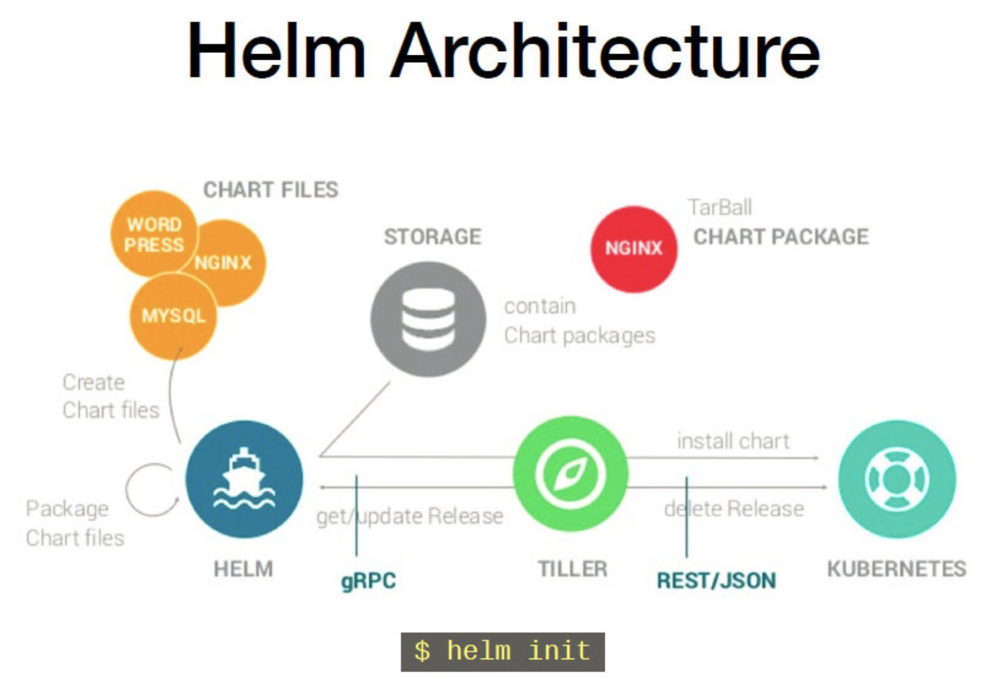

### 第11章 Helm-kubernetes的包管理器

>Helm : k8s的包管理器

>术语

    Helm : Kubernetes的应用打包工具，也是命令行工具的名称
    
    Tiller: Helm的服务端，部署在Kubernetes集群中，用于处理Helm的相关命令
    
    Chart: Helm的打包格式，内部包含了一组相关的kubernetes资源
    
    Repoistory: Helm的软件仓库，repository本质上是一个web服务器，该服务器保存了chart软件包以供下载，并有提供一个该repository的chart包的清单文件以供查询。在使用时，Helm可以对接多个不同的Repository
    
    Release: 使用Helm install命令在Kubernetes集群中安装的Chart称为Release

#### 1.why Helm

    K8s能够很好的组织和编排容器，但它缺少一个更高层次的应用打包工具，Helm就是干这个的。
    
    　　比如对于一个MySQL服务，K8s需要部署如下对象：
    
    　　（1）Service，让外界能访问MySQL
    
    　　（2）Secret，定义MySQL的密码
    
    　　（3）PersisentVolumeClaim,为MySQL申请持久化存储空间。
    
    　　（4）Deployment，部署MySQL Pod，并使用上面的这些支持对象。
    
    可以将上面这些配置保存到文件中，或几种写进一个文件，然后通过kubectl apply -f 部署。
    
    　　如果服务少，这样问题也不大，但是如果是微服务架构，服务多达数十个甚至上百个，这种组织和管理应用的方式就不好使了：
    
    　　（1）很难管理、编辑和维护如此多的服务。每个服务有若干个配置，缺乏更高层次的工具将这些配置组织起来。
    
    　　（2）不容易将这些服务作为一个整体统一发布。部署人员需要首先理解应用都包含哪些服务，然后按照逻辑顺序依次执行kubectl apply, 缺少一种工具定义应用与服务，以及服务之间的依赖。
    
    　　（3）不能高效的共享和重用服务。比如两个应用都用到MySQL服务，但是配置参数不一样，这两个应用只能分别复制一套标准MySQL配置文件，修改后通过kubectl apply部署。也就是不支持参数化配置和多环境部署。
    
    　　（4）不支持应用级别的版本管理。虽然可以通过kubectl rollout undo进行回滚，但这只针对单个deployment，不支持整个应用的的回滚。
    
    　　（5）不支持对部署的应用状态进行验证。比如是否能通过预定义账号访问MySQL。虽然K8s有健康检查，但那是针对单个容器，我们需要应用（服务）级别的健康检查。
    
    　　Helm能够解决上面这些问题。
    
#### 2.Helm架构

>Helm有两个重要概念：chart和release

##### (1).chart

    chart:是创建一个应用的信息集合，包括各种k8s对象的配置模板、参数定义、依赖关系、文档说明等。chart是应用部署的自包含逻辑单元。可以将char想象成apt、yum中的软件安装包

##### (2).release

    release:是chart的运行实例，代表了一个正在运行的应用。当chart被安装到k8s集群，就生成一个release。chart能够多次安装到同一个集群，每次安装都是一个release

>Helm是包管理工具，这里的包就是指chart。 Helm能够：

+ 从零创建新chart
+ 与存储chart的仓库交互。拉取、保存、和更新chart
+ 在k8s集群中安装和卸载release
+ 更新、回滚和测试release

>Helm包含两个组件： Heml客户端 和 Tiller服务器

+ Helm客户端用户可以：

    + 在本地开发chart
    + 管理chart仓库
    + 与Tiller服务器交互
    + 在远程K8s集群上安装chart
    + 查看release信息
    + 升级或卸载已有的release

+ Tiller服务器运行在K8s集群中。它会处理Helm客户端的请求，与k8s的API Server交互。Tiller服务器负责:

    + 监听来自Helm客户端的请求
    + 通过chart创建release
    + 在k8s中安装chart，并跟踪release状态
    + 通过API server升级或卸载已有的release
    
>总结：Helm客户端负责管理chart,Tiller服务器负责管理release

#### 3.安装Helm

**注意：heml安装客户端与服务端版本需要一致，否则会报错**

##### 3-1 Helm客户端

    wget https://storage.googleapis.com/kubernetes-helm/helm-v2.13.1-linux-amd64.tar.gz
    
    [root@node1 helm]# tar -zxvf helm-v2.13.1-linux-amd64.tar.gz 
    linux-amd64/
    linux-amd64/LICENSE
    linux-amd64/tiller
    linux-amd64/helm
    linux-amd64/README.md
    
    [root@node1 helm]# cd linux-amd64/
    
    [root@node1 linux-amd64]# cp helm /usr/local/bin/helm
    [root@node1 linux-amd64]# helm help

##### 3-2 Tiller服务器

    Step1:在集群的每个节点安装socat软件
    $ yum install -y socat 
    
    Step2:master节点安装Tiller(Helm服务端)
    #创建服务端
    [root@node1 ~]# helm init --service-account tiller --upgrade -i registry.cn-hangzhou.aliyuncs.com/google_containers/tiller:v2.13.1  --stable-repo-url https://kubernetes.oss-cn-hangzhou.aliyuncs.com/charts
    $HELM_HOME has been configured at /root/.helm.
    
    Tiller (the Helm server-side component) has been upgraded to the current version.
    Happy Helming!

    #创建tls认证服务端
    [root@node1 ~]# helm init --service-account tiller --upgrade -i registry.cn-hangzhou.aliyuncs.com/google_containers/tiller:v2.13.1 --tiller-tls-cert /etc/kubernetes/ssl/tiller001.pem --tiller-tls-key /etc/kubernetes/ssl/tiller001-key.pem --tls-ca-cert /etc/kubernetes/ssl/ca.pem --tiller-namespace kube-system --stable-repo-url https://kubernetes.oss-cn-hangzhou.aliyuncs.com/charts
    $HELM_HOME has been configured at /root/.helm.
    
    Tiller (the Helm server-side component) has been upgraded to the current version.
    Happy Helming!
    
    Step3:上述若遇到错误，可应用如下命令创建serviceaccount tiller并给它集群管理权限
    [root@node1 ~]# kubectl create serviceaccount --namespace kube-system tiller
    serviceaccount/tiller created
    [root@node1 ~]# kubectl create clusterrolebinding tiller-cluster-rule --clusterrole=cluster-admin --serviceaccount=kube-system:tiller
    clusterrolebinding.rbac.authorization.k8s.io/tiller-cluster-rule created
    [root@node1 ~]# kubectl patch deploy --namespace kube-system tiller-deploy -p '{"spec":{"template":{"spec":{"serviceAccount":"tiller"}}}}'
    deployment.extensions/tiller-deploy patched (no change)
    
    Step4:验证是否安装成功
    [root@node1 mysql]# helm version
    Client: &version.Version{SemVer:"v2.13.1", GitCommit:"618447cbf203d147601b4b9bd7f8c37a5d39fbb4", GitTreeState:"clean"}
    Server: &version.Version{SemVer:"v2.13.1", GitCommit:"618447cbf203d147601b4b9bd7f8c37a5d39fbb4", GitTreeState:"clean"}
    
    Step5:查看Pod运行情况
    [root@node1 mysql]# kubectl get pod -o wide --all-namespaces | grep tiller
    kube-system   tiller-deploy-6df646875f-l7jgk             1/1     Running   0          2m28s   10.244.104.53    node2   <none>           <none>
    
    
    ##如下查看Tiller的Service、deployment和Pod
    
    ---------
    
    ###1.查看tiller的service
    [root@node1 ~]# kubectl get -n kube-system svc | grep tiller
    tiller-deploy   ClusterIP   10.1.97.18   <none>        44134/TCP       31m
    
    或
    
    [root@node1 ~]# kubectl get -n kube-system svc tiller-deploy -o wide
    NAME            TYPE        CLUSTER-IP   EXTERNAL-IP   PORT(S)     AGE   SELECTOR
    tiller-deploy   ClusterIP   10.1.97.18   <none>        44134/TCP   31m   app=helm,name=tiller
    
    ----------
    
    ###2.查看tiller的deployment
    [root@node1 ~]# kubectl get -n kube-system deployment | grep tiller
    tiller-deploy             1/1     1            1           15m
    
    或
    
    [root@node1 ~]# kubectl get -n kube-system deployment tiller-deploy -o wide
    NAME            READY   UP-TO-DATE   AVAILABLE   AGE   CONTAINERS   IMAGES                                                              SELECTOR
    tiller-deploy   1/1     1            1           32m   tiller       registry.cn-hangzhou.aliyuncs.com/google_containers/tiller:v2.13.1   app=helm,name=tiller
    
    ----------
    
    ###3.查看tiller的pod
    
    [root@node1 ~]# kubectl get -n kube-system pod | grep tiller
    tiller-deploy-6df646875f-l7jgk               1/1     Running   0          13m
    
    或
    
    [root@node1 ~]# kubectl get -n kube-system pod tiller-deploy-8f67bd57d-wnz7h -o wide
    NAME                             READY   STATUS    RESTARTS   AGE     IP              NODE    NOMINATED NODE   READINESS GATES
    tiller-deploy-6df646875f-l7jgk   1/1     Running   0          6m59s   10.244.104.53   node2   <none>           <none>

#### 4.使用Helm

>查看仓库

    #查看仓库
    [root@node1 ~]# helm repo list
    NAME  	URL                                                   
    stable	https://kubernetes.oss-cn-hangzhou.aliyuncs.com/charts   ##stable是官方仓库
    local 	http://127.0.0.1:8879/charts                             ##local是用户存放自己开发的chart的本地仓库
    
>可通过helm repo add 添加更多个仓库

    # 先移除原先的仓库
    helm repo remove stable
    # 添加新的仓库地址
    helm repo add stable https://kubernetes.oss-cn-hangzhou.aliyuncs.com/charts
    # 更新仓库
    helm repo update

>查看当前可以安装的char: helm search

    ##搜索可以安装的Mysql-chart
    [root@node1 ~]# helm search mysql
    NAME                         	CHART VERSION	APP VERSION	DESCRIPTION                                                 
    stable/mysql                 	0.3.5        	           	Fast, reliable, scalable, and easy to use open-source rel...
    stable/percona               	0.3.0        	           	free, fully compatible, enhanced, open source drop-in rep...
    stable/percona-xtradb-cluster	0.0.2        	5.7.19     	free, fully compatible, enhanced, open source drop-in rep...
    stable/gcloud-sqlproxy       	0.2.3        	           	Google Cloud SQL Proxy                                      
    stable/mariadb               	2.1.6        	10.1.31    	Fast, reliable, scalable, and easy to use open-source rel...

>安装chat  

    ##安装Mysql
    [root@node1 mysql]# helm install stable/mysql
    NAME:   manageable-tiger    ### release的名字， 如果不用-n指定名字，这里就随机生成
    LAST DEPLOYED: Sun May 19 02:28:48 2019
    NAMESPACE: default      ### 命名空间，可以通过--namespace指定
    STATUS: DEPLOYED        ### 状态是DEPLOYED， 表示已经将chart部署到集群
    
    RESOURCES:              ### 当前release包含的资源，PersistentVolumeClaim，POD， secret,service,deployment,configmap
    ==> v1/PersistentVolumeClaim
    NAME                    STATUS   VOLUME  CAPACITY  ACCESS MODES  STORAGECLASS  AGE
    manageable-tiger-mysql  Pending  0s
    
    ==> v1/Pod(related)
    NAME                                     READY  STATUS   RESTARTS  AGE
    manageable-tiger-mysql-5ffc6757fb-hd8qh  0/1    Pending  0         0s
    
    ==> v1/Secret
    NAME                    TYPE    DATA  AGE
    manageable-tiger-mysql  Opaque  2     0s
    
    ==> v1/Service
    NAME                    TYPE       CLUSTER-IP    EXTERNAL-IP  PORT(S)   AGE
    manageable-tiger-mysql  ClusterIP  10.1.127.222  <none>       3306/TCP  0s
    
    ==> v1beta1/Deployment
    NAME                    READY  UP-TO-DATE  AVAILABLE  AGE
    manageable-tiger-mysql  0/1    1           0          0s
    
    
    NOTES:      ### 显示的是release的使用方法
    MySQL can be accessed via port 3306 on the following DNS name from within your cluster:
    manageable-tiger-mysql.default.svc.cluster.local
    
    To get your root password run:
    
        MYSQL_ROOT_PASSWORD=$(kubectl get secret --namespace default manageable-tiger-mysql -o jsonpath="{.data.mysql-root-password}" | base64 --decode; echo)
    
    To connect to your database:
    
    1. Run an Ubuntu pod that you can use as a client:
    
        kubectl run -i --tty ubuntu --image=ubuntu:16.04 --restart=Never -- bash -il
    
    2. Install the mysql client:
    
        $ apt-get update && apt-get install mysql-client -y
    
    3. Connect using the mysql cli, then provide your password:
        $ mysql -h manageable-tiger-mysql -p
    
    To connect to your database directly from outside the K8s cluster:
        MYSQL_HOST=127.0.0.1
        MYSQL_PORT=3306
    
        # Execute the following commands to route the connection:
        export POD_NAME=$(kubectl get pods --namespace default -l "app=manageable-tiger-mysql" -o jsonpath="{.items[0].metadata.name}")
        kubectl port-forward $POD_NAME 3306:3306
    
        mysql -h ${MYSQL_HOST} -P${MYSQL_PORT} -u root -p${MYSQL_ROOT_PASSWORD}
    
>查看已经部署的release

    [root@node1 mysql]# helm list
    NAME            	REVISION	UPDATED                 	STATUS  	CHART      	APP VERSION	NAMESPACE
    manageable-tiger	1       	Sun May 19 02:28:48 2019	DEPLOYED	mysql-0.3.5	           	default 
    
>删除release

    [root@node1 mysql]# helm delete manageable-tiger
    release "manageable-tiger" deleted
    
    上述并未完全删除
    
    #查看，status为DELETED,此时不能创建同名chart
    [root@node1 mysql]# helm list --all
    NAME            	REVISION	UPDATED                 	STATUS 	CHART      	APP VERSION	NAMESPACE
    manageable-tiger	1       	Sun May 19 02:28:48 2019	DELETED	mysql-0.3.5	           	default 
    
    ##完全删除
    [root@node1 mysql]# helm delete --purge manageable-tiger
    release "manageable-tiger" deleted

#### 5.chart详解

    chart由一系列文件组成，这些文件描述了K8s部署应用时需要的资源，比如Servcie、Deployment、PersistentVolmeClaim、Secret、ConfigMap等。
    
    chart可以很复杂，部署整个应用，比如包含HTTP servers、Database、消息中间件、Cache等。
    
    chart将这些文件放置在预定义的目录结构中，通常被打包成tar包，而且标注上版本信息，便于Helm部署。
    
##### 5-1.chart目录结构

>一旦安装了某个chart，就可以在 ~/.helm/cache/archive中找到chart的tar包

    ##查看char的tar包
    [root@node1 mysql]# ls ~/.helm/cache/archive/
    mysql-0.3.5.tgz
    
    ##解压缩
    [root@node1 mysql]# tar -zxvf ~/.helm/cache/archive/mysql-0.3.5.tgz -C /home/k8s/mysql/
    
    [root@node1 mysql]# ls
    mysql  
    [root@node1 mysql]# ls mysql
    Chart.yaml  README.md  templates  values.yaml
    
    ##(1)描述chart的概要信息
    [root@node1 mysql]# cat Chart.yaml 
    description: Fast, reliable, scalable, and easy to use open-source relational database
      system.
    engine: gotpl
    home: https://www.mysql.com/
    icon: https://www.mysql.com/common/logos/logo-mysql-170x115.png
    keywords:
    - mysql
    - database
    - sql
    maintainers:
    - email: viglesias@google.com
      name: Vic Iglesias
    name: mysql   #必填
    sources:
    - https://github.com/kubernetes/charts
    - https://github.com/docker-library/mysql
    version: 0.3.5  #必填
    
    ##(2)README.md
    
    ##(3)LICENSE:描述chart的许可信息，此文件为可选
    
    ##(4)requirements.yaml:指定chart的依赖关系，安装过程中，依赖的chart也会被安装
    
    ##(5)values.yaml:chart支持在安装时根据参数进行定制化配置，而values.xml则提供了这些配置参数的默认值
    
    ##(6)templates: k8s各种资源的配置模板都在这。Helm会将values.yaml中的参数值注入模板中，生成标准的YAML配置文件。
                    模板是chart的最重要的部分，也是Helm最强大的地方。模板增加了应用部署的灵活性，能够适用不同的环境
    
    [root@node1 mysql]# ls templates/
    configmap.yaml  deployment.yaml  _helpers.tpl  NOTES.txt  pvc.yaml  secrets.yaml  svc.yaml
    
    ##(7)templates/NOTES.txt: chart的简易适用文档

##### 5-2.chart模版

    大部分属性变成了 {{XXX}}。 这些实际上是模板语法。 Helm采用GO语言的模板编写chart。Go模板非常强大，支持变量、对象、函数、流控制等功能
    
    [root@node1 mysql]# ls templates/
    configmap.yaml  deployment.yaml  _helpers.tpl  NOTES.txt  pvc.yaml  secrets.yaml  svc.yaml
    
    以secrets.yaml为例说明:
    apiVersion: v1
    kind: Secret
    metadata:
      name: {{ template "mysql.fullname" . }}  ##定义secret的name。关键字template的作用是引用一个模板mysql.fullname
      labels:
        app: {{ template "mysql.fullname" . }}
        chart: "{{ .Chart.Name }}-{{ .Chart.Version }}"
        release: "{{ .Release.Name }}"
        heritage: "{{ .Release.Service }}"
    type: Opaque
    data:
      {{ if .Values.mysqlRootPassword }}
      mysql-root-password:  {{ .Values.mysqlRootPassword | b64enc | quote }}
      {{ else }}
      mysql-root-password: {{ randAlphaNum 10 | b64enc | quote }}
      {{ end }}
      {{ if .Values.mysqlPassword }}
      mysql-password:  {{ .Values.mysqlPassword | b64enc | quote }}
      {{ else }}
      mysql-password: {{ randAlphaNum 10 | b64enc | quote }}
      {{ end }}
    ~               
    
#### 6.实践mysql chart

    安装之前需要清楚chart的使用方法。这些信息保存在values.yaml和README.MD,可以使用如下命令查看：
    
    ###阅读注释可以知道MySQL  chart支持哪些参数，安装前需要哪些准备。
    
    ---------
    
    ##查看所需要的资源参数    
    [root@node1 mysql]# helm inspect values stable/mysql  ##输出的是Values.yaml(定义参数)的内容
    ## mysql image version
    ## ref: https://hub.docker.com/r/library/mysql/tags/
    ##
    image: "mysql"
    imageTag: "5.7.14"
    
    ## Specify password for root user
    ##
    ## Default: random 10 character string
    # mysqlRootPassword: testing
    
    ## Create a database user
    ##
    # mysqlUser:
    # mysqlPassword:
    
    ## Allow unauthenticated access, uncomment to enable
    ##
    # mysqlAllowEmptyPassword: true
    
    ## Create a database
    ##
    # mysqlDatabase:
    
    ## Specify an imagePullPolicy (Required)
    ## It's recommended to change this to 'Always' if the image tag is 'latest'
    ## ref: http://kubernetes.io/docs/user-guide/images/#updating-images
    ##
    imagePullPolicy: IfNotPresent
    
    livenessProbe:
      initialDelaySeconds: 30
      periodSeconds: 10
      timeoutSeconds: 5
      successThreshold: 1
      failureThreshold: 3
    
    readinessProbe:
      initialDelaySeconds: 5
      periodSeconds: 10
      timeoutSeconds: 1
      successThreshold: 1
      failureThreshold: 3
    
    ## Persist data to a persistent volume
    persistence:
      enabled: true
      ## database data Persistent Volume Storage Class
      ## If defined, storageClassName: <storageClass>
      ## If set to "-", storageClassName: "", which disables dynamic provisioning
      ## If undefined (the default) or set to null, no storageClassName spec is
      ##   set, choosing the default provisioner.  (gp2 on AWS, standard on
      ##   GKE, AWS & OpenStack)
      ##
      # storageClass: "-"
      accessMode: ReadWriteOnce    ##注意此处存储需要的参数值
      size: 8Gi     ##注意此处存储需要的参数值
    
    ## Configure resource requests and limits
    ## ref: http://kubernetes.io/docs/user-guide/compute-resources/
    ##
    resources:
      requests:
        memory: 256Mi
        cpu: 100m
    
    # Custom mysql configuration files used to override default mysql settings
    configurationFiles:
    #  mysql.cnf: |-
    #    [mysqld]
    #    skip-name-resolve
    
    
    ## Configure the service
    ## ref: http://kubernetes.io/docs/user-guide/services/
    service:
      ## Specify a service type
      ## ref: https://kubernetes.io/docs/concepts/services-networking/service/#publishing-services---service-types
      type: ClusterIP
      port: 3306
      # nodePort: 32000

    ------------
    
    ##chart定义了一个PVC， 申请存储空间。 因为实验环境不支持动态供给，所以要先申请PV(按上述例子【部署mysql】)
    ##Step1:申请PV
    [root@node1 mysql]# cat helm-mysql-pv.yml 
    apiVersion: v1
    kind: PersistentVolume
    metadata:
      name: db-pv
    spec:
      accessModes:
        - ReadWriteOnce
      capacity:
        storage: 8Gi
      persistentVolumeReclaimPolicy: Retain
      #storageClassName: nfs
      nfs:
        path: /nfsdata/db-pv  #需要事先在nfsdata目录创建db-pv目录
        server: 192.168.1.31
        
    [root@node1 mysql]# kubectl apply -f helm-mysql-pv.yml 
    persistentvolume/db-pv created
    
    [root@node1 mysql]# kubectl get pv
    NAME    CAPACITY   ACCESS MODES   RECLAIM POLICY   STATUS      CLAIM   STORAGECLASS   REASON   AGE
    db-pv   8Gi        RWO            Retain           Available                                   3s
    
    --------------
    
    ##Step2:安装chart--定制化安装chart
    
    可以接受values.yml的默认值，也可定制化，比如设置mysqlRootPassword。Helm支持两种方法传递参数
    
    (1).指定自己的values文件, 通常做法是:helm inspect values mysql > myvalues.yaml生成values文件，然后设置mysqlRootPassword,最后执行
    
        helm install --values=myvalues.yaml  mysql
    
    (2).使用--set 直接传入参数值(采用本方式)
    
        helm install stable/mysql --set mysqlRootPassword=syf -n syfdb
    
    通过helm list 和  helm status XXX 可以查看chart的最新状态
    
    ####安装chart,利用--set自定义值
    [root@node1 mysql]# helm install stable/mysql --set mysqlRootPassword=syf -n syfdb
    NAME:   syfdb
    LAST DEPLOYED: Mon May 20 03:40:22 2019
    NAMESPACE: default
    STATUS: DEPLOYED
    
    RESOURCES:
    ==> v1/PersistentVolumeClaim
    NAME         STATUS  VOLUME  CAPACITY  ACCESS MODES  STORAGECLASS  AGE
    syfdb-mysql  Bound   db-pv   8Gi       RWO           1s
    
    ==> v1/Pod(related)
    NAME                          READY  STATUS    RESTARTS  AGE
    syfdb-mysql-67db9b8587-vk2tv  0/1    Init:0/1  0         0s
    
    ==> v1/Secret
    NAME         TYPE    DATA  AGE
    syfdb-mysql  Opaque  2     1s
    
    ==> v1/Service
    NAME         TYPE       CLUSTER-IP  EXTERNAL-IP  PORT(S)   AGE
    syfdb-mysql  ClusterIP  10.1.93.38  <none>       3306/TCP  1s
    
    ==> v1beta1/Deployment
    NAME         READY  UP-TO-DATE  AVAILABLE  AGE
    syfdb-mysql  0/1    1           0          1s
    
    
    NOTES:
    MySQL can be accessed via port 3306 on the following DNS name from within your cluster:
    syfdb-mysql.default.svc.cluster.local
    
    To get your root password run:
    
        MYSQL_ROOT_PASSWORD=$(kubectl get secret --namespace default syfdb-mysql -o jsonpath="{.data.mysql-root-password}" | base64 --decode; echo)
    
    To connect to your database:
    
    1. Run an Ubuntu pod that you can use as a client:
    
        kubectl run -i --tty ubuntu --image=ubuntu:16.04 --restart=Never -- bash -il
    
    2. Install the mysql client:
    
        $ apt-get update && apt-get install mysql-client -y
    
    3. Connect using the mysql cli, then provide your password:
        $ mysql -h syfdb-mysql -p
    
    To connect to your database directly from outside the K8s cluster:
        MYSQL_HOST=127.0.0.1
        MYSQL_PORT=3306
    
        # Execute the following commands to route the connection:
        export POD_NAME=$(kubectl get pods --namespace default -l "app=syfdb-mysql" -o jsonpath="{.items[0].metadata.name}")
        kubectl port-forward $POD_NAME 3306:3306
    
        mysql -h ${MYSQL_HOST} -P${MYSQL_PORT} -u root -p${MYSQL_ROOT_PASSWORD}
    
    --------
    
    ##查看release列表
    [root@node1 mysql]# helm list
    NAME 	REVISION	UPDATED                 	STATUS  	CHART      	APP VERSION	NAMESPACE
    syfdb	1       	Mon May 20 03:40:22 2019	DEPLOYED	mysql-0.3.5	           	default  
    
    --------
    
    ##查看release状态
    $ helm status syfdb
    [root@node1 mysql]# helm status syfdb
    LAST DEPLOYED: Mon May 20 03:40:22 2019
    NAMESPACE: default
    STATUS: DEPLOYED
    
    RESOURCES:
    ==> v1/PersistentVolumeClaim
    NAME         STATUS  VOLUME  CAPACITY  ACCESS MODES  STORAGECLASS  AGE
    syfdb-mysql  Bound   db-pv   8Gi       RWO           8m20s
    
    ==> v1/Pod(related)
    NAME                          READY  STATUS   RESTARTS  AGE
    syfdb-mysql-67db9b8587-vk2tv  1/1    Running  0         8m19s   ##pod已启动
    
    ==> v1/Secret
    NAME         TYPE    DATA  AGE
    syfdb-mysql  Opaque  2     8m20s
    
    ==> v1/Service
    NAME         TYPE       CLUSTER-IP  EXTERNAL-IP  PORT(S)   AGE
    syfdb-mysql  ClusterIP  10.1.93.38  <none>       3306/TCP  8m20s
    
    ==> v1beta1/Deployment
    NAME         READY  UP-TO-DATE  AVAILABLE  AGE
    syfdb-mysql  1/1    1           1          8m20s
    
    
    NOTES:
    MySQL can be accessed via port 3306 on the following DNS name from within your cluster:
    syfdb-mysql.default.svc.cluster.local
    
    To get your root password run:
    
        MYSQL_ROOT_PASSWORD=$(kubectl get secret --namespace default syfdb-mysql -o jsonpath="{.data.mysql-root-password}" | base64 --decode; echo)
    
    To connect to your database:
    
    1. Run an Ubuntu pod that you can use as a client:
    
        kubectl run -i --tty ubuntu --image=ubuntu:16.04 --restart=Never -- bash -il
    
    2. Install the mysql client:
    
        $ apt-get update && apt-get install mysql-client -y
    
    3. Connect using the mysql cli, then provide your password:
        $ mysql -h syfdb-mysql -p
    
    To connect to your database directly from outside the K8s cluster:
        MYSQL_HOST=127.0.0.1
        MYSQL_PORT=3306
    
        # Execute the following commands to route the connection:
        export POD_NAME=$(kubectl get pods --namespace default -l "app=syfdb-mysql" -o jsonpath="{.items[0].metadata.name}")
        kubectl port-forward $POD_NAME 3306:3306
    
        mysql -h ${MYSQL_HOST} -P${MYSQL_PORT} -u root -p${MYSQL_ROOT_PASSWORD}
    
    --------
    
    ##查询deployment/service/pod
    [root@node1 mysql]# kubectl get deployment | grep mysql
    syfdb-mysql   1/1     1            1           9m41s
    [root@node1 mysql]# kubectl get service | grep mysql
    syfdb-mysql   ClusterIP   10.1.93.38   <none>        3306/TCP   9m53s
    [root@node1 mysql]# kubectl get pod | grep mysql
    syfdb-mysql-67db9b8587-vk2tv   1/1     Running   0          9m58s
    
    --------
    
    ##centos7安装mysql客户端
    [root@node1 mysql]# yum install -y mariadb.x86_64 mariadb-libs.x86_64
    
    ##连接k8s集群内mysql服务
    ##应用mysql -h ${MYSQL_HOST} -P${MYSQL_PORT} -u root -p${MYSQL_ROOT_PASSWORD}此种连接方式,连接地址为service提供的IP地址和端口
    [root@node1 mysql]# mysql -h 10.1.93.38 -P3306 -u root -psyf
    Welcome to the MariaDB monitor.  Commands end with ; or \g.
    Your MySQL connection id is 1910
    Server version: 5.7.14 MySQL Community Server (GPL)
    
    Copyright (c) 2000, 2018, Oracle, MariaDB Corporation Ab and others.
    
    Type 'help;' or '\h' for help. Type '\c' to clear the current input statement.
    
    MySQL [(none)]> show databases;
    MySQL [(none)]> create database syf;
    Query OK, 1 row affected (0.02 sec)
    
    MySQL [(none)]> use syf
    Database changed
    MySQL [syf]> create table tb_user(name varchar(20));
    Query OK, 0 rows affected (0.03 sec)
    
    MySQL [syf]> insert into tb_user values('kaixinyufeng');
    Query OK, 1 row affected (0.01 sec)
    
    MySQL [syf]> select * from tb_user;
    +--------------+
    | name         |
    +--------------+
    | kaixinyufeng |
    +--------------+
    1 row in set (0.00 sec)
    
    MySQL [syf]> exit
    
    --------
    
    ###查看nfs存储已有内容
    [root@node1 mysql]# ls /nfsdata/db-pv/
    auto.cnf  ib_buffer_pool  ibdata1  ib_logfile0  ib_logfile1  ibtmp1  mysql  performance_schema  syf  sys
    
    --------
    
    ###查看Pod详情,mysql部署在node3节点上
    [root@node1 mysql]# kubectl get pod -o wide | grep mysql
    syfdb-mysql-67db9b8587-vk2tv   1/1     Running   0          167m   10.244.135.26   node3   <none>           <none>
    
    ###模拟Node3节点故障,关机
    [root@node3 ~]# shutdown now
    Connection to node3 closed by remote host.
    Connection to node3 closed.
    
    或退出执行: $ vagrant halt node3
    
    ###查看节点运行状态,node3已经关闭
    [root@node1 ~]# kubectl get node
    NAME    STATUS     ROLES    AGE   VERSION
    node1   Ready      master   52d   v1.13.3
    node2   Ready      <none>   52d   v1.13.3
    node3   NotReady   <none>   52d   v1.13.3
    
    ###等待一段时间,时间有点长...，查看deployment , pod
    [root@node1 ~]# kubectl get deployment
    NAME          READY   UP-TO-DATE   AVAILABLE   AGE
    syfdb-mysql   1/1     1            1           3h    #已部署
    
    ##此时mysql被部署到node2节点
    [root@node1 ~]# kubectl get pod -o wide | grep mysql
    syfdb-mysql-67db9b8587-lrg47   1/1     Running       0          5m47s   10.244.104.55   node2   <none>           <none>
    syfdb-mysql-67db9b8587-vk2tv   1/1     Terminating   0          3h1m    10.244.135.26   node3   <none>           <none>
    
    ###再次连接mysql数据库查看
    [root@node1 ~]# mysql -h 10.1.93.38 -P3306 -u root -psyf
    Welcome to the MariaDB monitor.  Commands end with ; or \g.
    Your MySQL connection id is 49
    Server version: 5.7.14 MySQL Community Server (GPL)
    
    Copyright (c) 2000, 2018, Oracle, MariaDB Corporation Ab and others.
    
    Type 'help;' or '\h' for help. Type '\c' to clear the current input statement.
    
    MySQL [(none)]> use syf
    Reading table information for completion of table and column names
    You can turn off this feature to get a quicker startup with -A
    
    Database changed
    MySQL [syf]> select * from tb_user;
    +--------------+
    | name         |
    +--------------+
    | kaixinyufeng |
    +--------------+
    1 row in set (0.00 sec)

    **以上，数据完好无损!!!**
    
    --------
    
    ##删除release
    $ helm delete syfdb 
    
    **此时删除的release应用 $ helm list还可查询到**
    
    ##完全删除release
    $ helm delete --purge syfdb
    release "syfdb" deleted
    
    **此时删除的release无法再用 $ helm list查询到**
    
#### 7 升级和回滚release

    helm upgrade syfdb #可以对已经发布的release进行升级　通过--values 或 --set应用新的配置。
    
    ##查看所有版本
    [root@node1 ~]# helm history syfdb
    REVISION	UPDATED                 	STATUS  	CHART      	DESCRIPTION     
    1       	Mon May 20 03:40:22 2019	DEPLOYED	mysql-0.3.5	Install complete
    
    ##回滚到任意版本
    $ helm rollback syfdb 1    # 可以回滚到任何版本(1是REVISION的值)
    

#### 8 开发自己的chart

>k8s提供了大量官方的chart, 不过要部署微服务，还是需要开发自己的chart

##### 8-1.创建chart

>Helm会帮助创建目录mychart，并生成各类chart文件。我们在此基础上开发自己的chart.

    ##创建目录mychart，并生成各类chart文件
    [root@node1 helm-chart]# helm create mychart
    Creating mychart
    
    ##查看内容
    [root@node1 helm-chart]# tree mychart/
    mychart/
    ├── charts  ##charts目录是本chart依赖的chart,初始为空目录
    ├── Chart.yaml  ##用于描述这个chart的基本信息，包括名字，描述信息以及版本
    ├── templates   ##是Kubernetes manifest文件模板目录，模板使用chart配置的值生成Kubernetes manifest文件。模板文件使用的Go语言模板语法
    │   ├── deployment.yaml
    │   ├── _helpers.tpl
    │   ├── ingress.yaml
    │   ├── NOTES.txt  ##纯文本文件，可在其中填写chart的使用说明,介绍chart部署后的一些信息。例如介绍如何使用这个chart，列出缺省的设置等
    │   ├── service.yaml
    │   └── tests
    │       └── test-connection.yaml
    └── values.yaml   ##用于存储templates目录中模板文件中用到的变量。 模板文件一般是Go模板。如果你需要了解更多关于Go模板的相关信息，可以查看Hugo (https://gohugo.io) 的一个关于Go模板的介绍 (https://gohugo.io/templates/go-templates/)
    
    3 directories, 8 files
    
##### 8-2.调试

>Helm提供了debug工具：
    
    helm lint XXXX:会检测chart语法，报告错误以及给出建议。
    
    helm install --dry-run XXXX --debug:会模拟安装chart, 输出每个模板生成的YAML内容，检查这些输出看是否符合我们的预期。
    
##### 8-3.安装chart

>helm 提供了四种方法：

+ 安装仓库中的chart: $ helm install stable/nginx

+ 通过tar包安装: $ helm install ./nginx-1.2.3.tgz

+ chart本地目录安装: $ helm install ./nginx

+ 通过URL安装: helm install https://example.com/charts/nginx-1.2.3.tgz

##### 8-4.将chart添加到仓库

#### 9.Helm实践：

参考:

[强大的Kubernetes包管理工具](https://blog.csdn.net/zhaohuabing/article/details/80083960)

--------------------------------------------

**体胖还需勤跑步，人丑就要多读书!!! --开心玉凤**