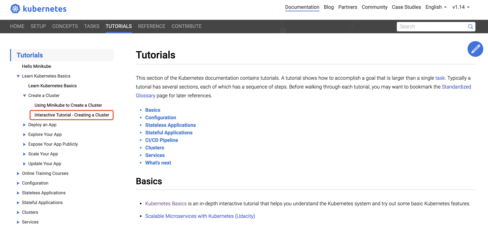
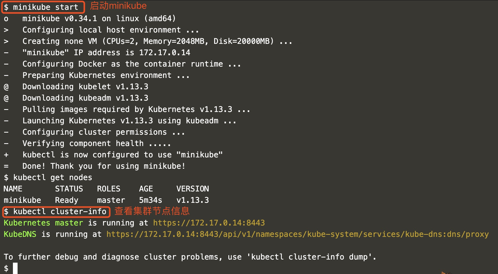
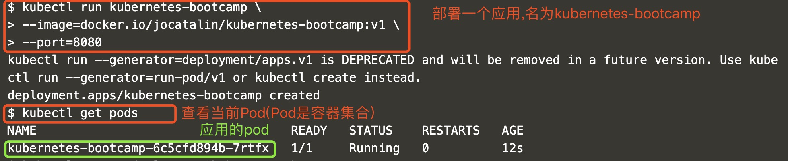
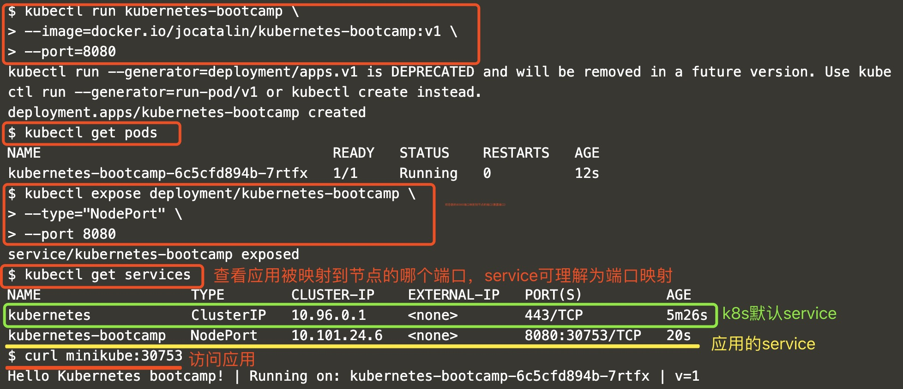
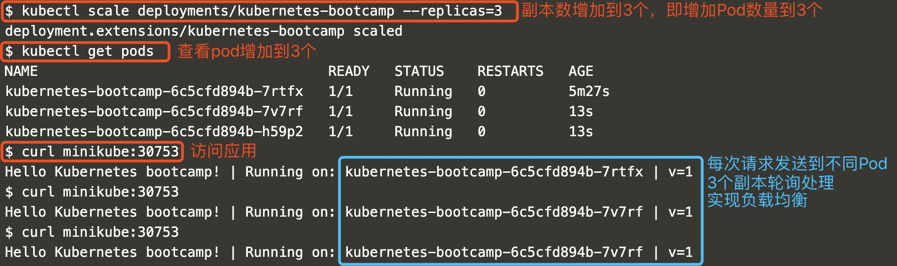
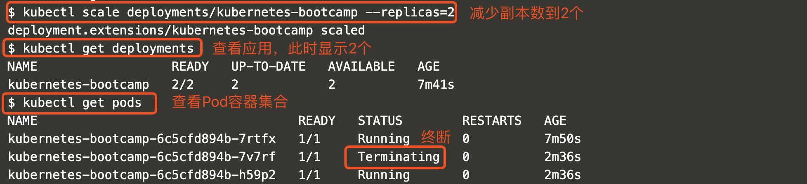
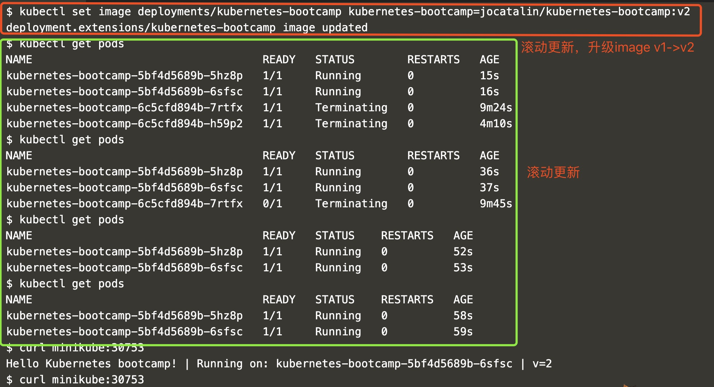

2019.5.11 开心玉凤

目标：

    1。kubernetes重要概念和架构
    
    2。学习kubernetes如何编排容器，包括：优化资源利用，高可用，滚动更新，网络插件，服务发现，监控，数据管理，日志管理等
    
教程[完成创建kubernetes集群，部署应用，访问应用，扩展应用，更新应用等](https://kubernetes.io/docs/tutorials/#basics)

博客[每天5分钟玩转k8s](https://mp.sohu.com/profile?xpt=Y2xvdWRtYW42QHNvaHUuY29t&_f=index_pagemp_2&spm=smpc.content.author.3.1557473409950ErIE9g3)

文章[每天5分钟玩转k8s](https://www.cnblogs.com/liufei1983/category/1369899.html)

-------------------------------------------------
*************************************************

目录：

第1章 先把kubernetes跑起来

第2章 重要概念

第3章 部署k8s集群-kubeadm

第4章 k8s架构

第5章 运行应用

第6章 通过service访问pod

第7章 Rolling Update

第8章 Health Check

第9章 数据管理(一个数据库例子)

第10章 Secret(处理敏感信息) & Configmap

第11章 Helm-kubernetes的包管理器

-------------------------------------------------
*************************************************

### 第1章 先把kubernetes跑起来

#### 1。启动minikube

Step1.[打开k8s教程菜单](https://kubernetes.io/docs/tutorials/kubernetes-basics/create-cluster/cluster-interactive/)

Step2.启动minikube

    $ minikube version #查看minikube版本
    
    $ kubectl get nodes #获取节点信息。此时已创建好了一个单节点的k8s集群
    
    $ kubectl cluster-info  #查看集群信息
    

#### 2。部署应用

    # 通过kubectl run部署一个应用，名为kubernetes-bootcamp | Docker镜像通过--image指定 | --port设置应用对外服务的端口
    $ kubectl run kubernetes-bootcamp \
    > --image=docker.io/jocatalin/kubernetes-bootcamp:v1 \
    > --port=8080
    
    k8s术语：
    (1).Deployment可理解为应用
    (2).Pod是容器的集合(一般会将紧密相关的一组容器放到一个pod中，同一个pod所有容器共享IP地址和Port间。即它们在一个network namespace中)
        Pod是k8s调度的最小单位，同一Pod中容器始终被一起调度
        
    $ kubectl get pods #查看当前Pod
    

#### 3。访问应用

默认情况下，所有Pod只能在集群内部访问。为能够从外部访问应用，需将容器8080端口映射到节点的端口

    #暴露应用的8080端口
    $ kubectl expose deployment/kubernetes-bootcamp \
    > --type="NodePort" \
    > --port 8080
    
    #查看应用被映射到节点的哪个端口
    $ kubectl get services
    
    #查看节点名称：minikube
    $ kubectl get nodes 
    
    #访问应用
    $ curl minikube:30753 #节点名称:暴露端口
    

#### 4。Scale应用

##### (1)增加副本

默认情况下只会运行一个副本

    #查看副本数
    $ kubectl get deployments
    NAME                  READY   UP-TO-DATE   AVAILABLE   AGE
    kubernetes-bootcamp   1/1     1            1           3m30s
    
    #副本数加到3个
    $ kubectl scale deployments/kubernetes-bootcamp --replicas=3
    
    #查看副本数
    $ kubectl get deployments
    
    #查看当前Pod增加到3个
    $ kubectl get pods
    
    #访问应用,每次执行均会将请求发送到不同Pod，3个副本轮询处理，实现了负载均衡
    $ curl minikube:30753 
    
   

##### (2)减少副本

     #将副本数减少到2个(其中一个副本会被删除)
     kubectl scale deployments/kubernetes-bootcamp --replicas=2
     
     

     #多次执行,直到仅有2个副本
     $ kubectl get pods
     NAME                                   READY   STATUS    RESTARTS   AGE
     kubernetes-bootcamp-5bf4d5689b-5hz8p   1/1     Running   0          58s
     kubernetes-bootcamp-5bf4d5689b-6sfsc   1/1     Running   0          59s
     
     #访问应用（多次执行，会将请求负载发到2个副本）
     $ curl minikube:30753  

#### 5。滚动更新

##### (1).升级镜像版本

    #升级镜像版本v1->v2
    $kubectl set image deployments/kubernetes-bootcamp kubernetes-bootcamp=jocatalin/kubernetes-bootcamp:v2 deployment.extensions/kubernetes-bootcamp image updated
    
  

##### (2).回退版本

    #回退v2->v1
    $ kubectl rollout undo deployments/kubernetes-bootcamp
    
    #观察滚动更新过程
    $ kubectl get pods
    
    #访问应用，验证版本是否已经回退到v1
    $ curl minikube:30753
    Hello Kubernetes bootcamp! | Running on: kubernetes-bootcamp-6c5cfd894b-hzfrj | v=1

--------------------------------------------

**体胖还需勤跑步，人丑就要多读书!!! --开心玉凤**