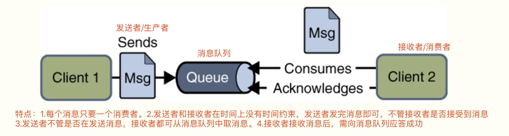
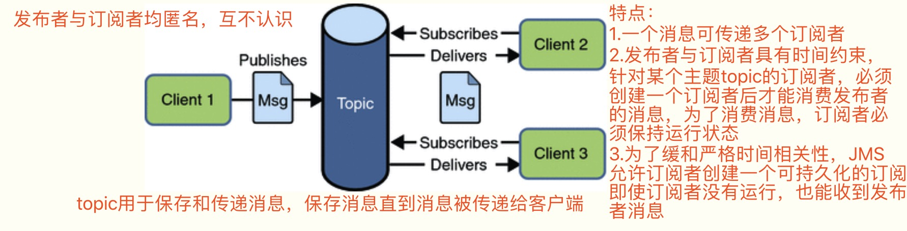
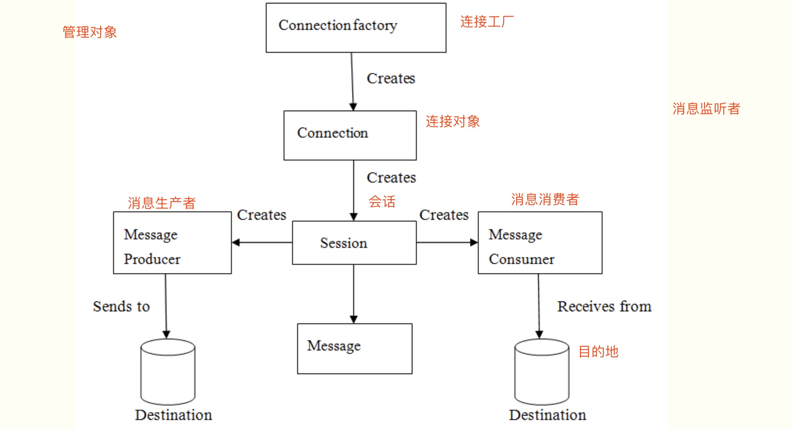

### 1.JMS(Java message service):java消息服务应用程序接口

#### 1-1 什么是JMS

    JMS即Java消息服务（Java Message Service）应用程序接口，是一个Java平台中关于面向消息中间件（MOM）的API，用于在两个应用程序之间，或分布式系统中发送消息，进行异步通信。
    Java消息服务是一个与具体平台无关的API，绝大多数MOM提供商都对JMS提供支持
    两个应用程序之间需要进行通信，我们使用一个JMS服务，进行中间的转发，通过JMS 的使用，我们可以解除两个程序之间的耦合。
    
#### 1-2 JMS优势

    1。Asynchronous（异步）
      JMS原本就是一个异步的消息服务，客户端获取消息的时候，不需要主动发送请求，消息会自动发送给可用的客户端
      
    2。Reliable（可靠）
      JMS保证消息只会递送一次。大家都遇到过重复创建消息问题，而JMS能帮你避免该问题
      
#### 1-3 JMS消息模型

    JMS具有两种通信模式：
    1、Point-to-Point Messaging Domain （点对点）
    2、Publish/Subscribe Messaging Domain （发布/订阅模式）
    
    在JMS API出现之前，大部分产品使用“点对点”和“发布/订阅”中的任一方式来进行消息通讯。JMS定义了这两种消息发送模型的规范，它们相互独立。任何JMS的提供者可以实现其中的一种或两种模型，这是它们自己的选择。JMS规范提供了通用接口保证我们基于JMS API编写的程序适用于任何一种模型。
    
##### (1).Point-to-Point Messaging Domain（点对点通信模型）

##### (2).Publish/Subscribe Messaging Domain（发布/订阅通信模型）

#### 1-4 JMS接收消息

    在JMS中，消息的产生和消费是异步的。对于消费来说，JMS的消费者可以通过两种方式来消费消息。
    
    (1)同步（Synchronous）
    　 
    在同步消费信息模式模式中，订阅者/接收方通过调用 receive（）方法来接收消息。在receive（）方法中，线程会阻塞直到消息到达或者到指定时间后消息仍未到达。
    
    (2)异步（Asynchronous）
    
    使用异步方式接收消息的话，消息订阅者需注册一个消息监听者，类似于事件监听器，只要消息到达，JMS服务提供者会通过调用监听器的onMessage()递送消息。
    
#### 1-5 JMS编程模型

   

参考:[Java消息队列--JMS概述](http://www.cnblogs.com/jaycekon/p/6220200.html)
