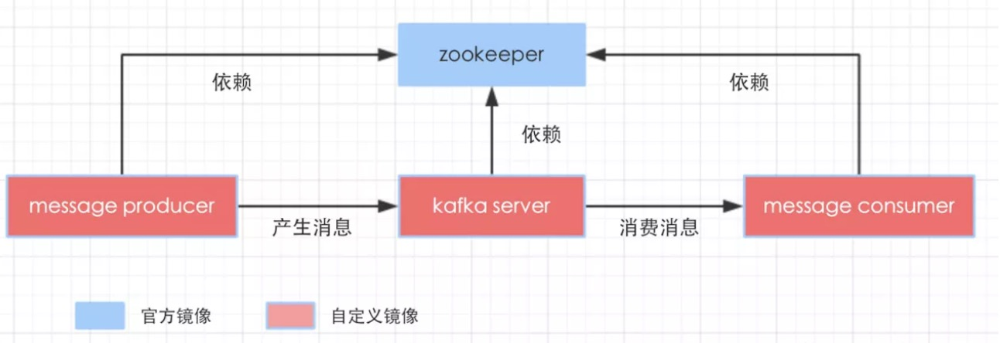

## Docker安装kafka---方式一

参考[Docker下kafka学习，三部曲之二：本地环境搭建](https://juejin.im/entry/5ad93d5f6fb9a07a9a106456)

### kafka依赖zookeeper关系图

    1.kafka sever提供消息服务; 
    2.message producer的作用是产生执行主题的消息; 
    3.message consumer的作用是订阅指定主题的消息并消费掉。

参考

[在Docker环境下部署Kafka](https://blog.csdn.net/snowcity1231/article/details/54946857)

[使用docker安装kafka](https://blog.csdn.net/lblblblblzdx/article/details/80548294)

    Step1:拉取镜像
    $ docker pull wurstmeister/zookeeper
    $ docker pull wurstmeister/kafka
    
    Step2:启动zookeeper容器
    $ docker run -d --name zookeeper -p 2181:2181 -t wurstmeister/zookeeper
    
    Step3:启动kafka容器，并设置相应环境变量(10.xx.xx.xx为本机IP)
    $ docker run  -d --name kafka -p 9092:9092 -e KAFKA_BROKER_ID=0 -e KAFKA_ZOOKEEPER_CONNECT=10.xx.xx.xx:2181 -e KAFKA_ADVERTISED_LISTENERS=PLAINTEXT://10.xx.xx.xx:9092 -e KAFKA_LISTENERS=PLAINTEXT://0.0.0.0:9092 -t wurstmeister/kafka
    
    Step4:测试kafka
    shiyufeng:kafka shiyufeng$ docker exec -it kafka bash
    bash-4.4# cd /opt/
    
    bash-4.4# ls
    kafka             kafka_2.12-2.2.0  overrides
    bash-4.4# cd kafka_2.12-2.2.0/
    
    bash-4.4# ls
    LICENSE    NOTICE     bin        config     libs       logs       site-docs
    
    #创建主题（注意：zookeeper必须在本机配置相应域名，否则报错  --topic指定主题）
    bash-4.4# bin/kafka-topics.sh --create --zookeeper zookeeper:2181 --replication-factor 1 --partitions 1 --topic syf-kafka
    Created topic syf-kafka.
    
    #向topic写入内容
    bash-4.4# bin/kafka-console-producer.sh --broker-list localhost:9092 --topic syf-kafka
    >hello kafka
    >
    
    #再开一个终端，模拟消费者
    shiyufeng:kafka shiyufeng$ docker exec -it kafka bash
    bash-4.4# cd /opt/
    bash-4.4# ls
    kafka             kafka_2.12-2.2.0  overrides
    bash-4.4# cd kafka_2.12-2.2.0/
    bash-4.4# ls
    LICENSE    NOTICE     bin        config     libs       logs       site-docs
    
    #启动消费者(注意0.90版本之前和后启动消费者的方法不同，此为新版本启动消费者方法)
    bash-4.4# bin/kafka-console-consumer.sh --bootstrap-server localhost:9092 --topic syf-kafka --from-beginning
    >hello kafka
    >
    
上述简单kafka单机版已搭建完毕，可利用docker搭建kafka集群 

总结：上述创建主题和启动消费者异常说明

[Storm 执行异常 java.lang.RuntimeException: java.nio.channels.UnresolvedAddressException 问题解决](https://www.cnblogs.com/zhwbqd/p/4045263.html)

    问题原因：需要在本机配置zookeeper的域名
    
    $ vim /etc/hosts  #增加10.xx.xx.xx zookeeper 
      
[kafka 创建消费者报错 consumer zookeeper is not a recognized option](https://blog.csdn.net/csdn_sunlighting/article/details/81516646)

    旧版本：bin/kafka-console-consumer.sh --zookeeper zookeeper:2181 --topic syf-kafka --from-beginning //启动消费者
    
    新版本：bin/kafka-console-consumer.sh --bootstrap-server localhost:9092 --topic syf-kafka --from-beginning
    
--------------------------

## Docker安装kafka--方式二

### 1.编写docker-compose.yml

    shiyufeng:kafka shiyufeng$ cat docker-compose.yml
    version: '2'
    services:
      zookeeper:
        image: wurstmeister/zookeeper
        ports:
          - "2181:2181"
      kafka:
        image: wurstmeister/kafka:2.11-0.11.0.3
        ports:
          - "9092"
        environment:
          KAFKA_ADVERTISED_LISTENERS: PLAINTEXT://:9092
          KAFKA_LISTENERS: PLAINTEXT://:9092
          KAFKA_ZOOKEEPER_CONNECT: zookeeper:2181
        volumes:
          - /var/run/docker.sock:/var/run/docker.sock
          
### 2.启动server

    在docker-compose.yml目录执行 $ docker-compose up -d
    
    $ docker ps #查看启动的容器
    
    shiyufeng:kafka shiyufeng$ docker ps
    CONTAINER ID        IMAGE                              COMMAND                  CREATED              STATUS              PORTS                                                NAMES
    6e4255a6fbd2        wurstmeister/kafka:2.11-0.11.0.3   "start-kafka.sh"         About a minute ago   Up About a minute   0.0.0.0:32769->9092/tcp                              kafka_kafka_1
    dc28546ff30a        wurstmeister/zookeeper             "/bin/sh -c '/usr/sb…"   About a minute ago   Up About a minute   22/tcp, 2888/tcp, 3888/tcp, 0.0.0.0:2181->2181/tcp   kafka_zookeeper_1
    
    #查看容器中kafka版本号
    shiyufeng:kafka shiyufeng$ docker exec kafka_kafka_1 find / -name \*kafka_\* | head -1 | grep -o '\kafka[^\n]*'
    kafka_2.11-0.11.0.3
    #查看zookeeper版本
    shiyufeng:kafka shiyufeng$ docker exec kafka_zookeeper_1 pwd
    /opt/zookeeper-3.4.13
    
### 3.扩展broker

    #在docker-compose.yml所在文件夹下，执行下述命令，将broker总数由1个扩展为2个
    $ docker-compose scale kafka=2  
    
    shiyufeng:kafka shiyufeng$ docker ps
    CONTAINER ID        IMAGE                              COMMAND                  CREATED             STATUS              PORTS                                                NAMES
    3aff192341aa        wurstmeister/kafka:2.11-0.11.0.3   "start-kafka.sh"         6 seconds ago       Up 5 seconds        0.0.0.0:32770->9092/tcp                              kafka_kafka_2
    6e4255a6fbd2        wurstmeister/kafka:2.11-0.11.0.3   "start-kafka.sh"         5 minutes ago       Up 5 minutes        0.0.0.0:32769->9092/tcp                              kafka_kafka_1
    dc28546ff30a        wurstmeister/zookeeper             "/bin/sh -c '/usr/sb…"   5 minutes ago       Up 5 minutes        22/tcp, 2888/tcp, 3888/tcp, 0.0.0.0:2181->2181/tcp   kafka_zookeeper_1
    
### 4.实战：消息的生产和消费

#### 4-1 创建topic

    #创建一个topic,名为topic001，4个partition，副本因子2
    shiyufeng:kafka shiyufeng$ docker exec kafka_kafka_1 \
    > kafka-topics.sh \
    > --create --topic topic001 \
    > --partitions 4 \
    > --zookeeper zookeeper:2181 \
    > --replication-factor 2
    Created topic "topic001".
    
#### 4-2 查看刚创建的topic(可在容器kafka_kafka_2上执行命令查看)

    shiyufeng:kafka shiyufeng$ docker exec  kafka_kafka_2 \
    > kafka-topics.sh --list \
    > --zookeeper zookeeper:2181 \
    > topic001
    topic001
    
#### 4-3 查看刚创建topic情况，broker和副本情况

    shiyufeng:kafka shiyufeng$ docker exec kafka_kafka_2 \
    > kafka-topics.sh \
    > --describe \
    > --topic topic001 \
    > --zookeeper zookeeper:2181
    Topic:topic001	PartitionCount:4	ReplicationFactor:2	Configs:
    	Topic: topic001	Partition: 0	Leader: 1001	Replicas: 1001,1002	Isr: 1001,1002
    	Topic: topic001	Partition: 1	Leader: 1002	Replicas: 1002,1001	Isr: 1002,1001
    	Topic: topic001	Partition: 2	Leader: 1001	Replicas: 1001,1002	Isr: 1001,1002
    	Topic: topic001	Partition: 3	Leader: 1002	Replicas: 1002,1001	Isr: 1002,1001

#### 4-4 生产消息

    shiyufeng:~ shiyufeng$ docker exec -it kafka_kafka_1 \
    > kafka-console-producer.sh \
    > --topic topic001 \
    > --broker-list kafka_kafka_1:9092,kafka_kafka_2:9092
    >hello kafka
    
#### 4-5 消费消息

    shiyufeng:kafka shiyufeng$ docker exec kafka_kafka_2 \
    > kafka-console-consumer.sh \
    > --topic topic001 \
    > --bootstrap-server kafka_kafka_1:9092,kafka_kafka_2:9092
    hello kafka
    
  参考[kafka的Docker镜像使用说明(wurstmeister/kafka)](https://blog.csdn.net/boling_cavalry/article/details/85395080)