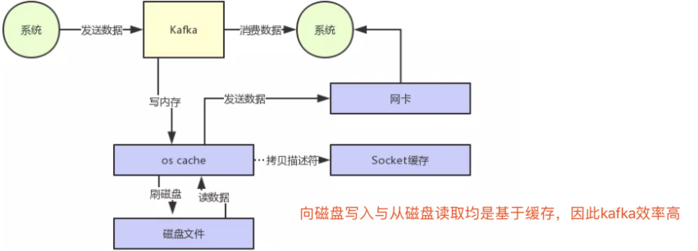
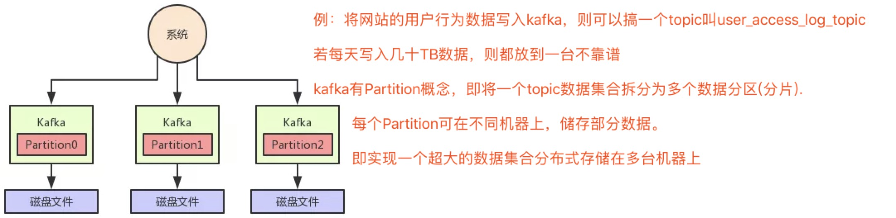
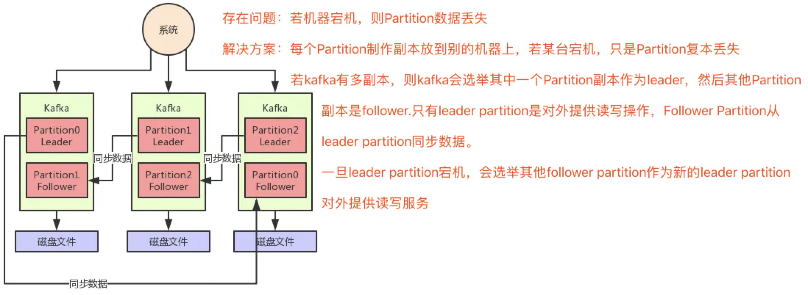
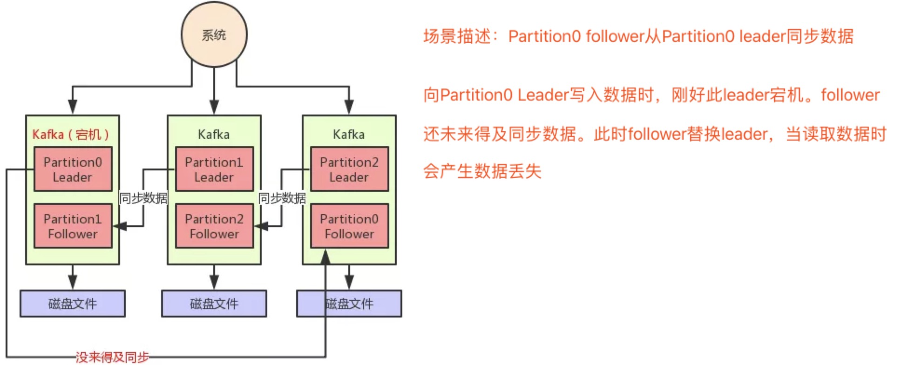
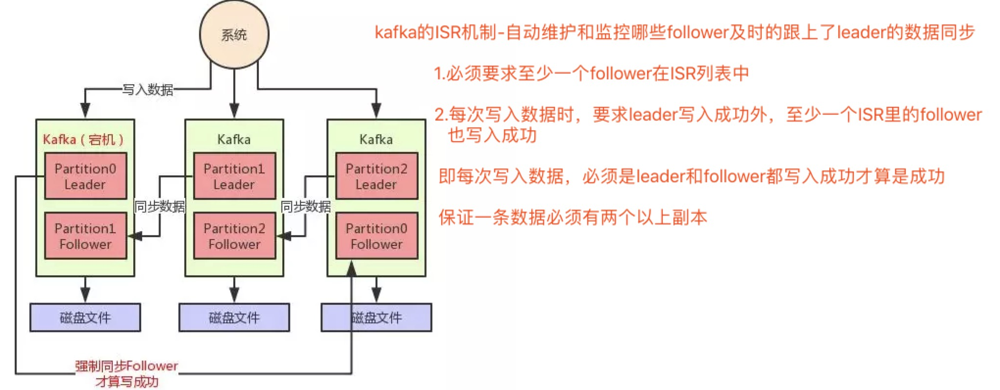
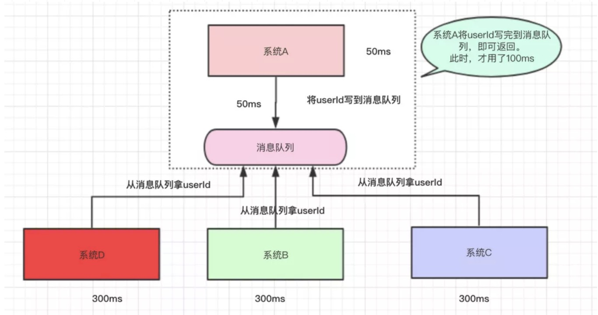
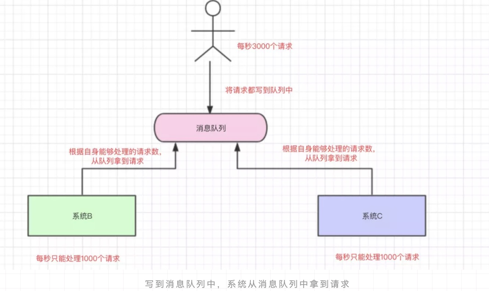
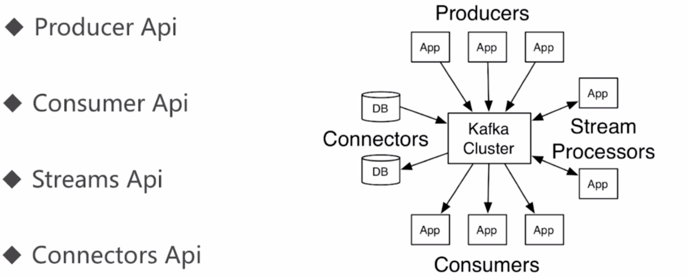
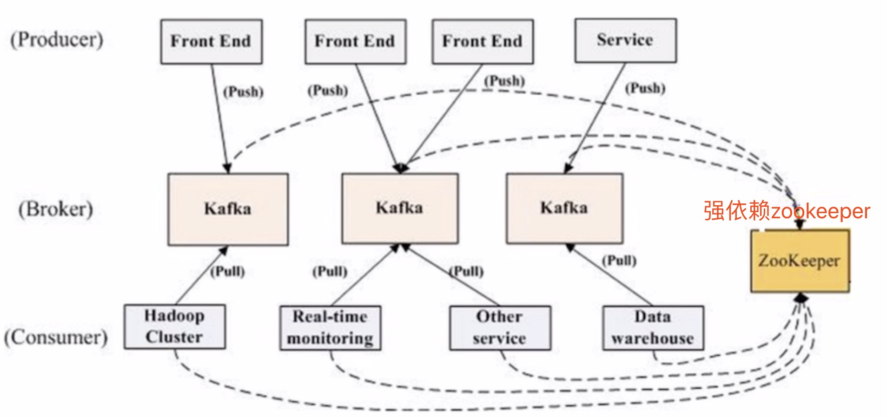
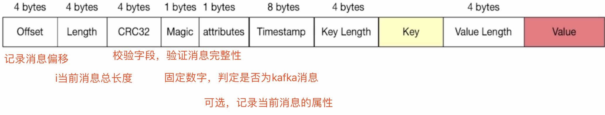

# Apache Kafka -- 分布式流处理平台

[kafka中文文档](http://kafka.apachecn.org/documentation.html#producerapi)

# Apache Kafka -- 掘金好文

### 一。 [消息中间件如何实现每秒几十万的高并发写入](https://mp.weixin.qq.com/s?__biz=MzU0OTk3ODQ3Ng==&mid=2247484700&idx=1&sn=fbfdb57ea53882828e4e3bd0b3b61947&chksm=fba6ed1fccd16409c43baa7f941e522d97a72e63e4139f663b327c606c6bb5dfe516b6f61424&scene=21#wechat_redirect)

    Kafka是高吞吐低延迟的高并发、高性能的消息中间件，在大数据领域有极为广泛的运用。配置良好的Kafka集群甚至可以做到每秒几十万、上百万的超高并发写入。
    
+ 页面缓存技术+磁盘顺序写(写入) **kafka核心架构原理**

+ 零拷贝技术(消费)

性能优化后：

----------------------------------

### 二。[写入消息中间件的数据，如何保证不丢失](https://mp.weixin.qq.com/s/wbqA9vZOCQ0M_N9Q0NXWVg)

+ kafka分布式存储架构

+ kafka高可用架构

+ kafka写入数据丢失问题

+ kafka的核心机制--ISR机制

    ISR是kafka自动维护和监控哪些follower及时的跟上了leader的数据同步
    
+ kafka写入的数据保证不丢失

**若写入失败，则让生产者不停的重试，直到kafka恢复正常**

----------------------------------

### 三。[什么是消息队列](https://mp.weixin.qq.com/s?__biz=MzI4Njg5MDA5NA==&mid=2247485080&idx=1&sn=f223feb9256727bde4387d918519766b&chksm=ebd74799dca0ce8fa46223a33042a79fc16ae6ac246cb8f07e63a4a2bdce33d8c6dc74e8bd20&token=1439272449&lang=zh_CN&scene=21#wechat_redirect)

参考：[github-3y](https://github.com/ZhongFuCheng3y/3y)

+ 消息队列(MQ(Message Queue)-中间件

+（一）为什么要用消息队列

1.解耦 

    A提供B,C，D服务，B和C可能需要A提供某数据，但D不需要。则可以用消息队列方式，谁要谁取
    
 2.异步

3.削峰/限流

+（二）消息队列问题

    JDK实现的队列都是简单的内存队列
    
1。高可用--集群/分布式(不能够单机)

2。数据丢失问题

    Redis可以将数据持久化磁盘上，万一Redis挂了，还能从磁盘从将数据恢复过来。同样地，消息队列中的数据也需要存在别的地方，这样才尽可能减少数据的丢失。

3。消费者怎么得到消息队列的数据

    生产者将数据放到消息队列中，消息队列有数据了，主动叫消费者去拿(俗称push)
    
    消费者不断去轮训消息队列，看看有没有新的数据，如果有就消费(俗称pull)
    
----------------------------------

[Kafka简明教程](https://zhuanlan.zhihu.com/p/37405836)

[消息队列使用的四种场景介绍，有图有解析，一看就懂](https://zhuanlan.zhihu.com/p/55712984))

[消息队列设计精要](https://zhuanlan.zhihu.com/p/21479556)

[消息队列的使用场景是怎样的](https://www.zhihu.com/question/34243607)

------------------------------------

# 慕课网 kafka流处理平台

>linkedIn开发,11年开源加入Apache基金会

+ 分布式数据同步系统Databus

+ 高性能计算引擎 Cubert

+ java异步处理框架 ParSeq

+ Kafka流处理平台

## Kafka基本概念

+ Producer: 消息和数据的生产者，向kafka的一个topic发布消息的进程/代码/服务

+ Consumer: 消息和数据的消费者，订阅数据(Topic)并且处理其发布的消息的进程/代码/服务

+ Consumer Group：逻辑概念，对于同一个Topic，会广播给不同的Group,一个Group中，只有一个consumer可以消费该消息

+ Broker: 物理概念，kafka集群中的每个kafka节点

+ Topic: 逻辑概念，kafka消息的类别，对数据进行区分，隔离

+ Partition: 物理概念，kafka下数据存储的基本单元。一个Topic数据，会被分散存储到多个Partition，每一个Partition是有序的(Partition被分布在Broker上)

    每一个topic被切分为多个Partitions
    
    消费者数目少于或等于Patition的数目(因为消费者大于Partition，会导致多个消费者同时消费一个Partition,会产生错误)
    
    Broker Group中的每个Broker保存Topic的一个或多个Partitions
    
    Consumer Group中的仅有一个Consumer读取Topic的一个或多个Partitions，并且是唯一的Consumer

+ Replication: 同一个Partition可能会有多个Replica,多个Replica之间的数据是一样的

    当集群中有Broker挂掉的情况，系统可以主动地使Replicas提供服务
    
    系统默认设置每一个Topic的replication系统为1，可以在创建topic时单独设置
    
    Replication特点：
    
     (1)Replication的基本单位是Topic的Partition
    
     (2)所有的读和写都从Leader进，Followers只是做为备份
     
     (3)Follower必须能够及时复制Leader的数据
     
     (4)增加容错性与可扩展性

+ Replication Leader: 一个Partition的多个Replica上，需要一个Leader负责该Partition上与Producer和Consumer交互

+ ReplicaManager: 负责管理当前broker所有分区和副本的信息，处理KafkaController发起的一些请求。副本状态的切换，添加/读取消息等

## Kafka基本结构

>kafka基本结构

>展示kafka做为消息队列的运作

    Kafka强依赖zookeeper

    Broker所有信息存储到Zookeeper,Topic和Partition分布存储到zookeeper

>Kafka消息结构

## Kafka特点

### 分布式

+ 多分区 :多个Partition

+ 多副本 :Replications

+ 多订阅者 : Kafka一个topic有多个阅者，一个订阅者对应一个Partition

+ 基于zookeeper调度 : kafka很多信息存储到zookeeper上

### 高性能

+ 高吞吐量 

+ 低延迟

+ 高并发 :高并发意味着高吞吐量

+ 时间复杂度为O(1)

### 持久性与扩展性

+ 数据可持久化 

+ 容错性 :多副本及按组消费增强容错性

+ 支持在线水平扩展 : 一个Broker可以有一个或多个Partition

+ 消息自动平衡: 避免过度访问某几台机器或订阅消费集中在某几台机器

## Kafka应用场景

### 消息队列(消息可被重复消费)

### 行为跟踪(如实时监控)

### 日志收集

### 流处理

### 事件源(回溯事件变更，可存储大量日志)

### 持久性日志(commit log)

## Kafka简单案例

