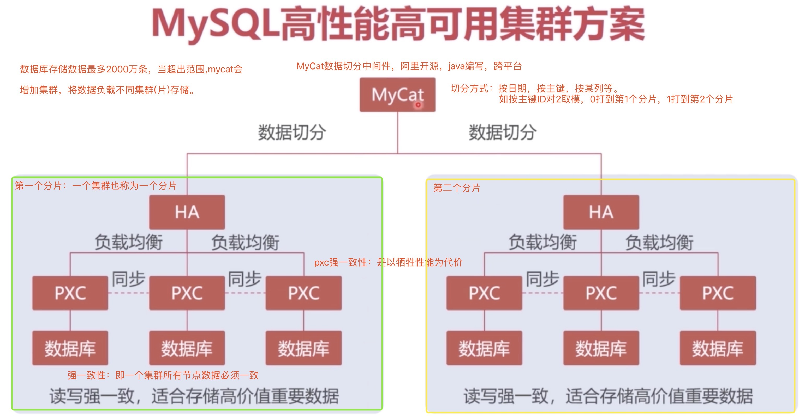
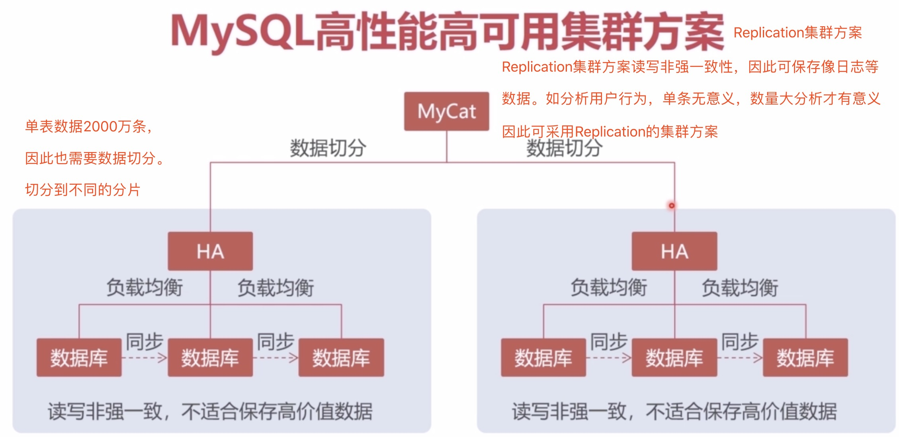
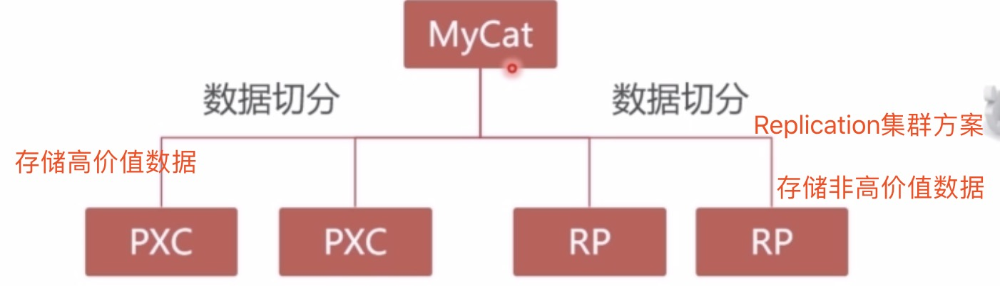
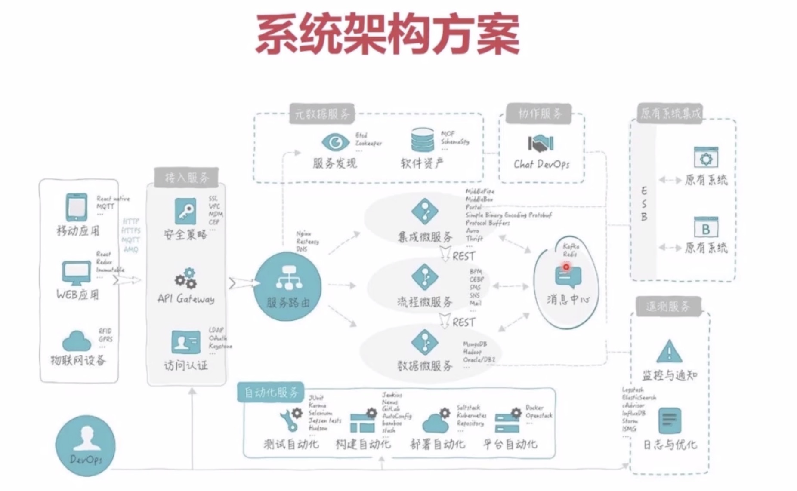
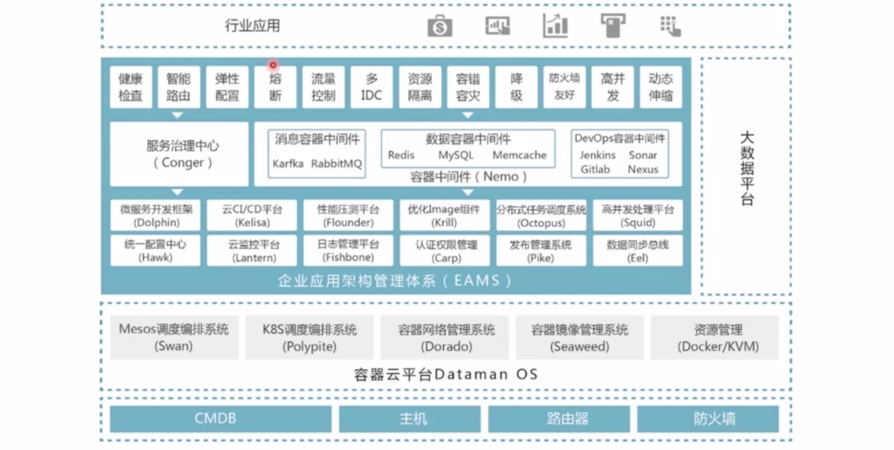
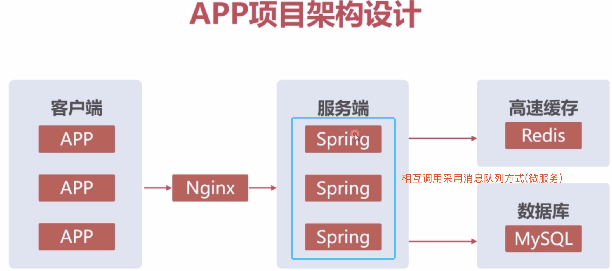
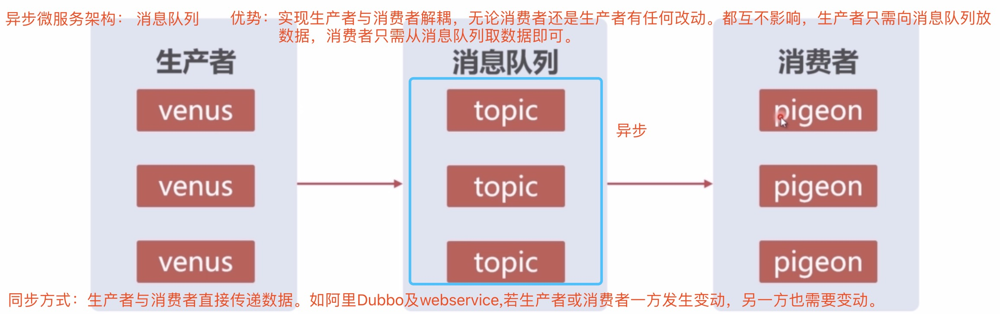

# mysql集群(pxc)入门

[mooc](https://www.imooc.com/learn/993) 学习笔记

云服务器，负载均衡，RDS云数据库

课程目标：

+ 掌握PXC集群mysql方案的原理

+ 掌握PXC集群的强一致性

+ 掌握PXC集群的高可用方案

**单机单节点问题**

    (1)单节点DB,无法满足性能要求(并发访问量大，无法满足性能)
    
    (2)单节点DB,没有冗余设计，无法满足高可用(必须要一直运行，一旦挂掉..)
    
**单节点数据库压力测试**

**单节点数据库高可用测试**

#### 1。Mysql高性能高可用集群方案-pxc集群方案

**pxc集群方案：强一致性，以牺牲性能为代价**

#### 2。Mysql高性能高可用集群方案-Replication集群方案

**Replication集群方案：不以牺牲性能为代价。问题：无法提供读写强一致性.单条数据价值不是很高，可采用该集群方案**

#### 3.PXC与Replication集群方案结合应用

#### 4.系统架构方案

#### 5.App项目架构设计

**其中Spring部分为部署在Tomcat服务器中的应用，应用与应用之间调用可以采用微服务中的消息队列异步方式**

#### 6.Docker虚拟机部署MySQL集群

