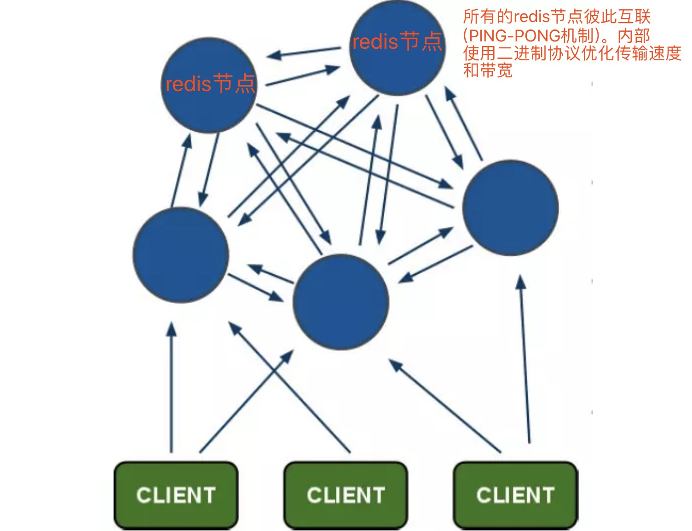
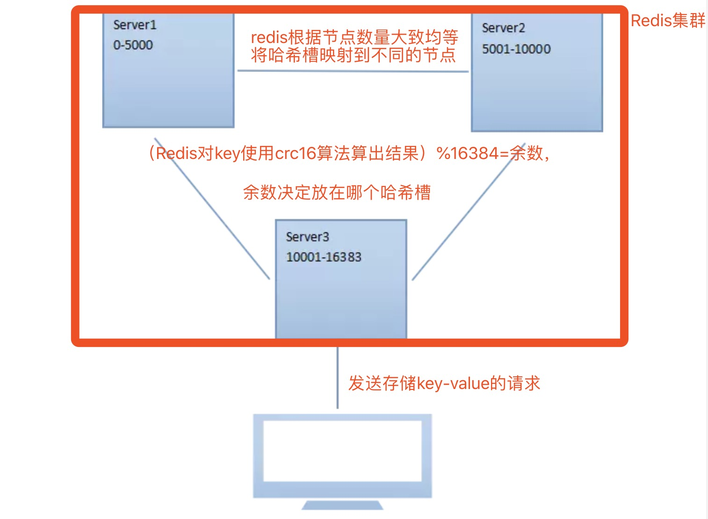
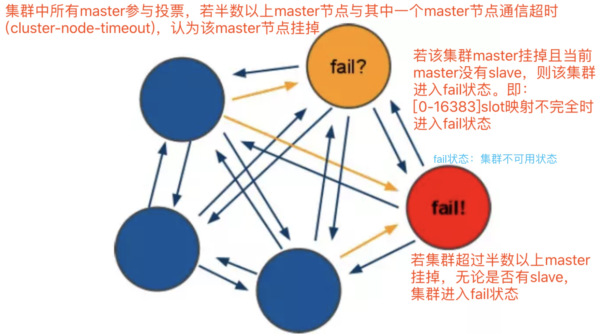

# Redis概念

Redis是使用c语言开发的一个高性能键值数据库，Redis可以通过一些键值类型来存储数据。

# Redis应用场景

+ 缓存（数据查询、短连接、新闻内容、商品内容等等）。（最多使用）
 
+ 分布式集群架构中的session分离。 聊天室的在线好友列表。 任务队列。（秒杀、抢购、12306等等） 应用排行榜。 网站访问统计。 数据过期处理（可以精确到毫秒）

-----------------------------------------------------------

# Redis实战

## 一.[安装redis]((https://juejin.im/post/5b4dd82ee51d451925629622))

    #下载redis
    $ wget http://download.redis.io/releases/redis-3.0.0.tar.gz
    
    #解压
    $ tar -zxvf redis-3.0.0.tar.gz
    
    #安装c语言环境
    $ apt-get install gcc-c++
    
    #编译
    $ cd redis-3.0.0
    $ make
    
    #安装
    $ cd src && make install PREFIX= /usr/local/redis
    
    #查看
    $ cd /usr/local/redis
    $ ls
    
-----------------------------------------------------------

## 二.启动redis

### 启动方式一：前端启动

    $ cd /usr/local/redis/bin       
    $ ./redis-server
    
**前端启动的关闭 强制关闭 ctrl+c 正常关闭 ./redis-cli shutdown。一旦客户端关闭，则redis服务也会停掉**

### 启动方式二：后端启动   

    $ cd redis-3.0.0
    #将redis.conf拷贝到bin目录下
    $ cp redis.conf /usr/local/redis/bin/
    $ cd /usr/local/redis/bin/
    $ vim redis.conf #修改daemonize为yes
    #后端命令启动redis
    $ ./redis-server redis.conf
    #查看是否启动成功
    $ ps -aux | grep redis
    [root@k8s3 bin]# ps -aux | grep redis
    root     17819  0.0  0.3  40704  7428 ?        Ssl  10:14   0:00 ./redis-server *:6379
    root     17830  0.0  0.0  12492   700 pts/0    S+   10:14   0:00 grep --color=auto redis

**关闭后端启动的方式:强制关闭： kill -9 进程号 正常关闭：./redis-cli shutdown**

-----------------------------------------------------------

## 三.Redis客户端

### 自带客户端

    $ cd /usr/local/redis/bin
    
    $ ./redis-cli -h 127.0.0.1 -p 6379
    [root@k8s3 bin]# ./redis-cli -h 127.0.0.1 -p 6379
    127.0.0.1:6379> select 15  #select加上数据库的下标,就可以选择指定的数据库使用,下标从0开始(0-15)
    OK
    
**写成./redis-cli则使用默认配置，默认ip 127.0.0.1,默认端口 6379**

**关闭 ctrl + c 或 127.0.0.1:6379>quit**

### 图形界面客户端-redis-desktop-manager

### jedis 客户端 -企业应用最多

[github-jedis](https://github.com/xetorthio/jedis) | [Java单例连接redis](https://juejin.im/post/5b4dd82ee51d451925629622#heading-63)

-----------------------------------------------------------

## 四.Redis数据类型

### (一).string类型

##### 1.赋值(set key value)与取值(get key)

    127.0.0.1:6379[1]> set key1 123
    OK
    127.0.0.1:6379[1]> get key1
    "123"

##### 2.取值并赋值(getset key value)

    127.0.0.1:6379[1]> getset key1 321
    "123"
    127.0.0.1:6379[1]> get key1
    "321"
    
##### 3.设置获取多个键值(mset key value [key value...] mget key [key...])

    127.0.0.1:6379[1]> mset key1 123 key2 456 key3 789
    OK
    127.0.0.1:6379[1]> mget key1 key2 key3
    1) "123"
    2) "456"
    3) "789"
    127.0.0.1:6379[1]> mset key1 a key2 b
    OK
    127.0.0.1:6379[1]> mget key1 key2 key3
    1) "a"
    2) "b"
    3) "789"
    
##### 4.删除(del key)

    127.0.0.1:6379[1]> del key3
    (integer) 1
    127.0.0.1:6379[1]> get key3
    (nil)
    
##### 5.数值增减

+ 递增数字(incr key)

**应用：自增主键 商品编号、订单号采用 string 的递增数字特性生成**

    127.0.0.1:6379[1]> set num 1
    OK
    127.0.0.1:6379[1]> incr num
    (integer) 2
    127.0.0.1:6379[1]> incr num
    (integer) 3

+ 增加指定的整数(incrby key increment)

    127.0.0.1:6379[1]> incrby num 2
    (integer) 5
    127.0.0.1:6379[1]> incrby num 5
    (integer) 10

+ 递减数字(decr key)

    
    127.0.0.1:6379[1]> decr num
    (integer) 9

+ 减少指定的数值(decryby key decrement)

    127.0.0.1:6379[1]> decrby num 4
    (integer) 5
    
##### 6。向尾部追加值Append

    127.0.0.1:6379[1]> set key1-str hello
    OK
    127.0.0.1:6379[1]> append key1-str "redis"
    (integer) 10
    127.0.0.1:6379[1]> get key1-str
    "helloredis"
    127.0.0.1:6379[1]> strlen key1-str    #计算字符串总长度
    (integer) 10
    127.0.0.1:6379[1]> append key2-str "syf" #追加值不存在，则设置key-value值
    (integer) 3
    127.0.0.1:6379[1]> get key2-str
    "syf"
    127.0.0.1:6379[1]> append key2-str " learn redis"
    (integer) 15
    127.0.0.1:6379[1]> get key2-str
    "syf learn redis"

### (二).Hash 散列类型

##### 1。使用string问题

    假设有User对象以JSON序列化的形式存储到Redis中(User对象有id，username、password、age、name等属性)，
    
    存储的过程如下：保存、更新：User对象  json(string)  redis
    
    如果在业务上只是更新age属性，其他的属性并不做更新。若仍采用上边的方法在传输、处理时会造成资源浪费，因此hash可以很好的解决这个问题。

##### 2。hash散列类型

    hash是散列类型，它提供了字段和字段值的映射。字段值只能是字符串类型，不支持散列类型、集合类型等其它类型
    
**HSET命令**

    HSET命令不区分插入和更新操作，当执行插入操作时HSET命令返回1，执行更新操作时返回0
    
###### 1。一次只设置/获取一个字段值 语法：hset key field value / hget key field

    127.0.0.1:6379[1]> hset user username syf
    (integer) 1
    
    127.0.0.1:6379[1]> hget user username
    "syf"

###### 2。一次设置/获取多个字段值 语法：hmset key field value [field value...] / hmget key field [field...]

    127.0.0.1:6379[1]> hmset user age 31 sex girl
    OK
    
    127.0.0.1:6379[1]> hmget user username age sex
    1) "syf"
    2) "31"
    3) "girl"
    
    127.0.0.1:6379[1]> hmset user username xiaofeng class redis   #有该字段则覆盖值，否则写入值
    OK
    
    127.0.0.1:6379[1]> hgetall user
    1) "username"
    2) "xiaofeng"
    3) "age"
    4) "31"
    5) "sex"
    6) "girl"
    7) "class"
    8) "redis"

###### 3。当字段不存在时赋值，类似hset,区别在于如果字段存在，该命令不执行任何操作。 语法：hsetnx key field value

    127.0.0.1:6379[1]> hsetnx user username yufeng
    (integer) 0

###### 4。获取所有字段值 语法：hgetall key

    127.0.0.1:6379[1]> hgetall user
    1) "username"
    2) "xiaofeng"
    3) "age"
    4) "31"
    5) "sex"
    6) "girl"
    7) "class"
    8) "redis"
    
###### 5。删除字段 可以删除一个或多个字段，返回值是被删除的字段的个数。 语法：hdel key field [field...]

    127.0.0.1:6379[1]> hdel user age
    (integer) 1
    127.0.0.1:6379[1]> hdel user age class
    (integer) 1
    127.0.0.1:6379[1]> hgetall user
    1) "username"
    2) "xiaofeng"
    3) "sex"
    4) "girl"

###### 6。增加数字 语法：hincrby key field increment

    127.0.0.1:6379[1]> hincrby user age 2    #age已经被删除，则写入age赋值为2
    (integer) 2
    127.0.0.1:6379[1]> hgetall user
    1) "username"
    2) "xiaofeng"
    3) "sex"
    4) "girl"
    5) "age"
    6) "2"

    127.0.0.1:6379[1]> hincrby user age 30  #age已存在且值为2，在其上加30
    (integer) 32
    127.0.0.1:6379[1]> hgetall user
    1) "username"
    2) "xiaofeng"
    3) "sex"
    4) "girl"
    5) "age"
    6) "32"
    
###### 7。判断字段是否存在 语法：hexists key field
         
    127.0.0.1:6379[1]> hexists user age   
    (integer) 1
    127.0.0.1:6379[1]> hexists user class
    (integer) 0
    
###### 8。只获取字段名或字段值 语法： hkeys key / hvals key

    127.0.0.1:6379[1]> hkeys user
    1) "username"
    2) "sex"
    3) "age"
    
    127.0.0.1:6379[1]> hvals user
    1) "xiaofeng"
    2) "girl"
    3) "32"
    
###### 9。获取字段数量 语法：hlen key

    127.0.0.1:6379[1]> hlen user
    (integer) 3
    
### (三).List 类型

##### 1.ArrayList 和 LinkedList 的区别

    Arraylist是使用数组来存储数据，特点：查询快、增删慢
    
    Linkedlist是使用双向链表存储数据，特点：增删快、查询慢，但是查询链表两端的数据也很快
    
    Redis的list是采用链表来存储的，所以对于redis的list数据类型的操作，是操作list的两端数据来操作的
    
##### 2.命令

###### (1).向列表两端增加元素(左边lpush/右边rpush key value [value...])

    127.0.0.1:6379[1]> lpush list:1 1 2 3 #从左边向里推1,2,3三个元素,3在最左边
    (integer) 3
    127.0.0.1:6379[1]> rpush list:1 4 5 6 #从右边向里推4,5,6三个元素,6在最右边
    (integer) 6
    
###### (2).查看列表 LRANGE命令(lrange key start stop)

    查看列表 LRANGE命令是列表类型最常用的命令之一，获取列表中的某一片段，将返回start、stop之间的所有元素（包含两端的元素），索引从0开始。索引可以是负数，如：“-1”代表最后边的一个元素。
    
    127.0.0.1:6379[1]> lrange list:1 0 2 #查询索引从0开始到索引为2的元素
    1) "3"
    2) "2"
    3) "1"
    127.0.0.1:6379[1]> lrange list:1 0 -1 #查询从索引为0开始到最后一个的元素
    1) "3"
    2) "2"
    3) "1"
    4) "4"
    5) "5"
    6) "6"
    
###### (3).从列表两端弹出元素 (左边lpop/右边rpop key)

    #弹出分两步：第一步是将列表左边的元素从列表中移除；第二步是返回被移除的元素值

    127.0.0.1:6379[1]> lpop list:1  #从左侧弹出一个元素
    "3"
    127.0.0.1:6379[1]> rpop list:1  #从右侧弹出一个元素
    "6"
    127.0.0.1:6379[1]> lrange list:1 0 -1  #查看列表
    1) "2"
    2) "1"
    3) "4"
    4) "5"
    
###### (4).获取列表中元素的个数 语法：llen key

    127.0.0.1:6379[1]> llen list:1
    (integer) 4
    
###### (5).获得/设置指定索引的元素值(lindex key index / lset key index value)
   
    127.0.0.1:6379[1]> lindex list:1 2   #获取指定元素索引2的值
    "4"
    127.0.0.1:6379[1]> lset list:1 2 2   #设置指定元素索引2的值
    OK
    127.0.0.1:6379[1]> lindex list:1 2   #查询索引2的值
    "2"
    127.0.0.1:6379[1]> lrange list:1 0 -1  #查询从索引为0到最后一个元素的值
    1) "2"
    2) "1"
    3) "2"    #索引为2的值被改
    4) "5"
    
###### (6).只保留列表指定片段 指定范围和 lrange 一致 语法：ltrim key start stop

    127.0.0.1:6379[1]> ltrim list:1 0 2    #保留索引从0到2的值
    OK
    127.0.0.1:6379[1]> lrange list:1 0 -1  #查询所有列表的值
    1) "2"
    2) "1"
    3) "2"
    
###### (7).向列表中插入元素(linsert key before | after pivot value)

**向列表中插入元素 该命令首先会在列表中从左到右查找值为pivot的元素，然后根据第二个参数是BEFORE还是AFTER来决定将value插入到该元素的前面还是后面**

    127.0.0.1:6379[1]> linsert list:1 after 1 9 #从左向右查找1，并将9插入到1后
    (integer) 4
    127.0.0.1:6379[1]> lrange list:1 0 -1  
    1) "2"
    2) "1"
    3) "9"
    4) "2"

###### (8).将元素从一个列表转移到另一个列表 语法：rpoplpush source destination

    127.0.0.1:6379[1]> rpoplpush list:1 newlist
    "2"
    127.0.0.1:6379[1]> lrange newlist 0 -1
    1) "2"
    127.0.0.1:6379[1]> lrange list:1 0 -1
    1) "2"
    2) "1"
    3) "9"
    
###### (9).删除列表中指定的值 LREM命令(lrem key count value)

**LREM命令会删除列表中前count个值为value的元素，返回实际删除的元素个数。根据count值的不同，该命令的执行方式会有所不同:**

    当count>0时， LREM会从列表左边开始删除。
    当count<0时， LREM会从列表后边开始删除。
    当count=0时， LREM删除所有值为value的元素。
    
    127.0.0.1:6379[1]> lrange list:1 0 -1 #查询列表所有数据
    1) "2"
    2) "1"
    3) "9"
    127.0.0.1:6379[1]> lrem list:1 1 1    #从左边删除值为1的所有元素
    (integer) 1
    127.0.0.1:6379[1]> lrange list:1 0 -1 #查询列表数据
    1) "2"
    2) "9"
    
###### (10).应用

    在Redis中创建商品评论列表 用户发布商品评论，将评论信息转成json存储到list中。 
    
    用户在页面查询评论列表，从redis中取出json数据展示到页面
    
    定义商品评论列表key:商品编号为1001的商品评论key【items:comment:1001】 -key定义规则可设置有意义
    
### (四).Set类型

**集合类型：无序、不可重复; 列表类型：有序、可重复**

##### 命令

###### 1。增加/删除元素 语法：sadd key member [member...]

    127.0.0.1:6379[1]> sadd user_tb a b c #创建集合user_tb添加元素a,b,c
    (integer) 3
    127.0.0.1:6379[1]> sadd user_tb a     #若集合中存在a，则不加入
    (integer) 0

###### 2。获得集合中的所有元素 语法：smembers key

    127.0.0.1:6379[1]> smembers user_tb #获取集合中所有元素
    1) "b"
    2) "c"
    3) "a"
    
###### 3。删除集合中的某一元素 语法：srem key member [member...]

    127.0.0.1:6379[1]> srem user_tb c    #从user_tb中删除c元素
    (integer) 1
    127.0.0.1:6379[1]> smembers user_tb  #获取集合中所有元素
    1) "b"
    2) "a"
    
###### 4。判断元素是否在集合中 语法：sismember key member

    127.0.0.1:6379[1]> sismember user_tb a  #判断a元素是否在集合中
    (integer) 1
    127.0.0.1:6379[1]> sismember user_tb d
    (integer) 0
    
##### 运算命令

###### 1.集合的差集运算 语法：sdiff key [key...]

    127.0.0.1:6379[1]> smembers user_tb
    1) "b"
    2) "a"
    127.0.0.1:6379[1]> sadd user_tb2 a c d #创建user_tb2集合，并向其添加三个元素
    (integer) 3
    127.0.0.1:6379[1]> smembers user_tb2
    1) "d"
    2) "c"
    3) "a"
    127.0.0.1:6379[1]> sdiff user_tb user_tb2 #计算user_tb与user_tb2的差集(以user_tb为主)
    1) "b"
    127.0.0.1:6379[1]> sdiff user_tb2 user_tb #计算user_tb2与user_tb的差集(以user_tb2为主)
    1) "c"
    2) "d"

###### 2.集合的交集 sinter key [key...]

    127.0.0.1:6379[1]> sinter user_tb user_tb2 #对user_tb和user_tb2集合做交集
    1) "a"
    
###### 3.集合的并集 sunion key [key...]

    127.0.0.1:6379[1]> sunion user_tb user_tb2  #对user_tb和user_tb2集合做并集
    1) "b"
    2) "c"
    3) "d"
    4) "a"
    
###### 4.获得集合中元素的个数 语法：scard key

    127.0.0.1:6379[1]> smembers user_tb2 #获取user_tb2集合中的所有元素
    1) "d"
    2) "c"
    3) "a"
    127.0.0.1:6379[1]> scard user_tb2  #获取集合中元素的个数
    (integer) 3

###### 5.从集合中弹出一个元素 

**注意:由于集合是无序的，所有spop命令会从集合中随机选择一个元素弹出。 语法：spop key**

    127.0.0.1:6379[1]> smembers user_tb2
    1) "d"
    2) "c"
    3) "a"
    127.0.0.1:6379[1]> spop user_tb2
    "d"

#### (五).Sortedset 类型

**Sortedset 又叫 zset Sortedset 是有序集合，可排序的，但是唯一。 Sortedset 和 set 的不同之处，会给 set 中元素添加一个分数，然后通过这个分数进行排序。**

##### 命令

###### 1.增加元素 zadd key score member [score member...]

    向有序集合中加入一个元素和该元素的分数，如果该元素已经存在则会用新的分数替换原有的分数。
    
    返回值是新加入到集合中的元素个数，不包含之前已经存在的元素。 
    
    语法：zadd key score member [score member...]
    
    127.0.0.1:6379[1]> zadd scoreboard 80 a 81 b 82 c
    (integer) 3
    127.0.0.1:6379[1]> zscore scoreboard
    (error) ERR wrong number of arguments for 'zscore' command
    127.0.0.1:6379[1]> zadd scoreboard 88 c
    (integer) 0

###### 2.获取元素分数 语法：zscore key member

    127.0.0.1:6379[1]> zscore scoreboard c
    "88"

###### 3.删除元素

    移除有序集key中的一个或多个成员，不存在的成员将被忽略。 当key存在但不是有序集类型时，返回一个错误。
    
    127.0.0.1:6379[1]> zrem scoreboard b
    (integer) 1
    127.0.0.1:6379[1]> zscore scoreboard b
    (nil)
    
###### 3.获得排名在某个范围的元素列表

+ 按照元素分数从小到大的顺序返回索引从start到stop之间的所有元素（包含两端的元素） 语法：zrange key start stop [withscores]

    
    127.0.0.1:6379[1]> zscore scoreboard a
    "80"
    127.0.0.1:6379[1]> zscore scoreboard b
    "99"
    127.0.0.1:6379[1]> zscore scoreboard c
    "88"
    127.0.0.1:6379[1]> zrange scoreboard 0 2
    1) "a"
    2) "c"
    3) "b"
    127.0.0.1:6379[1]> zrange scoreboard 0 2 withscores
    1) "a"
    2) "80"
    3) "c"
    4) "88"
    5) "b"
    6) "99"

+ 按照元素分数从大到小的顺序返回索引从start到stop之间的所有元素（包含两端的元素） 语法：zrevrange key start stop [withscores]

    
    127.0.0.1:6379[1]> zrevrange scoreboard 0 2 #按元素分数从大到小顺序显示第0到第2个索引元素
    1) "b"
    2) "c"
    3) "a"
    127.0.0.1:6379[1]> zrevrange scoreboard 0 2 withscores #显示分数
    1) "b"
    2) "99"
    3) "c"
    4) "88"
    5) "a"
    6) "80"
    
###### 4.获取元素的排名

+ 从小到大 语法：zrank key member

    127.0.0.1:6379[1]> zrank scoreboard a  #从小到大a元素排名第1
    (integer) 0
    
+ 从大到小 语法：zrevrank key member

    127.0.0.1:6379[1]> zrevrank scoreboard a #从大到小a元素排名第2
    (integer) 2
    
###### 5.获得指定分数范围的元素 语法：zrangebyscore key min max [withscores] [limit offset count]

    127.0.0.1:6379[1]> zrange scoreboard 0 3 withscores  #查看索引从0到3的所有元素并显示分数
    1) "a"
    2) "80"
    3) "c"
    4) "88"
    5) "b"
    6) "99"
    
    127.0.0.1:6379[1]> zrangebyscore scoreboard 90 97 withscores #查询[90,97]间的元素和分数
    (empty list or set)
    127.0.0.1:6379[1]> zrangebyscore scoreboard 88 100 withscores #查询[88,100]间的元素和分数
    1) "c"
    2) "88"
    3) "b"
    4) "99"
    
###### 6.增加某个元素的分数 语法：zincrby key increment member

    127.0.0.1:6379[1]> zincrby scoreboard 4 c #给元素c增加值4(88+4=92)
    "92"

###### 7.获得集合中元素的数量 语法：zcard key

    127.0.0.1:6379[1]> zcard scoreboard #获取集合中元素的数量(a,b,c共计3个)
    (integer) 3

###### 8.获得指定分数范围内的元素个数 语法：zcount key min max

    127.0.0.1:6379[1]> zrange scoreboard 0 2 withscores
    1) "a"
    2) "80"
    3) "c"
    4) "92"
    5) "b"
    6) "99"
    127.0.0.1:6379[1]> zcount scoreboard 90 100
    (integer) 2
    
###### 9.按照排名范围删除元素 语法：zremrangebyrank key start stop

    127.0.0.1:6379[1]> zremrangebyrank scoreboard 0 1  #按照排名范围(0和1/从小到大)删除元素
    (integer) 2
    127.0.0.1:6379[1]> zrange scoreboard 0 -1 withscores #查询key=scoreboard的所有无素
    1) "b"
    2) "99"

###### 10.按照分数范围删除元素 语法：zremrangebyscore key min max

    127.0.0.1:6379[1]> zadd scoreboard 86 a #向scoreboard的key中添加元素a 分数为86
    (integer) 1
    127.0.0.1:6379[1]> zrange scoreboard 0 -1 withscores #查询key=scoreboard的所有元素
    1) "a"
    2) "86"
    3) "b"
    4) "99"
    127.0.0.1:6379[1]> zremrangebyscore scoreboard 80 90 #移除分数为80-90间的元素
    (integer) 1
    127.0.0.1:6379[1]> zrange scoreboard 0 -1 withscores #查询所有元素
    1) "b"
    2) "99"

###### 11. 应用：商品销售排行榜

    需求：根据商品销售量对商品进行排行显示 思路：定义商品销售排行榜（sorted set集合），Key为items:sellsort，分数为商品销售量。
    
    写入商品销售量：
    
    商品编号1001的销量是9，商品编号1002的销量是10
    192.168.101.3:7007> ZADD items:sellsort 9 1001 10 1002
      
    商品编号1001的销量加1
    192.168.101.3:7001> ZINCRBY items:sellsort 1 1001
     
    商品销量前10名：
    192.168.101.3:7001> ZRANGE items:sellsort 0 9 withscores

-----------------------------------------------------------
   
## 五.keys 命令

### (一)。常用命令

#### 1.keys 返回满足给定pattern 的所有key

    127.0.0.1:6379[1]> keys list* #返回所有匹配list的keys
    1) "list:1"
    2) "list:"

    127.0.0.1:6379[1]> keys user #返回keys的值是user
    1) "user"

    127.0.0.1:6379[1]> keys user* #返回所有匹配user的keys
    1) "user"
    2) "user_tb2"
    3) "user_tb"

#### 2.exists 确认一个key 是否存在 

    127.0.0.1:6379[1]> exists user #判断user这个key是否存在
    (integer) 1
    127.0.0.1:6379[1]> exists user_key #判断user_key这个key是否存在
    (integer) 0
    
#### 3.del 删除一个key 

    127.0.0.1:6379[1]> del user_tb2 #删除user_tb2的这个key
    (integer) 1
    127.0.0.1:6379[1]> keys user*  #查询所有匹配user的keys
    1) "user"
    2) "user_tb"
    
#### 4.rename 重命名key

    127.0.0.1:6379[1]> rename user_tb user_tbs #重命名user_tb为user_tbs
    OK
    127.0.0.1:6379[1]> keys user* #查询所有匹配user的keys
    1) "user_tbs"
    2) "user"
    
#### 5.type 返回值的类型

    127.0.0.1:6379[1]> type user_tbs #查看use_tbs这个key的类型
    set
    127.0.0.1:6379[1]> type user  #查看user这个key的类型
    hash

### (二)。设置key的生存时间

**Redis在实际使用过程中更多的用作缓存，然而缓存的数据一般都是需要设置生存时间的，即：到期后数据销毁。**

+ EXPIRE key seconds:设置key的生存时间（单位：秒）key在多少秒后会自动删除

+ TTL key:查看key剩余的生存时间

+ PERSIST key:清除生存时间

+ PEXPIRE key milliseconds:生存时间设置单位为：毫秒

    127.0.0.1:6379[1]> hget user username #查看key为user的无素username
    "xiaofeng"
    127.0.0.1:6379[1]> expire user 2 #设置key为user的生存时间为2秒
    (integer) 1
    127.0.0.1:6379[1]> TTL user  #查看key为user距离失效时间还有多久。-2表示已失效
    (integer) -2
    127.0.0.1:6379[1]> hget user username #再次查询，key已失效
    (nil) 

-----------------------------------------------------------

## 六.Redis 持久化方案

### (一)Rdb方式(Redis 默认的方式)

**redis通过快照方式将数据持久化到磁盘中**

#### 1.设置持久化快照的条件

    $ vim /usr/local/redis/bin/redis.conf
    #修改持久化快照条件
    save 900 1
    save 300 10
    save 60 10000

#### 2.持久化文件的存储目录

    $ vim /usr/local/redis/bin/redis.conf
    #在 redis.conf 中可以指定持久化文件的存储目录
    dbfilename dump.rdb
     ...
    dir ./
    
    [root@k8s3 bin]# ls  #dump.rdb文件为持久化文件
    dump.rdb  redis-benchmark  redis-check-aof  redis-check-dump  redis-cli  redis-sentinel  redis-server  redis.conf
    
#### 3.Rdb的问题

**一旦redis非法关闭，那么会丢失最后一次持久化之后的数据**

**如果数据不重要，则不必要关心。如果数据不能允许丢失，那么要使用Aof方式**

### (二)Aof方式

**Redis默认是不使用该方式持久化的。Aof方式的持久化，是操作一次redis数据库，则将操作的记录存储到Aof持久化文件中**

#### 1.开启Aof方式持久化方案

    $ vim /usr/local/redis/bin/redis.conf
    #修改appendonly no为yes
  
#### 2.Aof文件存储的目录和rdb方式的一样.Aof文件存储的名称  

    # appendfilename "appendonly.aof"
    
**在使用Aof和Rdb方式时,若redis重启,则数据从Aof文件加载**

    
    
-----------------------------------------------------------

## 七.Redis的主从复制

### 1.什么是主从复制

    持久化保证了即使redis服务重启也不会丢失数据，因为redis服务重启后会将硬盘上持久化的数据恢复到内存中，
    
    但是当redis服务器的硬盘损坏了可能会导致数据丢失，如果通过redis的主从复制机制就可以避免这种单点故障.
    

### 2.主从复制设置

#### (1).主机配置 --无需配置,以当前10.13.80.13为主机，redis端口:6379

#### (2).从机配置 --虚拟机10.13.80.12为从机，redis端口设为6380(任意)

**本人事先准备了三台虚拟机，做k8s集群使用。三台虚拟机间可相互通信及拷备**

    ========下述在主机

    $ ssh k8s3 # 10.13.80.13(登录主机)
    $ cd /usr/local/redis/
    #复制出一个从机
    $ scp -r bin root@k8s2:/home/redis 
    
    ========下述在从机
    
    $ ssh k8s2 # 10.13.80.12(更换从机)
    $ vim redis.conf 
    #修改点
    # slaveof <masterip> <masterport>
    slaveof 10.13.80.13 6379  #增加主机配置
    
    port 6380  #也可更换为其他端口，不更换也可
    
    $ rm -rf appendonly.aof dump.rdb #清除从机的持久化文件
    
    $ ./redis-server redis.conf #启动从机
    
    ========下述在主机
    
    $ ssh k8s3 #切换到redis主机
    
    $ ./redis-cli -p 6379 #启动redis客户端
    
    $ select 1 #使用索引为1的数据库
    
    #设置一个key值
    127.0.0.1:6379[1]> set bakup:redis 'test bakup redis'
    OK
    127.0.0.1:6379[1]> get bakup:redis
    "test bakup redis"
    
    ========下述在从机
    
    $ ssh k8s2  #登录从redis
    
    $ ./redis-cli -p 6380 #启动6380的客户端
    
    [root@k8s2 bin]# ./redis-cli -p 6380
    127.0.0.1:6380> select 1
    OK
    127.0.0.1:6380[1]> get bakup:redis    #从redis取key值。能够查询到主机写入的key值已被同步到从机
    "test bakup redis"
    127.0.0.1:6380[1]> quit
    
**注意： 主机一旦发生增删改操作，那么从机会将数据同步到从机中 从机不能执行写操作**

-----------------------------------------------------------

## 八.Redis的集群

### (一)Redis cluster架构图

架构细节:

    (1)所有的redis节点彼此互联(PING-PONG机制),内部使用二进制协议优化传输速度和带宽.
    
    (2)节点的fail是通过集群中超过半数的节点检测失效时才生效.
    
    (3)客户端与redis节点直连,不需要中间proxy层.客户端不需要连接集群所有节点,连接集群中任何一个可用节点即可
    
    (4)redis-cluster把所有的物理节点映射到[0-16383]slot上,cluster 负责维护node<->slot<->value
    
    Redis 集群中内置了 16384 个哈希槽，当需要在 Redis 集群中放置一个 key-value 时，redis 先对 key 使用 crc16 算法算出一个结果，然后把结果对 16384 求余数，这样每个 key 都会对应一个编号在 0-16383 之间的哈希槽，redis 会根据节点数量大致均等的将哈希槽映射到不同的节点.

### (二)redis-cluster投票容错

### (三)集群管理工具-redis-trib.rb

#### 1.安装Ruby(集群管理工具redis-trib.rb)使用ruby脚本语言编写

    $ yum install ruby  #安装ruby
    
#### 2.下载redis-3.0.0.gem

    $ wget https://rubygems.org/downloads/redis-3.0.0.gem
    
#### 3.安装 ruby 和 redis 接口 

    [root@k8s3 redis]# gem install redis-3.0.0.gem
    Successfully installed redis-3.0.0
    Parsing documentation for redis-3.0.0
    Installing ri documentation for redis-3.0.0
    1 gem installed
    
#### 4.将 redis-3.0.0 包下 src 目录中的以下文件拷贝到 redis/redis-cluster/

    [root@k8s3 redis]# cd /usr/local/redis/
    [root@k8s3 redis]# ls
    bin
    [root@k8s3 redis]# mkdir redis-cluster
    [root@k8s3 redis]# cd /home/redis/redis-3.0.0/src/
    #redis-trib.rb是cluster的管理工具
    [root@k8s3 src]# cp redis-trib.rb /usr/local/redis/redis-cluster/
    [root@k8s3 src]# cd -
    [root@k8s3 redis]# ls
    bin  redis-cluster
    [root@k8s3 redis]# tree
    .
    |-- bin
    |   |-- dump.rdb
    |   |-- redis-benchmark
    |   |-- redis-check-aof
    |   |-- redis-check-dump
    |   |-- redis-cli
    |   |-- redis-sentinel -> redis-server
    |   |-- redis-server
    |   `-- redis.conf
    `-- redis-cluster
        `-- redis-trib.rb

#### 5.搭建集群

**搭建集群最少需要 3 台主机，如果每台主机再配置一台从机的话，则最少需要6台机器。 端口设计：7001-7006**

##### 在一台主机上模拟集群

###### Step1.复制出一个7001的机器,并修改相应集群参数和端口

    [root@k8s3 redis]# cp bin ./redis-cluster/7001 -r
    [root@k8s3 redis]# tree redis-cluster/
    redis-cluster/
    |-- 7001
    |   |-- dump.rdb
    |   |-- redis-benchmark
    |   |-- redis-check-aof
    |   |-- redis-check-dump
    |   |-- redis-cli
    |   |-- redis-sentinel -> redis-server
    |   |-- redis-server
    |   `-- redis.conf
    `-- redis-trib.rb
    
    #若存在持久化文件，则删除
    $ cd redis-cluster/7001/
    $ rm -rf appendonly.aof dump.rdb
    
    #修改redis.conf，设置集群参数和端口
    $ vim redis.conf 
    
###### Step2.模仿7001机器，复制出7002-7006机器.修改端口即可(集群参数7001已修改)

    $ cp 7001/ 7002 -r    #复制后修改端口为7002
    $ cp 7001/ 7003 -r    #复制后修改端口为7003
    $ cp 7001/ 7004 -r    #复制后修改端口为7004
    $ cp 7001/ 7005 -r    #复制后修改端口为7005
    $ cp 7001/ 7006 -r    #复制后修改端口为7006
    
###### Step3.创建脚本 start-all.sh

    $ vim start-all.sh #添加脚本文件,增加如下内容
    
    cd 7001
    ./redis-server redis.conf
    cd ..
    cd 7002
    ./redis-server redis.conf
    cd ..
    cd 7003
    ./redis-server redis.conf
    cd ..
    cd 7004
    ./redis-server redis.conf
    cd ..
    cd 7005
    ./redis-server redis.conf
    cd ..
    cd 7006
    ./redis-server redis.conf
    cd ..
    
    $ chmod u+x start-all.sh #修改脚本权限
    
###### Step4.执行脚本，启动6台机器

    $ ./start-all.sh    #启动脚本
    
    [root@k8s3 redis-cluster]# ps aux | grep redis  #查看redis进程
    root      5615  0.0  0.3  40704  7456 ?        Ssl  00:46   0:05 ./redis-server *:6379
    root     10787  0.0  0.3  40704  7460 ?        Ssl  02:23   0:00 ./redis-server *:7001 [cluster]
    root     10789  0.0  0.3  40704  7460 ?        Ssl  02:23   0:00 ./redis-server *:7002 [cluster]
    root     10791  0.0  0.3  40704  7460 ?        Ssl  02:23   0:00 ./redis-server *:7003 [cluster]
    root     10793  0.0  0.3  40704  7460 ?        Ssl  02:23   0:00 ./redis-server *:7004 [cluster]
    root     10799  0.0  0.3  40704  7460 ?        Ssl  02:23   0:00 ./redis-server *:7005 [cluster]
    root     10803  0.0  0.3  40704  7464 ?        Ssl  02:23   0:00 ./redis-server *:7006 [cluster]
    root     10818  0.0  0.0  12492   696 pts/0    R+   02:23   0:00 grep --color=auto redis
    
###### Step5.创建集群

    #创建集群
    [root@k8s3 redis-cluster]# ./redis-trib.rb create --replicas 1 10.13.80.13:7001 10.13.80.13:7002 10.13.80.13:7003 10.13.80.13:7004 10.13.80.13:7005 10.13.80.13:7006
    ...
    [OK] All nodes agree about slots configuration.
    >>> Check for open slots...
    >>> Check slots coverage...
    [OK] All 16384 slots covered.
    
    #连接集群端口为7001机器,-c指定集群连接
    [root@k8s3 7001]# ./redis-cli -p 7001 -c
    127.0.0.1:7001> quit   #退出
    
    #连接集群中端口为7002机器
    [root@k8s3 7001]# ./redis-cli -p 7002 -c
    #查看集群信息
    127.0.0.1:7002> cluster info   
    cluster_state:ok
    cluster_slots_assigned:16384
    cluster_slots_ok:16384
    cluster_slots_pfail:0
    cluster_slots_fail:0
    cluster_known_nodes:6
    cluster_size:3
    cluster_current_epoch:6
    cluster_my_epoch:2
    cluster_stats_messages_sent:197
    cluster_stats_messages_received:197
    #查看集群节点(master节点:7001,7002,7003)(slave节点:7004,7005,7006)
    127.0.0.1:7002> cluster nodes   
    47d9584d578c4664063ff5f4a66d0dc37c3a09a8 10.13.80.13:7003 master - 0 1554431453963 3 connected 10923-16383
    12fd0a0014dee7895f6fb1b449b11273f2500d8d 10.13.80.13:7005 slave 11469366448fbaa21aaa12e630e8d37083231a5b 0 1554431455972 5 connected
    6c4b4be7d54a589bc85f2127bbd3cb6cc4992c64 10.13.80.13:7006 slave 47d9584d578c4664063ff5f4a66d0dc37c3a09a8 0 1554431454967 6 connected
    11469366448fbaa21aaa12e630e8d37083231a5b 10.13.80.13:7002 myself,master - 0 0 2 connected 5461-10922
    f9278b3c35ef2aab41f24634ac318764754e6d1c 10.13.80.13:7004 slave 80c7b5dc85a1db251c0378884e1795c4e257606d 0 1554431458045 4 connected
    80c7b5dc85a1db251c0378884e1795c4e257606d 10.13.80.13:7001 master - 0 1554431457017 1 connected 0-5460
    
###### Step6.使用集群

    [root@k8s3 7001]# ./redis-cli -p 7002 -c  #启动端口为7002客户端，注-c必须指定
    127.0.0.1:7002> set syf:learn 'redis-cluster' #直接设置key值,不能用select 1选择数据库
    -> Redirected to slot [11331] located at 10.13.80.13:7003   #数据放在了端口为7003的哈希槽
    OK
    10.13.80.13:7003> get syf:learn
    "redis-cluster"
    10.13.80.13:7003> quit 
    
    [root@k8s3 7001]# ./redis-cli -p 7006 -c   #切换到7006端口
    127.0.0.1:7006> get syf:learn
    -> Redirected to slot [11331] located at 10.13.80.13:7003
    "redis-cluster"
    
    #模拟杀掉进程
    [root@k8s3 7001]# ps aux | grep redis
    root      5615  0.0  0.3  40704  7456 ?        Ssl  00:46   0:08 ./redis-server *:6379
    root     10787  0.1  0.5  40704  9496 ?        Ssl  02:23   0:03 ./redis-server *:7001 [cluster]
    root     10789  0.1  0.5  40704  9416 ?        Ssl  02:23   0:03 ./redis-server *:7002 [cluster]
    root     10791  0.1  0.3  40704  7496 ?        Ssl  02:23   0:03 ./redis-server *:7003 [cluster]
    root     10793  0.1  0.3  40704  7384 ?        Ssl  02:23   0:03 ./redis-server *:7004 [cluster]
    root     10799  0.1  0.3  40704  7396 ?        Ssl  02:23   0:03 ./redis-server *:7005 [cluster]
    root     10803  0.1  0.3  40704  7436 ?        Ssl  02:23   0:03 ./redis-server *:7006 [cluster]
    root     13164  0.0  0.0  12492   700 pts/0    R+   03:11   0:00 grep --color=auto redis
    [root@k8s3 7001]# kill -9 10791
    [root@k8s3 7001]# ps aux | grep redis
    root      5615  0.0  0.3  40704  7456 ?        Ssl  00:46   0:08 ./redis-server *:6379
    root     10787  0.1  0.5  40704  9496 ?        Ssl  02:23   0:03 ./redis-server *:7001 [cluster]
    root     10789  0.1  0.5  40704  9416 ?        Ssl  02:23   0:03 ./redis-server *:7002 [cluster]
    root     10793  0.1  0.3  40704  7384 ?        Ssl  02:23   0:03 ./redis-server *:7004 [cluster]
    root     10799  0.1  0.3  40704  7396 ?        Ssl  02:23   0:03 ./redis-server *:7005 [cluster]
    root     10803  0.1  0.3  40704  7436 ?        Ssl  02:23   0:03 ./redis-server *:7006 [cluster]
    root     13182  0.0  0.0  12492   700 pts/0    R+   03:11   0:00 grep --color=auto redis
    
    #7006从节点再查询数据
    [root@k8s3 7001]# ./redis-cli -p 7006 -c
    127.0.0.1:7006> get syf:learn
    (error) CLUSTERDOWN The cluster is down
    
    #切换到7002主节点
    [root@k8s3 7001]# ./redis-cli -p 7002 -c
    #查询集群节点(主节点：7001,7002,7006,7003-不可用fail)(从节点:7004,7005)
    127.0.0.1:7002> cluster nodes
    47d9584d578c4664063ff5f4a66d0dc37c3a09a8 10.13.80.13:7003 master,fail - 1554433910378 1554433907459 3 connected
    12fd0a0014dee7895f6fb1b449b11273f2500d8d 10.13.80.13:7005 slave 11469366448fbaa21aaa12e630e8d37083231a5b 0 1554434042023 5 connected
    6c4b4be7d54a589bc85f2127bbd3cb6cc4992c64 10.13.80.13:7006 master - 0 1554434046063 7 connected 10923-16383
    11469366448fbaa21aaa12e630e8d37083231a5b 10.13.80.13:7002 myself,master - 0 0 2 connected 5461-10922
    f9278b3c35ef2aab41f24634ac318764754e6d1c 10.13.80.13:7004 slave 80c7b5dc85a1db251c0378884e1795c4e257606d 0 1554434045053 4 connected
    80c7b5dc85a1db251c0378884e1795c4e257606d 10.13.80.13:7001 master - 0 1554434043033 1 connected 0-5460
    #查询数据
    127.0.0.1:7002> get syf:learn
    -> Redirected to slot [11331] located at 10.13.80.13:7006
    "redis-cluster"
    10.13.80.13:7006> get syf:learn
    "redis-cluster"
    
------------------------------------------------

## 九.[jedis连接集群-Java](https://juejin.im/post/5b4dd82ee51d451925629622#heading-63)
    
    

参考资料

[Redis官网地址](http://redis.io/) | [Redis下载地址](http://download.redis.io/releases/redis-3.0.0.tar.gz) | [掘金Redis入门](https://juejin.im/post/5b4dd82ee51d451925629622#heading-63)

