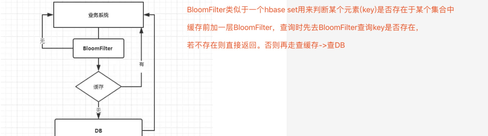
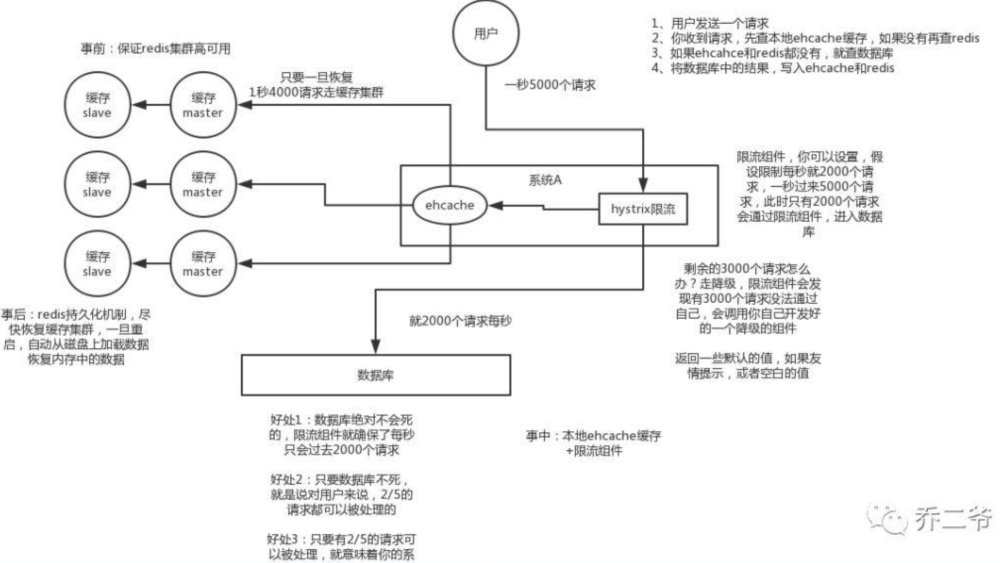

# [缓存穿透、缓存击穿、缓存雪崩、热点数据失效](https://juejin.im/post/5c9a67ac6fb9a070cb24bf34)

业务系统大致调用流程:

+ 业务系统查询数据->缓存->有数据->返回数据->业务系统;

+ 业务系统查询数据->缓存->没有数据->查询数据库->返回数据->业务系统

## 缓存穿透

+ 缓存穿透：查询不存在数据的现象叫缓存穿透

    **缓存及数据库都查询不到这条数据，但每次请求都打到数据库上面去**
    
+ 缓存穿透问题：

    黑客攻击系统，拿不存在的ID查询数据，产生大量请求到数据库去查询。导致数据库压力过大宕机
    
+ 解决方案：

    发生穿透即缓存中没有存储这些空数据的key,导致每次查询均需到D。可将这些key对应的值设为null并放到缓存中，并设置过期时间
    
+ BloomFilter 布隆过滤器,类似于hbase set 用来判断某个元素（key）是否存在于某个集合中

   

## 缓存击穿

+ 缓存击穿

  高并发系统中，大量请求同时查询一个key时，此时key刚好失效，导致大量请求打到DB
  
+ 缓存击穿问题

  造成某一时刻数据库请求量过大，压力剧增
  
+ 解决方案

  在第一个查询数据请求上使用互斥锁来锁住它。其他线程走到该步因拿不到锁就等着，直到第一个线程查询到了数据，做缓存，后面线程查询缓存
  
## 缓存雪崩

+ 缓存雪崩

  当某一时刻发生大规模缓存失效情况，如缓存服务器宕机，则会有大量请求打到DB，则DB承不住挂掉
  
+ 解决方案

  + 事前

      集群缓存，保证缓存服务的高可用
      
      如：Redis缓存，可使用：主从+哨兵。Redis Cluster来避免Redis全盘崩溃情况
  
  + 事中
  
      ehcache本地缓存 + Hystrix限流&降级,避免MySQL被打死

  + 事后
  
      开启Redis持久化机制，尽快恢复缓存集群
      
      **一旦重启，就能从磁盘上自动加载数据恢复内存中的数据**
      
    

## 解决热点数据集中失效问题

+ 热点数据集中缓存失效

  设置缓存时，会为缓存设置过期时间，对于热点数据，若缓存失效，则大量请求过来会被打到DB
  
+ 解决方案

  + 设置不同的失效时间
  
    对于热点的数据集，设置缓存失效时间错开。如在一个基础时间上加上/减掉一个范围内的随机值
    
  + 互斥锁
  
    第一个请求查询DB时给他加上互斥锁，其余请求等待第一个请求完成，并将数据写入缓存。其他请求即可查缓存而保护DB   
      
  
     