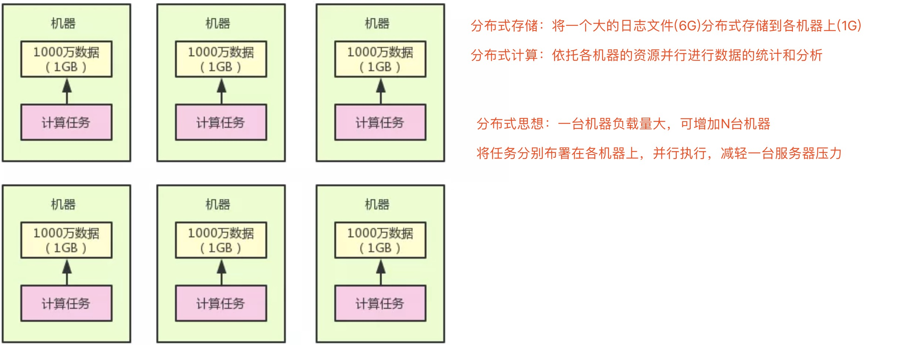

# 分布式

## [分布式系统--掘金](https://juejin.im/post/5c992471e51d456079490ef8)

+ 单块系统 (一个项目，一个DB，开发人员拉取，修改，再合并，再测试)

+ 分布式系统(大项目，分N个小项目，每个小项目通过Http/rpc方式通，且每个小项目都有自己的DB)

**分布式系统技术**

+ 分布式服务框架(dubbo/spring cloud)

+ 分布式事务(TCC/最终一致性/2PC等分布式事务实现方案)

+ 分布式锁

+ 分布式缓存(redis等缓存系统)

  **单块系统：可在单个JVM里本地缓存，如HashMap缓存一些数据**

+ 分布式消息系统(kafka/rabbitmq分布式消息中间件)

  **单块系统：可用类似LinkedList之类的数据结构作为一个本地内存里的队列**
  
+ 分布式搜索系统(需在系统里引入一个外部的分布式搜索系统，如Elasticsearch)

  **单块系统：基于Lucene来开发一个全文检索模块**
  
+ 分布式配置中心

+ 分布式日志中心

+ 分布式监控告警中心

+ 分布式会话

+ [分布式存储 & 分布式计算](https://mp.weixin.qq.com/s/1Of8HdSFQ-LDHj5IX-f6pg)

  **分布式存储：Hadoop HDFS用于做分布式存储，它可将一个超大文件拆分为很多小的数据块放在很多机器上**
  
  **分布式计算系统：Spark可以把计算任务分发到各个机器上，对各个数据块进行并行计算**
  
  

**其他复杂的分布式系统：hadoop、spark、hbase等大数据系统**

