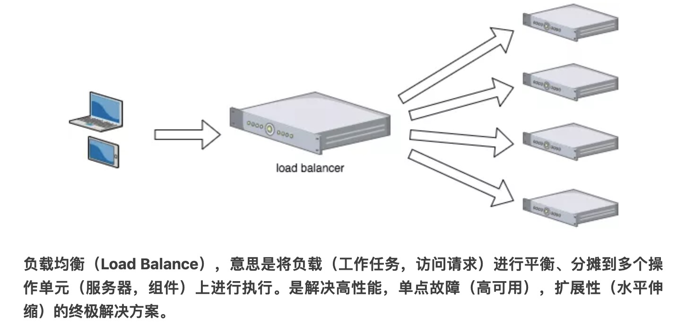

# 分布式和集群

## 分布式（distributed）

是指在多台不同的服务器中部署"不同的服务模块"，通过远程调用协同工作，对外提供服务。

## 集群（cluster）

是指在多台不同的服务器中部署"相同应用或服务模块"，构成一个集群，通过负载均衡设备对外提供服务。

## 集中式 & 集群 & 分布式部署

**集中式部署电子商务应用(集中式系统只有一台计算机提供服务)**

类比：一个饭店，仅有一个厨师(厨师不能生病，且客流量小)

**集群部署(多台计算机提供同样的服务)**

类比：一个饭店，客流量大，一个厨师以不足以支撑业务，因此聘请多个厨师，做同样的事件(客流量大，通过负载均衡分配由哪个厨师做任务)

**分布式部署(多台计算机提供不同的服务(通过把一件大的事情，拆分成多个小事情，分别交给不同的人来做))**

类比：一个饭店，厨师，洗菜等职位分工(术业有专攻),提升用户体验

[漫话：如何给女朋友解释什么是分布式和集群](https://mp.weixin.qq.com/s?__biz=Mzg3MjA4MTExMw==&mid=2247484758&amp;idx=1&amp;sn=4195022c137e260089da526caf27aa0e&source=41#wechat_redirect)

------------------------------------------------------------------------------

# 负载均衡

Load balancing，即负载均衡，是一种计算机技术，用来在多个计算机（计算机集群）、网络连接、CPU、磁盘驱动器或其他资源中分配负载，

以达到最优化资源使用、最大化吞吐率、最小化响应时间、同时避免过载的目的。

**类比：春运火车站不同入口限流策略，红色票哪个进站口，蓝色票哪个进站口...**

## OSI 七层参考模型

OSI是一个开放性的通信系统互连参考模型，他是一个定义得非常好的协议规范。

**计算机网络中相关概念**

+ telnet、HTTP、FTP、NFS、SMTP、DNS等属于第七层应用层的概念。

+ TCP、UDP、SPX等属于第四层传输层的概念。

+ IP、IPX等属于第三层网络层的概念。

+ ATM、FDDI等属于第二层数据链路层的概念。

**其中:二，三，四，七层负载均衡中最常用的是四和七层负载均衡**

## 负载均衡工具

### LVS(Linux Virtual Serve) --LVS主要用来做四层负载均衡

### Nginx(网页服务器) --Nginx主要用来做七层负载均衡

Nginx能反向代理HTTP, HTTPS, SMTP, POP3, IMAP的协议链接，以及一个负载均衡器和一个HTTP缓存

### HAProxy(c语言编写) --HAProxy主要用来做七层负载均衡

HAProxy其提供高可用性、负载均衡，以及基于TCP和HTTP的应用程序代理。

## 负载均衡算法

### 静态负载均衡算法

+ 轮询(Round Robin)
  
  顺序循环将请求一次顺序循环地连接每个服务器。当其中某个服务器发生第二到第7 层的故障，BIG-IP 就把其从顺序循环队列中拿出，不参加下一次的轮询，直到其恢复正常。

+ 比率(Ratio)

  给每个服务器分配一个加权值为比例，根椐这个比例，把用户的请求分配到每个服务器。
  
  当其中某个服务器发生第二到第7 层的故障，BIG-IP 就把其从服务器队列中拿出，不参加下一次的用户请求的分配, 直到其恢复正常。
  
+ 优先权(Priority)

  给所有服务器分组,给每个组定义优先权，BIG-IP 用户的请求，分配给优先级最高的服务器组（在同一组内，采用轮询或比率算法，分配用户的请求）；
  
  当最高优先级中所有服务器出现故障，BIG-IP 才将请求送给次优先级的服务器组。这种方式，实际为用户提供一种热备份的方式。

### 动态负载均衡算法

+ 最少连接数(Least Connection)
  
  传递新的连接给那些进行最少连接处理的服务器。当其中某个服务器发生第二到第7 层的故障，BIG-IP 就把其从服务器队列中拿出，不参加下一次的用户请求的分配, 直到其恢复正常。

+ 最快响应速度(Fastest)
 
  传递连接给那些响应最快的服务器。当其中某个服务器发生第二到第7 层的故障，BIG-IP 就把其从服务器队列中拿出，不参加下一次的用户请求的分配，直到其恢复正常。

+ 观察方法(Observed)

  连接数目和响应时间以这两项的最佳平衡为依据为新的请求选择服务器。当其中某个服务器发生第二到第7 层的故障，BIG-IP就把其从服务器队列中拿出，不参加下一次的用户请求的分配，直到其恢复正常

+ 预测法(Predictive)

  BIG-IP利用收集到的服务器当前的性能指标，进行预测分析，选择一台服务器在下一个时间片内，其性能将达到最佳的服务器相应用户的请求。(被BIG-IP 进行检测)

+ 动态性能分配(Dynamic Ratio-APM)

  BIG-IP 收集到的应用程序和应用服务器的各项性能参数，动态调整流量分配。

+ 动态服务器补充(Dynamic Server Act)

  主服务器群中因故障导致数量减少时，动态地将备份服务器补充至主服务器群。

+ 服务质量(QoS)

  按不同的优先级对数据流进行分配

+ 服务类型(ToS)

  按不同的服务类型（在Type of Field中标识）负载均衡对数据流进行分配
 
+ 规则模式

  针对不同的数据流设置导向规则，用户可自行

[负载均衡漫画版](https://mp.weixin.qq.com/s/SeERdxWRiowQMe4QAcr8oA)

------------------------------------------------------------------------------