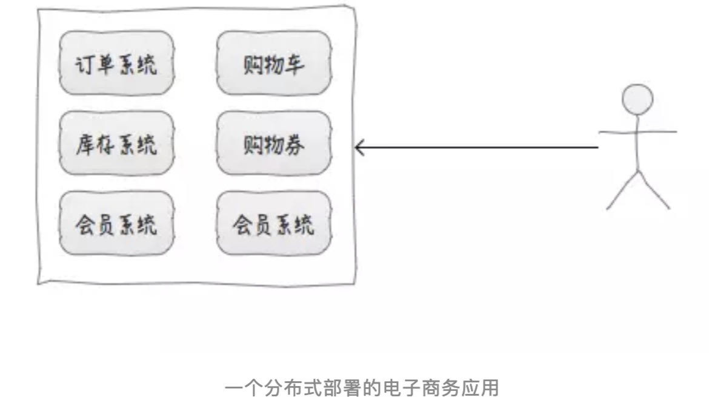

# 分布式和集群

## 分布式（distributed）

是指在多台不同的服务器中部署不同的服务模块，通过远程调用协同工作，对外提供服务。

## 集群（cluster）

是指在多台不同的服务器中部署相同应用或服务模块，构成一个集群，通过负载均衡设备对外提供服务。

## 集中式 & 集群 & 分布式部署

**集中式部署电子商务应用(集中式系统只有一台计算机提供服务)**

类比：一个饭店，仅有一个厨师(厨师不能生病，且客流量小)

**集群部署(多台计算机提供同样的服务)**

类比：一个饭店，多个厨师(客流量大，通过负载均衡分配由哪个厨师做任务)

**分布式部署(多台计算机提供不同的服务(通过把一件大的事情，拆分成多个小事情，分别交给不同的人来做))**

类比：一个饭店，厨师，洗菜等职位分工(术业有专攻),提升用户体验

[漫话：如何给女朋友解释什么是分布式和集群](https://mp.weixin.qq.com/s?__biz=Mzg3MjA4MTExMw==&mid=2247484758&amp;idx=1&amp;sn=4195022c137e260089da526caf27aa0e&source=41#wechat_redirect)