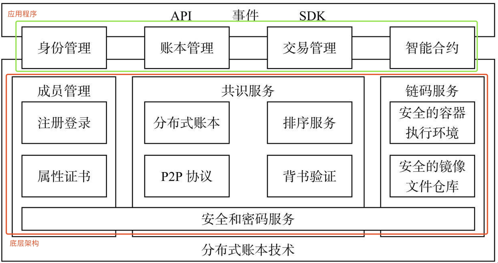
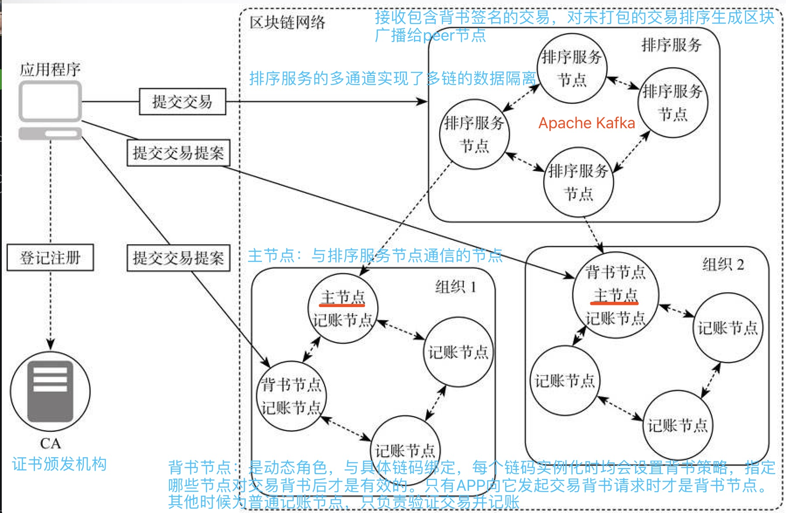
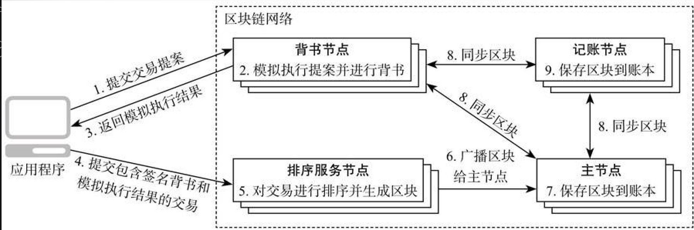

# 一。超级账本初体验     --2019.4 开心玉凤

## (一)。环境准备

### 1.安装git

    $ yum install git
    
    $ git version #git version 1.8.3.1

### 2.[安装docker & docker-compose](resources/deploy-docker.sh) | [参考](https://blog.csdn.net/vipty/article/details/80889699)

### 3.安装与配置golang环境

    $ wget https://dl.google.com/go/go1.9.2.linux-amd64.tar.gz
    
    $ tar -zxvf go1.9.2.linux-amd64.tar.gz 
    
    $ vim ~/.bash_profile
    # add content 配置golang环境变量
    export GOROOT=/home/shiyufeng/go
    export GOBIN=$GOROOT/bin
    export GOPATH=/home/workspace
    export PATH=$PATH:$GOBIN
    
    $ source ~/.bash_profile
    
    $ go version #测试go环境变量是否配置成功
    
### 4.下载fabric源码

    $ git clone https://github.com/hyperledger/fabric.git
    
## (二)超级账本部署调用

### 1.下载docker镜像文件

    $ cd fabric/scripts/
    
    $ chmod +x bootstrap.sh
    
    $ ./bootstrap.sh   #下载镜像(最新版本1.4.0)
    
    [root@k8s4 scripts]# docker images
    REPOSITORY                     TAG                 IMAGE ID            CREATED             SIZE
    hyperledger/fabric-zookeeper   0.4.15              20c6045930c8        2 weeks ago         1.43 GB
    hyperledger/fabric-zookeeper   latest              20c6045930c8        2 weeks ago         1.43 GB
    hyperledger/fabric-kafka       0.4.15              b4ab82bbaf2f        2 weeks ago         1.44 GB
    hyperledger/fabric-kafka       latest              b4ab82bbaf2f        2 weeks ago         1.44 GB
    hyperledger/fabric-couchdb     0.4.15              8de128a55539        2 weeks ago         1.5 GB
    hyperledger/fabric-couchdb     latest              8de128a55539        2 weeks ago         1.5 GB
    hyperledger/fabric-javaenv     1.4.0               3d91b3bf7118        2 months ago        1.75 GB
    hyperledger/fabric-javaenv     latest              3d91b3bf7118        2 months ago        1.75 GB
    hyperledger/fabric-tools       1.4.0               0a44f4261a55        2 months ago        1.56 GB
    hyperledger/fabric-tools       latest              0a44f4261a55        2 months ago        1.56 GB
    hyperledger/fabric-ccenv       1.4.0               5b31d55f5f3a        2 months ago        1.43 GB
    hyperledger/fabric-ccenv       latest              5b31d55f5f3a        2 months ago        1.43 GB
    hyperledger/fabric-orderer     1.4.0               54f372205580        2 months ago        150 MB
    hyperledger/fabric-orderer     latest              54f372205580        2 months ago        150 MB
    hyperledger/fabric-peer        1.4.0               304fac59b501        2 months ago        157 MB
    hyperledger/fabric-peer        latest              304fac59b501        2 months ago        157 MB
    hyperledger/fabric-ca          1.4.0               1a804ab74f58        2 months ago        244 MB
    hyperledger/fabric-ca          latest              1a804ab74f58        2 months ago        244 MB
    
### 2.部署超级账本网络

    #fabric-samples工程中已经生成的配置文件体验部署安装过程
    $ git clone https://github.com/hyperledger/fabric-samples.git 
    
    $ cd fabric-samples/basic-network/
    
    $ [root@k8s4 basic-network]# docker-compose -f docker-compose.yml up -d #利用docker-compose启动容器
      Creating network "net_basic" with the default driver
      Creating couchdb             ... done
      Creating orderer.example.com ... done
      Creating ca.example.com      ... done
      Creating cli                 ... done
      Creating peer0.org1.example.com ... done
      
    #切换到管理员用户创建和加入通道
    #切换环境到管理员用户的MSP(必须应用管理员的MSP才能创建通道)，进入peer节点容器peer0.org1.exmaple.com
    [root@k8s4 basic-network]# docker exec -it -e "CORE_PEER_MSPCONFIGPATH=/etc/hyperledger/msp/users/Admin@org1.example.com/msp" peer0.org1.example.com bash

**通道Channel:实现了数据的隔离和私密性，加入到通道中的所有peer节点间共享同一个账本**
    
    #创建通道channel(上述必须为管理员MSP，才能够创建channel)
    root@e7512bb25fa2:/opt/gopath/src/github.com/hyperledger/fabric# peer channel create -o orderer.example.com:7050 -c mychannel -f /etc/hyperledger/configtx/channel.tx 
    2019-04-08 07:18:55.178 UTC [channelCmd] InitCmdFactory -> INFO 001 Endorser and orderer connections initialized
    2019-04-08 07:18:55.216 UTC [cli.common] readBlock -> INFO 002 Received block: 0
    
    #加入通道
    root@e7512bb25fa2:/opt/gopath/src/github.com/hyperledger/fabric# peer channel join -b mychannel.block 
    2019-04-08 07:19:30.218 UTC [channelCmd] InitCmdFactory -> INFO 001 Endorser and orderer connections initialized
    2019-04-08 07:19:30.330 UTC [channelCmd] executeJoin -> INFO 002 Successfully submitted proposal to join channel
    #退出peer节点容器
    root@e7512bb25fa2:/opt/gopath/src/github.com/hyperledger/fabric# exit
    exit

**链码chaincode:可独立运行的应用程序，运行在基于Docker的安全容器中，在启动时和背书节点建立gRPC连接，在运行过程中通过链码接口和背书节点进行通信，实现账本交互**

**链码安装:将链码放到Peer节点文件系统的过程**

**链码实例化：在指定通道上启动并初始化链码的过程。初始化完成后，安装过链码的peer节点可以接收并处理链码调用请求**
    
    #进入cli容器，安装链码和实例化
    [root@k8s4 basic-network]# docker exec -it cli /bin/bash
    #给peer节点peer0.org1.example.com安装链码
    # -n指定链码名称 -v指定链码版本 -p指定链码源码路径
    root@e522a9f4ec5c:/opt/gopath/src/github.com/hyperledger/fabric/peer# peer chaincode install -n mycc -v v0 -p github.com/chaincode_example02/go
    2019-04-08 07:27:18.187 UTC [chaincodeCmd] checkChaincodeCmdParams -> INFO 001 Using default escc
    2019-04-08 07:27:18.187 UTC [chaincodeCmd] checkChaincodeCmdParams -> INFO 002 Using default vscc
    2019-04-08 07:27:18.614 UTC [chaincodeCmd] install -> INFO 003 Installed remotely response:<status:200 payload:"OK" > 
    #实例化链码
    root@e522a9f4ec5c:/opt/gopath/src/github.com/hyperledger/fabric/peer# peer chaincode instantiate -o orderer.example.com:7050 -C mychannel -n mycc -v v0 -c '{"Args":["init","a","100","b","200"]}'
    2019-04-08 07:32:17.326 UTC [chaincodeCmd] checkChaincodeCmdParams -> INFO 001 Using default escc
    2019-04-08 07:32:17.326 UTC [chaincodeCmd] checkChaincodeCmdParams -> INFO 002 Using default vscc
    
**ESCC&VSCC:**

    ESCC(Endorsement System chaincode):交易背书系统链码。主要功能是对交易结果进行结构转换和签名背书
    
    VSCC(Validation System chaincode):交易验证系统链码。主要功能是记账前对区块和交易进行验证
 
**链码查询：查询是一种对账本只读不写的链码调用，可读取一个或多个键的状态值。由于查询不会更改账本状态，所以客户端通常不会提交这些只读交易给排序服务打包到区块里**
   
    #查询初始值
    root@e522a9f4ec5c:/opt/gopath/src/github.com/hyperledger/fabric/peer# peer chaincode query -C mychannel -n mycc -c '{"Args":["query","a"]}'
    100
    #调用链码，从a转移10到b
    #-C指定通道名称 -n指定链码名称 -c指定参数
    root@e522a9f4ec5c:/opt/gopath/src/github.com/hyperledger/fabric/peer# peer chaincode invoke -C mychannel -n mycc -c '{"Args":["invoke","a","b","10"]}'
    2019-04-08 07:46:08.266 UTC [chaincodeCmd] InitCmdFactory -> INFO 001 Retrieved channel (mychannel) orderer endpoint: orderer.example.com:7050
    2019-04-08 07:46:08.278 UTC [chaincodeCmd] chaincodeInvokeOrQuery -> INFO 002 Chaincode invoke successful. result: status:200 
    #再查询a值
    root@e522a9f4ec5c:/opt/gopath/src/github.com/hyperledger/fabric/peer# peer chaincode query -C mychannel -n mycc -c '{"Args":["query","a"]}'
    90

**链码部署交易:链码部署是执行链码实例化的交易，是一种特殊的链码调用操作，链码部署成功后，链码就部署到区块链上了**

**链码初始化：链码实例化或升级时调用的初始化操作**
    
**链码打包：生成包含链码源码，实例化策略和签名的文件，基于这个文件进行链码实例化操作**

**链码调用交易：调用链码的操作，实现智能合约的功能。只有链码部署和链码调用操作才能通过链码的接口修改账本的状态数据**

**链码升级：链码安装后可随时升级，链码名称需保持不变，必须要更新的是链码版本，其他部分如链码所有者和实例化策略**

----------------------------------------------

# 二.超级账本系统架构

## 1。Hyperledger fabric1.0设计特点

### (1)模块插件化

    CA模块，共识算法，状态DB存储，ESCC,VSCC,BCCSP等均是可插拔的，提供了通用API.

### (2)充分利用容器技术

    节点应用容器做为运行环境，链码默认运行在安全容器中
    
    应用程序/外部系统-->背书节点API-->容器(链码)-->更新状态数据库
    
### (3)可扩展性

    peer节点拆分：背书节点(Endoser)，排序服务节点(Orderer)，记账节点(Committer)
    
    节点可加入不同channel,链码可运行在不同节点上。（提供并行执行效率和吞吐量）

### (4)安全性

    MSP(membership service provider)模块验证，授权最终用户能够使用区块链网络功能
    
    多链和多通道设计实现数据隔离，提供应用程序和链码间安全通道，实现隐私保护
    
## 2。系统逻辑架构

**名词:**

    MSP(Membership Service Provider)，每个MSP会建立一套根信任证书体系，得用PKI(public key infrastructure)对成员身份进行认证，验证成员用户提交请求的签名。
    
    注册证书分为：
    
    (1)注册证书(ECert)：用于用户身份 
    
    (2)交易证书(TCert):用于交易签名 
    
    (3)TLS证书(TLS Cert)：用于TLS传输

## 3。网络节点架构

   

## 4。典型交易流程

 
