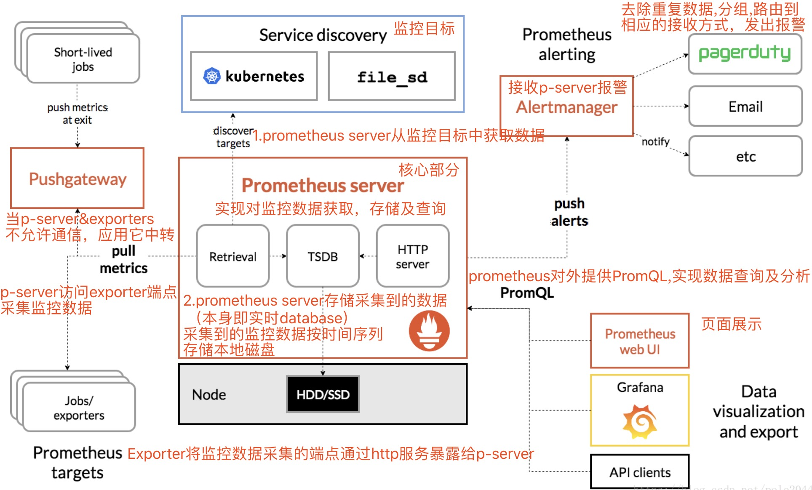

# [Prometheus](https://github.com/prometheus/prometheus)

## Prometheus 与 kubernetes

+ Prometheus:k8s集群的监控系统

  + Prometheus是一套开源的系统监控报警框架
  
  + 不适用对采集100%准确的情形，主要用于记录时间序列数据
  
  + Prometheus适用于微服务的体系架构

+ k8s:容器集群管理系统

## Prometheus组成及架构

### Prometheus生态圈组件

+ Prometheus Server:收集和存储时间序列数据

+ Client Library:客户端库，为需要监控的服务生成相应的metrics并暴露给Prometheus Server。当Prometheus server 来pull时，直接返回实时状态的metrics

**[prometheus工作流](https://blog.csdn.net/polo2044/article/details/83051314)**

+ Prometheus server定期从配置好的jobs或者exporters中拉取metrics，或者接收来自Pushgateway发送过来的metrics，或者从其它的Prometheus server中拉metrics

+ Prometheus server在本地存储收集到的metrics，并运行定义好的alerts.rules，记录新的时间序列或者向Alert manager推送警报

+ Alertmanager根据配置文件，对接收到的警报进行处理，发出告警

+ 在图形界面中，可视化采集数据

## [Prometheus入门与实践](https://www.ibm.com/developerworks/cn/cloud/library/cl-lo-prometheus-getting-started-and-practice/)

##