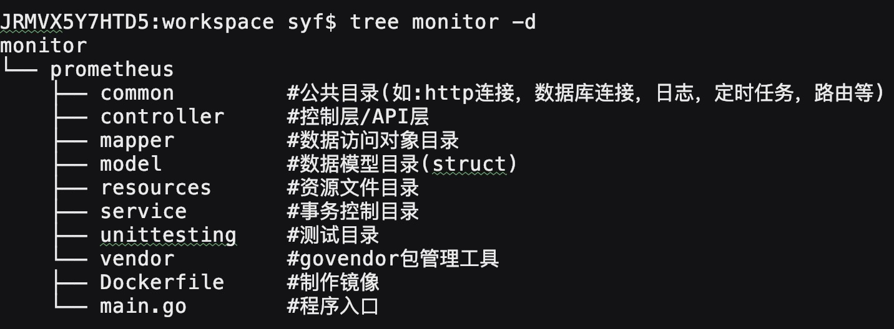

| 2019.6.21 记录一次prometheus项目开发经验     --开心玉凤

### 项目简介

>项目描述：
    
    fabric网络部署在k8s中。安装prometheus监控fabric网络，Grafana可展示view

    prometheus监控物理指标：CPU，内存，磁盘大小及读写字节数和读写请求数等信息(以namespace为单位抓取数据)
    
    prometheus监控fabric网络指标： 区块高度(以channel为单位)
    
 
### 项目开发
   
>项目开发：

    开发工具: GOLand   |   开发语言：golang
    
    框架：Gin框架(路由) + beego日志框架(记录日志) + viper读取配置文件 + sqlx数据库连接 + govendor包管理工具 + cron计划任务
    
    应用程序包：
    1.go get github.com/gin-gonic/gin
    2.go get github.com/astaxie/beego/logs
    3.go get github.com/spf13/viper
    4.go get github.com/jmoiron/sqlx
    5.go get -u -v github.com/kardianos/govendor
    6.go get github.com/robfig/cron
    
    
>项目目录结构：

    
>应用govendor依赖包管理工具，将go get获取的依赖包，生成在/vendor目录下

    govendor类似于java的maven依赖包管理工具

参考：

[Golang包管理工具之govendor的使用](https://www.cnblogs.com/liuzhongchao/p/9233177.html)

[Go Mod对比Go Vendor](https://studygolang.com/articles/18887?fr=sidebar)

    1.安装
    go get -u -v github.com/kardianos/govendor
    
    2.进入项目目录
    
    3.初始化vendor目录
    govendor init
    
    4.生成依赖包
    govendor add +external #生成依赖包 
    
    5.更新依赖包
    govendor update +vendor
  
  
### 项目部署

#### 本地测试
  
>golang项目编译成二进制

参考：[Go跨平台编译](https://studygolang.com/articles/16633?fr=sidebar)

    1.问题描述:
    
    mac编译直接go build编译的二进制文件，拷备到linux无法执行问题。因此需要修改环境变量
    
    2.解决方案:
    
    (1). $ env  #查询环境变量
    
    (2). $ GOHOSTOS="linux"  GOOS="linux" go build main.go
    
         或用-o参数指定生成的二进制名称
         
         CGO_ENABLED=0 GOOS=linux GOARCH=amd64 go build -o monitor main.go
         
>编写Dockerfile（镜像制作）

参考：[官网Dockerfile](https://docs.docker.com/engine/reference/builder/#copy)

    $ cd monitor/prometheus

    $ vim Dockerfile
    
    ---------------------

    FROM golang:1.10-alpine3.7                   #指定基础镜像
    
    COPY monitor /root/                          #拷备Dockerfile目录下monitor二进制文件到容器/root目录下
    
    #此处可切换目录:( WORKDIR /root )  并设置二进制执行权限 (RUN chmod 755 monitor)
    
    RUN mkdir -p /root/prometheus/resources      #容器中创建资源目录(配置文件指定./prometheus/resources/config.yaml)
    
    COPY resources/* /root/prometheus/resources/ #拷备Dockerfile目录下resources目录文件到容器对应目录下
    
    WORKDIR /root                                #切换工作目录到/root下
    
    EXPOSE 8085                                  #暴露端口
    
    ENTRYPOINT ["./monitor"]                     #执行二进制(或: CMD "./monitor")
    
    ---------------------
 
>构建镜像

参考:[Docker 命令大全](https://www.runoob.com/docker/docker-build-command.html)
    
    docker build -t monitor:v0621 .  
    
    #说明:
    
    1。docker build 命令用于使用 Dockerfile 创建镜像
    
    2。-t指定镜像名称和标签，如monitor:v0621，也可以不指定标签，默认为latest
    
    3。注意后面的.表示当前目录下的Dockerfile，也可手动指定Dockerfile文件位置
    
       docker build -f /path/to/Dockerfile .
       
>测试镜像

    docker run monitor -d  #表示后台运行，ctrl+c结束打印日志，docker容器不会被停止
    
    docker run monitor -ti #ctrl+c结束打印日志，docker容器会被停止
    
#### 部署到远程服务器
    
>save镜像,打tar包

参考：

[将服务打包jar包构建成镜像并导出tar包](https://blog.csdn.net/qq_34763130/article/details/87864072)

[Docker save命令](https://www.runoob.com/docker/docker-save-command.html)

    $ docker save -o ./monitor.tar monitor:v0621  #./monitor.tar指定tar包存储路径及名称,monitor:v0621指定源镜像名称及版本号
    
>将镜像拷备到服务器~/syf目录下，并load加载镜像

    $ scp monitor.tar root@ip:~/syf
    
    #登录服务器，cd ~/syf
    $ docker load -i monitor.tar  #参数-i指定导出的文件
    
    #服务器镜像拷备成功
    
    #将项目所需要的配置文件目录resouces目录一并拷备到服务器~/syf目录下(cd ~/syf && mkdir -p prometheus/resources)
    
>启动容器，并设置文件挂载目录(若：配置文件有修改，可在挂载目录中修改并停止/删除容器，重新启动容器即可)

    $ docker run -v ~/syf/prometheus/resources/:/root/prometheus/resources/ -p 8085:8085 -d monitor:v0621
    
    #物理机:虚拟机(-v:指定挂载目录,-p：映射端口，若不指定，则外界无法访问)
    
    
-----------------------------------

### golang技术总结

##### 一。普通http请求及https请求(跳过证书验证及有证书验证)

##### 二。viper读取yaml配置文件，获取属性值

##### 三。sqlx数据库连接及事务 | 也可用"gorm"框架

##### 四。beego日志框架，记录日志

##### 五。Gin框架，路由应用

##### 六。govendor管理依赖包

##### 七。定时任务:go get github.com/robfig/cron

##### 八。基础

###### 1.正则应用

    func RegexPOrderPeer(str string) (string, string) {
    
    	matchOrder, _ := regexp.MatchString("^orderer-.*", str) #查找以orderer-开头后面作意字符
    
    	matchPeer, _ := regexp.MatchString("^peer.", str)
    
    	index := strings.Index(str, "-")
    
    	service := str[0:index]
    
    	if matchOrder {
    
    		return "orderer", service
    
    	} else if matchPeer {
    
    		return "peer", service
    
    	} else {
    
    		return "", service
    
    	}
    }
    
###### 2。读取/写入文件

    func main(){
        str:="{}"
        filePath := viper.GetString("path/filename.txt")
        	if checkFileIsExist(filePath) { //文件已经存在，则从文件中读取数据
        		rs := readFromFile(filePath)
        		fmt.println(rs)
        	} else{
        	   WriteToFile(filePath, str)
        	}
    }

    //判断文件是否存在,存在返回true不存在返回false
    func checkFileIsExist(filename string) bool {
    	var exist = true
    	if _, err := os.Stat(filename); os.IsNotExist(err) {
    		exist = false
    	}
    	return exist
    }
    
    //读取文件
    func readFromFile(fileName string) string {
    
    	if fileObj, err := os.Open(fileName); err == nil {
    		defer fileObj.Close()
    		if contents, err := ioutil.ReadAll(fileObj); err == nil {
    			result := strings.Replace(string(contents), "\n", "", 1)
    			return result
    		}
    	}
    	return ""
    }
    
    //初始化配置数据写入文件
    func WriteToFile(fileName, data string) {
    
    	var f *os.File
    	var err error
    
    	f, err = os.Create(fileName) //创建文件
    	if err != nil {
    		logs.Error("创建文件异常:%s", err.Error())
    		return
    	}
    	_, err = io.WriteString(f, data) //写入文件(字符串)
    
    	if err != nil {
    		logs.Error("数据写入文件异常:%s", err.Error())
    		return
    	}
    
    	logs.Debug("已成功写入数据到文件:%s", fileName)
    }

###### 3. json -> struct  |  json -> map  | struct -> json     

(1). json -> struct   json.Unmarshal()

(2). struct -> json   json.marshal()

(3). json -> map

    var jsonStr={"kind":"Deployment","apiVersion":"apps/v1","metadata":{"name":"prom-prometheus-server","namespace":"prometheus","selfLink":"/apis/apps/v1/namespaces/prometheus/deployments/prom-prometheus-server","uid":"xx","resourceVersion":"xx","generation":6,"creationTimestamp":"2019-06-11T07:27:04Z","labels":{"app":"prometheus","chart":"prometheus-7.4.4","component":"server","heritage":"Tiller","release":"prom"},"annotations":{"deployment.kubernetes.io/revision":"1","field.cattle.io/publicEndpoints":"[{\"addresses\":[\"192.1.1.1\"],\"port\":2222,\"protocol\":\"TCP\",\"serviceName\":\"prometheus:prom-prometheus-server\",\"allNodes\":true}]"}},"spec":{"replicas":1,"selector":{"matchLabels":{"app":"prometheus","component":"server","release":"prom"}},"template":{"metadata":{"creationTimestamp":null,"labels":{"app":"prometheus","component":"server","release":"prom"}},"spec":{"volumes":[{"name":"config-volume","configMap":{"name":"prom-prometheus-server","defaultMode":420}},{"name":"storage-volume","persistentVolumeClaim":{"claimName":"prom-prometheus-server"}}],"containers":[{"name":"prometheus-server-configmap-reload","image":"jimmidyson/configmap-reload:v0.2.2","args":["--volume-dir=/etc/config","--webhook-url=http://127.0.0.1:9090/-/reload"],"resources":{},"volumeMounts":[{"name":"config-volume","readOnly":true,"mountPath":"/etc/config"}],"terminationMessagePath":"/dev/termination-log","terminationMessagePolicy":"File","imagePullPolicy":"IfNotPresent"},{"name":"prometheus-server","image":"prom/prometheus:v2.5.0","args":["--config.file=/etc/config/prometheus.yml","--storage.tsdb.path=/data","--web.console.libraries=/etc/prometheus/console_libraries","--web.console.templates=/etc/prometheus/consoles","--web.enable-lifecycle"],"ports":[{"containerPort":9090,"protocol":"TCP"}],"resources":{},"volumeMounts":[{"name":"config-volume","mountPath":"/etc/config"},{"name":"storage-volume","mountPath":"/data"}],"livenessProbe":{"httpGet":{"path":"/-/healthy","port":9090,"scheme":"HTTP"},"initialDelaySeconds":30,"timeoutSeconds":30,"periodSeconds":10,"successThreshold":1,"failureThreshold":3},"readinessProbe":{"httpGet":{"path":"/-/ready","port":9090,"scheme":"HTTP"},"initialDelaySeconds":30,"timeoutSeconds":30,"periodSeconds":10,"successThreshold":1,"failureThreshold":3},"terminationMessagePath":"/dev/termination-log","terminationMessagePolicy":"File","imagePullPolicy":"IfNotPresent"}],"restartPolicy":"Always","terminationGracePeriodSeconds":300,"dnsPolicy":"ClusterFirst","serviceAccountName":"prom-prometheus-server","serviceAccount":"prom-prometheus-server","securityContext":{"runAsUser":0},"schedulerName":"default-scheduler"}},"strategy":{"type":"RollingUpdate","rollingUpdate":{"maxUnavailable":1,"maxSurge":1}},"revisionHistoryLimit":10,"progressDeadlineSeconds":600},"status":{"observedGeneration":6,"replicas":1,"updatedReplicas":1,"readyReplicas":1,"availableReplicas":1,"conditions":[{"type":"Available","status":"True","lastUpdateTime":"2019-06-11T07:27:04Z","lastTransitionTime":"2019-06-11T07:27:04Z","reason":"MinimumReplicasAvailable","message":"Deployment has minimum availability."},{"type":"Progressing","status":"True","lastUpdateTime":"2019-06-11T07:27:46Z","lastTransitionTime":"2019-06-11T07:27:04Z","reason":"NewReplicaSetAvailable","message":"ReplicaSet \"prom-prometheus-server-8498ccdf84\" has successfully progressed."}]}}

    func DealDeploymentsData(jsonStr string, modifyVal float64) (map[string]interface{}, error) {
    
    	var mapResult map[string]interface{}  #定义map
    
    	err := json.Unmarshal([]byte(jsonStr), &mapResult) #json->map
    
    	if err != nil {
    		logs.Error("json转map错误:%s", err.Error())
    		return nil, err
    	}
    
    	for key, value := range mapResult {  #操作map
    
    		if key == "spec" {
    
    			val := value.(map[string]interface{})
    
    			for k, _ := range val {
    
    				if k == "replicas" {
    
    					val[k] = modifyVal 
    				}
    
    			}
    		}
    
    		if key == "metadata" {
    
    			val := value.(map[string]interface{})
    
    			for k, _ := range val {
    
    				if k == "uid" || k == "resourceVersion" || k == "creationTimestamp" {
    					delete(val, k)  #删除key值
    				}
    
    			}
    
    		}
    
    		if key == "status" {
    
    			delete(mapResult, key)  #删除key值
    
    		}
    
    	}
    
    	if err != nil {
    		return nil, err
    	}
    
    	return mapResult, nil
    }
    
(4).yaml->struct    (gopkg.in/yaml.v2)

参考[Go语言之读取yaml配置文件，转换成struct结构，json形式输出](https://blog.51cto.com/xingej/2115258)

    type PrometheusYaml struct {
    	Pkind              string `yaml:"kind" json:"kind"`
    	PApiVersion        string `yaml:"apiVersion" json:"apiVersion"`
    	PrometheusMetadata `yaml:"metadata" json:"metadata"`
    	PrometheusData     `yaml:"data" json:"data"`
    }
    
    ...
    
    newYaml := model.PrometheusYaml{}
    
    err := yaml.Unmarshal([]byte(str), &newYaml)
    

(5).yaml < - > json  yaml与json文件互转

###### 4.golang日期

    mTime, ok := val.Data.Result[i].Value[0].(float64)  #[1234567,0]
    if !ok {
       
    }
    mtime := int64(math.Ceil(mTime))
    metricTime := time.Unix(mtime, 0).Format("2006-01-02 15:04:05") //格式化时间

####### 5.go工程在启动时带入参数

[参考](https://blog.csdn.net/niyuelin1990/article/details/79035728)

[golang flag包用法](https://studygolang.com/articles/3365)

##### 九。数据库mysql

###### 1. varchar -> date函数：str_to_date()

应用表里为标准日期格式，但类型为varchar(2019-06-21 12:00:00)  str_to_date(str,'%Y-%m-%d %h%i%s')

###### 2.[mysql取每组前N条记录](https://www.cnblogs.com/softidea/p/10268811.html)

-------------------

[GO语言中文网](http://c.biancheng.net/view/81.html)

[golang笔记-命令篇](https://www.cnblogs.com/tianyajuanke/p/5196436.html)

-------------------

体胖还需勤跑步，人丑就要多读书!!!     ---开心玉凤
    