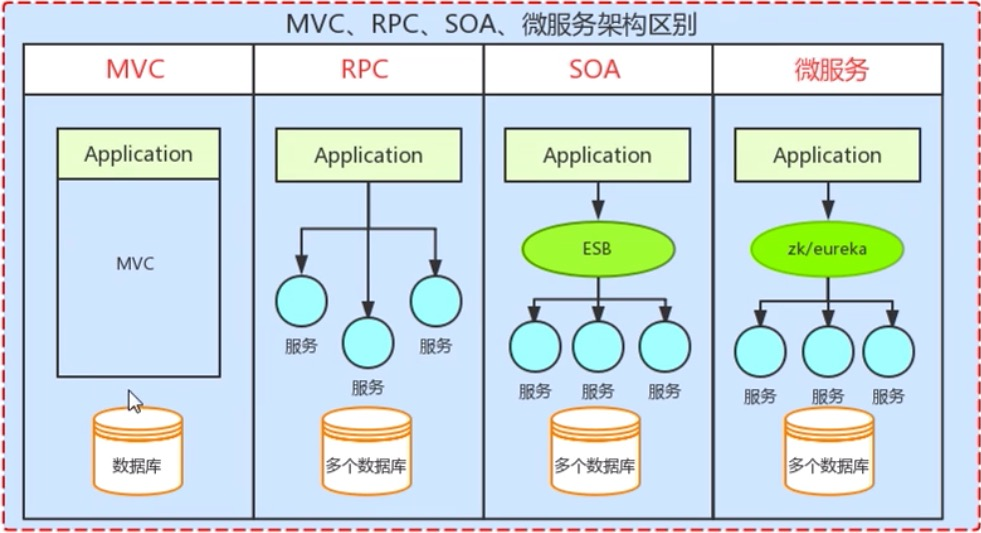

### [spring cloud学习视频](https://www.bjsxt.com/down/8672.html)

### 微服务架构

#### 1。什么是微服务(类似于SOA架构)

    微服务是一种软件的架构风格，一个大型的复杂软件应用，由一个或多个微服务组成。系统中的各个微服务可被独立部署。各个微服务间是松耦合的，每个微服务只关注于完成一个任务，并很好的完成该任务。

#### 2。架构风格

    项目的一种设计模式
    
>常见架构风格

    (1).基于客户端与服务端：如qq,应用需要安装客户端
    
    (2).基于组件模型的架构: 如EJB
    
    (3).分层架构：如MVC
    
    (4).面向服务架构：如SOA （整个系统拆分成若干服务，服务间相互通信）
    
    (5).微服务
    
>微服务特点

    (1).系统是由多个服务构成
    
    (2).每个服务可单独独立部署
    
    (3).每个服务间是松耦合的，服务内部是高内聚(每个服务只关注完成一个功能)的，外部是低耦合的
    
>微服务优缺点

优点：

    (1).测试，部署问题（单体架构，迭代版本需要重新部署，测试；微服务只需要部署，测试相关服务即可）
    
    (2).可伸缩性强(部分服务伸缩而不影响其他服务)
    
    (3).可靠性强(不会因为某个bug导致整个服务宕机，仅影响当前服务)
    
    (4).跨语言程度(不同服务可选择合适语言和工具开发)更加灵活
    
    (5).团队协作容易(只需了解自己的服务，不需要知道其他服务实现)
    
    (6).系统迭代容易
    
缺点：

    (1).运维成本过高，部署数量较多
    
    (2).接口兼容多版本问题(面向服务开发即面向接口开发)
    
    (3).分布式系统复杂性(网络延迟，服务容错，负载均衡需要考虑)
    
    (4).分布式事务(现已有解决方案)
    
    
-------------------------------------

### Spring cloud初级阶段

#### 1.微服务架构介绍

>单体架构(单体系统/单体应用)

    是一种把系统中所有的功能，模块耦合在一个应用中的架构方式
    
    特点：
    
    (1).打包成一个独立的单元，导成一个唯一的jar包或是war包
    
    (2).会以一个进程的方式来运行（jar/war依赖jvm运行，jvm是一个进程）
    
    (3).MVC模式就是单体架构
    
    优点：
    
    (1).项目易于管理
    
    (2).部署简单(单一架构，jar/war置于tomcat/webapp目录下即可运行)
    
    缺点：
    
    (1).测试成本高(所有功能均在一个项目，需求变更，迭代，则对其他部分可能会有影响，也需重新测试)
    
    (2).可伸缩性差(无法对某一模块进行水平扩展)
    
    (3).可靠性差(若因bug导致宕机，会导致整个系统不可用)
    
    (4).系统迭代困难(所有功能在一个系统)
    
    (5).跨语言程度差(统一技术栈，更换语言验)
    
    (6).团队协作难(不像微服务间团队与团队)

>微服务架构

>常见软件架构MVC,PRC,SOA,微服务架构区别

    (1)MVC架构：就是一个单体架构.代表技术：struct2,springmvc,spring,mybatis等
    
    RPC架构和SOA架构和微服务均有"服务概念"，可称为面向服务架构
    
    (2)RPC(Remote procedure call)架构：远程过程调用
    
      它是一种通过网络，从远程计算机程序上请求服务，而不需要了解底层网络技术的协议。
      
      通过Application调用，服务间不能相互通信
      
      代表技术：Thrift(支持跨平台，多语言调用),Hessian
      
    (3)SOA:解决RPC调用服务间管理，及注册发现等(RPC不能满足服务过多)
    
      SOA(service oriented architecture):面向服务的架构
      
      与RPC架构区别多了个ESB层(ESB主要治理服务)
      
      ESB(Enterprise service bus):企业服务总线,即服务中介，提供了服务与服务间的交互
      
      ESB包含功能：负载均衡，流量控制，加密处理，服务监控，异常处理，监控告急
      
      代表技术：Mule(以java为核心的消息框架..付费),WSO2(开源)
    
    (4)微服务(与SOA架构相似，不叫服务总线ESB，叫服务中心EK，更轻量)
    
      微服务就是一个轻量级的服务冶理方案
      
      代表技术：springcloud, dubbo
      
      注册中心：zookeeper, springcloud自带的eureka
    
>微服务的设计原则

+ AKF拆分原则

+ 前后端分离原则

+ 无状态服务

+ Restful通信风格

#### 2.Spring cloud入门

    课程工具:
    
    JDK1.8 / Eclipse Mars / Spring cloud:Dalston.SR5  / Spring Boot:1.5.3.RELEASE /RabbitMQ-server:3.5.1
    
    技术要求：
    
    SpringBoot有一定了解  &  做过EGO电商项目

>Spring Cloud简介

+ 什么是spring cloud

+ spring cloud与dubbo区别

>Spring Cloud版本

+ 常见版本号介绍

+ Spring cloud版本号介绍

+ Spring cloud与子项目版本兼容说明
    

    
    
    
    

