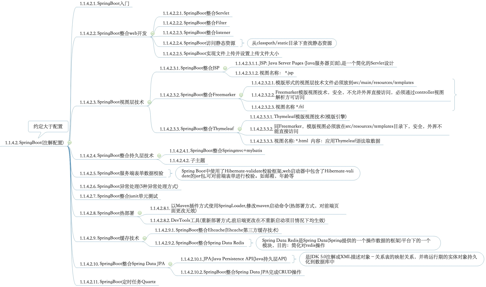

### [springBoot API](https://docs.spring.io/spring-boot/docs/2.1.6.RELEASE/api/)

### [SpringBoot学习目录](https://www.jianshu.com/p/9a08417e4e84)

#### 一。SpringBoot简单框架搭建

### [springboot学习视频](https://www.bjsxt.com/down/8660.html)

>1.构建spring Boot及启动器讲解

>2.Spring Boot整合web开发

    >spring Boot整合servlet(两种方式)
    
        方式一：通过注解扫描完成Servlet组件的注册
            
        方式二：通过方法完成Servlet组件的注册
        
    >spring Boot整合Filter(两种方式) :Filter过滤器
    
        方式一：通过注解扫描完成Filter组件的注册
        
        方式二：通过方法完成Filter组件的注册
    
    >spring Boot整合listener :Listener监听器

        方式一：通过注解扫描完成Listener组件的注册
                
        方式二：通过方法完成Listener组件的注册
        
    >Spring Boot访问静态资源
    
        (1)Spring Boot从classpath/static的目录下查找静态资源(目录名称必须为static,相对路径以static为准)
        
        (2)Spring Boot从ServletContext根目录下查找静态资源(目录名称必须为webapp,相对路径以webapp为准)
        
    >Spring Boot文件上传及设置上传文件大小默认值
    
>3.Spring Boot视图层技术

    > (1)Spring Boot整合JSP
    
    > (2)Spring Boot整合Freemarker (模版视图技术，安全)
    
         借助HBuilder做freemarker开发
      
         模版形式的视图层技术文件必须放到src/main/resources/templates,该目录安全，该目录不允许外界直接访问(不允许浏览器输入url访问该目录资源,必须通过controller进行视图解析跳转才可访问)
    
         视图名称 *.ftl ,模版文件
     
    > (3)Spring Boot整合Thymeleaf(重点)(Thymeleaf也是一个模版型视图技术，同freemarker)
    
          存放视图目录要求在:src/resources/templates,该目录安全，该目录不允许外界直接访问(不允许浏览器输入url访问该目录资源,必须通过controller进行视图解析跳转才可访问)
          
          Thymeleaf是通过它特定语法对html的标记做渲染
          
          视图名称: *.html  内容：应用Thymeleaf语法取数据
          
       Thymeleaf语法
       
>4.Spring Boot整合持久层技术

    > (1)Spring Boot整合springmvc+mybatis,实现CRUD
      
>5.Spring Boot服务端表单数据校验(Spring Boot中使用了Hibernate-validate校验框架,web启动器中包含了Hibernate-validate的jar包)

    > POJO类注解应用：如@NotBlank,@NotEmpty非空校验,@Length(min=6,max=20,message="描述信息"),@Min(判断数值最小范围，如：@Min(value=15),包含15),@Max(@Max(value=100)),@Email()
      
>6.Spring Boot异常处理(5种处理方式)

    >(1)自定义错误页面
    
    >(2)@ExceptionHadle注解处理异常
    
    >(3)@ControllerAdvice+@ExceptionHandler注解处理异常
    
    >(4)配置SimpleMappingExceptionResolver处理异常(缺点：与第3种不同，它不能传递异常信息,只能做异常类型和视图映射)
    
    >(5)自定义HandlerExceptionResolver类处理异常(解决4方式不能传递异常信息问题)
    
    > Spring Boot整合Junit单元测试
    
>7.Spring Boot热部署(2种方式)

**热部署：在项目不停止的情况下，完成项目部署(问题：代码改变，需将重启项目;热部署即代码改变，不必重启项目)**

    >SpringLoader插件:在部署项目时使用的是热部署方式
    
    (1)方式一：以Maven插件方式使用SpringLoader
    
        > RUN AS->Maven Build修改maven的启动命令
        
        > SpringLoader热部署程序是在系统后台以进程形式来运行，需要手动关闭该进程(否则会报端口被占用问题)
    
        缺点：只能对后台java代码做部署处理，但对页面无能为力
    
    (2)方式二：在项目中直接使用jar包的方式
    
    >DevTools工具:在部署项目时使用的是重新部署方式

>8.Spring Boot缓存技术

    >(1)Spring Boot整合Ehcache(Ehcache:第三方独立缓存技术)
    
        A>pom.xml中添加Ehcache启动器
        
        B>创建echcache.xml配置文件，存储到src/main/resources/ehcache.xml (主要用于配置缓存策略)
    
       @Cacheable 与 @CacheEvict 注解使用
       
       A>@Cacheable作用：把方法的返回值添加到Ehcache中做缓存
       
         @Cacheable(value="x"):value指定一个Ehcache配置文件中的缓存策略，未给定value，则name表示使用默认缓存策略
         
         @Cacheable(value="x",key=""):key给存储的值起个名称。在查询时若名称存在，则从缓存中将数据返回(缓存对象时做了个标记)
         
       B>@CacheEvict作用：清除缓存
       
         @CacheEvice(value="x",allEntries=true)  清除缓存中以x缓存策略缓存对象
       
    >(2)Spring Boot整合Spring Data Redis
    
       Spring Data Redis是属于Spring Data下的一个模块。作用就是简化对于redis的操作
       
       jedis:java操作redis的jar包 (jedis client / jedis cluster)
       
       >将原jedis xml中的配置，优化为类+注解的方式处理

>9.Spring Boot整合Spring Data JPA(Spring Data JPA用于操作数据库)

   Spring Data JPA介绍： 
   
       Spring Data就是Spring提供的一个操作数据的框架
       
       Spring Data JPA只是Spring Data框架下的一个基于JPA标准操作数据的模块
       
       Spring Data JPA核心能力：基于JPA标准对数据进行操作,简化操作持久层代码，只需编写接口即可
       
   
   Spring Boot整合Spring Data JPA:
   
       搭建整合环境
       
       A>pom.xml：添加坐标 spring data JPA启动器和数据库连接信息(Spring Data JPA用于操作数据库)
       
       B>application.properties全局配置文件：配置数据库连接，数据库连接池，Spring Data JPA信息
       
         spring.jpa.hibernate.ddl-auto=update #开启了一个正向工程(根据实体类注解生成表结构)
         
         spring.jpa.show-sql=true #控制台输出sql语句
         
       C>实体类(Users):定义表相关注解
       
       D>定义接口(声明一个方法，向里写入数据)[springBoot整合Spring Data JPA-Repository接口使用]
       
       E>测试类(调用接口，写入一条数据。此时数据库中无该表，执行写入操作，会自动根据实体类注解创建该表)
       
       F>Spring Boot整合Spring Data JPA-CrudRepository接口使用
       
         CrudRepository主要完成增删改查的操作,CrudRepository接口继承了Repository接口
         
         ctrl+o:查看方法的所有形为
         
       G>SpringBoot整合Spring Data JPA-PagingAndSortingRepository接口使用
       
         PagingAndSortingRepository接口主要提供了分页和排序的操作
         
         PagingAndSortingRepository接口继承了CrudRepository

>10.Spring Boot定时任务

--------------------------

思维导图:

[我的码云](https://gitee.com/kaixinyufeng/spring-boot-chapter) 用户名:y_6smile@sina/A##3m#y##

[我的github](https://github.com/shiyufeng0919/Technology/tree/master/%E7%BC%96%E7%A8%8B%E8%AF%AD%E8%A8%80/java) 用户名:y_6smile@sina/A##3g##b

--------------------------

体胖还需勤跑步，人丑就该多读书！  ------开心玉凤 2019.7.13

 